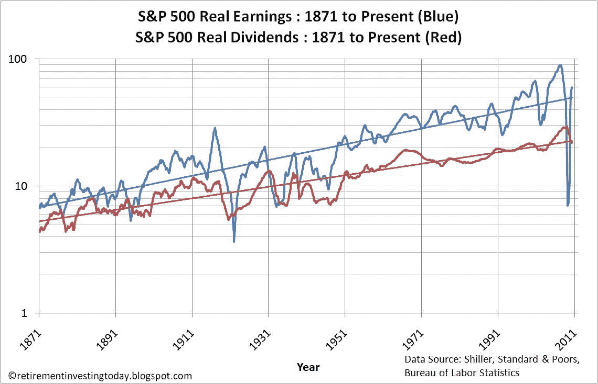
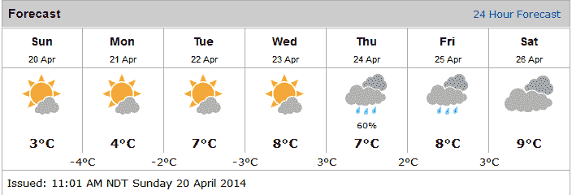
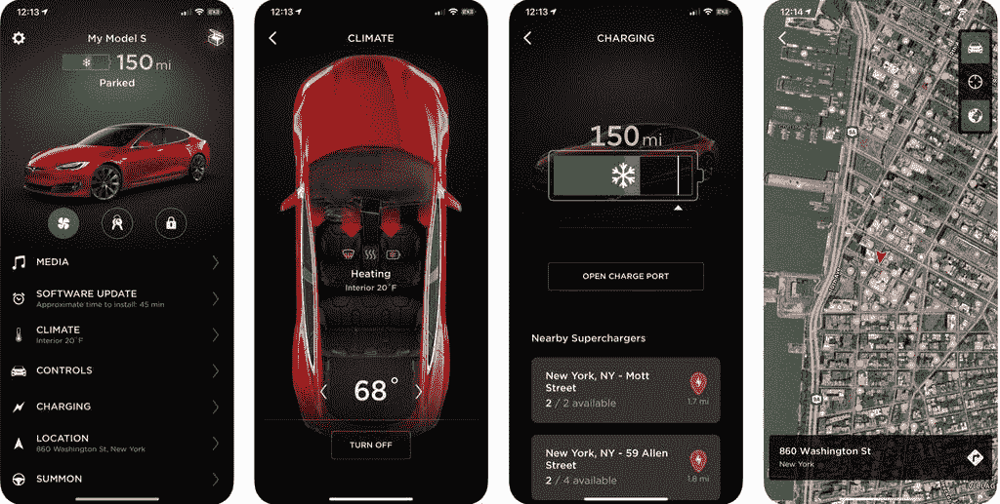
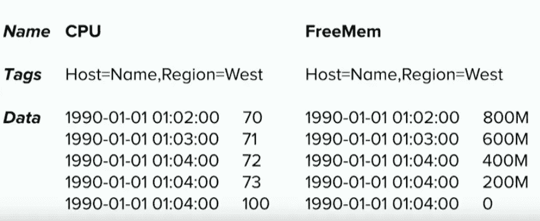
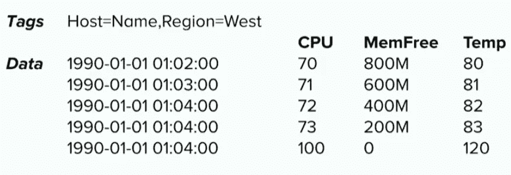

# 时间序列数据库是您数据的未来

> 原文：<https://betterprogramming.pub/time-series-databases-are-the-future-for-your-data-664c5edb2cde>

## 如果您只保存单个状态值，那么您的数据库在将来几乎毫无用处。你需要一个时间序列

尼克·希利尔在 [Unsplash](https://unsplash.com?utm_source=medium&utm_medium=referral) 上的照片。

数据是过去十年的金矿，由于机器学习和物联网等所有其他相关领域，大数据每年都比上一年增长得更快。

从你的用户那里获得更多的数据是有价值的。你可以研究他们的行为，发现模式，甚至更多你现在无法想象的。但在未来，有了你的数据，这一切都将成为可能。

# 时间序列时代

你将能够分析过去、现在和未来！与仅保留数据最新状态的旧方法相比，有什么变化？

您每分钟都在生成更多的数据！

我们正在获得更好的硬件、存储和更智能的算法。

数据是做一切事情的标准。

# 时序数据无处不在

即使你不认为你有这种数据，你也要从更广的视角考虑你管理的数据。

S&P 股票的总净值是一个时间序列:

来源:[http://www . retirementinvestingtoday . com/2010/04/us-s-500-stock-market-including . html](http://www.retirementinvestingtoday.com/2010/04/us-s-500-stock-market-including.html)

天气数据每天都在变化，但您希望保留整个历史:

一个简单的天气预报很容易展示每个人日常使用的时间序列数据类型。照片来自加拿大环境部(via [Alex Hickey](https://alexhickey.com/2014/04/23/tis-the-season-to/) )。

甚至你个人特斯拉的位置也可以成为时间序列数据，考虑到拥有特定数据的整个历史可以让你获得难以置信的结果，就像跟踪你的[特斯拉](https://electrek.co/2019/08/29/tesla-owners-chase-stolen-model-3-tracking-app-police-reprimands/)的小偷一样。

来源:[https://www . freelancer . com/u/meikramullah/portfolio/Tesla-React-Native-App-6665504](https://www.freelancer.com/u/meikramullah/portfolio/Tesla-React-Native-App-6665504?w=f&ngsw-bypass=)

# 预测我的未来！

您可以通过更多数据获得更多见解:

*   分析:发现一段时间内的趋势。
*   可视化:为整个组织的仪表板提供动力。
*   机器学习:更多的输入和输出将使你在未来建立机器学习模型。
*   自动化:定义触发管道或工作流的阈值。

# 时间序列数据是什么样子的？

## 你以为是什么样子！

## 它真正的样子！

# 它改变了什么？

以前你主要做`UPDATES`。对于时间序列，您将主要只使用`INSERT`！

过去，您主要编写随机分布的数据。用时间序列，你会写到最近的时间间隔！

过去，您关注的是基于主键的编写。对于时间序列，您将基于一个主键和一个时间戳值进行编写！

# 怎么才能真正入门？

您可以深入研究这个领域，尝试找到一种新的思路，来实现您一直存储在应用程序数据库中的值的历史版本。

你的第一步可能是试图找到一个在你首选的云提供商中可用的[时间序列数据库](https://www.trustradius.com/time-series-databases)。下一步可能是尝试用已经以这种及时的方式格式化的样本数据的数据集填充你的特定数据库——可能来自任何处理时间序列分析的竞争对手[Kaggle](https://www.kaggle.com/tags/time-series-analysis)。

读完这篇简短的时间序列数据介绍后，我将留给你最后一个思考:所有的数据都是时间序列数据吗？

# 你想更多地研究时间序列吗？

我还向你推荐几本主要由机器学习开发者使用的书，但这将帮助你获得一些关于这个主题的知识和思考:

*   实用时间序列分析:用统计和机器学习进行预测:[https://amzn.to/393uDzA](https://amzn.to/393uDzA)
*   时间序列与预测简介:[https://amzn.to/3pGzKvF](https://amzn.to/3pGzKvF)

# 参考资料和资源

*   [https://amzn.to/393uDzA](https://amzn.to/393uDzA)
*   [https://amzn.to/3pGzKvF](https://amzn.to/3pGzKvF)
*   [https://www.youtube.com/watch?v=TQk_tc03MyQ](https://www.youtube.com/watch?v=TQk_tc03MyQ)
*   [https://www.youtube.com/watch?v=7hxXU9dceaE](https://www.youtube.com/watch?v=7hxXU9dceaE)
*   [https://blog . time scale . com/blog/what-the-heck-is-time-series-data-and-why-do-I-need-a-time-series-database-dcf3 B1 b 18563/](https://blog.timescale.com/blog/what-the-heck-is-time-series-data-and-why-do-i-need-a-time-series-database-dcf3b1b18563/)
*   [https://www.trustradius.com/time-series-databases](https://www.trustradius.com/time-series-databases)
*   https://www.kaggle.com/tags/time-series-analysis