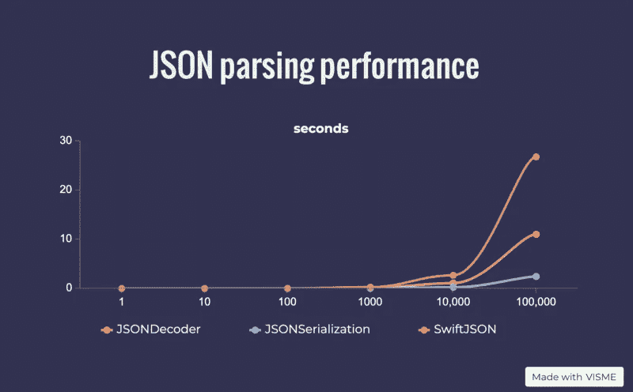

# 是时候抛弃 SwiftyJSON 了

> 原文：<https://betterprogramming.pub/time-to-abandon-swiftyjson-switch-jsondecoder-codable-407f9988daec>

## JSON serialization vs . JSONDecoder vs . Swift yjson—使用 Swift 原生 JSON decoder 解析 JSON 以获得更好的性能


丹尼尔·冯·阿彭在 [Unsplash](https://unsplash.com?utm_source=medium&utm_medium=referral) 上的照片。

# 1.JSON 解析是基础的一部分


由 [Mirko Blicke](https://unsplash.com/@mirkoblicke?utm_source=medium&utm_medium=referral) 在 [Unsplash](https://unsplash.com?utm_source=medium&utm_medium=referral) 上拍摄的照片。

有很多著名的项目采用不同的方法和理念来处理 JSON 解析。`SwiftyJSON`大概是其中最早也是最受欢迎的一个。它不那么冗长且容易出错，并利用 Swift 强大的类型系统来处理所有细节。

`JSONSerialization`是大多数 JSON 解析项目的核心。它来自 Swift 的[基础](https://developer.apple.com/documentation/foundation)框架，将 JSON 转换成不同的 Swift 数据类型。在像`SwiftyJSON`这样的项目出现之前，人们使用原始的`JSONSerialization`来解析 JSON 对象。但是这可能很痛苦，因为值类型和 JSON 结构可能会有所不同。您需要手动处理错误，并将类型`Any`转换为 Swift 基础类型。更容易出错。

`JSONDecoder`与 Swift 4 一同发布，具有更先进、更有前途的功能。它将 JSON 对象解码成 Swift 对象，并采用`Decodable`协议。

# 2.绩效基准


[David Guliciuc](https://unsplash.com/@hypefilms?utm_source=medium&utm_medium=referral) 在 [Unsplash](https://unsplash.com?utm_source=medium&utm_medium=referral) 上拍摄的照片。

回顾过去几年，`SwiftyJSON`一直在我们的项目中扮演着重要的角色，将我们从原始的`JSONSerialization`痛苦中拯救出来。

但是现在还兼容吗？让我们开始我们的基准测试来比较这三种方法:原始的`JSONSerialization`、`SwiftyJSON`和`JSONDecoder`。

下面这个简单的`Tweet` JSON 包含一个`Comments`数组和一个`Replies`嵌套数组:

`Tweet`和`Comment`对象是被反序列化并映射到的 JSON，它们采用`Codable`协议支持`JSONDecoder`。它们还有两个初始化器，一个用于来自`JSONSerialization`的`Dictionary`，另一个用于来自`SwiftyJSON`的`JSON`对象。

这三种方法将在 Xcode 的单元测试中的`measure`块内运行`10`、`100`、`1000`、`10,000`和`100,000`次，以比较耗时:

# 3.结果和分析



作者照片(用 VISME 制作)。

`SwiftyJSON`循环累加时耗时曲线最陡。数据显示，当循环进行到`100,000`时，它比`JSONDecoder`慢三倍，比`JSONSerialization`几乎慢六倍。

是什么让它如此缓慢？

`SwiftyJSON`使用`JSONSerialization`反序列化 JSON 对象:

瓶颈显然在对象映射和检索过程中。当我查看这行代码时，发现了部分原因:

```
return type == .array ? rawArray.map { JSON($0)} : nil
```

当检索值时，它循环并映射每个对象到`JSON`对象。当我们处理嵌套数组时，时间复杂度和空间复杂度呈指数级增长。

# 4.结论


照片由 [Brina Blum](https://unsplash.com/@brina_blum?utm_source=medium&utm_medium=referral) 在 [Unsplash](https://unsplash.com?utm_source=medium&utm_medium=referral) 上拍摄

原始的`JSONSerialization`方法具有出色的性能，但是在处理真实世界的 JSON 时并不理想。没有人喜欢连锁的可选的、容易出错的、冗长的代码:

`JSONDecoder`在我看来，这是因为它完美地平衡了性能和可用性:

`SwiftyJSON`性能最差，相对于`JSONDecoder`比较啰嗦。这样的代码比原始的`JSONSerialization`要好，但不如`JSONDecoder`干净:

在本文中，我们对这三种方法进行了基准测试。性能和代码可用性都证明是时候抛弃`SwiftyJSON`移民`JSONDecoder`了！

# 5.资源


照片由 [Unsplash](https://unsplash.com?utm_source=medium&utm_medium=referral) 上的[Olav Ahrens rtne](https://unsplash.com/@olav_ahrens?utm_source=medium&utm_medium=referral)拍摄。

文中提到的所有[回购和代码](https://github.com/SwiftyJSON/SwiftyJSON)都可以在 GitHub 上找到[。](https://github.com/ericleiyang/JSONExample)