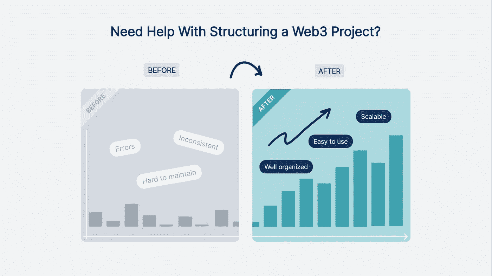
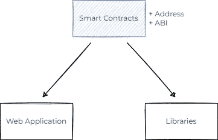

# 是时候拆分你的 Monorepo 了？我们对构建 Web3 项目的看法

> 原文：<https://betterprogramming.pub/time-to-split-your-monorepo-our-take-on-structuring-web3-project-5ad93be1cf9f>

## 我们为什么拆分我们的单一回购协议，以及我们如何处理智能合约

首先，我认为把所有代码放在一个地方是完全没问题的，尤其是在项目开始的时候。把事情做好。不要过度复杂化。然而，最终，事情变得复杂了。处理智能合同很棘手，因为一旦部署，它们就在那里，更新并不总是容易的。此外，您的 dApp 的其他部分需要一个契约代码来与它们进行交互。本文将展示我们在 [FELToken](https://feltlabs.ai/) 中使用的代码结构，这将有望使事情变得可扩展和易于维护。

# 主要组件

每个 dApp 通常由两个主要组件组成:智能合约和一个与它们通信的 web 应用程序。通常，额外的库也与智能合约通信。要与智能合约交互，您总是需要合约的地址和 ABI。

大多数 Web3 应用程序的依赖结构。

依赖结构并不复杂。所有组件都依赖于存储部署地址和合同 ABI 的智能合同。

# 为什么不是 Monorepo？

看看上面的结构，很明显，如果我们拆分组件，我们将不得不处理必要文件的交换。那么我们为什么要把东西分开呢？既然我们可以把所有东西都放在一个地方，为什么还要经历这种额外的挣扎呢？

反对 monorepo 的最大理由可能是版本控制。如果我们更新一个组件，我们通常也必须更新其他部分。我们要么必须总是一次进行大的更新，要么习惯于我们的主分支经常出问题的事实。当越来越多的人开始贡献时，这就成了一个问题，因为我们需要一个用于测试的工作项目。

此外，不同的组件通常有不同的版本周期，例如，智能合同通常不会像 web 应用程序一样经历那么多的更新。把所有东西都放在一个地方会很难区分这些更新。

通过将代码分割成多个存储库，我们可以确保在每个开发点都能正常工作。此外，我们可以使用 git 标签在存储库之间引用正确的版本。例如，当我们更新智能合同时，web 应用程序仍然可以引用旧版本，直到它被更新。这种方法确保更多的人可以同时工作，而不会损坏东西。

# 如何兑换智能合约 ABI？

我们使用 [**布朗尼**](https://eth-brownie.readthedocs.io/en/stable/) 来处理智能合同部署。我们还决定使用 GitHub 来交换智能合同的文件(地址和 ABI)。很容易创建 GitHub action，它将自动部署智能合约并将必要的文件存储在 GitHub repo 中:

然后在 web 应用程序中，我们可以基于标签从 GitHub 中`fetch`获取必要的文件。超级简单对吧？嗯，还有最后一个棘手的部分:地方发展。

## 地方发展解决方案

运行本地加纳切区块链是 Web3 开发的日常面包。同时运行智能合约和 web 应用程序是不可避免的。我们需要确保不会因为将代码分成多个存储库而使这变得复杂。

我们决定使用本地文件服务器来解决这个问题。这听起来可能有点过分，但它很好地解决了所有问题。因此，在部署脚本的最后，我们运行一个文件服务器。在 Python 中运行文件服务器很简单，如下所示:

然后在部署脚本的最后，我们需要运行`server_build_directory()`。确保在绝对端运行该函数，因为它会阻止执行。你可以在这里阅读我们的完整部署脚本:`[deploy_dev.py](https://github.com/FELToken/smart-contracts/blob/e9c49f151d9d80eebbc6d35a875bd1eaaffdf1c5/scripts/deploy_dev.py)`。一旦服务器开始运行，我们可以像从 GitHub 获取文件一样获取文件。我们只需要用`http://localhost:8100`替换 GitHub URL。文件的结构保持不变！

这种方法的优点是 Brownie 会自动清除本地开发文件。因此，我们不会将任何本地文件提交到 git 中。

# 结论

我们的方法不是唯一正确的方法。我看到人们使用不同的策略来存储智能合约，例如，将它们保存为 NPM 包。然后使用 NPM 将这个包安装到一个 web 应用程序中。只要您的所有组件都使用 JavaScript，这就非常简单。问题是我们有 JavaScript 和 Python 库与智能契约通信，这使得特定于语言的解决方案不切实际。

*如果你觉得这有帮助，别忘了关注更多教程。我写了我们在整个*[*@ FELT _ labs*](https://twitter.com/FELT_labs)*项目开发过程中的 web3 体验，创造了一个保护隐私的 AI 解决方案。*