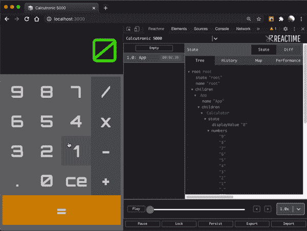
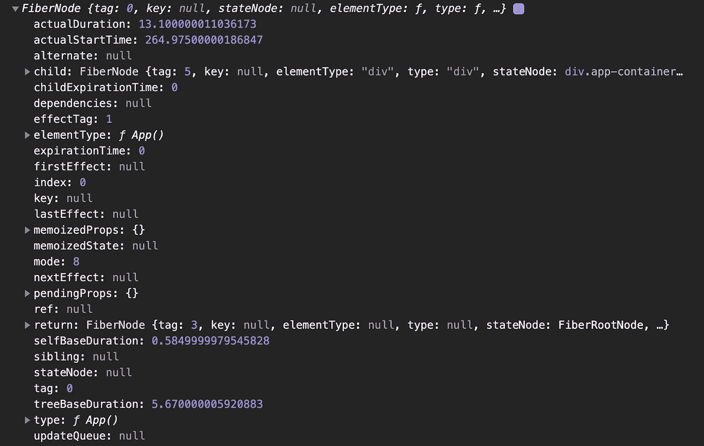
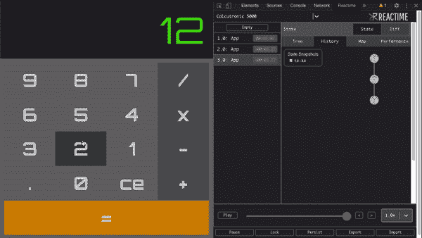

# 具有反应时间的时间旅行态

> 原文：<https://betterprogramming.pub/time-traveling-state-with-reactime-6-0-53fdc3ae2a20>

## 一个开源调试工具，它可以快照当前状态，并让您逐步通过以前的状态

🎉[获得 2020 年 React 开源奖提名](https://osawards.com/react/)🎉

状态管理是开发高效和高性能的 React 应用程序的关键部分。开发人员知道，随着应用程序的扩展，管理状态会变得难以管理。 [Reactime](https://github.com/open-source-labs/reactime) 旨在通过为开发人员提供一套强大的应用程序状态可视化工具来改进状态调试工作流程。

在本文中，我们将深入探讨我们工具的机制，React Fiber 的幕后发生了什么，以及我们在最新更新中实现的功能。

来源:[https://github.com/open-source-labs/reactime](https://github.com/open-source-labs/reactime)

# 什么是反应时间？

Reactime 是一个开源的 React 状态调试工具，可以为开发人员跟踪和可视化状态变化。Reactime 允许开发人员在他们的应用程序中进行时间旅行并“跳转”到以前的状态，从而实现无缝调试过程。Reactime 使用 React 纤程，我们将在下面更深入地解释这一点。

Reactime 调试 React 计算器应用程序

# 什么是反应纤维？

React Fiber 是用 React 的 16.0.0 更新实现的，我们可以把它看作是 React 之前“引擎”的更新。React Fiber 本质上是 React 用来高效渲染应用程序的一组算法和进程。纤程节点是 React 通过 React 纤程产生的信息单元。

例如，如果我们有一个简单地呈现一个`div`的`App`组件:

其对应的纤程节点如下所示:

反应纤维节点的例子

从上面的例子来看，每个纤维节点都包含了一个单独部分的数据(组件、HTML 标签等)。)的 React 应用程序。纤程节点通过单链表数据结构作为父节点、子节点或兄弟节点相互引用

*有趣的事实:这是你在野外很少见到的数据结构之一！*

通过这些引用，纤程节点创建了一个表示 React 应用程序的树状数据结构。在下一节中，我们将讨论 Reactime 如何利用 React Fiber 来实现其核心功能。

# Reactime 是如何工作的？

在较高的层次上，Reactime 可以捕捉应用程序中每个状态变化的快照，并将它们实时呈现在可视化的层次图中。通过在应用程序的每个状态变化之前记录快照，Reactime 只需按下一个按钮，就可以穿越到应用程序的前一个状态。

Reactime 在 React 计算器应用中的状态时间旅行特性

此外，通过纤程树访问整个应用的数据，我们使用递归深度优先搜索算法遍历纤程节点，以提取有意义的数据，并根据 D3 和 visx 所需的数据结构进行调整。

# Reactime 6.0 有什么新功能？

1.  扩大了与反冲的最新更新(0.0.13)的兼容性。
2.  添加了可视化功能，将 atom 和选择器映射到它们各自的组件。
3.  通过将快照与动态图例关联，改进了历史记录选项卡。
4.  通过整合一个名为 visx 的可视化 D3/React 库，重新设想了组件图，为用户提供了更健壮的视图。
5.  改进了“性能”选项卡，以便在状态改变时更好地显示组件呈现趋势和潜在的性能瓶颈。
6.  赋予可视化组件`onHover`突出显示相应 DOM 元素的功能。
7.  对代码库的总体增强(改进模块化、减少技术债务和增强入职)。

要了解更多关于反冲和 visx，请查看这些参考资料:

*   [反冲 js——React 状态管理的未来？](https://medium.com/@CSVince/recoiljs-the-future-of-react-state-management-ffb1345833b6)
*   [反冲 js——开发者工具的现状](https://medium.com/@guizzettic/recoiljs-current-landscape-of-developer-tools-2e242d4509ae)
*   [VISX——React 中可视化数据的简单解决方案](https://medium.com/@alexander.landeros1/visx-an-easy-solution-to-visualizing-data-in-react-e94c67b7025b)

# 如何下载 Reactime 或与其合作

我们真的很高兴能与开源社区分享这一点，我们很乐意让您尝试 Reactime。随意玩，打破东西，放入一个公关，让我们知道你的想法！

*撰稿人:Vincent Nguyen、Sanjay Lavingia、Jason Victor、Chris Guizzetti 和 Alexander landers*