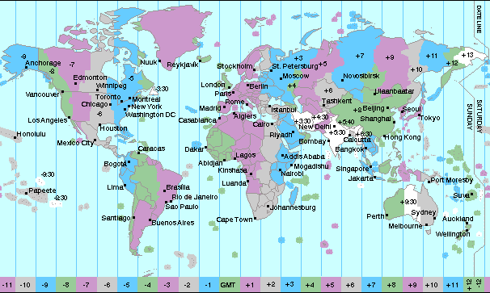
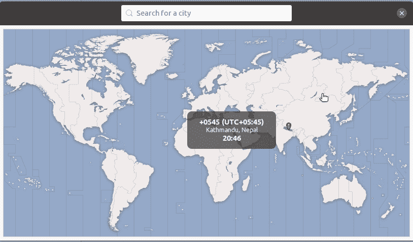

# 软件开发人员的时区

> 原文：<https://betterprogramming.pub/time-zones-for-software-developers-7f21d5a407aa>

## 与时区打交道可能会很困难。让我们把事情弄清楚

卢卡斯·布拉塞克在 [Unsplash](https://unsplash.com?utm_source=medium&utm_medium=referral) 上的照片

与时区打交道可能会很艰难！事实上，这篇文章的灵感来自于我和他们之间的问题。我最终决定咬紧牙关，做一些广泛的研究来正确理解它们。我发现当你理解了基础知识后，他们会变得更容易相处。这是我的尝试，通过把所有的基础知识放在一个地方，来帮助其他正在与时区作斗争的人。最后还有一些常见问题的解决方法。

# 协调世界时:面包和黄油

这是我们在查看时区之前需要了解的第一件事。UTC 是世界时间标准。这意味着世界上其他地方的时间都是使用 UTC 来确定的。事实上，世界上任何地方的当地时间都可以通过在 UTC 上加上或减去一个偏移量来获得。

例如，我居住的尼泊尔的时间总是可以通过在 UTC 的当前时间上加 5 小时 45 分钟来获得。所以这里的时间可以表示为 UTC+05:45。

UTC 本身是地球上经度为 0 度的地区的时间。这个区域被称为本初子午线。人们经常把 UTC 误认为是时区，但 UTC 本身并不是时区。

# 什么是时区？

地球大约每小时自转 15 度，所以世界被分成 360/15 = 24 个时区。这个想法是每个 15 度间隔的时间总是相同的。

本初子午线左侧时区的时间可以通过从 UTC 减去偏移量来获得。类似地，右边时区的时间可以通过向 UTC 添加偏移量来获得。每个区域中的偏移量与相邻区域相差一个小时。

这些区域也可以通过名称来引用。例如，不偏离 UTC 的时区称为 GMT(格林威治标准时间)。另一个例子是东部标准时间，它是一个偏移量为-5 的时区。

所有这些都在下面的图片中得到了更清晰的说明。

底部的数字表示偏移量。GMT 的偏移量为 0。(图片来源:[夏威夷大学](https://laulima.hawaii.edu/access/content/group/dbd544e4-dcdd-4631-b8ad-3304985e1be2/book/chapter_1/time.htm))

然而，事情没那么简单。这些地区属于不同的国家和地区，或者有时只与一个国家的部分地区相交，所以我们实际使用的时区只是粗略地基于这些地区。相反，它们受到国家和领土边界的影响。因此，世界上不仅仅只有 24 个时区。因此，许多时区没有精确的小时时差。例如，加拿大 NFLD 的圣约翰有一个-03:30 的偏移量。

受边界影响的时区(Ubuntu 中的时区选择界面)

从这里可以学到的重要东西是:

*   仅仅因为两块土地位于相同的经度 15 度区域，这并不意味着它们具有相同的时区或相同的 UTC 偏移量。
*   两个不同的时区可以有相同的 UTC 偏移量。
*   两个不同的国家或地区可以在同一个时区。
*   同一个国家的两个地区可能位于不同的时区。

# 世界上时间的类型

我知道时间的“类型”听起来很奇怪。这只是因为没有更好的名字。全世界有两种时间。它们是夏令时和标准时间。

## 夏令时

> 夏令时(DST)是指在夏季将时钟从标准时间向前拨一小时，在秋季再拨回来，以便更好地利用自然日光—[timeanddate.com](https://www.timeanddate.com/time/dst/)

每当一个地区开始夏令时，它就会改变它的时区来反映这一点。例如，采用中部标准时间(CST)的地区也实行夏令时，将改为中部夏令时(CDT)。

## 标准时间

这是不使用夏令时的地区使用的时间。这是我们用来定义时区的时间。

需要注意的一点是，并非所有使用相同标准时间或位于相同时区的地区都会实行夏令时。因此，在秋季(不实行夏令时)当地时间相同的地区，在夏季(实行夏令时)可能会有不同的当地时间。

# 计算机中的时区

我们前面已经看到了一些时区的例子:东部时间、中部时间、中部时间和格林威治时间。这些时区基于经度的 15 度划分，不考虑夏令时。我们还看到，由于夏令时，确定给定地区的时间变得复杂了。因此，这些基于经度的时区不能直接用于时间转换。

这个问题的解决方案是一个叫做[时区数据库](https://www.iana.org/time-zones)的时区数据库。该数据库将时区视为国家区域，而不是使用基于经度的时区。该数据库中的时区与夏令时和标准时间相关联。这个数据库是执行时间转换的关键。

例如，美国/纽约是该数据库中的一个时区。该数据库包含以下关于该时区的重要信息:

*   **标准时间**(即-05:00)期间的偏移量。这相当于美国东部标准时间。
*   **夏令时期间的偏移量**(即-04:00)。这相当于美国东部夏令时。
*   **关于何时转换到夏令时以及何时转换回来的规则**

我们现在可以很容易地想象将这些信息与 UTC 时间结合起来，计算并显示我们想要的任何时区的时间。然而，你应该总是使用专门为处理时区而创建的库，比如 [Moment Timezone](https://momentjs.com/timezone/) ，因为自己编写代码可能是一项艰巨的任务。

时区数据库是不断更新的，因此在任何使用它的应用程序中保持数据库最新是至关重要的。

# UNIX 时间戳:计算机如何存储时间信息

> “UNIX 时间戳是一种以秒为单位跟踪时间的方法。这一计数从 UTC 时间 1970 年 1 月 1 日的 Unix 纪元开始。因此，Unix 时间戳仅仅是特定日期和 UNIX 纪元之间的秒数。”— [Unix 时间戳](https://www.unixtimestamp.com/)

UNIX 时间戳与时区无关。这意味着 UNIX 时间戳总是对应于 UTC 中的一个时间点。要用任何其他时区表示时间，您需要将该时区的偏移量添加到 UNIX 时间戳中。因此，根据经验，如果您需要在特定的时区存储时间，那么您需要在 UNIX 时间戳旁边存储您希望表示的时区。

例如，在 JavaScript 中，每当我们运行`Date.now()`或`(new Date()).valueOf()`，我们就会得到一个 UNIX 时间戳。然而，如果我们运行`(new Date()).toString()`，我们将得到一个日期字符串，它与我们的系统设置的时区相偏移。该字符串还将包含时区信息。

# 一些涉及时区的常见问题

下面我们将看看一些涉及时区的常见问题以及如何解决它们。如果您认为自己已经很好地掌握了如何解决这些问题，请随意跳过这一部分。

## 以用户的时区显示时间

在许多应用程序中，这是一项非常常见的任务。假设我们有以下需求:

*   我们正在为狗建立一个社交网络，用户可以上传他们的狗的照片。每篇文章都标有发表时间的时间戳。让我们称之为`post time`。
*   当其他用户查看帖子时，他们必须能够看到狗图片的`post time`。这个`post time`必须显示在查看者的时区中。

例如，如果我在尼泊尔时间晚上 10:00 发布了一张不存在的狗的照片，那么在纽约查看该照片的人一定会看到上午 11:15 是不遵守夏令时的发布时间，而下午 12:15 是遵守夏令时的发布时间(转换源:[时间是](https://time.is/compare/1000PM_25_Dec_2020_in_Kathmandu/EST/EDT))

**解决方案**

当用户创建帖子时:

*   从后端获取 UTC 日期。默认情况下，大多数后端服务器都设置为 GMT 作为时区，所以这应该不是问题。您也可以从前端发送时间戳，但是如果没有必要，依赖客户端并不是一个好主意。
*   如果您的数据库支持日期类型，那么直接存储获得的 GMT 日期。如果不是，那么将其转换为 UNIX 时间戳并存储在数据库中。

当查看者请求帖子时:

*   如果您的数据库支持日期类型，那么将其转换为 UNIX 时间戳。如果没有，那么您已经存储了原始时间戳，可以直接使用它。将此时间戳发送到前端。
*   您的前端的日期库(标准的或第三方的)在默认情况下肯定会被设置为系统的时区，并且具有获取与系统时区相关的日期字符串的方法。如果您只是使用日期库将时间戳转换为字符串，那么它将已经处于查看者的时区中。

## 以另一个时区显示时间

比方说，我们稍微改变了对早期狗社交网络的要求。我们现在想以创建者的时区显示发布时间。

例如，如果我在尼泊尔时间晚上 10:00 发布一张不存在的狗的照片，那么在纽约查看该照片的人一定会看到亚洲/加德满都晚上 10:00 是发布时间。这里亚洲/加德满都是尼泊尔的时区。

请注意，这个示例也适用于我们希望在查看者系统的时区之外的任何时区显示日期和时间信息的情况。

**解决方案**

当用户创建帖子时:

这个没有上一个直接。我们现在需要一种方法来了解用户所在的时区。

*   大多数数据库都有一个方法来给出 UTC 偏移量。但并不是所有的方法都能给出准确的时区名称。然而，一些日期库会有一个方法来猜测时区。这种猜测在某些情况下可能是不正确的，但有时这是你能做的最好的。
*   无论如何，在我们确定了前端的时区之后，我们需要将它发送到后端，并存储时区以及 UTC 日期和时间戳，就像在前面的步骤中一样。
*   如果我们的应用程序不需要显示时区的名称，那么我们可以只存储偏移量。
*   将时间解析为一个字符串并存储该字符串并不是一个好主意，因为这将使通过`post time`搜索数据库变得困难。

例如:

*   在 JavaScript 中，`new Date().getTimezoneOffset()`将以分钟为单位给出本地时间和 UTC 之间的差异，我们可以用它来确定偏移量。然而，仅仅这些信息并不能告诉我们时区是什么。这是因为多个时区可以有相同的偏移量，用户甚至可能处于夏令时地区。
*   JavaScript 还支持`Intl.DateTimeFormat().resolvedOptions().timeZone`,它将为我们提供时区的名称。然而，这在较旧的浏览器中不起作用。
*   Moment Timezone 是一个流行的 JavaScript 日期库，它有一个方法`moment.tz.guess()`，可以猜测用户所在的时区。好消息是，如果浏览器支持的话，它将使用我们之前讨论过的`Intl.DateTimeFormat`方法。

当查看者请求帖子时:

*   如果我们的数据库支持日期类型，或者如果我们存储原始时间戳，那么我们可以使用一个支持时区的日期库，比如 Moment timezone，将其转换为海报的时区。回想一下，我们在上一步中存储了海报的时区。
*   这次我们将把转换成字符串的实际日期发送到前端，并直接显示出来。我们可以使用时区库在前端进行转换，但是这些库通常很大，因为它们携带时区信息，会增加应用程序的加载时间。

*   请注意，我们也可以在不使用第三方库的情况下做到这一点，只需将海报时区的偏移量添加到我们的原始时间戳，然后将其转换为 UTC 日期字符串。然而，我们必须从前端获取偏移量，并将它存储在每个 post 中。这是因为如果我们不存储每次发布的偏移量，我们就需要考虑夏令时。这在前面的例子中不是问题，因为 Moment Timezone 会为我们处理这个问题。

## 将时间从一个时区转换到另一个时区

这个例子的标题有点误导。实际上，从一个时区到另一个时区没有真正的时间“转换”。正如我们前面所学的，时间可以用 UNIX 时间戳来表示，它总是采用 UTC。因此，我们只能显示相对于不同时区的时间，而不是将时间从一个时区“转换”到另一个时区。如果我们总是存储 UNIX 时间戳，那么就根本不需要进行任何转换。我们只需要能够显示目标时区的时间。

但是，如果我们没有 UNIX 时间戳，而是有一个标准日期格式的日期字符串(例如，MM/DD/YYYY HH:MM:SS ),我们知道它与某个时区相关，那么我们可以很容易地从中提取 UNIX 时间戳。然后，我们可以使用这个时间戳在任何其他时区创建一个日期字符串。

如果我们从 UTC 偏移量的角度来考虑，这似乎很容易做到。我们需要做的就是从 UTC 中减去源时区的偏移量，然后将目标时区的偏移量加到结果中。然而，这里的问题是我们需要考虑夏令时。为了解决这个问题，我们需要利用时区数据库。这个任务需要很多复杂的东西，所以当显示 UNIX 时间戳作为相对于某个时区的日期字符串时，我们应该总是使用一个库。图书馆将在考虑夏令时的情况下为您执行上述步骤。

这里有一个这个时刻时区的例子(基于[文档](https://momentjs.com/timezone/)):