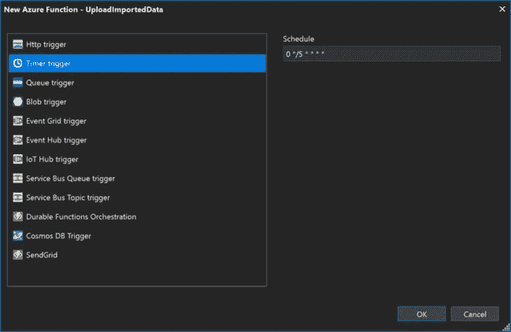
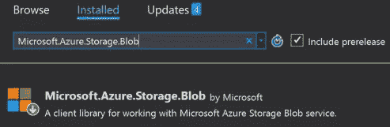
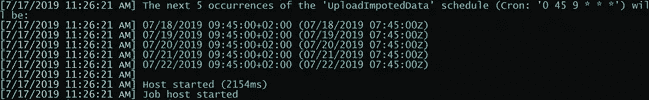

# 每天上传到 Azure Blob 的 TimerTrigger Azure 函数

> 原文：<https://betterprogramming.pub/timertrigger-azure-function-to-upload-to-azure-blob-daily-c4e761a8ee4c>

## Azure 功能越来越好

安装微软。Azure.Storage.Blob

# 介绍

使用 Azure Function 总是很有趣，在其他 Azure 服务的帮助下，它会变得越来越好。在这篇文章中，我们将看到如何使用 TimerTrigger Azure 函数每天向 Azure Blob 存储上传一个文件。基本思想是让一个作业在每天的特定时间运行，以执行上传。

# 背景

如果你是 Azure Functions 的新手，我推荐你在这里阅读一些相关文章[。你可以用 Azure Function 创建的东西是无穷无尽的，这里我们只讨论其中的一个。](https://sibeeshpassion.com/tag/azure-function/)

我们生活在一个一切都自动化的世界——没有人对任何手工工作感兴趣。在 Azure Function 的帮助下，编写一个每天在给定时间运行的自动化作业变得前所未有的简单。

# 先决条件

*   有效的 Azure 订阅
*   一个正在运行的 Azure 功能(如果你不确定如何创建一个 Azure 功能应用， [*这篇文章*](https://sibeeshpassion.com/iothubtrigger-azure-function-and-azure-iot-hub/#creating-an-azure-function-app) 会有帮助)
*   有效的 Azure 存储帐户

# Azure 函数和 Azure Blob

## 获取存储连接字符串

默认情况下，当您在 Visual Studio Azure Function 应用程序中创建 Azure 函数时，将创建一个名为`AzureWebJobsStorage`的新键。如果没有，您应该通过从您的存储帐户获取连接字符串，在您的`local.settings.json`文件中创建它。

要获取连接字符串，请转到您的存储帐户，然后单击设置刀片下的访问密钥。然后复制列出的任何一个连接字符串。您可以使用这个值在`local.settings.json`文件中的`Values`下创建`AzureWebJobsStorage`键。您还应该在 Azure 门户的 Azure 函数配置中创建它，因为这个`local.settings.json`文件只是用于本地的，在您发布函数时不会被推送到 Azure 函数。

# 在函数应用程序中创建 Azure 函数

要在 Azure Function 应用中创建新的 Azure 函数，请右键单击您的项目，然后单击`Add`并选择`New Azure Function`。在出现的弹出窗口中，应该有一个为你的 Azure 函数命名的选项。完成后，选择您想要使用的触发器—在本例中，我将选择 Timer Trigger。

带`TimerTrigger`的 Azure 功能

单击 OK，将为您创建一个时间间隔为五分钟的新功能。`TimerTrigger`函数使用`NCronTab`库来截取`CRON`表达式。这是您在上面图像的 Schedule 选项下看到的表达式。一个普通的`CRON` express 中有这些字段。

如果您查看这段代码，您会发现已经为您创建了一个函数`Run`，其时间间隔由您设置:

现在，我们可以通过更改`CRON`表达式来告诉我们的 Azure 函数在每天上午 9:45 运行:

你可以在这里了解更多`CRON`表情[。](https://docs.microsoft.com/en-us/azure/azure-functions/functions-bindings-timer#cron-expressions)

# 将数据上传到 Azure Blob

现在，我们已经准备好每天运行 Azure 函数，正如我们所希望的那样，是时候编写一些代码来生成数据并将其上传到 blob。在此之前，我们应该确保已经安装了所需的 Nuget 包`Microsoft.Azure.Storage.Blob`。

我们现在可以重写完整的函数代码:

如您所见，我创建了一个`CloudStorageAccount`的实例，然后通过调用函数`CreateCloudBlobClient()`创建了一个 blob 客户端。一旦我们得到它，我们通过使用函数`GetContainerReference()`得到 blob 容器引用，然后得到 blob 块，最后我们调用`UploadFromStreamAsync()`函数上传流数据。

第`var stream = getTheImportedData.ConvertToStream();`行是从一个 API 获取流数据，它返回一个 JSON，然后我通过调用一个扩展方法将它转换成一个流。

这里的`EnvironmentVariables.StorageConnectionString`是共享静态类的一部分，它返回我们在`local.settings.json`文件中设置的`AzureWebJobsStorage`。

# 输出

现在让我们在本地运行我们的函数并进行测试。输出应该如下所示:

# 结论

哇——我们已经报道了很多！我们了解到:

*   关于 Azure 函数以及如何设置它
*   关于 Azure 函数中的时间触发器
*   关于 Azure 函数中的 CRON 表达式
*   如何使用 Azure 函数将数据上传到 Azure blob