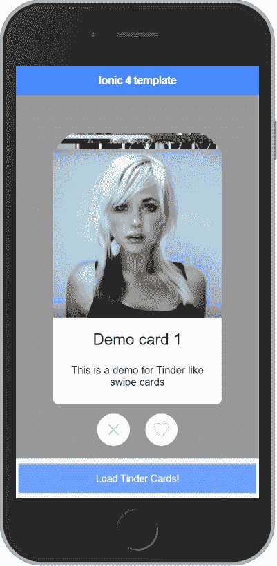
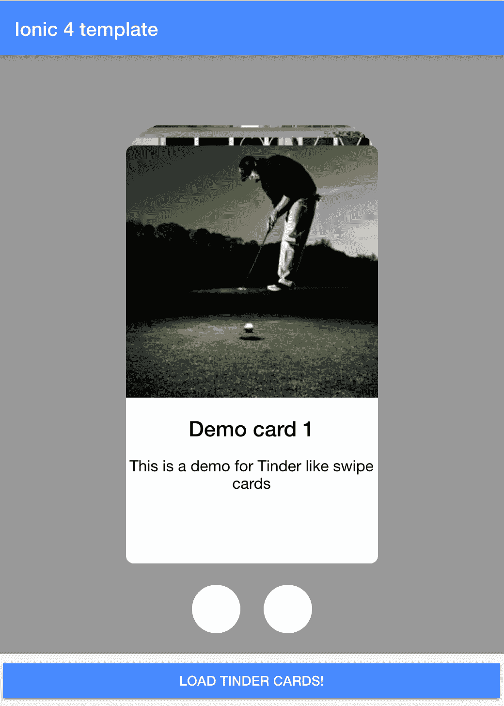

# 为 Angular/Ionic 4 构建类似 Tinder 的滑动 UI

> 原文：<https://betterprogramming.pub/tinder-like-swiper-ui-for-angular-ionic-4-50c401d6b9fb>

## Tinder 的 swiper 是一个有用的 UI 组件。为您的 Angular/Ionic 4 应用程序构建它


Nicola Fioravanti 在 [Unsplash](https://unsplash.com?utm_source=medium&utm_medium=referral) 上的照片

在高层次上，我决定将工作分成四个部分:

1.  为该组件起草初始(~placeholder)模板和 TS 代码，将其放入一个带有按钮的 [Ionic](https://ionicframework.com/) 应用程序页面(home.page)中，该页面会将 Tinder cards 的数据“加载”到该组件中。
2.  实现“堆叠”卡片的视图，以便它可以呈现由图像、标题和描述组成的卡片列表。
3.  然后，执行是(心形)/否(十字)按钮，动画显示从牌堆中取出的牌。
4.  最后，实现卡片拖动，以便用户可以左右拖动和滑动卡片，做出相应的是/否选择，然后为用户做出的选择配置一个简单的事件侦听器。

因此，最终结果应该是这样的:



我们开始吧，有很多内容要讲！

# 第 1 部分:创建初始模板

让我们从分叉[这个 StackBlitz 的 Ionic 4 模板](https://stackblitz.com/edit/ionic-4-template)开始。它有一个`HomePage`开始，我们将添加一个新的角度组件:

从上面可以看出，我们已经向模板添加了`tinder-ui`组件，它将具有`cards`属性(我们将使用 [Angular 的输入](https://angular.io/api/core/Input)在我们的组件中实现它)，以及一个`choiceMade`监听器。(将通过 [Angular 的输出](https://angular.io/guide/template-syntax#input-and-output-properties)实现)。

另外，我们添加了一个简单的按钮，我们将使用它来模拟将卡“加载”到我们的组件中

现在，让我们刺一下我们的`tinder-ui`组件。(我们将创建三个文件:tinder-ui-component 的 HTML、SCSS 和 TS)并将其添加到`home.module.ts`:

## **tinder-ui.component.html**

所以，我们只是在这里添加了所有 div 和它们相应的类，并添加了对根 div 到`cards.length` - >的绑定，使得如果卡的长度为零，整个组件不可见。

## **tinder-ui . component . scss**

我们的 CSS 规则将有助于对齐所有的东西，并使其看起来适合 swiper。

我不太擅长样式，所以你可能有一个更好的方法，尤其是如果你打算使用一个响应式 UI。但是对于我们这里的情况，这些应该足够了。

## **tinder-ui.component.ts**

所以，这里有几个注意事项:

*   我们导入了`Input`，并使用这个装饰器来引用这个组件将从其父组件(`home.page`)获得的卡片数据。
*   我们使用`ViewChildren`来跟踪代表我们每张卡片的实际 HTML 元素。因为我们订阅了更改，所以可以动态跟踪卡。我们将需要访问的元素，因为我们将改变他们的风格(如操纵他们的“转换”等。).

既然组件的基础已经准备好了，我们需要将它添加到我们的`home.module.ts`:

# 第 2 部分:实现堆叠卡片的视图

对于这个实现，我们将假设每张卡片只有一个图像、标题和描述，并且我们的`cards`数组(数据源来自`home.page.ts`)将有以下接口:

```
cards: Array<{ img: string, title: string, description: string}>;
```

基于此，我们现在将在`tinder-ui.component.html`中实现堆叠卡片的视图。

我们将利用`*ngFor`指令来复制卡片，并将使用`[ngStyle]`绑定和每个卡片的`index`来以堆栈的形式呈现它们:

我们还将添加一个模板引用`tinderCardImage`到我们的``元素中，这样我们就可以在 TS 代码中用`ViewChildren`来选择它。

最后，我添加了一个简单的(load)监听器，以确保图像只有在完全加载后才会显示(不透明度 1)。这是一个更流畅的外观和感觉。

现在我们应该准备好测试这叠卡片的视图了。为此，我们将把`home.page.html`中的按钮绑定到一个方法，该方法将加载一些占位符数据:

现在，我们应该能够点击*加载火绒卡*按钮，并看到以下内容:



# 第 3 部分:用动画实现是/否按钮

我们将假设一个“心”的图像代表“是”,一个“叉”的图像代表用户的“否”回答。

对于这个实现，我决定只使用一个 SVG 图像，并将其内嵌到 Tinder 按钮(上面的白色圆圈)和 Tinder-status 中，Tinder-status 是一个动态指示器，它将在拖动时向用户显示他们的答案。

因此，现在我们正在内联表示心和十字的 SVG，并向每张卡片添加一个(`transitionend`)事件监听器，因为我们只想在过渡动画完全结束的情况下对卡片进行操作(例如从堆栈中删除卡片)。

最后，我们将添加`[style.opacity]`绑定，这将帮助我们在需要时显示选择指示器。

## 更新的 tinder-ui.component.html

现在，我们已经准备好用按钮逻辑修改我们的 TS 文件了，还有一些额外的好处:

在上面的代码中，我们:

*   增加了新的导入——`Renderer2`——这是为了使卡片元素[样式以一种有角度的方式](https://alligator.io/angular/using-renderer2/)变化。
*   我们添加了新的 var——`moveOutWidth`——我们现在在`ngAfterViewInit`钩子中确定它。这个数字将定义卡应该“移动”到用户屏幕之外多远。
*   现在有更多的变量来管理事物的状态:`shiftRequired`(以防我们需要移除顶部的卡片)，加上简单的状态变量来跟踪我们的 UI 的状态(`transitionInProgress`、`heartVisible`、`crossVisible`)。

这里的`userClickedButton`方法应该很容易理解:如果我们的用户点击了“yes”(心形)，我们将 transform 添加到顶部的卡片(`array[0]`)，并迫使它开始向右飞去。

如果点击“否”，卡片会飞向左侧。现在，当这样的转换结束时，我们的另一个方法`handleShift`将移除这样的卡，因为`shiftRequired`状态是`true`。

最后，这里我们调用了`toggleChoiceIndicator`方法，它使 Tinder status SVG 在屏幕中央对用户可见。

# 第 4 部分:实现拖动和选择输出

最后一个实现步骤是拖动功能。为了启用它，我们将使用 [Hammer.js](https://hammerjs.github.io/) 平移手势，它曾经是 Ionic 框架的一部分，但现在需要单独安装:

```
npm i hammerjs
```

以上将安装软件包，然后您只需将以下内容添加到您的`main.ts`:

```
import 'hammerjs'
```

启用 Hammer 后，我们可以将(`pan`)和(`panend`)输入手势监听器添加到`tinder — cards` div:

```
<div class="tinder--cards" (pan)="handlePan($event)" (panend)="handlePanEnd($event)">...</div>
```

现在我们可以将方法`handlePan`和`handlePanEnd`添加到我们的`tinder-ui.component.ts`中，并添加逻辑来发出用户的选择:

# 结论

经过最近几次修改，我们的代码现在已经完成，可以在 Ionic 4 或 pure Angular 应用程序中使用。

当然，这种实现还有改进的潜力(比如移除对 Hammer.js 的依赖等)，但是如果你只是需要一条前进的道路，这应该可以让你继续前进。

*   这里是[演示](https://ionic-4-template-czmv63.stackblitz.io)。
*   下面是[编辑器链接](https://stackblitz.com/edit/ionic-4-template-czmv63)。
*   这是在构建这个代码片段时启发我的 [codepen.io](https://codepen.io/RobVermeer/pen/japZpY) 。