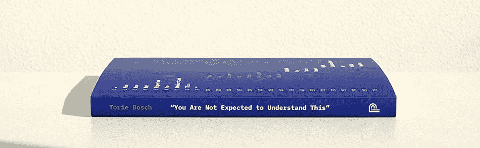
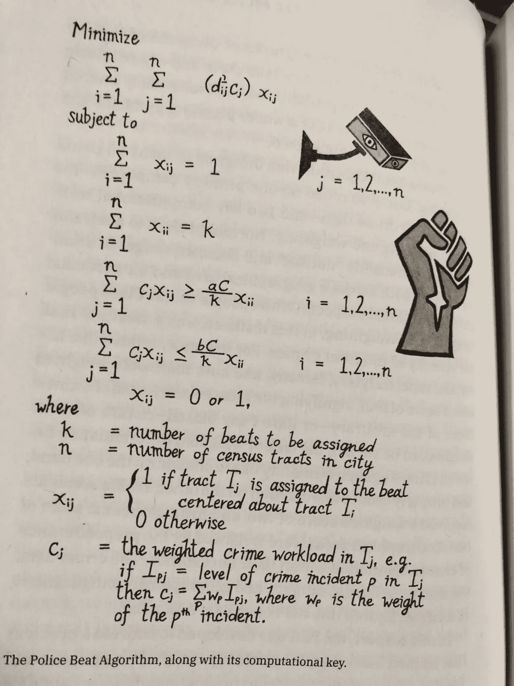

# 改变世界的微小代码片段

> 原文：<https://betterprogramming.pub/tiny-snippets-of-code-that-changed-the-world-fda104afc0d0>

## 仅仅几行字就能产生巨大的全球影响


克里斯里德在 [Unsplash](https://unsplash.com?utm_source=medium&utm_medium=referral) 上的照片

1997 年，伊桑·朱克曼发明了弹出式广告，从而打破了互联网。

他为 Tripod.com 工作，这是一个让人们免费制作小网页的在线服务。为了赚钱，Tripod 出售与页面并排的广告。问题是，广告会出现在色情内容的旁边——比如说，一个关于肛交的用户页面——而广告客户*没有*这样做。

朱克曼的老板让他想出一些解决办法。有没有什么方法可以定位广告，让它们不在 sexytime 用户生成的内容旁边？

这时，Zuckerman 想出了一个奇怪的、黑客式的解决方案:当你访问一个 Tripod 页面时，它会产生一个只有广告的全新弹出页面。这样，从技术上讲，广告就不会与任何特定的用户页面相关联。它只会浮在屏幕上。

不过，事情是这样的:Zuckerman 的 Javascript 代码创建了弹出广告？它非常短——只有一行代码:

```
window.open('http://tripod.com/navbar.html'
"width=200, height=400, toolbar=no, scrollbars=no, resizable=no, target=_top");
```

基本上，Javascript 告诉浏览器打开一个 200 像素宽、400 像素高的新窗口，顶部没有滚动条或工具栏，位于当前打开的任何其他网页的顶部。

简单，但有害！很快，商业网站复制了扎克曼的创新，互联网上充斥着弹出广告。我在 21 世纪初认识的一位在下载网站工作的程序员告诉我，他们绝大多数的收入来自色情弹出广告。

你肯定见过弹出式广告。你肯定恨他们。幸运的是，你使用的浏览器现在可以抑制它们。

正如朱克曼所说，他写了一行代码“让这个世界变得糟糕透顶。”



我在祖克曼为 [*写的一篇文章中偶然看到了他的故事。你不应该理解这个:26 行代码如何改变世界。这是一个非常有趣的短文小集子，由托里·博施编辑，反映了使世界倾斜的代码片段。*](https://www.harvard.com/book/you_are_not_expected_to_understand_this/)

令我着迷的是这些片段有多简短。这与许多关于编码的流行文化假设完全背道而驰，这些假设通常认为重要的代码是庞大而杂乱的。好莱坞喜欢把“程序员编程”描绘得一塌糊涂，像瀑布一样倾泻出代码。关于谷歌的统治地位的故事过去常常提到[它的“20 亿行代码”](https://www.wired.com/2015/09/google-2-billion-lines-codeand-one-place/)，好像那纯粹的*分量*是该公司成功的原因。

往往恰恰相反。事实上，谷歌的原始创新——早在 90 年代使谷歌超越其搜索引擎同行的那段代码——是其“PageRank”算法，该算法根据有多少其他页面链接到它，以及这些链接页面的质量来计算网页的价值。这不是一段很长的代码；人家用 Python 做过自己的版本，也就几十行。

当然，谷歌的整体运营——就像任何大型科技公司一样——涉及成千上万的流程来保持运转。这就是为什么他们的代码库如此庞大。但是一些影响最大的代码可能非常简洁。

你应该[读完整本书(或者买给书呆子作为节日礼物)](https://www.harvard.com/book/you_are_not_expected_to_understand_this/)，因为例子很吸引人，范围也很广。查尔顿·麦克韦恩有一章是关于 20 世纪 60 年代末开发的“警察巡逻算法”，该算法试图预测哪里最有可能发生犯罪，因此执法机构可以向那里派遣更多的警察。当然，这最终创造了一个种族主义的反馈循环:由于贫困的黑人社区与白人社区相比已经警力过剩，算法在那里指挥更多的警力，导致更多的逮捕，这说服算法派出更多的警察；冲洗并重复。

警察巡逻的算法并不太长；在*中，你不需要理解这个*，艺术家凯利·查德勒把它画了出来…



这是另一段改变世界的更短的代码:“跟踪像素”。

正如 Lily Hay Newman 在她关于跟踪像素的章节中指出的，你可能每天都在与这些代码进行交互，而没有意识到这一点。基本上，它是一点 HTML，在电子邮件中嵌入一个微小的像素，小到你看不见。但是如果有人给我发了一封带有跟踪代码的邮件，它就会监视我。它是这样工作的:当我打开消息时，代码要求我的浏览器请求那个单像素图像。给我发邮件的人看了看，*嘿，克莱夫的浏览器要求那个像素了吗？*如此有效，给我发邮件的人可以立刻知道我打开了邮件。

在电子邮件中添加一个跟踪像素非常简单——只有这一行:

```

```

这是最后一个更老的例子！这本书有一章(由艾伦·r·斯托凡和尼克·帕特里奇撰写)是关于阿波罗 11 号登月任务登月舱的“紧急救援”代码。这种“紧急救援”代码运行在登月舱的微型机载计算机上，旨在帮助确定事情的优先顺序:如果计算机过载，它会抛开所有最重要的工作。

当登月舱接近月球时，这变得非常重要，因为毫无疑问，计算机已经超负荷工作了*方式*。“紧急救援”代码开始行动，关闭了所有对登月舱着陆不至关重要的东西。它甚至关闭了登月舱内的一些显示系统，这吓坏了宇航员。但它成功了:登月舱安全着陆。

这是代码—只有 22 行…

```
POODOO    INHINT
    CA  Q
    TS  ALMCADR

    TC  BANKCALL
    CADR  VAC5STOR  # STORE ERASABLES FOR DEBUGGING PURPOSES.

    INDEX  ALMCADR
    CAF  0
ABORT2    TC  BORTENT

OCT77770  OCT  77770    # DONT MOVE
    CA  V37FLBIT  # IS AVERAGE G ON
    MASK  FLAGWRD7
    CCS  A
    TC  WHIMPER -1  # YES.  DONT DO POODOO.  DO BAILOUT.

    TC  DOWNFLAG
    ADRES  STATEFLG

    TC  DOWNFLAG
    ADRES  REINTFLG

    TC  DOWNFLAG
    ADRES  NODOFLAG

    TC  BANKCALL
    CADR  MR.KLEAN
    TC  WHIMPER
```

这本书真的很棒——[非常值得一读！](https://www.harvard.com/book/you_are_not_expected_to_understand_this/)

我每周在媒体上发表三次； [*关注我这里获取你邮件里的每一篇帖子*](https://clivethompson.medium.com/subscribe) *。*

我是《纽约时报》杂志*的特约撰稿人，是《连线》杂志*和《史密森尼》杂志*的专栏作家，也是《琼斯母亲》杂志*的定期撰稿人。我还是《编码者:一个新部落的形成和世界的重建》和《比你想象的更聪明:技术如何让我们的思想变得更好》的作者。我是推特上的*[*@ pomeranian 99*](https://twitter.com/pomeranian99)*和* [*Instagram 上的*](https://www.instagram.com/pomeranian99/) *，还有乳齿象上的*[*@ Clive @ saturation . social。*](https://saturation.social/@clive)*