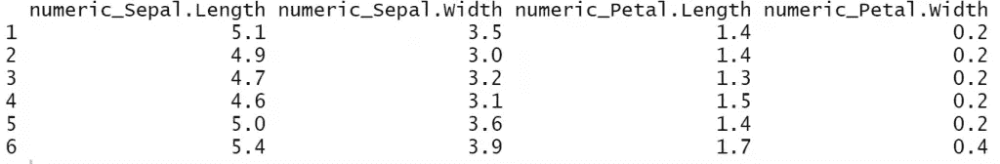
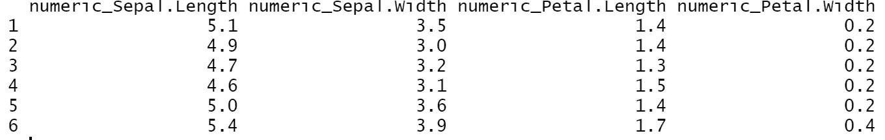
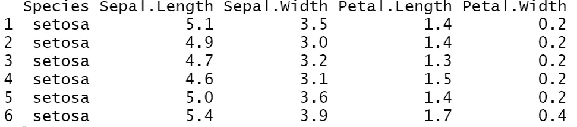
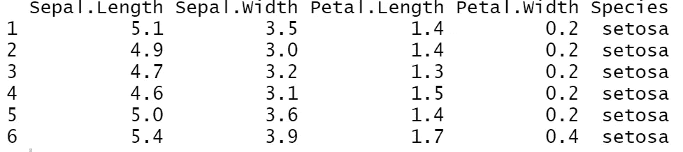
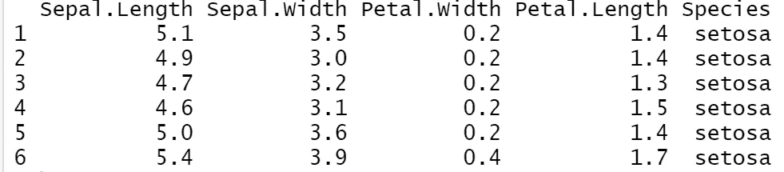
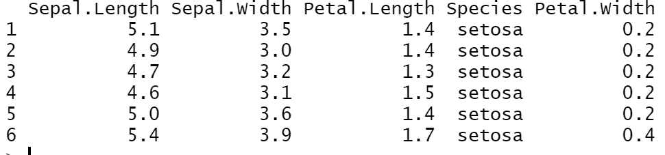
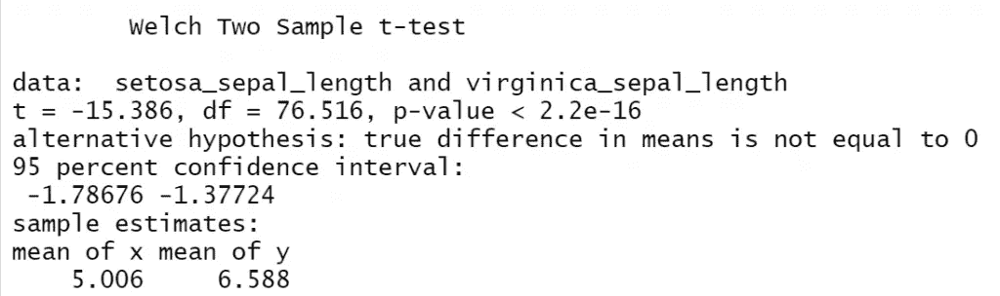
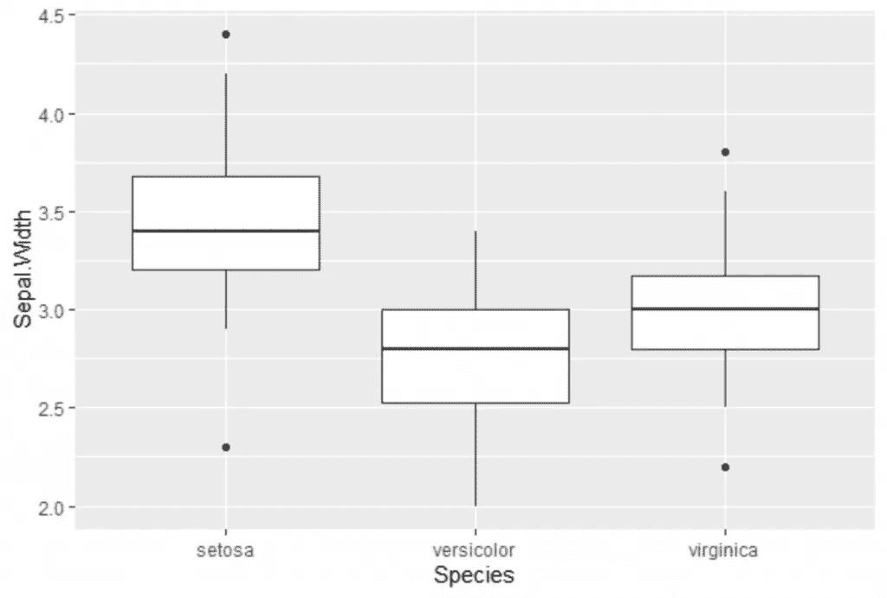
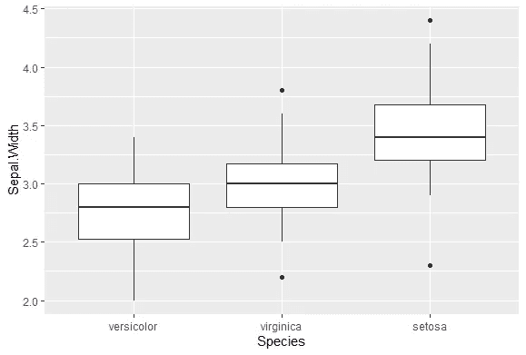

# 清理 R 中数据的有用命令

> 原文：<https://betterprogramming.pub/tip-commands-for-data-cleaning-in-r-8a5ad8d96d2b>

## 使用 R 和 tidyverse 使您的工作更轻松的命令


图片来源:[https://www.tidyverse.org](https://www.tidyverse.org)

[](https://jorgepit-14189.medium.com/membership) [## 用我的推荐链接加入媒体-乔治皮皮斯

### 阅读乔治·皮皮斯(以及媒体上成千上万的其他作家)的每一个故事。您的会员费直接支持…

jorgepit-14189.medium.com](https://jorgepit-14189.medium.com/membership) 

我发现以下命令在任何数据科学项目的 EDA 部分都非常有用。我们将使用 [tidyverse](https://www.tidyverse.org/packages/) 包，其中我们只需要 dplyr 和 ggplot2，并使用 [iris 数据集](https://scikit-learn.org/stable/auto_examples/datasets/plot_iris_dataset.html)。

# select_if | rename_if

`select_if`函数属于 dply，在我们想要根据一些条件选择一些列时非常有用。我们还可以添加一个适用于列名的函数。

**示例**:假设我只想选择数字变量，并在它们的列名中添加前缀“numeric_”。

```
library(tidyverse) 
iris%>%select_if(is.numeric, list(~ paste0("numeric_", .)))%>%head()
```



注意，我们也可以以同样的方式使用`rename_if`。需要注意的是，`rename_if()`、`rename_at()`和`rename_all()`已经被`rename_with()`取代。匹配的 select 语句已经被一个`select()` + `rename_with()`的组合所取代。

这些功能被取代是因为`mutate_if()`和好友被`across()`取代。`select_if()`和`rename_if()`已经使用了整齐选择，所以它们不能被`across()`替换，相反，我们需要一个新的函数。

# 在哪里

我们可以通过选择函数返回`TRUE`的变量，使用`where`来`select`或`rename`列。我们将使用与上面相同的例子。

**示例**:假设我只想选择数字变量，并在它们的列名前加上前缀“numeric_”。

```
iris%>%rename_with(~ paste0("numeric_", .), where(is.numeric))%>%
       select(where(is.numeric))%>%head()
```



# 一切

在许多数据科学项目中，我们希望一个特定的列(通常是因变量 *y* )出现在数据集中的第一个或最后一个。我们可以使用 dplyr 包中的`everything()`来实现这一点。

**示例**:假设我希望列种类在我的数据集中首先出现**。**

```
mydataset<-iris%>%select(Species, everything()) 
mydataset%>%head()
```

****

****示例**:假设我希望列种类出现在我的数据集中最后的**处。****

**这有点棘手。看看下面我们如何做到这一点。我们将使用第一列出现的`mydataset`，我们将把它移到最后一列。**

```
mydataset%>%select(-Species, everything())%>%head()
```

****

# **重新安置**

**`relocate()`是 dplyr 1.0.0 中的新增功能。您可以使用`.before`或`.after`指定列的确切位置。**

****例:**假设我想要花瓣。出现在 Sepal.Width 旁边的宽度列**

```
iris%>%relocate(Petal.Width, .after=Sepal.Width)%>%head()
```

****

**注意，我们也可以设置在最后一列之后出现。**

****例子**:假设我想要花瓣。最后一列的宽度。**

```
iris%>%relocate(Petal.Width, .after=last_col())%>%head()
```

****

**你可以在文档中找到更多信息。**

# **拉**

**当我们处理数据框并选择单个列时，有时我们希望输出为`as.vector`。我们可以用`pull()`来实现这个，它是 dplyr 的一部分。**

****示例:**假设我想在萼片中运行 t.test。setosa 对 virginica 的长度。注意`t.test`函数需要数字向量。**

```
setosa_sepal_length<-iris%>%filter(Species=='setosa')%>%select(Sepal.Length)%>%pull()virginica_sepal_length<-iris%>%filter(Species=='virginica')%>%select(Sepal.Length)%>%pull()t.test(setosa_sepal_length,virginica_sepal_length)
```

****

# **重新排序**

**当您使用 ggplot2 时，当您必须根据某些条件对因子进行重新排序时，有时会令人沮丧。假设我们想要显示萼片的箱线图。物种宽度。**

```
iris%>%ggplot(aes(x=Species, y=Sepal.Width))+geom_boxplot()
```

****

****例子**:假设我们想根据物种的中位数对箱线图重新排序。**

**我们可以通过`stats`包中的`reorder()`轻松做到这一点。**

```
iris%>%ggplot(aes(x=reorder(Species,Sepal.Width, FUN = median), y=Sepal.Width))+geom_boxplot()+xlab("Species")
```

****