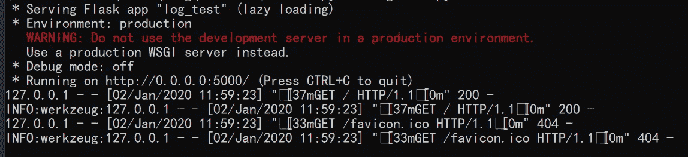
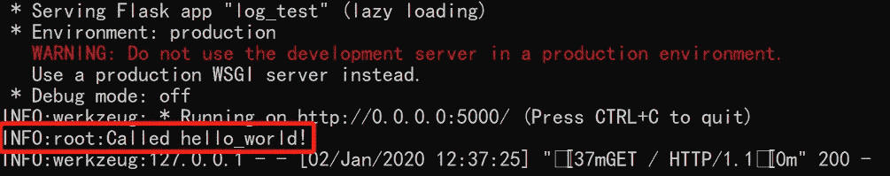
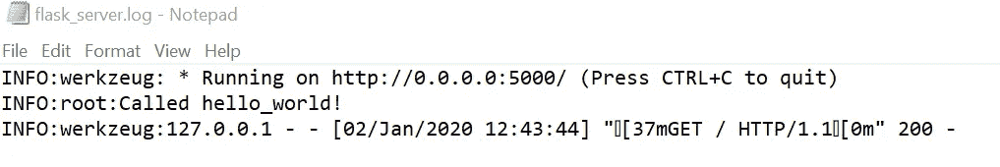
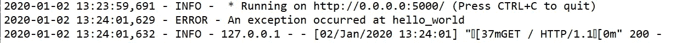
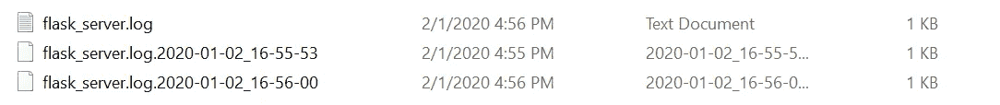

# 用 Python 处理日志文件的技巧和诀窍

> 原文：<https://betterprogramming.pub/tips-and-tricks-for-handling-logging-files-in-python-b48be3d553ad>

## 利用内置日志模块生成调试用的日志文件


由[杯先生/杨奇煜·巴勒](https://unsplash.com/@iammrcup?utm_source=unsplash&utm_medium=referral&utm_content=creditCopyText)在 [Unsplash](https://unsplash.com/s/photos/file?utm_source=unsplash&utm_medium=referral&utm_content=creditCopyText) 上拍摄的照片

通过阅读这篇文章，你将学会实现你自己的定时日志系统，为你的 [Flask](http://flask.palletsprojects.com/) 或 [Django](https://www.djangoproject.com/) 服务器输出每日日志文件。

拥有一个日志系统对于调试来说是非常有益的。您肯定希望生成每日日志文件来跟踪错误，以及收集数据，如使用情况和经常调用的 API。

我们将使用名为*日志*的内置模块，这是一个强大的模块。这个模块的主要优点之一是它是一个标准的库模块，这意味着所有的 Python 模块都可以参与日志记录。

本教程有三个部分。

1.  基本用法
2.  高级组件
3.  结论

让我们开始吧。

# 1.基本用法

## 导入

您需要先导入该模块，然后才能使用它。添加以下导入语句:

```
import logging
```

接下来，您可以通过利用基于严重性级别的可用功能来记录消息。

## 日志记录级别

总共提供了五个级别:

*   `DEBUG` —详细信息，通常仅在诊断问题时感兴趣。
*   `INFO` —确认事情按预期运行。
*   `WARNING` —表示发生了意想不到的事情，或者预示着不久的将来会出现一些问题(例如，“磁盘空间不足”)。该软件仍按预期工作。
*   `ERROR` —由于更严重的问题，软件无法执行某些功能。
*   `CRITICAL` —严重错误，表明程序本身可能无法继续运行。

您可以按如下方式调用它们:

```
logging.debug('Debug')
logging.info('Info')
logging.warning('Warning')
logging.error('Error')
logging.critical('Critical')
```

让我们通过设置一个简单的 Flask 服务器并运行日志消息来测试它。

将上面的代码保存在一个名为`log_test.py`的文件中。打开一个终端，将其指向目录，并通过以下命令运行它:

```
python log_test.py
```

打开浏览器并输入`localhost:5000`，您应该能够在控制台中看到`Hello world`响应和以下输出。



作者图片

您会注意到`“Called hello_world”` 没有被记录。这主要是因为日志记录级别已经默认为警告及以上。不会记录调试和信息消息。

在初始化期间，我们可以通过`basicConfig`函数轻松地更改日志级别。让我们通过在`app.route`装饰器的正上方和`app = Flask(__name__) initialization`的正下方添加以下代码来测试它。

```
logging.basicConfig(level=logging.INFO)
```

您应该能够看到以下输出。



作者图片

## 通过 basicConfig 初始化

`basicConfig`函数还接受一个文件名参数，该参数指示它应该使用一个`FileHandler`将它记录到一个文件中，而不是控制台中。

创建一个名为`log`的新目录，并将`basicConfig`代码修改如下:

```
logging.basicConfig(filename='log/flask_server.log' ,level=logging.INFO)
```

在网络浏览器中访问`localhost:5000`后，将会生成一个名为`flask_server.log`的文件。



作者图片

日志记录系统会将日志消息附加到文件中，以便后续调用该 URL。

## 可变数据

您可以使用格式字符串来记录变量数据。示例如下:

```
data = 'hello_world'
logging.error('An exception occurred at %s', data)
```

## 格式

您可以根据自己的喜好指定输出的格式。下面的示例将记录时间、消息的严重级别以及最后的输出消息。

```
logging.basicConfig(filename='log/flask_server.log' ,level=logging.INFO, format="%(asctime)s - %(levelname)s - %(message)s")
```

您应该得到以下输出:



作者图片

在下一节中，我们将探索日志模块的另外两个主要组件。

# 2.高级组件

上一节中的函数是 logger 组件的一部分，它公开了应用程序代码直接使用的接口。除了记录器组件之外，还有另外两个主要组件:

*   `Handlers` —将日志记录(由记录器创建)发送到适当的目的地。
*   `Formatters` —指定日志记录在最终输出中的布局。

这两个组件是`logger`组件配置的一部分。

您可以利用这两个组件来实现一个高级日志记录系统，比如根据文件大小、容量或日期在不同的文件之间轮换。

让我们通过复制相同的功能来测试它，但是这一次，同时使用`Handler`和`Formatter`组件。

## 格式程序

另一方面，formatter 接受一个简单的样式字符串，该字符串决定消息的格式。

```
formatter = logging.Formatter("%(asctime)s - %(levelname)s - %(message)s")
```

## 处理者

到目前为止，我们测试的是`StreamHandler`和`FileHandler`。除了默认处理程序之外，该模块还附带了以下处理程序:

1.  `[StreamHandler](https://docs.python.org/3.8/library/logging.handlers.html#logging.StreamHandler)`实例向流(类似文件的对象)发送消息。
2.  `[FileHandler](https://docs.python.org/3.8/library/logging.handlers.html#logging.FileHandler)`实例向磁盘文件发送消息。
3.  `[BaseRotatingHandler](https://docs.python.org/3.8/library/logging.handlers.html#logging.handlers.BaseRotatingHandler)`是在某一点轮换日志文件的处理程序的基类。它并不意味着被直接实例化。而是用`RotatingFileHandler`或者`TimedRotatingFileHandler`。
4.  `[RotatingFileHandler](https://docs.python.org/3.8/library/logging.handlers.html#logging.handlers.RotatingFileHandler)`实例将消息发送到磁盘文件，支持最大日志文件大小和日志文件轮换。
5.  `[TimedRotatingFileHandler](https://docs.python.org/3.8/library/logging.handlers.html#logging.handlers.TimedRotatingFileHandler)`实例将消息发送到磁盘文件，以一定的时间间隔旋转日志文件。
6.  `[SocketHandler](https://docs.python.org/3.8/library/logging.handlers.html#logging.handlers.SocketHandler)`实例向 TCP/IP 套接字发送消息。从 3.4 开始，还支持 Unix 域套接字。
7.  `[DatagramHandler](https://docs.python.org/3.8/library/logging.handlers.html#logging.handlers.DatagramHandler)`实例向 UDP 套接字发送消息。从 3.4 开始，还支持 Unix 域套接字。
8.  `[SMTPHandler](https://docs.python.org/3.8/library/logging.handlers.html#logging.handlers.SMTPHandler)`实例向指定的电子邮件地址发送消息。
9.  `[SysLogHandler](https://docs.python.org/3.8/library/logging.handlers.html#logging.handlers.SysLogHandler)`实例向 Unix 系统日志守护程序发送消息，可能在远程机器上。
10.  `[NTEventLogHandler](https://docs.python.org/3.8/library/logging.handlers.html#logging.handlers.NTEventLogHandler)`实例向 Windows NT/2000/XP 事件日志发送消息。
11.  `[MemoryHandler](https://docs.python.org/3.8/library/logging.handlers.html#logging.handlers.MemoryHandler)`实例将消息发送到内存中的缓冲区，只要满足特定条件，缓冲区就会被刷新。
12.  `[HTTPHandler](https://docs.python.org/3.8/library/logging.handlers.html#logging.handlers.HTTPHandler)`实例使用`GET`或`POST`语义向 HTTP 服务器发送消息。
13.  `[WatchedFileHandler](https://docs.python.org/3.8/library/logging.handlers.html#logging.handlers.WatchedFileHandler)`实例监视它们正在记录的文件。如果文件更改，它将关闭并使用文件名重新打开。这个处理程序只在类似 Unix 的系统上有用；Windows 不支持使用的底层机制。
14.  `[QueueHandler](https://docs.python.org/3.8/library/logging.handlers.html#logging.handlers.QueueHandler)`实例将消息发送到队列，例如在队列或多处理模块中实现的那些。
15.  `[NullHandler](https://docs.python.org/3.8/library/logging.handlers.html#logging.NullHandler)`实例不处理错误消息。它们由想要使用日志记录的库开发人员使用，但是想要避免在库用户没有配置日志记录的情况下显示的`No handlers could be found for logger XXX`消息。

初始化后，可以使用*为处理程序设置格式化程序*。

```
handler = logging.FileHandler(filename='log/flask_server.log')
handler.setFormatter(formatter)
```

## 记录器

记录器允许我们设置日志记录级别以及添加或删除处理程序。以下示例将日志记录级别设置为`INFO`，将处理程序设置为我们之前定义的`FileHandler`。

```
logger = logging.getLogger()
logger.setLevel(logging.INFO)
logger.addHandler(handler)
```

对于后续的日志调用，你必须使用`logger.info`而不是`logging.info`。

下面我们来看看完整的代码，以供参考。

尽管同一个实现的完整代码与前面通过`basicConfig`调用的部分相比冗长了许多，但是拥有这样一个结构的好处是允许我们轻松地实现我们想要的日志记录系统。

让我们看看下面的例子，它利用`TimedRotatingFileHandler`来记录日常文件。

## TimedRotatingFileHandler

我们将在顶部导入模块，以提醒这个 Flask 应用程序使用了`TimedRotatingFileHandler`。

```
import logging
from logging.handlers import TimedRotatingFileHandler
```

在初始化期间，您可以确定`when`参数。输入字符串不区分大小写。

*   `S` —秒
*   `M` —分钟
*   `H` —小时
*   `D` —天数
*   `W0-W6` —工作日(0 =星期一)
*   `midnight` —午夜滚动

以下示例将在五秒钟后将日志记录到一个新文件中。只有存在日志事件时，才会生成文件。

```
handler = TimedRotatingFileHandler('log/flask_server.log', when="s", interval=5)
handler.suffix = "%Y-%m-%d_%H-%M-%S"
```

`suffix`将作为生成新文件时的参考。它将始终将日志数据存储在`flask_server.log`中。一旦满足条件，当前文件将根据后缀进行重命名。

当您发送垃圾邮件`localhost:5000`时，您将获得以下输出。



作者图片

以下代码是生成每日日志文件的完整代码。只需将参数设置为`midnight`，间隔为`1`。

如果您记录的是 unicode 或另一种编码形式，请在初始化时设置它。`encoding`参数接受字符串输入，如`utf8`。

# 3.结论

让我们回顾一下今天所学的内容。

我们从探索日志模块的基本功能开始。我们学会了通过`basicConfig`函数将日志数据输出到文件中。

然后，我们继续讨论两个主要组件，即`Formatter`和`Handler`。我们用它们实现了相同的功能，并将它们公开给模块中可用的其他处理程序。

此外，我们还测试了用于每日日志系统的`TimedRotatingFileHandler`。您可以自行测试其他处理程序。

感谢阅读，下次教程再见。

# 参考

1.  [登录 Python 文档](https://docs.python.org/3.8/library/logging.html)。
2.  [伐木，基础教程](https://docs.python.org/3.8/howto/logging.html#logging-basic-tutorial)
3.  [伐木高级教程](https://docs.python.org/3.8/howto/logging.html#logging-advanced-tutorial)
4.  [Python 文档:模块日志处理程序](https://docs.python.org/3.8/library/logging.handlers.html#module-logging.handlers)