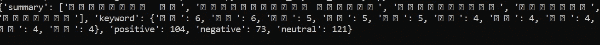
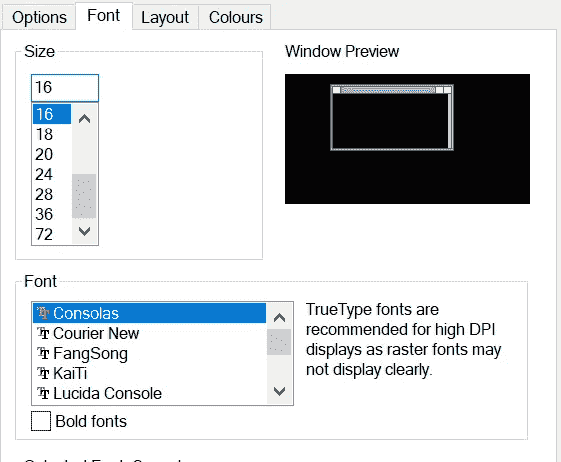

# 用 Python 处理 Unicode 文件的技巧和诀窍

> 原文：<https://betterprogramming.pub/tips-and-tricks-for-handling-unicode-files-in-python-e8a88b7ba047>


Unicode 协会的官方标志

对于那些在日常工作中经常处理 Unicode 文件(也适用于其他编码)的人来说，这篇文章是必读的。作为一名自然语言处理从业者，处理 Unicode 文件是一场噩梦，尤其是在使用 Windows 操作系统的情况下。想象一下当您遇到编码或解码错误时的挫败感，例如:

```
UnicodeEncodeError: 'mbcs' codec can't decode characters in positionUnicodeDecodeError: 'charmap' codec can't decode byte 0x90 in position
```

很多时候，这样的错误信息不够丰富，除非你是这方面的老手。你可能会问为什么我们需要编码和解码字符。我们先简单解释一下 Unicode。基于 python 官方文档， [Unicode](https://www.unicode.org/) (通用编码字符集)是一个规范，旨在列出人类语言使用的每一个字符，并赋予每个字符自己唯一的代码。Unicode 规范不断修订和更新，以添加新的语言和符号。

因此，编码和解码是将字符从文本映射到字节的一种方式，反之亦然。这使得我们可以在计算机之间传输它们，并在日常生活中使用它们。当你有不同的操作系统时，事情会变得更加复杂。此外，不同的语言有自己的字符集，这些字符集只能在某些字体下显示。为了简单起见，把它想象成把一个外国字符翻译成机器能理解的字符。在本文中，我们将探索一些可以用来在 Python 中处理 Unicode 文件的方法。让我们从可用的模式和标准编码开始。

## 通过上下文管理器读取或写入文件

打开文件最安全的方法是通过上下文管理器使用 with 语句。它会自动为我们关闭文件，防止任何可能出现的问题。

默认模式是`'rt'`，指的是读取和文本文件。您可以使用以下代码编写:

上面的代码将覆盖并截断文件。在某些情况下，你可能更喜欢使用模式`'a'`而不是`'w'`。以下列表显示了可用的完整模式:

*   **r** :打开读取(默认)
*   **w** :打开进行写入，首先截断文件
*   **x** :以独占方式打开，如果文件已经存在则失败
*   **a** :打开写，追加到文件末尾(如果存在)
*   **b** :二进制模式
*   **t** :文本模式(默认)
*   **+** :打开一个磁盘文件进行更新(读写)

您可以组合一些模式。[如原始文档](https://docs.python.org/3.5/library/functions.html#open)中所述，对于二进制读写访问，模式`'w+b'`打开并将文件截断为 0 字节。`'r+b'`打开文件而不截断。

## Python 中的标准编码

要在 Python 中指定编码，只需在上下文管理器初始化期间传入另一个参数。每当读取或写入 Unicode 字符时，都必须指定它。以下示例显示了将 Unicode 文本追加到现有文件的正确方法:

如果你不确定使用哪种编码，只需输入`utf8`并检查错误。大多数时候，UTF-8 对于编码和解码字符已经足够好了。但是，在某些情况下，您需要使用不同的编码。查看以下[链接](https://docs.python.org/3.7/library/codecs.html#standard-encodings)，了解更多可用编码。如果您不知道文件中使用了什么编码，该怎么办？让我们进入下一部分，了解更多信息。

## 通过 Notepad++检查编码类型

就我个人而言，我更喜欢使用 Notepad++来浏览文件内容。如果你用 Notepad++打开一个文件，你可以在用户界面的右下角看到使用的编码类型。


使用 UTF 8 编码的示例文件。作者图片

您可以通过编码菜单修改编码。它接受大量最常用的编码。


该图显示了单击编码菜单时的下拉菜单。作者图片

如果您曾经遇到过无法将文件转换为另一种编码或者无法读取某些编码的问题，即使您已经正确指定了编码，您可以尝试下面的*愚蠢但有效的*方法。

1.  用您想要的编码创建一个空文本文件。
2.  复制原始文件中的所有内容。
3.  将其粘贴到新文件中并保存。

大多数情况下，这会自动将所有字符转换成新的编码。请注意，如果字符不能基于新编码进行转换，可能会丢失数据。

## 处理未知编码的字符

如果您遇到无法识别编码的情况，并且字符是未知的，您可以尝试修改 errors 参数来解决这个问题:

error 参数指的是如何处理编码和解码错误。请注意，该参数不能在二进制模式下使用。可用的错误处理程序有:

*   **strict** :如果有编码错误，则引发`[ValueError](https://docs.python.org/3.5/library/exceptions.html#ValueError)`异常。`None`的默认值也有同样的效果。
*   **忽略**:忽略错误。请注意，忽略编码错误会导致数据丢失。
*   **替换**:在有错误数据的地方插入替换标记(如`'?'`)。
*   **surrogateescape** :将任何不正确的字节表示为 Unicode 私有使用区的码位，范围从 U+DC80 到 U+DCFF。当这个错误处理程序被用于写数据时，这些私有代码点将被变回相同的字节。这对于处理未知编码的文件很有用。
*   **xmlcharrefreplace** :仅在写入文件时受支持。编码不支持的字符被替换为适当的 XML 字符引用`&#nnn;`。
*   **反斜线位置**:用 Python 的反斜线转义序列替换格式错误的数据。
*   **namereplace** :(也仅在写入时支持)用`\N{...}`转义序列替换不支持的字符。

## 在命令提示符下显示 Unicode 字符

如果您在 Windows 操作系统中运行命令提示符，大多数情况下会出现显示 Unicode 字符的问题。产生类似下图的乱码:



命令提示符显示乱码字符。作者图片

为了解决这个问题，我们需要将设置更改为正确的字体。

1.  右键单击顶部菜单，然后单击属性。
2.  点击字体菜单。
3.  将字体修改为可以显示字符的所需字体。比如可以用凯体字体渲染汉字。



命令提示符的字体属性。作者图片

## 使用 Unicode 字符打开文件路径—适用于通过 pandas 模块读取 csv 文件

这部分有点棘手，尤其是当你使用某些 Python 模块时，比如 pandas。假设您有以下非英语语言的文件路径:

```
file_path = 'C:\path\to\数据分析\data.csv'
```

试图通过 read_csv 读取文件将会抛出一个错误，因为文件路径包含 Unicode 字符。如果使用 Python 中的内置 open()函数，这不是问题。为了解决这个问题，我们需要首先打开文件，然后将它传递给 read_csv 函数:

# 结论

让我们回顾一下我们在本教程中所涵盖的内容。首先，我们了解了在读写文件时使用上下文管理器(带语句)的重要性。我们接触了 Python 中可用的模式和标准编码列表。现在我们知道使用现有的文本编辑器，如 Notepad++来提供输入文件的编码和结构。如果有未知编码的字符，我们可以在初始化时通过 errors 参数来处理。对于 Windows 用户，可以选择在命令提示符下修改字体，以正确显示 Unicode 文本。最后，我们学会了在使用 pandas 模块读取任何数据集之前先打开文件。感谢您的阅读，祝您有美好的一天！

## 参考

1.  [https://docs.python.org/3.5/library/functions.html#open](https://docs.python.org/3.5/library/functions.html#open)
2.  [https://docs . python . org/3.7/library/codecs . html #标准编码](https://docs.python.org/3.7/library/codecs.html#standard-encodings)