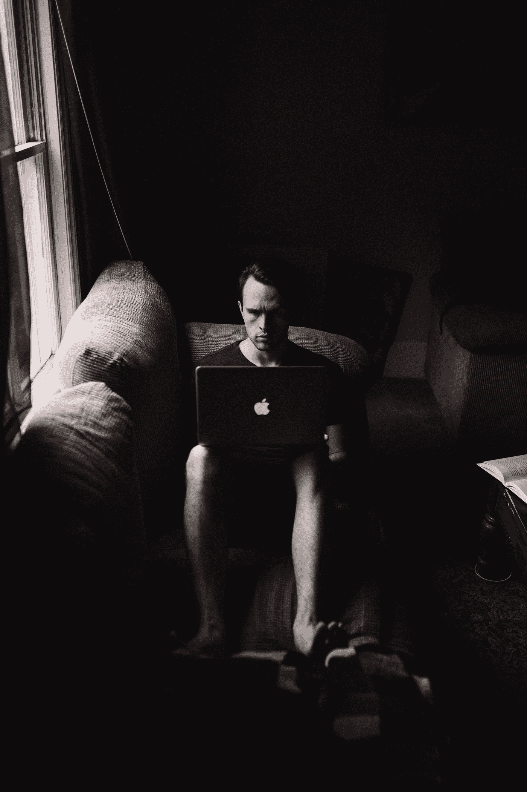

# 在家工作时保持高效的技巧和诀窍

> 原文：<https://betterprogramming.pub/tips-and-tricks-to-staying-productive-when-working-from-home-e1997fae2587>

## 远程工作可能比表面上看起来更难

[安德鲁·尼尔](https://unsplash.com/@andrewtneel?utm_source=medium&utm_medium=referral)在 [Unsplash](https://unsplash.com/?utm_source=medium&utm_medium=referral) 上拍照

所有的开发者都不一样。有些开发人员在家工作时自然会更有效率，而有些则不然。我本人属于后一类。出于某种原因，我在指定的工作区和办公室完成了更多的工作。

幸运的是，当谈到在家工作时，遵循健康的习惯可以变得更有效率。这可能需要一些额外的工作，但绝对值得。这里有一些在家工作时完成更多事情的技巧和诀窍。

# 坚持你的工作时间表，尽可能早地醒来

当到了每天站立的时间，你不想在会议中昏昏沉沉，昏昏欲睡。这就是为什么约束自己，坚持正常的工作/睡眠时间表是至关重要的。

醒来就好像你要去上班，或者更好的是，比平时醒得更早。通过早起，你会以一个全新的思维开始新的一天。作为一个狂热的游戏玩家，很容易欺骗自己玩游戏到深夜，并想，*哦，我可以随时醒来。这是一个滑坡。不要这样对自己。*

# 沟通是关键

做一个团队成员，比你认为需要的更多的交流。很难量化远程完成的工作。可悲的事实是，你交流得越多，即使是那些你认为不重要的琐事，你就越能向你的雇主传达你的价值。

记住，在家工作时，雇主不能走到你的办公桌旁检查你正在做什么。如果你正在使用 Slack 或其他通讯工具，请确保试着保持在线。不要在没有让团队知道的情况下离开或闲置很长时间。

不要无缘无故地消失几天。这可能会让你的雇主怀疑你在做什么。

# 尽量减少分心

虽然穿着睡衣在家工作很舒服，但也很容易分心。你可能有一只宠物，比如一只狗或一只猫，当你工作时，它们会分散你的注意力，让你无法工作。当然，你不应该忽视你的最爱，但应该有一个健康的界限。

大多数时候，编码是生产力的爆发。当你准备进入状态时，关上门，戴上耳机，这样每个人都知道你在工作。这很难，但这是你坚持下去并完成日常任务的唯一方法。

# 如果可能的话，把你的工作场所和个人空间分开

你将会在家里花很多时间在电脑上。当你走进办公室时，很容易划分——你会在工作时工作，在家时放松。你已经没有了。所以你必须给人留下这样的印象。

你需要对自己诚实，并严格要求自己。就像在部队一样，该睡觉的时候才能睡觉。如果你很幸运有一间空房，那就只在工作时使用。

# 记下你当天想要完成的事情

我们的大脑认知资源有限——不要通过“记住”所有需要做的事情来限制自己。列出一份需要尽快解决的紧急事项清单。

在我的桌子上放一份清单能让我保持正确的方向和注意力。你可以用特雷罗或者吉拉来列出所有需要做的事情。

# 每天休息一下，走出家门

当世界各地都有疫情时，这并不总是正确的，但走出家门对整体健康至关重要。人类是社会物种——我们需要走出去和其他人互动。

即使只是去吃午饭，或者去公园吃东西，或者去跑步，一定要走出家门。否则你会发疯的。我每天午餐时间离开一个小时，晚上可能会去跑步或训练柔术。它让我离开办公桌，这是非常必要的，尤其是在处理孤独或抑郁的时候。

# 包扎

我希望你至少找到了一个在家工作时保持高效率的有用建议。感谢阅读，保持高效。编码快乐！