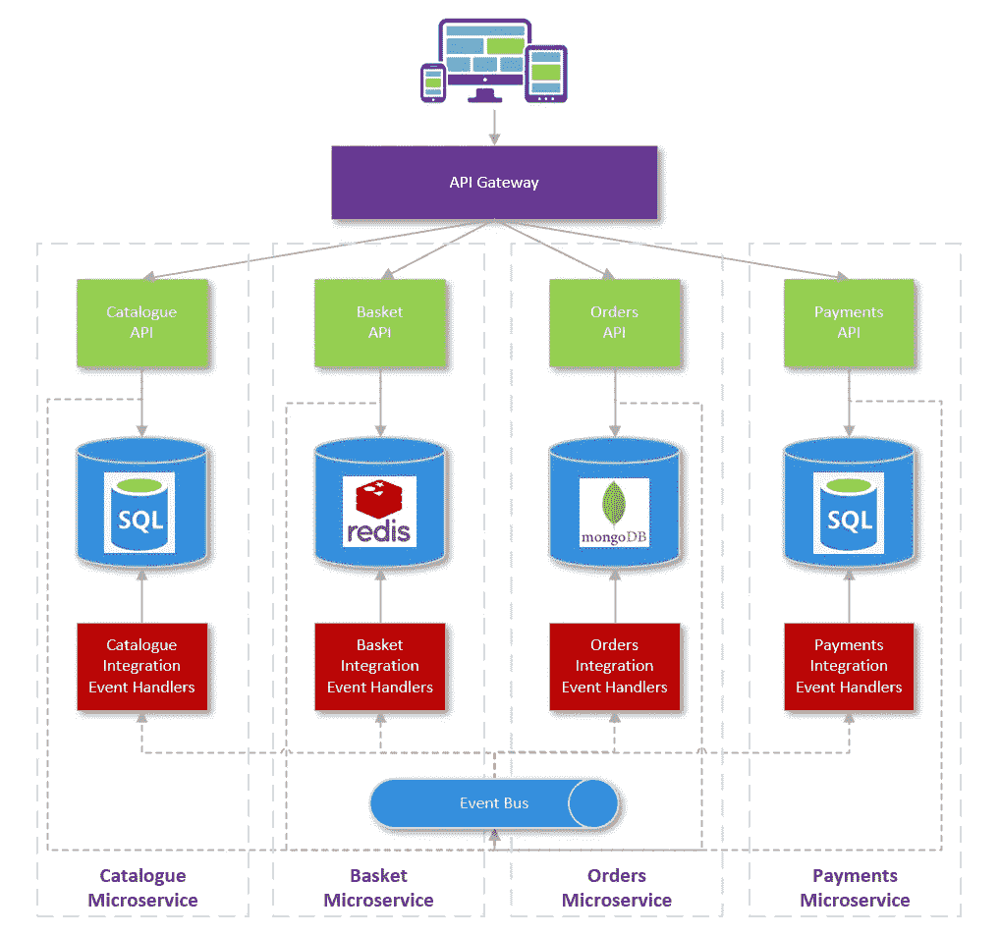
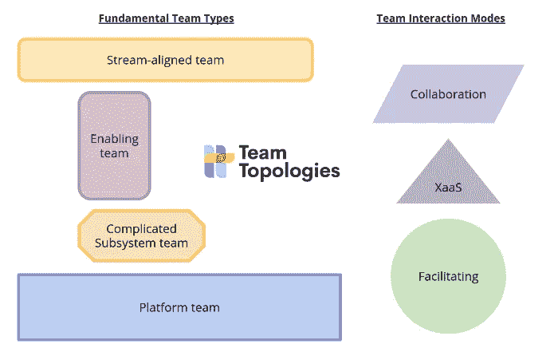
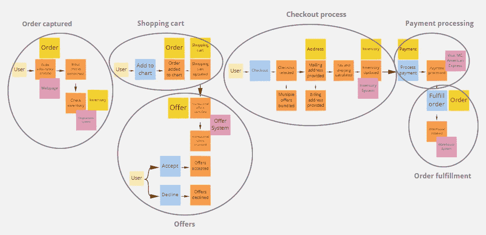
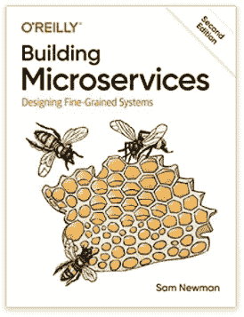
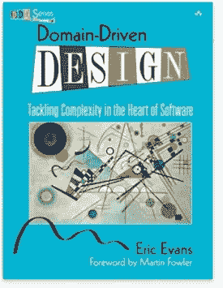
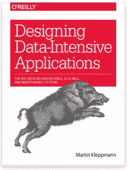
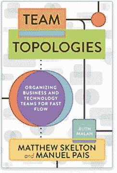
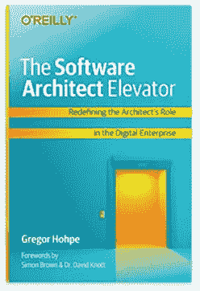

# 野外驯服微服务的小技巧

> 原文：<https://betterprogramming.pub/tips-for-taming-microservices-in-the-wild-795b8bce4567>

## 在企业中采用微服务的技巧和故事

图片来源:网飞

我们的软件开发世界被流行词汇所困扰，微服务维度当然也不例外。CQRS 的 Kubernetes，DDD 的 Event Sourcing 我们从哪里开始，这些概念的哪些方面使它们非常适合微服务架构？

在你开始你的深渊之旅之前，你必须首先确定你已经回答了一些基本问题。*什么是*微服务以及*我们为什么要使用它们*？更重要的是，他们是不是你此时此刻问题的正确解决方案。

我们经常把某些技术比作养老虎当宠物。照看一个成熟的微服务架构通常会让你觉得自己就像 Joe Exotic 在管理一个充满致命猫科动物的动物园。如果没有适当的规划、安全和服务界限，微服务架构会很快变得不可控制，迟早有一只老虎会反咬一口！

# 什么是微服务？

随着时间的推移，出现了各种各样的架构技术，其共同的目标是将我们的系统分解为更细粒度和更易管理的组件:分层架构、面向服务的架构……微服务目前是该领域的新生事物。

微服务建立在 [Eric Evans 的](https://www.oreilly.com/library/view/domain-driven-design-tackling/0321125215/)革命性想法的基础上，通过业务领域安排代码，并提议部署到独立托管的组件。由于现代 DevOps 技术和云计算的兴起，这种风格的架构现在已经成为可能，云计算允许快速供应基础设施。

微服务是一种架构风格，它将应用程序构建为服务的集合，这些服务

*   高度可维护和可测试
*   松散耦合
*   可独立部署和扩展
*   围绕业务能力组织
*   由一个小团队拥有、运输和运营

每个微服务都有自己的数据库和 API。异步消息技术通常用于通过事件总线以最终一致的方式将数据从一个微服务同步到另一个微服务。通常使用 API 网关通过公共域上的不同基本路径来呈现微服务。

# 为什么选择微服务？

微服务带来的一些技术优势可能有点太容易被抓住了，而且还有很多。在实践中，我发现这种现代架构风格的最大好处是它对我们团队实现快速流程的影响

*   许多团队并行自主工作的能力
*   需要较低认知复杂性的较小服务
*   细粒度组件和团队使我们的基础架构和团队更容易扩展

那么使用微服务架构的技术优势是什么呢？ ***多语言架构*** 可用于我们的开发团队选择他们用于微服务的技术堆栈。现在，我们可以在不同的领域真正使用正确的工具，并在更安全的环境中尝试更新的技术。

将我们的架构分解成更小的服务意味着我们可以轻松地独立部署这些粒度单元。这使我们能够在部署时大幅降低风险，并极大地提高团队的敏捷性。

> *快乐的日子！那么我们都应该开始使用微服务了吗？不幸的是，事情没那么简单……*

微服务对于大型团队开发的大型复杂系统或软件来说确实很出色。微服务帮助您将复杂性分解为更小的块，更易于管理，但是整个系统架构的整体复杂性变得非常复杂。对于较小的项目来说，复杂性的代价通常太大了。

这里有一些管理这种复杂性的技巧，以确保你不会在老虎围栏的错误一边结束。

## 1.团队拓扑

在我讲述了微服务的好处之后，我的第一个建议是关于团队的，这并不奇怪。如果你从这篇文章中拿走了一样东西，那么请阅读 Matthew Skelton 和 Manuel Pais 的 [***团队拓扑*** 。团队拓扑对我和我的团队产生了巨大的影响，允许我们在构建软件时释放极快的流程。](https://teamtopologies.com/)

团队拓扑很大程度上基于康威定律。

> "设计系统的组织被限制生产这些组织的通信结构的复制品的设计."

康威定律可以通过执行一个“反向康威策略”来抵消，在这个策略中，你的团队根据你对架构形成的预期而分裂。这意味着随着时间的推移，您的团队可以与您的架构和谐地工作，而不是不断地与之对抗。

Matthew Skelton 和 Manuel Pais 还提倡使用专门的平台团队来大幅提高流量。平台团队现在被认为是在 [ThoughtWorks Radar](https://www.thoughtworks.com/en-gb/radar) 上采用的最佳实践。

## 2.平台

平台是我的团队在微服务领域取得成功的绝对关键。我们最近才开始让整个团队致力于构建平台，这大大增强了我们大规模构建产品的能力。下面是我发现在构建微服务时特别有帮助的几个平台。

*   **UI 设计系统:** UI 组件库，用于重用 UI 控件，确保您的微服务 UI 具有一致的观感。
*   **管理门户:**管理门户是帮助解决常见管理问题和实现自动化的好方法。这些应该关注开发人员的生产力以及支持和管理问题。可以提供帮助的领域包括:自助基础架构、RBAC、查看日志/事件故障、报告、BI、运行状况检查和监控。
*   **应用网关:**一个像样的应用网关对于微服务的成功是绝对必要的。
*   **Kubernetes:**Kubernetes(***k8s***)是一个容器编排器，帮助您大规模运行基于容器的工作负载。k8s 最大的好处是，它为您的开发人员提供了巨大的能力和灵活性，使他们能够快速构建大量小型微服务。

维护一个围绕 Kubernetes 等技术构建的基础设施平台是一项艰巨的任务，但如果你希望大规模使用微服务，你将会获得回报。拥有经验丰富的架构师和工程师的平台团队将是您成功的关键。

## 3.严格分离

微服务的一个基本规则是，每个微服务都应该有自己专用的数据库。当涉及到用户界面和代码分离时，事情变得更加灰暗。

*   **微前端:**微前端将隔离原则扩展到 UI 层。每个微服务团队都维护自己的复合 UI 部分，或者为自己的服务提供完全独立的 UI。有很多方法可以实现微前端，但是我发现 *web 组件*工作得非常好。由于使用 web 组件的复杂性，我们发现创建一个健壮的沙箱和框架来开发它们会有很大的不同。
*   **代码分离:**重要的是，微服务只访问它们自己的数据库，我们不要偏离我们旧的工作方式。如果你的团队发现很难坚持这一原则，那么可以通过将微服务分割成单独的存储库或使用适合度函数来分析分层，如 [ArchUnit](https://www.archunit.org/) 。
*   团队分离:为了不违反康威定律，我们应该让不同的团队在每个微服务上工作。由不同团队开发的任何代码都应该位于单独的存储库中。对于可能使用内部/开源渠道进行贡献的平台来说，这通常不太真实。

## 4.集中式测井和遥测

虽然关注点分离对于微服务来说通常是件好事，但对于日志和遥测来说却不是这样。拥有日志和遥测的集中视图对于帮助您快速诊断问题非常重要。

*   **消息相关性:**消息和请求应该使用 ***相关性 ID*** 分组在一起。这将帮助您诊断与特定用户或依赖关系相关的问题。
*   **事件处理:**事件的处理应该在所有微服务中以标准的方式完成。这将确保以标准方式记录、跟踪、分组和重试事件。平台或库可以在这方面提供帮助。
*   **消息医院:**为大型分布式系统处理消息时处理错误是一项艰巨的任务。拥有一个查看和纠正失败事件和消息的平台对管理微服务系统非常有帮助。

## 5.领域驱动设计

领域驱动的设计原则对微服务特别有效。DDD 提倡将软件安排到由**业务领域**分隔的**有界上下文**中。Eric Evans 备受推崇的领域驱动设计思想发表于 2003 年，微服务时代在两年后诞生绝非巧合。

球队经常对 DDD 又爱又恨，但我的经验是，当这些原则被正确理解和应用时，它可以是美好的事情！由于微服务的事件驱动和分布式特性，我发现一些 DDD 技术特别有效。

**事件风暴:**事件风暴是最近由[阿尔贝托·布兰多里尼](https://www.youtube.com/watch?v=mLXQIYEwK24)发明的。它是一种设计技术，专注于将产品团队和业务团队聚集在一起，以协作的方式设计系统架构。事件风暴让团队首先思考系统的事件和行为，然后研究所需的命令和组件。最后一个阶段是确定需要哪些集合(数据结构),并一起构建一个数据模型。

事件风暴的伟大之处在于它让你的团队以正确的方式思考问题，而不是直接跳到数据模型。这种设计方式对我的团队非常有效，我们合作的业务团队一直都非常投入，这对 DDD 非常重要。使用事件风暴，你将得到产品团队和业务团队都理解的丰富的领域模型。

在与 DDD 和微服务合作时，我们面临的最大挑战之一是确定我们的领域边界和聚合。事件风暴是帮助您的团队工作的一种极好的方式，通过它聚合和有界的上下文很好地为您的领域工作。

**CQRS 和事件采购:**这两种技术在 DDD 中都非常重要。关于什么是 CQRS 和事件采购，还有更好的解释，所以我不想让你读更多我的漫谈。虽然这些技术经常在 DDD 使用，但我发现团队经常太快使用它们，因为它们是新的和闪亮的。

CQRS 和事件源是特别难遵循的实践，在使用它们之前，确保有一个好的理由来解决你的问题域。创建这些技术的主要原因之一是它们可以帮助您更容易地表示您的领域。通常使用事件、命令和查询可以帮助你创建一个更丰富的领域模型。如果这不是你要解决的问题的情况，并且 CQRS 或活动采购的技术方面对你来说都不重要，那么这些可能不是目前要遵循的正确模式。

也就是说，事件采购的和/或 CQRS 与使用事件风暴进行协作设计的结合是非常强大的！这些技术是相互配合的，允许您和您的团队构建更丰富的模型，更准确地表示您的微服务所绑定的领域。

## 6.共享原则

我们已经讨论了团队对于承担微服务的重要性。

> 如果你是在这些多岩石的海洋中航行的船长，那么你最好确保船上的每个人都朝着同一个方向划船！

微服务中的一些原则与我们在开发单片应用程序时所习惯的非常不同，因此请确保您的团队了解其中一些原则以及它们带来的好处。

我经常发现阻碍团队的最大障碍之一是 **DRY(不要重复自己)**规则。在微服务世界中，我们预计会有大量的重复，尤其是数据及其相关代码。一般来说，共享代码或库来解决跨领域的问题是一个好主意，比如日志记录、事件处理和身份验证，但其他任何事情都会导致硬依赖和强耦合，这是我们首先要努力驯服的野兽。

一个**微服务机箱**可以帮助解决一些常见问题，让您的团队在构建新的微服务时快速建立起来。这将允许您的团队快速到达构建中最重要的部分并专注于它。

## 7.研究

大多数有效构建微服务的技术都经过了尝试和测试。确保你在开始之前做了调查，给你最大可能的成功机会。

Sam Newman 的书精彩地概述了微服务带来的一些挑战，以及应对这些挑战的一些技术。这是一个很好的起点。

构建微服务:设计细粒度系统

领域驱动设计和微服务是天作之合！如果你没有读过这本书，或者没有了解过一些 DDD 原则，那么我强烈推荐你阅读这本书。这本书是革命性的，对游戏中许多最好的程序员产生了巨大的影响。它很好地经受了时间的考验，但是如果你更喜欢最近的书，那么沃恩·弗农的《[红皮书](https://www.amazon.co.uk/Implementing-Domain-Driven-Design-Vaughn-Vernon/dp/0321834577)是个不错的选择。

领域驱动的设计:解决软件核心的复杂性[2003]

使用微服务时，您可以为每个微服务选择正确的数据存储和检索技术。Martin Kleppmanns 的书给出了迄今为止我所遇到的不同数据库、数据结构和数据处理技术的最佳分类。

[设计数据密集型应用](https://www.amazon.com/Designing-Data-Intensive-Applications-Reliable-Maintainable/dp/1449373321)【2015】作者 Martin Kleppmann

我已经说过这本书对我和我的团队有多重要。团队拓扑为您提供了一些关于如何最好地设置您的团队以成功使用微服务的深刻见解。

[团队拓扑结构:组织业务和技术团队实现快速流程](https://www.amazon.co.uk/Team-Topologies-Organizing-Business-Technology/dp/1942788819)【2019】作者:Matthew Skelton 和 Manuel Pais

一旦你有了征服微服务的策略，你会想要记录下来，并向你的利益相关者和团队传达你的愿景。这本书是对软件架构中一些技术性较低的方面的极好尝试，这些方面将是团队实现战略的关键。

软件架构师电梯:重新定义架构师在数字企业中的角色

# 一些最后的想法

这些只是我在使用微服务架构时帮助我的一些想法和技术。有些人可能不同意我的观点或者有更好的想法，这绝对没问题！

许多团队未能使用微服务，但每个人都会在这个过程中犯一些错误。不正确的领域界限、错误的技术选择、错误的团队、缺失的需求……要记住的最重要的事情是对变化保持开放的态度，尽可能多地与人合作，学习和借鉴他们的经验。

如果你对我的有任何其他想法或想法，我很乐意听听！祝你好运驯服你的老虎！