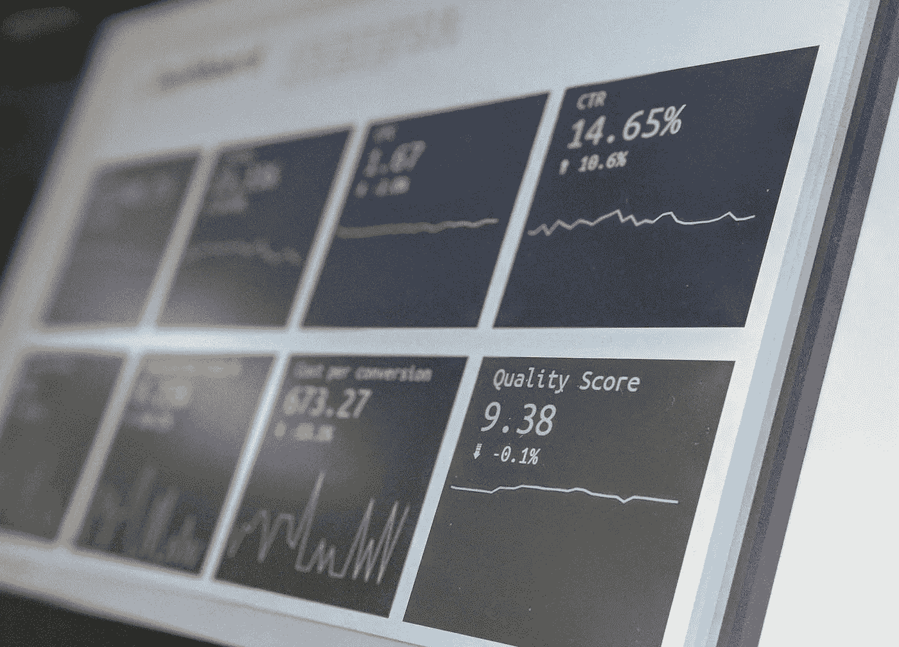
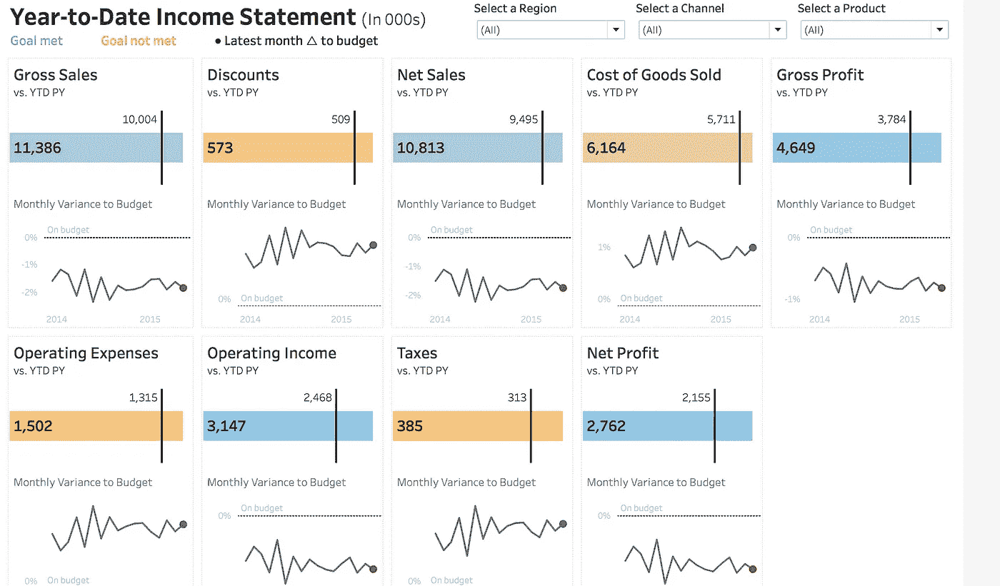
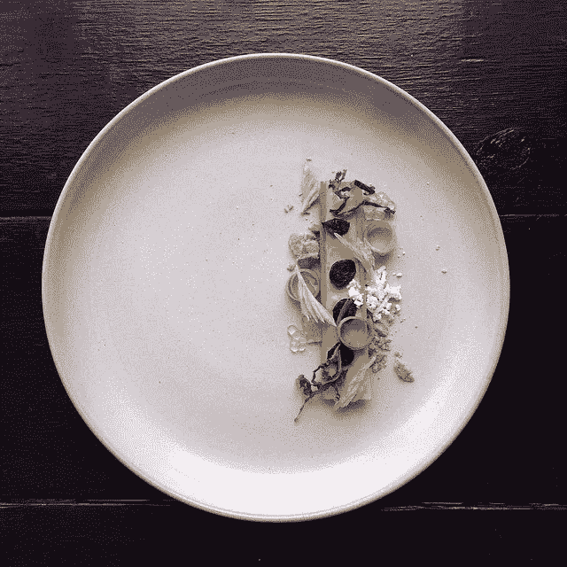

# 设计百万美元仪表板的技巧

> 原文：<https://betterprogramming.pub/tips-on-designing-a-dashboard-worth-millions-of-dollars-21b1f992dee2>

## 如何避开仪表板墓地

斯蒂芬·道森在 [Unsplash](https://unsplash.com/search/photos/dashboard?utm_source=unsplash&utm_medium=referral&utm_content=creditCopyText) 上拍摄的照片

在过去的几周里，我们看到 Tableau 被 Salesforce 以 157 亿美元收购，Looker 被谷歌以 27 亿美元收购。

这些公司为什么这么值钱？

为什么那么多公司愿意为 Tableau 和 Looker 提供的服务付费？

事实是，仪表板可能是时间和资源的昂贵浪费，或者它们可以提供比原始投资更有价值的见解。事实上，创建仪表板是一项非常有利可图的业务。

我为一家公司工作，该公司的业务模式围绕着向外部客户销售仪表盘和见解。我们只有四种仪表板产品。就是这样，然而，这家公司已经存在了十多年。

这是因为他们非常擅长创建持续产生影响的仪表板。这些不是你用了一两个月就忘了的仪表盘。相反，他们创建的仪表盘简洁、清晰，有助于董事们快速做出决策。

他们能够通过创建遵循一些基本原则的仪表板来做到这一点。我们想在下面分享一些基本的技巧。谁知道呢，也许你的团队会建造下一个百万美元的仪表板。

# **别埋了乐德**

在开发仪表板时，您需要首先用一个高层次的指标来吸引您的受众。这可能是一年内在保险欺诈中损失的总金额，一个突出公司表现的排名，或者可能是三个特定的指标。

这些高级指标的目的是激起人们的兴趣。它需要抓住观众，迫使他们提出问题，并不断深入挖掘仪表板。

具体来说，你想让他们问一些问题，比如这个数字为什么这么高或这么低，是什么因素导致了这个数字？

让我们看一个例子(见下面的仪表板):

来源: [Tableau](https://www.tableau.com/about/blog/2017/10/7-tips-and-tricks-dashboard-experts-76821)

这个仪表板实际上做得很好。它是干净的，提供非常简洁的信息。

但是，没有初始抽签。没有明显的迹象表明公司的收入是好是坏。

所以我为什么要感兴趣呢？我真的没有任何问题，因为我没有任何驱动指标或美元数字来做准备。

将描述净收入与目标差距的金额和百分比放在左上角是一个好的设计决策。这组数字会驱使我问正确的问题。具体来说，为什么净利润高于或低于预期？

这将促使最终读者查看下面的图表。净利润在这个仪表盘上是存在的，只是藏在角落里。实际上是埋掉了铅。

最重要的信息应该优先显示在仪表板的顶部。

# 注重内容和风格

创建一个伟大的仪表板就像在高级餐厅当厨师一样。

如果你太注重审美而不是味道，你的食物会很难吃。如果你不注重美观，你的顾客就看不到你 50 美元的鲑鱼和胡萝卜菜肴的价值。

创建带有各种铃铛和哨子的华而不实的仪表板是很有诱惑力的。类似于 21 世纪初，在高级餐饮世界的每一道菜上都撒上泡沫、球体和凝胶的诱人方式。

但是花里胡哨并不能讲述一个故事。

他们可以强调这一点，但他们也可以分散最终用户的注意力，使其更难做出明确的决定。

所以过分关注风格会阻碍而不是帮助。

另一方面，展示也很重要。演示可以吸引最终用户的注意力，即使你有坏的数据。比如下面我们来看看这道漂亮的菜。

由 Instagram 上的[**@ chefjacqueslamerde**创作的](https://instagram.com/chefjacqueslamerde/)

…等等…那只是芹菜、花生酱和葡萄干…

但是，不知何故，它看起来更像。即使是坏数据，有时也可以被漂亮的仪表盘原谅(这不是鼓励坏数据！).

我们试图强调这样一个事实，即设计在我们如何感知信息方面发挥着作用。

作为数据专业人员，我们有时会只关注数字和指标。数字本身并不能像吸引我们一样吸引人们的兴趣。抓住人们的注意力是[设计原则发挥作用的地方](https://uxplanet.org/10-rules-for-better-dashboard-design-ef68189d734c)。

同样，如果我们看净收入仪表板，它是干净的，有一个非常简单的风格。很清楚地了解每个图表中发生了什么。人们通常认为有很多铃铛和哨子就能构成一个漂亮的仪表板。

实际上通常是相反的。保持仪表板简单，只包含所需的数据，使信息更加清晰。如果你有太多的事情要做，你会混淆信息，让最终用户感到困惑。

这就像仪表板的 UX 应该像网站的 UX 一样对待。

# 不要在互动背后隐藏太多

我们提到了很多关于避免花里胡哨的东西，因为它们经常会破坏你试图用仪表板传达的信息。

大多数仪表板允许的一个更具体的特性是过滤器和工具提示。这些在某些方面很棒，直到你把太多的信息放在它们后面。

要求终端用户进行太多的交互来获取数据可能会冲淡你试图描述的信息。

经验法则:如果你不能打印出你的仪表板并讲述同样的故事，那么你在工具提示和过滤器后面隐藏了太多的信息。

其中一个例子是提供了过多的过滤器，这些过滤器可能会与仪表盘上不同的小部件交互。这迫使最终用户需要翻转每个小部件的多个状态，以获得您想要告诉他们的信息。

有时候，我们想要过多的信息只会进一步阻碍信息的传递。仪表板是关于信息优先级的。你应该只展示能帮助高管做出明确决策的最重要的信息。

大多数主管都希望有很多选择来分割数据，但这并不意味着你应该这样做。过多的交互可能会促使他们不断分析滤波器的新配置，而不是做出决定。这意味着你将不得不重新寻求更好的设计。

# **提供背景**

当您创建仪表板时，您通常可以在真空中创建它们。团队经常创建仪表板或度量标准，并且没有意识到其他公司或团队可能不知道正在发生什么。尤其是当您开始创建自定义指标时。

这就是我们建议为指标、仪表板目的和轴提供上下文的原因。

**指标**

不管你假设你的度量是众所周知的还是深奥的。以清晰简洁的方式定义指标所代表的内容对每个人都有好处。这也迫使团队使用易于向最终用户解释的度量标准。一些团队可能会创建超级复杂的模型来计算度量，但是这通常会抽象出度量可能具有的价值。相反，你应该关注那些你可以向任何人解释的简单指标。

如果你不能理解一个指标，你就不能做决定。

**仪表板的用途**

终端用户第一次体验仪表板时，他们可能不知道为什么要看它。把用户正在看的东西用几个句子组合起来可以帮助他们更好地理解。从很多方面来说，你应该努力不要求一个总结，但是有一个总结总是好的。类似于带代码的文档。

好的代码应该需要很少的文档，但这并不意味着你不应该记录你的代码！永远记录一切。

**坐标轴**

你如何定义轴并不总是直截了当的。您需要足够多的刻度线，以便最终用户能够理解折线图和条形图的含义，但是您不需要太多的刻度线，以免造成混乱。这归结于良好的判断。例如，当您使用迷你图时，通常会限制刻度线，但如果它是主折线图，您可能会沿每个轴提供更多的上下文。

# **细节决定成败**

高级指标通常提供“是什么”而不是“为什么”。

高级指标促使用户寻找答案。

是什么在推动净利润这样的高水平数字？

因此，仪表板的下一层应该有助于回答这些问题。

这意味着您需要查看顶部指标，并考虑最终用户在查看它时可能会有什么问题。在仪表板开发流程的这一步，您应该尝试列出作为最终用户您会有哪些问题。让一两个还没有看过仪表板的团队成员写下他们的问题是很有帮助的。这样你就有了一双全新的眼睛。

基于这些问题，您可以开始创建提供所需洞察力的二级仪表板。

Tableau 有一个很棒的特性叫做动作。这可以让您轻松地深入查看更详细的特定仪表板。

这里的目标是提供高层次的指标和低层次的细节，帮助董事们做出具体的决策。

# 结论

这是我们在一家公司工作时学到的一些很好的技巧，这家公司的唯一目的是创建仪表板，为外部客户提供价值。我们希望它能帮助您创建令人惊叹的仪表盘，为您的公司创造价值。请记住，要专注于创建不会埋没 led 的仪表板，并允许董事轻松做出好的决策。这就是你如何做一个百万美元的仪表板。

相比之下，过多的花里胡哨和设计糟糕的仪表板会导致糟糕的决策或没有决策。

如果您有任何问题，请随时发送给我们！