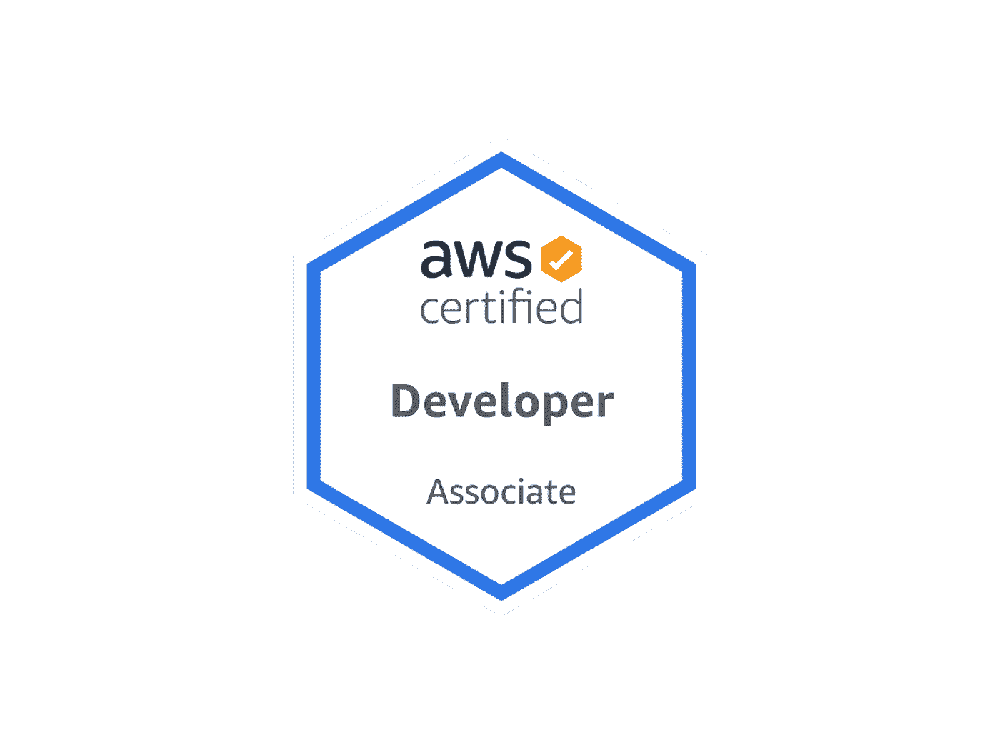
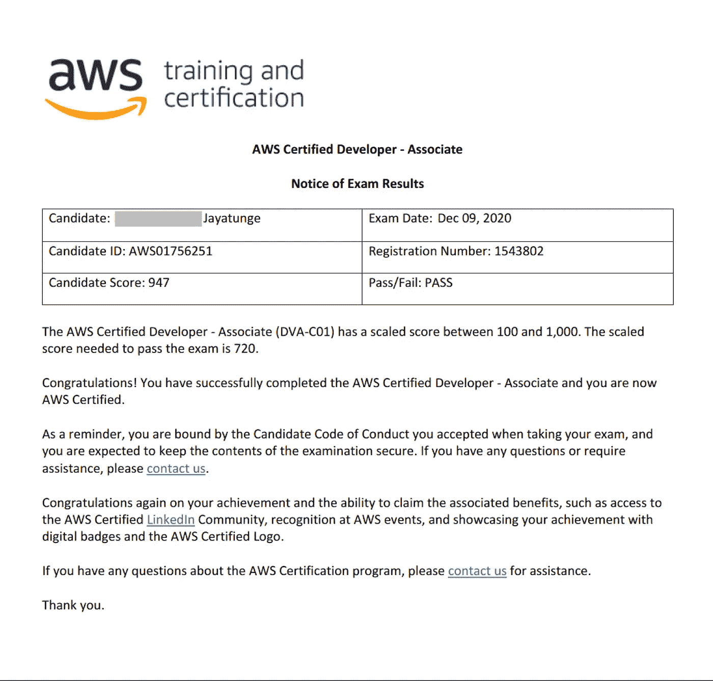
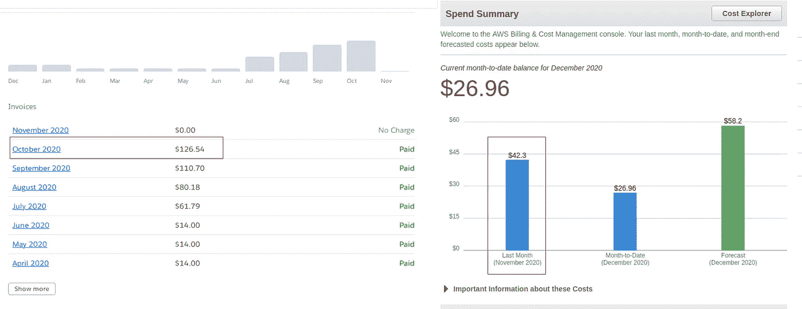
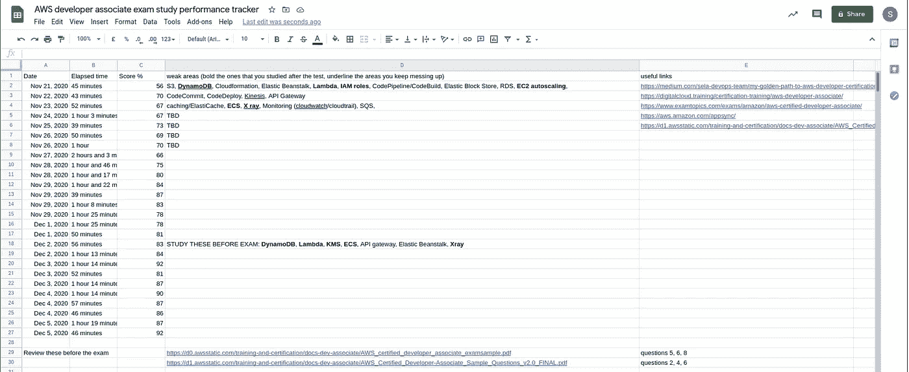

# 通过 AWS 认证的提示

> 原文：<https://betterprogramming.pub/tips-on-passing-your-aws-certification-26fd95f3ee01>

## 在没有任何经验的情况下，我是如何在不到三周的学习时间内获得 947 分的

亚马逊网络服务认证开发人员助理 DVA-C01 徽章

我 2020 年的目标之一是更好地完成 DevOps 相关的任务。我对 AWS 几乎没有任何经验，除了使用 Rekognition 和 S3 在我两年前构建的应用程序中实现了面部识别功能。

这是我考试成绩的记分卡。

我在 11 月 21 日开始准备考试，并在 12 月 9 日参加了 AWS 认证开发人员-助理(DVA-C01)考试。以下是一些帮助我轻松通过考试的策略。

# 1.使用 AWS 实际构建一些东西

就像任何计算机科学的好学生一样，我决定购买一些在线课程来帮助我准备考试。虽然这些课程提供了结构化的学习体验，并有效地概括了高层次的理论，但我发现自己很难通过简单的“hello world”示例来有效地学习。

我发现教师提供的动手练习过于简单，不能代表你在现实世界中会做什么。谁会在 EC2 上运行 Nginx/Apache 而不使用 SSL/TLS，或者在 Lambda 上运行 JavaScript 函数而不使用`node_modules`中的一些库？

这并不是说教师/课程在帮助你准备考试方面无效——它们完全足以让你通过考试——但是如果你像我一样，通过实践和深入的方法学得最好，那么你可能需要做的不仅仅是把`httpd`从 ECR 拉到你的 Fargate 集群并到此为止。

因此，在学习了特定服务的高级理论后，我跳过了教师提供的实验，决定通过将我的特定应用程序从 Heroku 迁移到 AWS，或者以不同的方式简单地在 AWS 上部署一个已经存在的应用程序，来获得一些实际操作经验。为了让所有东西都在一个屋檐下，我还从 Godaddy DNS 迁移到 AWS Route 53。

在我的实践/学习期结束时，我已经将我所有的应用程序从 Heroku(确切地说是四个)中迁移出来。因此，除了削减超过 60%的托管成本之外，我还获得了宝贵的实践经验。在我看来是双赢。以下是我与 Heroku 对比的 AWS 账单:

Heroku(左)对 AWS(右)。我从每月花费 126 美元到每月 42 美元。

对于每次应用程序迁移，我都有意识地使用 AWS 的特定服务集来满足应用程序的需求。例如，对于一个大型企业级 Rails 应用程序，我确保对 PostgreSQL 数据库使用 RDS，对应用服务器使用 EC2 上的 ECS，对 CI/CD 使用 Codepipline。对于一个小的代理网站，我认为一个带有`certbot`的`T2.micro` EC2 实例就足够了。

当我将 Heroku 上托管的 React 应用程序迁移到 AWS 时，我接受了无服务器，只使用了一个 S3 桶、一个 Cloudfront 发行版和一个由 ACM 免费赞助的 SSL/TLS 证书。

# 2.从不同的资源中学习

除了尼尔·戴维斯和夏羽·马雷克提供的课程材料，我还阅读了 AWS 的官方文档和文章。当我在考试中偶然发现一些课程中没有讨论的主题(如 AppSync、各种缓存策略的基础架构/应用副作用)时，这一点得到了回报。

# 3.仔细检查每道模拟试题，不要看正确答案，直到你自己算出答案

在完成一项测试后不久，我检查了我做错的每一道题，并且没有看答案就把它们抄了下来。在我有了一个问题和答案选择的列表后，我试图找到我可以阅读的文档来找出正确的答案。通常情况下，我能够通过谷歌搜索推断出正确的答案。这种主动的学习/研究帮助我对 AWS 以及所有服务如何相互配合有了更直观的理解。

在按照这个方法做了几次测试后，我开始看到一些模式，并且能够比以前更快地嗅出错误的答案。当我试图回答似乎有不止一个正确答案的问题时，这个排除过程给了我极大的帮助。

# 4.遵循学习方案，争取每天完成两次模拟测试

在我完成培训材料后。我看了尼尔·戴维斯和夏羽·马雷克在 Udemy 上的所有测试。我决定推迟考试，直到我在模拟考试中一直得到 80+分。事实证明，我不必推迟考试日期，因为每天完成至少一项测试和事后分析可以保持我的技能敏锐。我使用电子表格来跟踪我的进步，并在每次模拟测试后记录薄弱环节。

我完成了大约 27 次(累计)10 次模拟测试。

我连续一周没有通过模拟测试(除了一次侥幸通过)，但我跟踪了那些我一直在努力的服务，并通过专注于它们的学习成功度过了最初的低迷期。

# 5.速射技巧

1.  在你能够*持续*在模拟考试中获得 80+分之前，不要参加考试。
2.  在考试过程中，使用标记功能来标记您不确定的问题(避免重复每个问题以节省时间)。
3.  通读试题，特别注意“最低成本”、“最少的代码更改”、“最安全”、“最简单的方法”、“最少的管理开销”等短语。
4.  重温你的心算。在我的 DVA-C01*T3 考试中，我不允许使用计算器(物理或其他)。*

我现在就知道这么多。感谢您的阅读，祝您的 AWS 认证好运！

沙希科是一名来自多伦多的软件工程师，也是 T2 Restarone 公司的创始人。当他不开发软件时，他就在 Medium 和 [YouTube](https://www.youtube.com/channel/UCFl6NiPZtdsLHWUPWhrJj3g) 上创造内容，帮助人们过渡到科技行业。