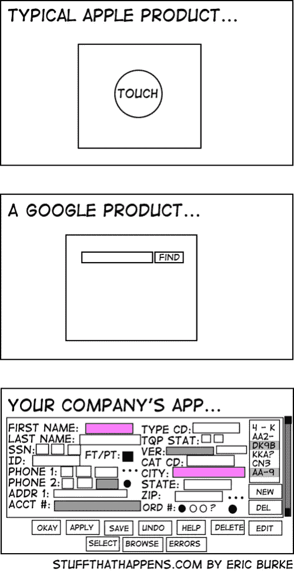

# REST API 错误响应结构提示

> 原文：<https://betterprogramming.pub/tips-on-rest-api-error-response-structure-aebe726e7f94>

## 关于错误响应中可以包含哪些信息以及这些信息为什么有用的一些建议


照片由[马赫什·拉纳韦拉](https://unsplash.com/@mahesh_ranaweera?utm_source=medium&utm_medium=referral)在 [Unsplash](https://unsplash.com?utm_source=medium&utm_medium=referral) 拍摄

互联网上有很多关于 REST 错误响应和什么是“最佳响应结构”的博客和讨论，但我只在少数帖子中看到过这些神奇的话:

“这取决于你在做什么。”

这句话应该是主要的答案，应该产生一些关于设计的想法，并为 REST 服务的用例提出问题。你可以调查脸书、谷歌、推特等公司的回复。，但我 100%确定您仍然会根据您在特定时间的实际需求和您的架构创建自己的响应结构。这里有一些关于如何有效地创建它的提示，或者至少给出一些关于高级用法的想法。

让我们假设在以下请求中:

```
curl -X POST \
  https://localhost/rest/api/v1/register \
  -d '{
  "username": "admin",
  "password": "password123",
  "confirmPassword": "password123",
  "email": "[4302aaf2-135b-47c2-b521-8b567ba1b23f@example.com](mailto:4302aaf2-135b-47c2-b521-8b567ba1b23f@example.com)",
}'
```

收到以下错误响应:

```
{
  "error": {
    "code": "alreadyExists",
    "detail": "account already exists"
  }
}
```

这是一个简单的错误响应，非常适合处理业务案例错误。为什么？因为商业错误往往是单一的。它允许 API 客户端转发错误代码，并在客户端处理任何逻辑。这种响应结构的实现也非常简单。

缺点是该结构不适合请求验证，因为它不能包含关于多个错误的信息。我们可以通过在数组中添加错误来快速解决这个问题。

经过额外的更改后，让我们假设对以下请求:

```
curl -X POST \
  [https://localhost/rest/api/v1/register](https://localhost/rest/api/v1/register) \
  -d '{
  "x-username": "user-43a46ff3-784f-440f-b0e5-8291a4a8403c",
  "x-password": "password123",
  "confirmPassword": "password123",
  "email": "[4302aaf2-135b-47c2-b521-8b567ba1b23f@example.com](mailto:4302aaf2-135b-47c2-b521-8b567ba1b23f@example.com)",
}'
```

收到以下错误响应:

```
{
  "errors": [
    {
      "code": "missingUsername",
      "detail": "username field is missing"
    },
    {
      "code": "missingPassword",
      "detail": "password field is missing"
    }
  ]
}
```

现在我们在响应中有多个错误，这适用于请求验证场景。对于小型服务，这将是一个完美的选择。然而，如果这种方法用于更大规模的应用，那么你可能会遇到麻烦。

根据提供的示例，每个验证错误现在都应该有自己的错误代码。想象一下你需要检查`required`、`min`、`max,`等等的情况。每个检查都有自己的错误代码，以了解请求中的错误。你能想象那会是怎样的地狱吗？

我们可以通过在错误结构中包含一些额外的字段来避免这种情况。

现在最后一次，让我们假设以下请求:

```
curl -X POST \
  [https://localhost/rest/api/v1/register](https://localhost/rest/api/v1/register) \
  -d '{
  "username": "a",
  "password": "password123",
  "confirmPassword": "123456789",
  "email": "1b3ee58f-0092-4569-893a-8a648f697b77",
}'
```

收到以下错误响应:

```
{
  "errors": [
    {
      "placement": "field",
      "title": "value too short",
      "detail": "field username must be at least 4 symbols",
      "location": "username",
      "field": "username",
      "code": "validation.min",
      "expression": "min",
      "argument": "4",
      "traceid": "74681b27-b1ea-454d-9847-d27059e19119",
      "stacktraces": [
        {
          "file": "model/response.go",
          "function": "model.(*ErrorMessage).LogStacktraceWithErr",
          "linenumber": 22,
          "realerror": null
        },
        {
          "file": "helpers/validator.go",
          "function": "helpers.Validator",
          "linenumber": 58,
          "realerror": null
        },
        {
          "file": "handlers/registration.go",
          "function": "handlers.RegistrationHandler",
          "linenumber": 61,
          "realerror": null
        }
      ]
    },
    {
      "placement": "field",
      "title": "must be equal",
      "detail": "field password is not equal to field confirmpassword",
      "location": "password",
      "field": "password",
      "code": "validation.equal",
      "expression": "equal",
      "argument": "confirmpassword",
      "traceid": "e017ecb2-d72f-4f79-889f-6c42126970a8",
      "stacktraces": [
        {
          "file": "model/response.go",
          "function": "model.(*ErrorMessage).LogStacktraceWithErr",
          "linenumber": 22,
          "realerror": null
        },
        {
          "file": "helpers/validator.go",
          "function": "helpers.Validator",
          "linenumber": 58,
          "realerror": null
        },
        {
          "file": "handlers/registration.go",
          "function": "handlers.RegistrationHandler",
          "linenumber": 61,
          "realerror": null
        }
      ]
    },
    {
      "placement": "field",
      "title": "incorrect email format",
      "detail": "field email has incorrect value",
      "location": "email",
      "field": "email",
      "code": "validation.email",
      "expression": null,
      "argument": null,
      "traceid": "cecda6b8-7ce8-4054-8c06-9382320afd78",
      "stacktraces": [
        {
          "file": "model/response.go",
          "function": "model.(*ErrorMessage).LogStacktraceWithErr",
          "linenumber": 22,
          "realerror": null
        },
        {
          "file": "helpers/validator.go",
          "function": "helpers.Validator",
          "linenumber": 58,
          "realerror": null
        },
        {
          "file": "handlers/registration.go",
          "function": "handlers.RegistrationHandler",
          "linenumber": 61,
          "realerror": null
        }
      ]
    }
  ]
}
```

是的，它变得很大！但是让我们来看看那里发生了什么，有哪些信息是可用的，以及它能以什么方式提供帮助。

*注意:我特意添加了* `*null*` *来直观地理解这一点，但最佳实践是省略不包含任何信息的字段。*

## 安置

如果 API 客户端应用程序倾向于向最终用户显示这些错误，明智的做法是给出错误位置的建议。几个例子:

*   *常规—* 在表格上方显示常规错误；
*   *字段* — [字段下方/字段右侧](https://uxmovement.com/forms/the-best-place-for-error-messages-on-forms/)显示错误；
*   *snackbar* ( *报警* ) —特定前端组件显示错误。

标题—简短的错误摘要。

Detail —错误的详细说明，如果出现验证错误，将动态生成该说明。该字段还可以包含在`argument`或`expression`字段中可用的附加信息。

## 位置

如果请求很长，并且包含多个子结构，其中相同的字段名出现多次，那么知道失败字段的位置是明智的。然而，依我看，只有当你有一个包含大量字段的大表单，并且你不希望做几个不同的调用或者每个类别有小的步进器时，这才是必要的。你知道，你典型的公司业务应用程序有可怕的用户体验，显示 50 个字段，通过填充这 50 个字段召唤出另外 666 个字段。



## 田

错误字段的关键字。这很方便，因为您的客户端可以在代码中使用与请求中相同的字段名，并自动将响应绑定到该特定字段。

## 密码

这里我们要么看到业务错误代码，要么看到代表验证组的验证错误代码。API 客户端可以在前端使用类似的验证代码，从而更容易地处理错误。

## 表示

该字段可以是各种验证规则的列表(`greater`、`not equals`、`equals`、`min`、`max`、`required`等)。).该字段应该有一组预定义的表达式。所有未定义的表达式都应该属于内部错误，以便以后安全地实现它们。该字段可以与错误代码字段合并，将解析逻辑留在 API 客户端(*不可取*)。

## 争吵

此字段应为表达式参数，即数字字符串或其他字段关键字。

## **Traceid**

该字段应包含 UUID 或其他类型的唯一标识值以跟踪错误。API 客户端可以根据该字段的值请求信息，如果出现内部错误，您可以进一步调查。

## **堆栈跟踪**

这是一个可选字段，可以在开发环境中用来查看调用堆栈中的*`*file*``*function*``*line*`和`*real error*` 。这允许在开发 API 客户端时快速调试。这完全是可选的——您可以简单地记录这些信息，然后在出现错误的情况下转到日志并在那里进行调查。然而，我发现这比查看日志要快得多。*此外，这是内部信息，应该隐藏起来，以防在生产模式中使用！**

*这里我们有一个错误响应，可以满足最小的需求，并有一个可以调整的选项。我并不是说这是一个完美的解决方案，可以满足您的需求，但它应该有助于您在设计错误响应时朝着正确的方向思考。更多想法可在 [RFC7807](https://tools.ietf.org/html/rfc7807) 找到。*

*顶部的樱桃可能是以下响应标题:*

*   ***响应 ID** —这应该是每个响应的唯一 UUID。它可以帮助 API 客户机识别出对于具有相同内容的相同请求收到了不同的响应。*
*   ***Correlation-ID** —这更像是一个内部 ID，用于跟踪流程中的整个流程。但是如果你的服务是一个巨大的生态系统的一部分，那么强烈建议你一直拥有这个价值，并把它的价值从过程的开始传递到结束。*
*   ***内容语言**—如果你已经实现了多语言支持，你肯定应该返回一个内容语言来指示在`title`和`detail`字段中使用的语言。*
*   ***Content-Type:application/problem+JSON**—正如 [RFC7807](https://tools.ietf.org/html/rfc7807) 中所建议的那样，在出现错误的情况下，使用下面的头是合乎逻辑的。*