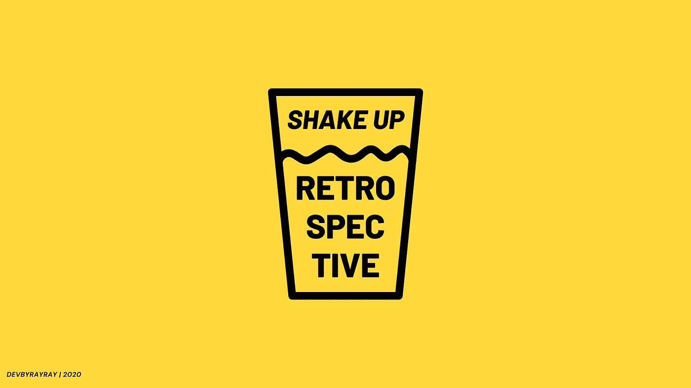

# 创建开发人员教程的技巧

> 原文：<https://betterprogramming.pub/tips-to-create-developer-tutorials-62cb3a25b8e5>

## 想写更多的教程，但你不知道从哪里开始？从这里开始

马库斯·斯皮斯克在 [Unsplash](https://unsplash.com?utm_source=medium&utm_medium=referral) 上的照片

这是我在网上写了八年编程教程之后写的。在那段时间里，我学到了很多东西——现在仍然如此——但我想与更多的人分享。我希望这会给你带来更多实用的信息，这样你就可以开始创作很酷的编程内容了。

去年我尝试了很多。作为一名开发人员，我工作了两年后开始写作。分享我的知识感觉真好！几年后，我尝试了视频和音频。但我觉得那不是我的事。即使偶尔，我还是会在一些特殊的场合尝试音频和视频。

> *这个故事最初发表于* [*ByRayRay.dev*](https://byrayray.dev/posts/2020-11-24-tips-to-create-developer-tutorials)

我觉得写作更多是我的事，我觉得发现自己的强项是什么也挺好的。

上了这么多课之后，我得出结论，可能有更多的人想为程序员创作内容。

我所说的*程序员*，是指软件工程师、程序员和最广义的开发人员。可能存在差异，但我指的是为日常工作编写代码的人，或者出于热情而编写代码的人。

我开始为自己创作内容。我想创建我的文档，以便我可以回顾过去。我从一开始就放了，所以质量不是很好。后来，我开始把它做得更好，这样它就有更好的质量供其他人消费。但我还是很享受。

所有这一切都是我写下我所学到的一切并以这种方式分享我的知识的动力，这样更多的人可以有这样的开端。

# 1.选择一个你感兴趣的话题

在你开始写你的心声之前，想一个主题是很好的。如果你对某个主题非常了解，并且对它充满热情，这将有助于你创建关于它的内容。

另一方面，制作一些你喜欢但不太了解的内容可以帮助你深入了解。我确实用同样的方式创作了很多内容。我就是挑个题目，做很多深度研究，用自己的话写下来。这只是我学会诚实的方法。

当你对一个话题充满热情，并且创造内容时，你的观众会注意到这一点。从我的经验来看，这将会产生非常积极的效果。

## 1.1 如何选择题目

选择一个时下流行的话题会有所帮助，因为这会让人们更有可能观看或阅读相关内容。但是，选择一个不太流行(或者还不流行)的话题可以带来一个你一开始不会想到的好处:从长远来看，它可以让你成为专家。因为如果没有创建者制作关于某个主题的内容，你的内容可能会被后来的人使用。

选择一个让你充满激情的话题会让你更容易创作内容。那么时间将不再是问题。

不要创造你不喜欢的话题。这会耗尽你所有的精力，所以会耗费你更多的时间。请不要这样做！此外，不要为了制作内容或因为别人这样做而制作内容。

你就是你！你选择主题是因为你喜欢它们。

## 1.2 我如何选择我的主题

大部分时间我都是在最诡异的地方思考话题:开车的时候，站在淋浴的时候，甚至是坐在马桶上(我知道，很诡异！).它们来自我在工作中经历的事情或我生活中的其他事件。

我从那些当我遇到一开始无法修复或者很难修复的 bug 或错误时出现的主题开始。当我发现解决方案时，我会在我的博客上写一篇关于它的博文。我那样做是希望它能帮助其他人。

除了解决问题的博客，我还创建了许多内容，因为我想更多地了解这个话题。然后我做了很多研究，关于它是如何工作的，你可以用它做什么，以及什么时候是使用它的好时机。这类内容对我提高编程技能帮助很大。

我认为总的来说，创作内容对我来说是增长技术技能的最好的事情。其他人会拿起一本书，研究它背后的理论，然后就知道了。对我来说，那没用。我需要把那个理论直接付诸实践，然后把它写下来。从科学上讲，这被证明是一种很好的学习方式。

# 2.写下你想要实现的目标

在你选择了一个很好的主题之后，你需要为你自己和将要阅读它的用户定义你想要达到的目标。

读者的目标可以是:

*   教授新技能
*   展示一种技术
*   提高认识
*   讲述你做过的事情

你自己的目标可以是:

*   展示你的专长
*   带来价值
*   赚钱
*   让你的名字更加出名

所以你的目标有很多可能性。

## 2.1 我如何定义我的目标

大部分时间我都在创造教学内容。我写了很多教程，人们可以跟着学习一些新的东西。但是通过一段内容向其他人教授一些东西总是以带来价值为目标的。

通过制作这些作品，你可以给人们带来很多价值。其次，你要让你为之写作的人知道你自己。

我的主要目标是永远不赚快钱。从来没有也永远不会有。如果专注于赚钱，我不会尽我所能做出最好的内容。

我不会告诉你赚不到钱，但永远不要让它成为你的主要关注点。专注于快速赚钱可能不是我要走的路。其次，我将在很长一段时间内无法创作内容。

# 3.突出你想说的

在你写东西或录制视频或播客之前，知道你想说什么是非常重要的。这就是为什么我总是从要点开始。

这有助于我有序地构建我的故事。通过使用项目符号，您可以轻松地更改顺序。

不要一开始就写下你的整个故事。如果你这样做，你的故事会变得太长或者没有任何内容。

如果你在开始前仔细考虑这一点，当你写下一切时，你会心存感激。

# 4.决定内容格式

我认为大多数人已经知道他们想要制作什么样的格式。

也许你更喜欢写作，或者可以毫无问题地制作一个视频。或者你在视频中不太适应你的脸，但在录制你的声音时却足够适应。

你必须选择你最喜欢的格式。当你不舒服的时候，人们会注意到的。

当然，当你第一次录制视频时，这并不坏。但是当你已经创作了十个视频，又觉得不舒服的时候，就挑另一个格式吧。

## 4.1 我如何选择我的格式

我尝试了音频、视频和书面形式。我很好地尝试了它们，制作了 20 多个视频和 20 个播客集。我写了更多的博文，我想大概有 400 多篇。

太多了！我自己也意识到了。但只是从 2020 年初开始，我才知道写作比音频和视频更适合我。

# 5.创建它

前面的步骤基本都是为了准备。准备需要很多时间和精力，尤其是如果你刚刚开始。

但是主要的信息是带你的观众踏上一段精心描述的旅程。想象他们对你告诉他们的事情一无所知。或者在他们和你开始这段旅程之前，让他们非常清楚你期望他们应该知道什么。

我开始为自己记录这些步骤。这在我创建开发人员教程时帮了我很大的忙。

开始的时候，为自己，也为别人。做它来帮助。不要为了名声而做这件事！如果你以成名为目标，你创造内容的旅程不会持续太久。

是的，你可以从中赚到钱，但我做了八年，没有用它赚到钱，所以不要担心这个。

~

你知道开发团队中那些没完没了的回顾会议吗？有些太长了，有太多无用的讨论，对吗？我写了一些问题来改善讨论！

***获得一份*** [***免费 PDF，内含我的 10 个最佳问题***](https://mailchi.mp/3dee30d99133/shake-up-retrospective) ***帮助你改进 Scrum 回顾流程。***

# 阅读更多

 [## 申请初级开发人员工作前的 3 件事

### 我见过很多初级开发人员的求职申请。大多数申请都是出于好意…

medium.com](https://medium.com/dev-together/3-todos-before-applying-for-a-junior-developer-job-26fc0d8ba2b9)  [## 如何以最简单的方式学习 JavaScript？

### 1.先从理论开始！

medium.com](https://medium.com/dev-together/how-to-learn-javascript-the-easy-way-2aa37007c481)  [## 在适用于 Linux 的 Windows 子系统上使用 Mac/Linux 中的 CLI 工具

### WSL2 如此强大，使得从 Mac 到 wsl 2 的转换轻而易举。

medium.com](https://medium.com/dev-together/use-cli-tools-from-mac-linux-on-windows-subsystem-for-linux-37d16f012489)  [## 为什么教程不能让你成为专业的开发者

### 精通不仅仅来自于做教程。尝试，失败，学习，重复！

medium.com](https://medium.com/better-programming/why-tutorials-wont-make-you-a-professional-developer-271108c74ddb)