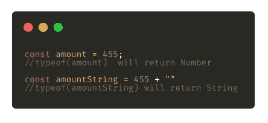
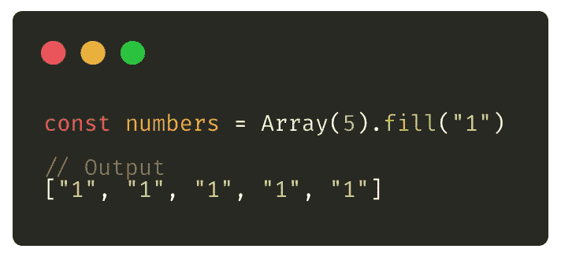
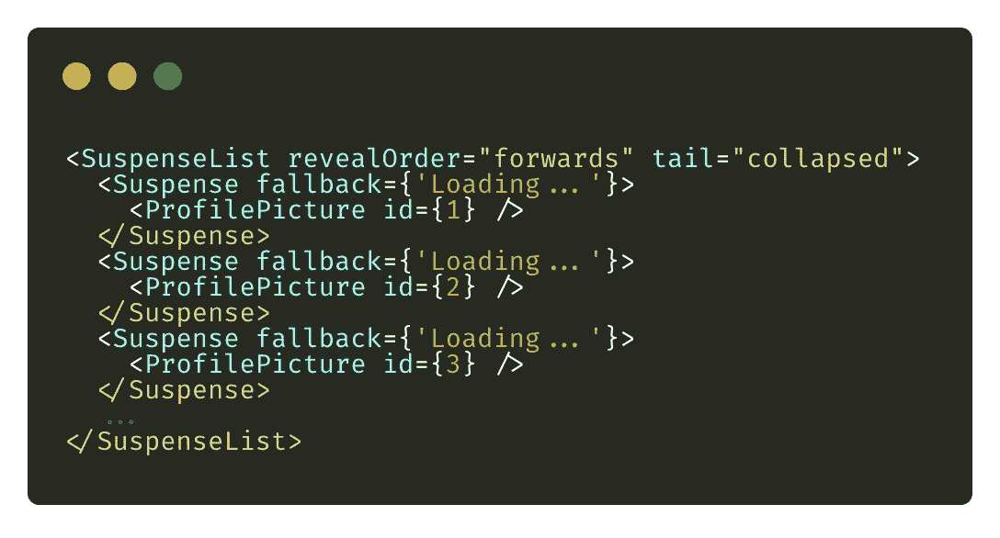
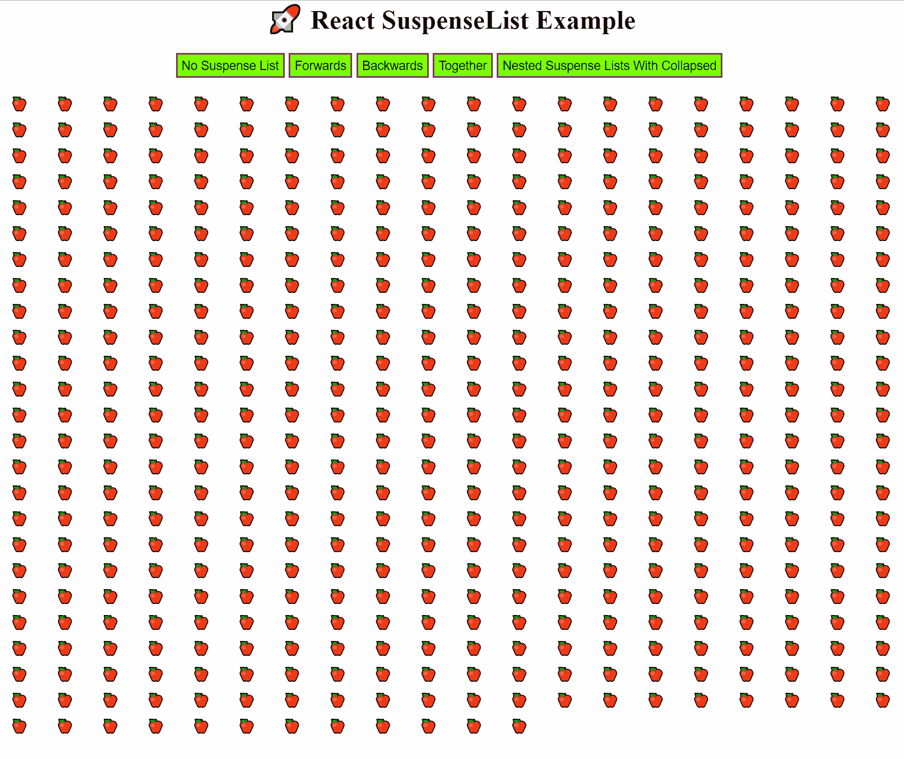
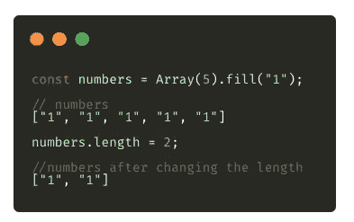

# 提升 JavaScript 和 React 技能的技巧

> 原文：<https://betterprogramming.pub/tips-to-level-up-your-javascript-and-react-skills-62bfbbb9b4d>

## 清理您的代码并遵循一些最佳实践


图片来源—[https://www.freepik.com/](https://www.freepik.com/)

每年，我们在项目中使用的库、框架和技术概念都会有大量不同的更新。作为一名优秀的开发者，我们的目标是充分利用新特性，让我们的生活变得简单。

这里是我在使用 JavaScript 和 React 时发现的一些有用的小技巧，我希望你能从中学习一些新的东西，并能在使用 React/JavaScript 时实现一些技巧。

# 1.React 路由器 JSX API

我很确定每个人都在使用 [React 路由器](https://reacttraining.com/react-router/)来维护应用程序中的不同路由。但是等等，你知道如何将道具传递给 route 组件吗？

看一下下面的代码片段，在定义路由时，可以用 props 传递整个组件，而不是传递路由中的组件。


阅读更多信息:

来源—[https://twitter.com/ryanflorence/status/1206643654753783808](https://twitter.com/ryanflorence/status/1206643654753783808)

# 2.使用不同的库延迟加载映像

你知道吗，在 Chrome 的 76 版本中，现在可以在不包含任何第三方库的情况下延迟加载图像了。只需向延迟加载资源添加`loading`属性。

看看下面的片段:

```

```

阅读更多信息:

[](https://web.dev/native-lazy-loading/) [## 面向 web 的本地延迟加载

### 这篇文章介绍了 loading 属性以及如何使用它来控制图像和 iframes 的加载。

网络开发](https://web.dev/native-lazy-loading/) 

# 3.将数字转换为字符串

想知道将数字转换为字符串的更快更简单的方法是什么？



只需添加一个空白字符串

这个黑客会自动将任何数字类型转换成字符串。

# 4.填充数组

在定义一个数组的时候，如果你想用一些数据填充它，那是很容易的。

只需定义数组的大小以及要填充的属性。当你想定义一个非空数组时，这是一个很方便的简单技巧。



用值声明数组

# 5.适合快速访问数据的数据结构

您知道吗，与使用对象键(通常是 id)作为数据结构中的键相比，将数据存储在对象的数组中要慢得多。

它不需要任何迭代，您将能够获取您选择的任何记录。

来源—[https://twitter.com/tejaskumar_/status/1209187101432004608?s=21](https://twitter.com/tejaskumar_/status/1209187101432004608?s=21)

# 6.可选链接

JavaScript 中的可选链接确实让开发人员的工作变得简单了。这个操作符允许你遍历一个嵌套的对象来获得变量的值，而不用担心是否有任何变量是未定义的。

让我们考虑一个例子来更好地理解这一点:

```
const person = {  
  name: 'John Doe',  
  device: {  
    name: 'iPhone 11 Pro'  
  }  
};
```

假设我们有一个名为`person`的对象，现在如果我想访问设备名，简单的语法如下:

```
const deviceName = person.device.name;
```

如果在`person`中`device`未定义或为空，JavaScript 解释器将抛出一个错误。使用可选的链接操作符，您可以编写:

```
const deviceName = person?.device?.name;
```

如果`deviceName`未定义，`deviceName`将为`null`。因此，如果对象中的属性不存在，通过使用可选的链接，您不必显式地处理它。可选链接是来拯救你的。

# 7.暂停列表的使用

React 16.6 增加了`<Suspense>`，一个让你“等待”一些代码加载的组件，并在等待时声明性地指定一个加载状态(像一个微调器)。

下面快速浏览一下代码的样子:



`SuspenseList`需要两个道具:

*   `**revealOrder**`(向前、向后、一起)定义了`SuspenseList`孩子应该显示的顺序。
*   `together`显示*所有的*当他们准备好时，而不是一个接一个。
*   `**tail**`(折叠、隐藏)指示如何显示`SuspenseList`中未加载的项目。
*   默认情况下，`SuspenseList`将显示列表中的所有后备。
*   `collapsed`仅显示列表中的下一个回退。
*   `hidden`不显示任何卸载的项目。

简而言之，`SuspenseList`可以用来加载项目，一次一个，按照定义的顺序，或者全部一起加载——以获得更好的用户体验。

我们可以在`<SuspenseList/>`标签中包装多个`<Suspense/>`。

示例:



惰性负载

回购链接示例:

[](https://github.com/Harshmakadia/react-suspenseList) [## harshmakadia/react-suspendelist

### 悬疑列表的演示示例⚠️悬疑列表是一个实验性的功能，还没有稳定的版本…

github.com](https://github.com/Harshmakadia/react-suspenseList) 

> **注意**:这是实验性的特性[在稳定版本](https://reactjs.org/docs/concurrent-mode-adoption.html)中还没有。

# 8.添加动态对象属性

定义对象时，可能会出现需要动态定义对象属性的情况。让我们看看下面的例子。

# 9.从 CRA 1.0 版本切换到 CRA 2.0 版本

想知道为什么吗？

来源—[https://twitter.com/reactjs/status/1046933146736963587?s=20](https://twitter.com/reactjs/status/1046933146736963587?s=20)

# 10.减少数组的长度

大多数人可能知道这个减少数组长度的简单技巧。你所要做的就是给它分配一个特定的号码。



# 11.样式组件

[Styled-components](https://www.styled-components.com/) 实际上属于 CSS-in-JS 库，该库仅使用 JavaScript 描述样式，将 CSS 抽象到组件级别。

它们可以通过 ES6 模板文字符号使用反勾号来创建，如下所示:

# 12.缓存破坏 React 应用程序

您是否遇到过这样的情况:新的构建在单页刷新时没有更新，或者需要清除缓存以反映新的更改？

[这个令人惊叹的博客](https://dev.to/flexdinesh/cache-busting-a-react-app-22lk)解释了如何在 React 中处理版本控制。

[](https://dev.to/flexdinesh/cache-busting-a-react-app-22lk) [## 缓存破坏 React 应用程序

### TL；DR - SemVer 您的应用程序，并在每次构建时生成一个不会被浏览器缓存的 meta.json 文件。无效…

开发到](https://dev.to/flexdinesh/cache-busting-a-react-app-22lk) 

以下是一些可以考虑的提示，它们与逻辑无关，但有助于简化您的工作。

# 13.使用 React 创建演示文稿

React [基于 MDX 的演示平台](https://mdx-deck.jxnblk.com)。

Reveal.js 是另一个可以用来开发吸引人的演示文稿的库。这是一个 HTML 表示框架。

# 14.Docz 文档

Docz 使您能够使用 MDX 快速创建实时重载、SEO 友好、生产就绪的文档站点，并在需要时通过利用 [GatsbyJS](https://www.gatsbyjs.org/) 和 Gatsby 主题阴影定制外观、感觉和行为。

[](https://www.docz.site/) [## Docz

### 记录你的东西从未如此简单

www.docz.site](https://www.docz.site/) 

# 15.免费图片和插图

免费库存摄影、视频和插图网站的链接集合。

[](https://github.com/neutraltone/awesome-stock-resources) [## 中性色调/awesome-股票-资源

### 令人敬畏的股票摄影，视频和插图网站的策划列表。我尽最大努力维护这个知识库…

github.com](https://github.com/neutraltone/awesome-stock-resources) 

感谢阅读。这些是我在日常工作中使用的一些技巧和窍门。

快乐学习。