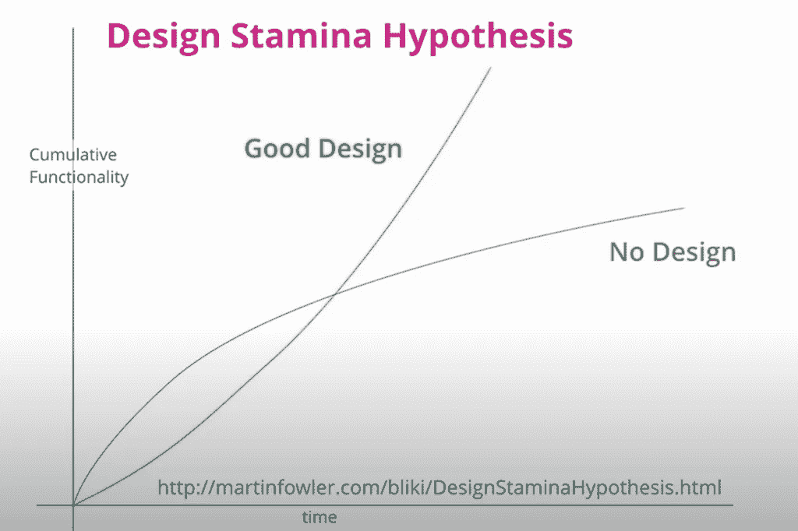

# 减少技术债务的技巧

> 原文：<https://betterprogramming.pub/tips-to-reduce-technical-debt-f9b7d1646967>

## 技术债务的积累是高级项目中的成本驱动因素。这里有一些减少它们的小贴士

来源:[https://www . kind png . com/PICC/m/3-38798 _ transparent-stacks-of-money-png-roll-of-money . png](https://www.kindpng.com/picc/m/3-38798_transparent-stacks-of-money-png-roll-of-money.png)

# 介绍

技术债务是计算机科学中常用的一个比喻，指的是软件技术实现不佳可能带来的后果。

至于糟糕的软件设计，积累的技术债务的影响与马丁·福勒在“[设计耐力假设](https://martinfowler.com/bliki/DesignStaminaHypothesis.html)”中描述的一样

简而言之，结果是实现新功能的时间增加了。增加功能变得更加困难。结果是更多的努力、更多的成本、增加的系统不稳定性、更多的崩溃、更多的错误、复杂性等等。

来源:[https://yakupbugra . com/2021/04/software-architecture-notes . html](https://yakupbugra.com/2021/04/software-architecture-notes.html)

# 最小化和减少技术债务的技巧

## 重构

减少技术债务最重要的是对你的软件进行定期重构。

粗略来说，软件开发过程包括两个步骤:
1。满足要求，让软件运行
2。优化和清理代码

在许多项目中，完成第一点就能满足时间要求。对于第二点，优化和清理代码通常是没有时间的。结果是几年后，这些项目的软件系统很难维护。

在现代 Scrum 项目中，问题是 Scrum 大师经常关注新功能的交付。

如果你的 Scrum 大师认为减少技术债务和/或重构时间是与产品所有者无关的技术问题，那么你真的有麻烦了。

当你的产品负责人认为这是技术性的东西，并且对重构结果不感兴趣时，也是一样。

一种可能性是测量重构的改进。这可以通过减少代码行、改进应用程序的响应时间、减少 bug 和升级会议来实现。

它还可以降低基础设施成本。最后，大多数优化应该可以用金钱来衡量。

对于重构，您还可以使用显示可能改进区域的工具。显示改进可能性的一个可能工具是 [SonarQube](https://www.sonarqube.org/) 。

## 使用软件分析工具

今天有许多工具来分析代码的质量。一个很好的可能性是在您的交付管道中包含这些工具，并让它为每一个变更而运行。

高级级别是您的开发人员在他们的本地工作站上使用这些工具，并且每次保存更改时都会进行检查。原因是越早发现质量问题，修复成本就越低。

工具扫描有不同的区域:

## 代码林挺

林挺对于减少错误和提高代码的整体质量非常重要。使用 lint 工具可以通过生成干净的代码来帮助您加速开发并降低成本。如果代码是干净的，错误的风险就会降低。

代码棉条也可用于 docker 文件、配置文件等。

## 质量扫描仪

SonarQube 是一种选择，您也可以将它添加到您的管道中。SonarQube 也受到 GitLab 等集成工具的支持。
[https://docs . sonar qube . org/latest/analysis/git lab-integration/](https://docs.sonarqube.org/latest/analysis/gitlab-integration/)

## 安全扫描仪

建议检查您使用的包和依赖项。通常需要用更新来替换版本，以修复新发现的安全问题。有不同的工具可用，如[修补，以前的白源](https://www.mend.io/)，[设防](https://www.microfocus.com/de-de/products/static-code-analysis-sast/overview)，或[开源安全管理 Snyk](https://snyk.io/product/open-source-security-management/) 。

还有很多其他的扫描仪。也许你知道更好的。

## 审计扫描器

一些平台提供了基于特定语言来验证代码质量的功能。比如针对 Node.js 的 npm audit 或者 Java 工具，比如 JArchitect。同样，对于 [Python，有几个静态代码分析工具](https://luminousmen.com/post/python-static-analysis-tools)可用。

# 内部/外部审计

证明你的软件系统质量的一个有用的方法是询问其他人的评论和他们的意见。交流和沟通导致学习和提高。

一个简单的方法是代码审查。同行的代码评审的问题通常是缺乏时间和对如何进行有效的代码评审的理解。对于新手来说，列出一些重点可能会有所帮助。

你可以给你的团队增加一个高级开发人员，主要职责是做评审。那可以提高质量。

如果在团队和开发人员较多的公司工作，可以找另一个团队进行评审。一些大公司有专门的审查和审计团队。

如果外部审计对你的管理层来说是值得的，那么它会让你大开眼界。通常，外部审计团队需要开发团队成员的支持。

过程是他们解释系统并提供代码。审计专业公司往往有更发达的分析软件。此外，还有对开发团队成员的采访。

结果是您的软件系统的质量状态和改进区域的报告，加上向开发团队展示的结果以及改进的提示列表。

# 使用模式

软件模式的使用通常会减少技术债务。

例如，[模型-视图-展示者(MVP)模式](https://en.wikipedia.org/wiki/Model%E2%80%93view%E2%80%93presenter)的使用。这种模式有利于模块化、可测试性以及干净和可维护的代码库。

有大量干净的代码模式。这里有一些想法:

 [## 9 个干净的代码模式，我希望我能早点知道

### 当你回顾自己职业生涯早期写的代码时，你知道那种感觉吗？我总觉得有点恐怖…

towardsdatascience.com](https://towardsdatascience.com/9-clean-code-patterns-i-wish-i-knew-earlier-57ee56c5892)  [## 用设计模式重构干净的代码

### 每个人都希望自己的代码是干净的，但是只有少数人拥有干净易读的代码。

medium.com](https://medium.com/swlh/refactoring-for-clean-code-with-design-patterns-2d3d754c3bfe) 

如果你想知道更多，你可以看看干净代码的坚实原则。

 [## 照片中的神盾局原则

### 如果你熟悉面向对象编程，那么你可能听说过坚实的原则。

medium.com](https://medium.com/backticks-tildes/the-s-o-l-i-d-principles-in-pictures-b34ce2f1e898) 

# 开发者指南

从上一章可以看出，模式和原则的数量是巨大的。对于一个开发团队来说，自己去寻找最相关的模式和原则来开发和改进一个特定的软件系统几乎是不可能的。

可以为开发人员的团队提供帮助，为具体的开发项目提供量身定制的指南。

开发者指南应该尽可能的简短，并且集中在主要方面。这可能是与特定项目相关的原则和模式，比如:

*   代码约定、命名约定
*   测试驱动开发以及如何处理异常
*   注释、类等的语言。
*   标准提交消息的规则
*   用于您的软件系统及其配置的代码质量扫描器
*   结对编程的使用
*   还有更多

如果你想知道什么是开发者指南的一部分，你可以在这里找到一些提示:

 [## 大型项目的开发者指南

### 大型软件项目开发人员指南的好处和内容。

faun.pub](https://faun.pub/developer-guidelines-for-big-projects-3e62f40a5648) 

# 软件架构原则和规则

使用架构原则可以帮助减少技术债务，因为从高层次的角度来看，它为开发团队提供了使用 it 资源的一般规则和指南。

软件架构原则的一个例子是 API 优先原则，它导致一个软件系统可以更容易地集成到其他软件系统中。结果是灵活性。技术上的影响是需要采用设计来提供 API。

另一个原则是降低复杂性。复杂性可以在软件设计中找到，提供功能和使用的基础设施。干净的代码也可以降低复杂性。通过重构来降低复杂性可以使系统在生产中更容易运行，问题也更少。

 [## 6 个重要的软件架构原则

### 将你未来的项目引向正确的方向

better 编程. pub](/6-important-software-architecture-principles-733fb4a08d35) 

这不是减少技术债务的技巧的结尾，而是本文的结尾。如果我错过了什么，请告诉我，并分享你的经历。