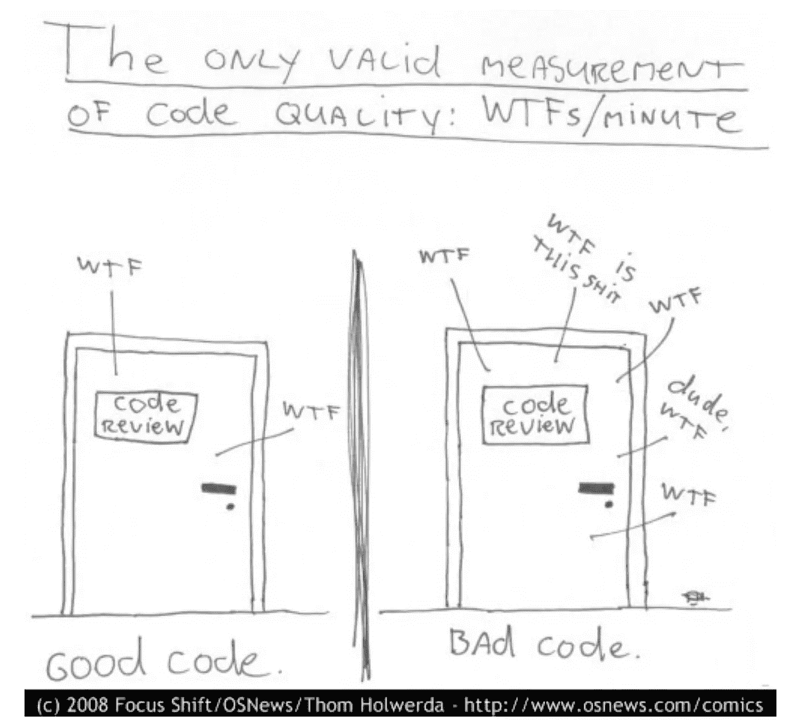

# 提高软件工程技能的两个技巧

> 原文：<https://betterprogramming.pub/tips-to-up-level-your-software-engineering-skills-293f78054e83>

## 1.预防性编程，而不是反应性编程

由[拍摄的罗布·威克斯](https://unsplash.com/@robwicks?utm_source=medium&utm_medium=referral)在 [Unsplash](https://unsplash.com?utm_source=medium&utm_medium=referral)

我进入这个行业的时间并不长，但是在比特币基地的时候，我有机会和一些优秀的工程师一起工作。

今天，我想与社区分享我在我钦佩的工程师身上发现的特质。有了这个基本的理解，帮助我的职业生涯达到了新的水平，我希望它也能帮助你。

1.  预防性编程，而不是反应性编程
2.  快就是慢，慢就是快

# 预防性编程，而不是反应性编程

区别初级工程师和高级工程师的最重要的特征之一是程序员在问题变成问题之前预测问题的能力。

换句话说，考虑边缘情况。信不信由你，考虑边缘情况不仅仅是 Leetcode 问题，在你的日常工作中也是需要的。它们只是以不同的形式呈现。

这里有一个人为的例子:

假设您的任务是构建一个`Banner`组件。你构建，构建，构建，瞧，它在你的 iPhone 14 模拟器上运行得很好。

考虑边缘情况的程序员会问自己这些问题以及更多:

*   当横幅组件在 iPad 上时会是什么样子？
*   水平方向看手机时，横幅看起来怎么样？横幅会有响应样式吗？
*   应该被记忆的道具，是否被记忆以防止不必要的重新渲染？
*   创建`Banner`组件使用了多少 Dom 元素？我们能减少它，所以它是更优化的吗？
*   如果消费者不正确地使用横幅，是否有足够的错误信息教他们如何正确使用？当错误信息描述得足够清楚，用户无需询问原作者就能发现问题时，程序就写得很好。

虽然初级程序员会让它与多少有些可读性的代码一起工作，但他们会让客户报告一个 bug，然后修复它。一个聪明的程序员会在发布它之前想出消费者可以破坏它的所有方法。

# 快就是慢，慢就是快

杰出的工程师不仅能够以预防的心态而不是被动的心态进行编程，而且他们还知道在开始时投入时间设计一个考虑周全的架构，将会在以后的道路上节省他们的时间。一个伟大的程序员不仅仅是为了满足今天的需求而开发软件。它考虑如何改变软件以适应未来的特性。

我读到过人们用这个标准来衡量他们的开发效率。

> developerProductivity =(代码行数)/(编写这些行的时间)

或者

> developerProductivity =完成一个特性所需的时间

就我个人而言，我不认为这些度量标准中的任何一个能够完整地描述一个开发人员的能力。

你能写的完成工作的代码越少，你作为程序员就越有能力。当我想到这一点时，我经常想到流行的计算机科学问题——汉诺塔。这个问题的本质很难解决，但是解决这个问题所需的代码量只有三个。简而言之，简洁不仅仅适用于写作；它也适用于软件工程。

此外，我不认为开发人员完成任务的速度代表了他们的能力。有时会，但不总是。一个速度快的程序员也许能很快得到一个工作程序，但是这个程序充满了 bug，不检查边缘情况，而且很难理解。

衡量干净代码的最好方法是统计 WTF 审查员在阅读你的代码时所说的话的数量:D(图片来源:Thom Holwerda，[https://www.osnews.com/story/19266/wtfsm/](https://www.osnews.com/story/19266/wtfsm/)

因此，代码很难长期维护。不仅其他维护人员很难在以后进行调试，而且在不破坏系统其他部分的情况下添加一个新功能也是非常困难的。因此，你正在玩一个打鼹鼠的游戏来解决这些问题。

你认为这是一个高效的开发者吗？我不会。在中国文化中，我们有一句流行的谚语，

> “快意味着慢，慢意味着快”

而我觉得这句话很符合这个语境。最初你写程序很快，但是现在你必须处理粗心架构的所有副作用。那是对整个团队的拖累。如果你选择重写软件，那就是两倍的工作量。如果你在设计一个好的架构之前投入一点时间，你可能会更有效率。

*免责声明:这些绝不是 100%真实的。它们是我从与其他出色的程序员一起工作和观察中收集的想法和观察。像所有的建议一样，要有所保留。*