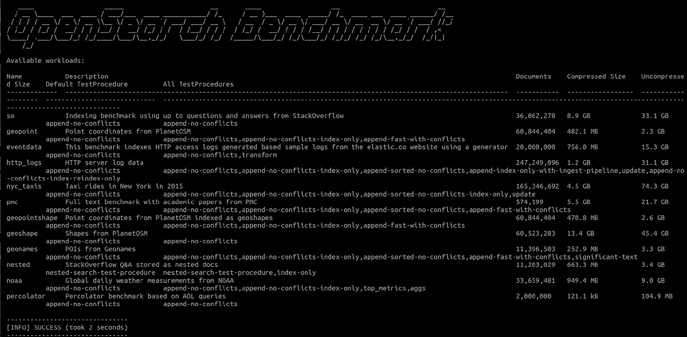
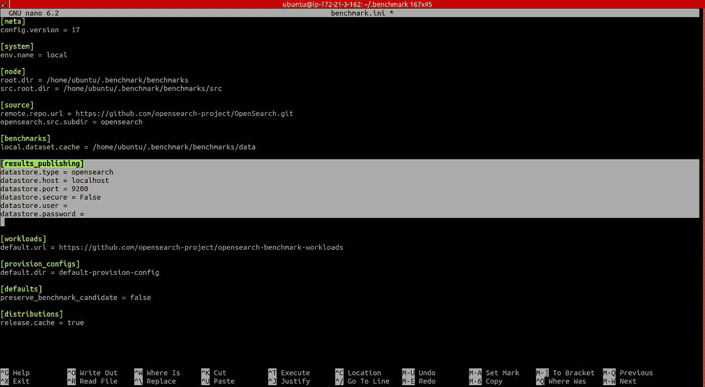
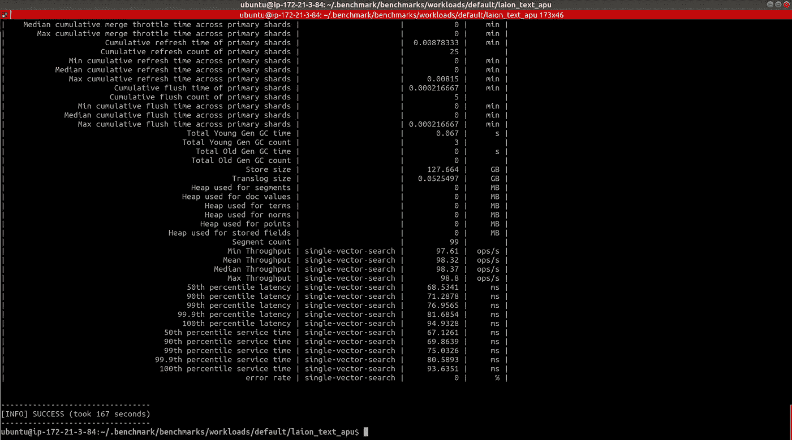
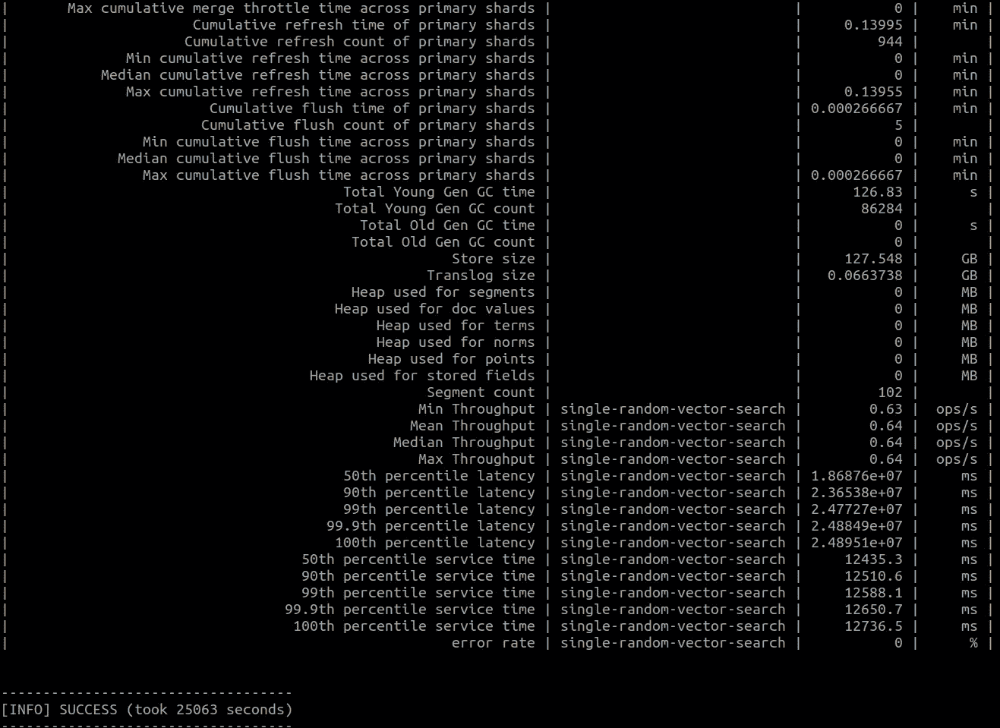
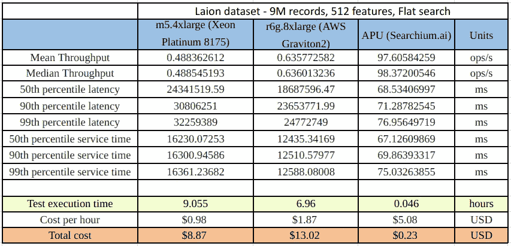

# 厌倦了对闲置的搜索资源进行故障排除？使用 OpenSearch 基准进行性能调优

> 原文：<https://betterprogramming.pub/tired-of-troubleshooting-idle-search-resources-use-opensearch-benchmark-for-performance-tuning-d4277c9f724>

## 了解如何安装 OpenSearch Benchmark，创建“工作负载”，并在计算设备之间对它们进行基准测试


照片由[本·怀特](https://unsplash.com/@benwhitephotography?utm_source=medium&utm_medium=referral)在 [Unsplash](https://unsplash.com?utm_source=medium&utm_medium=referral) 上拍摄

OpenSearch 用户经常想知道他们的搜索在各种环境、主机类型和集群配置中的表现。OpenSearch Benchmark 是一个社区驱动的开源的 Rally 分支，是实现这一目的的理想工具。

OpenSearch-benchmark 通过优化 OpenSearch 资源使用来帮助您降低基础设施成本。该工具还使您能够通过运行定期基准测试来发现性能退化并提高性能。在进行基准测试之前，您应该尝试其他几个步骤来提高性能——这是我在之前的一篇文章中讨论的主题。

在本文中，我将带领您设置 OpenSearch 基准测试并运行搜索性能基准测试，将一个广泛使用的 EC2 实例与一个新的计算加速器——由 [Searchium.ai](https://www.searchium.ai/) 开发的关联处理单元(APU)进行比较。

# 步骤 1:安装 Opensearch-benchmark

我们将使用一台 m5.4xlarge (us-west-1) EC2 机器，我在上面安装了 OpenSearch 并索引了一个名为 laion_text 的 9.1 M 大小的向量索引。该索引是大型 [laion 数据集](https://laion.ai/projects/)的一个子集，在那里我将文本字段转换为一个矢量表示(使用[剪辑](https://openai.com/blog/clip/)模型):

安装 Python 3.8+，包括 pip3，git 1.9+，以及一个[合适的 JDK 来运行 OpenSearch。](https://github.com/opensearch-project/OpenSearch-Benchmark/blob/main/DEVELOPER_GUIDE.md)确保 JAVA_HOME 指向那个 JDK。然后运行以下命令:

```
sudo python3.8 -m pip install opensearch-benchmark
```

提示:你可能需要手动安装每个依赖项。

*   `sudo apt install python3.8-dev`
*   `sudo apt install python3.8-distutils`
*   `python3.8 -m pip install multidict –upgrade`
*   `python3.8 -m pip install attrs — upgrade`
*   `python3.8 -m pip install yarl –upgrade`
*   `python3.8 -m pip install async_timeout –upgrade`
*   `python3.8 -m pip install aiosignal — upgrade`

运行以下命令验证安装是否成功:

```
opensearch-benchmark list workloads
```

您应该会看到以下详细信息:



作者截图

# 步骤 2:配置保存结果的位置

默认情况下，OpenSearch 基准测试报告“内存中”如果设置为“内存中”，则在运行基准测试时，所有指标都将保存在内存中。如果设置为“opensearch”，所有指标都将被写入一个持久的指标存储中，并且数据将可用于进一步的分析。

要将报告的结果保存在您的 OpenSearch 集群中，请打开位于`~/.benchmark`文件夹中的`opensearch-benchmark.ini`文件，然后修改突出显示区域中的结果发布部分，以写入 OpenSearch 集群:



作者截图

# 步骤 3:构建搜索“工作负载”


斯科特·布莱克在 [Unsplash](https://unsplash.com?utm_source=medium&utm_medium=referral) 上拍摄的照片

既然我们已经正确安装了 OpenSearch 基准测试，那么是时候开始基准测试了！

计划是使用 OpenSearch Benchmark 来比较两个计算设备之间的搜索。您可以使用下面的方法对任何实例进行基准测试和比较。在这个例子中，我们将测试一个常用的 KNN 平面搜索(一个使用 IVF 和 HNSW 的 ANN 例子将在我的下一篇文章中介绍),并将一个 m5.4xlarge EC2 实例与 APU 进行比较。

你可以通过从 Searchium.ai 的 SaaS 平台下载的插件来访问 APU。您可以在自己的环境和数据上测试以下基准测试过程。可以免费试用，注册也很简单。

OpenSearch 基准测试中的每个测试/跟踪被称为一个“工作负载”我们将在 m5.4xlarge 上创建一个搜索工作负载，作为我们的基准。我们还将在同一个 EC2 上的 APU 上创建一个搜索工作负载，它将充当我们的竞争者。稍后，我们将比较两种工作负载的性能。

让我们首先使用`laion_text`索引为 m5.4xlarge (CPU)和 APU 创建一个工作负载(确保从`.benchmark`目录中运行这些命令):

```
opensearch-benchmark create-workload --workload=laion_text_cpu --target-hosts=localhost:9200 --indices="laion_text”
```

```
opensearch-benchmark create-workload --workload=laion_text_apu --target-hosts=localhost:9200 --indices="laion_text”
```

***注意*** *:如果工作量保存在* `*home*` *文件夹下的* `*workloads*` *文件夹中，则需要将其复制到* `*.benchmark/benchmarks/workloads/default*` *目录下。*

再次运行`opensearch-benchmark list`工作负载，注意`laion_text_cpu`和`laion_text_apu`都被列出。

接下来，我们将向测试计划中添加操作。在本节中，您可以添加任意数量的基准测试。将每个测试添加到`workload.json`文件的时间表中，该文件可以在您希望进行基准测试的索引名文件夹中找到。

在我们的案例中，可以在以下领域找到它:

*   `./benchmark/benchmarks/workloads/default/laion_text_apu`
*   `./benchmark/benchmarks/workloads/default/laion_text_cpu`

我们想测试一下我们的 OpenSearch 搜索。创建一个名为“single vector search”(或任何其他名称)的操作，并包含一个查询向量。我剪掉了向量本身，因为 512 维向量会有点长…添加所需的查询向量，并确保将相同的向量复制到 m5.4xlarge (CPU)和 APU `workload.json`文件中！

接下来，添加您想要的任何参数。在这个例子中，我将坚持使用默认的八个客户端和 1000 次迭代。

m 5.4x 大型(CPU) `workload.json`:

```
"schedule":[
      {
         "operation":{
            "name":"single-vector-search",
            "operation-type":"search",
            "body":{
               "size":"10",
               "query":{
                  "script_score":{
                     "query":{
                        "match_all":{}
                     },
                     "script":{
                        "source":"knn_score",
                        "lang":"knn",
                        "params":{
                           "field":"vector",
                           "query_value":[INSERT VECTOR HERE],
                           "space_type":"cosinesimil"
                        }
                     }
                  }
               }
            }
         },
         "clients":8,
         "warmup-iterations":1000,
         "iterations":1000,
         "target-throughput":100
      }
   ]
```

辅助动力装置`workload.json`:

```
"schedule":[
      {
         "operation":{
            "name":"single-vector-search",
            "operation-type":"search",
            "body":{
               "size":"10",
               "query":{
                  "gsi_knn":{
                     "field":"vector",
                     "vector":[INSERT VECTOR HERE],
                     "topk":"10"
                  }
               }
            }
         },
         "clients":8,
         "warmup-iterations":1000,
         "iterations":1000,
         "target-throughput":100
      }
   ]
```

# 步骤 4:运行我们的工作负载


照片由 [Tim Gouw](https://unsplash.com/es/@punttim?utm_source=medium&utm_medium=referral) 在 [Unsplash](https://unsplash.com?utm_source=medium&utm_medium=referral) 上拍摄

是时候运行我们的工作负载了！我们有兴趣在正在运行的 OpenSearch 集群上运行我们的搜索工作负载。我给`execute_test`命令添加了几个参数:

`Distribution-version` —确保添加正确的 OpenSearch 版本。

`Workload` —我们的工作量名称。

其他参数也是可用的。我增加了`pipeline`、`client-options`、`on-error`，简化了整个流程。

继续运行以下命令，这将运行我们的工作负载:

```
opensearch-benchmark execute_test --distribution-version=2.2.0 --workload=laion_text_apu --pipeline=benchmark-only --client-options=verify_certs:false,use_ssl:false --on-error=abort --client-options="timeout:320"
```

```
opensearch-benchmark execute_test --distribution-version=2.2.0 --workload=laion_text_cpu --pipeline=benchmark-only --client-options=verify_certs:false,use_ssl:false --on-error=abort --client-options="timeout:320"
```

现在我们等待…

> **奖金基准:**我很想看看在基于 Arm 的亚马逊 Graviton2 处理器上的结果，所以我也在 r6g.8xlarge EC2 上运行了完全相同的过程。

我们的结果应该如下所示:



*laion_text_apu (* APU)结果


m5.4xlarge *(C* PU)结果



r6g.8xlarge *(C* PU)结果

# 第五步:比较我们的结果

我们终于准备好查看我们的测试结果了。请敲鼓… 🥁

首先，我们注意到每个工作负载的运行时间是不同的。m5.4xlarge 工作负载用时 9 小时，r6g.8xlarge 工作负载用时 6.96 小时，APU 工作负载用时 2.78 分钟。这是因为 APU 还支持查询聚合，允许更大的吞吐量。

现在，我们希望对我们的工作负载进行更全面的比较。OpenSearch Benchmark 使我们能够生成一个 CSV 文件，在该文件中我们可以轻松地比较工作负载。

首先，我们需要找到每个案例的工作量 id。这可以通过查看 open search benchmark-test-executions 索引(在步骤 2 中创建)或`benchmarks`文件夹来完成:

使用工作负载 id，运行以下命令来比较两个工作负载，并在 CSV 文件中显示输出:

```
opensearch-benchmark compare --results-format=csv --show-in-results=search --results-file=data.csv --baseline=ecb4af7a-d53c-4ac3-9985-b5de45daea0d --contender=b714b13a-af8e-4103-a4c6-558242b8fe6a
```

这里有一个简短的总结，比较了我们的三个工作负载结果:



作者图片

表中结果的简要说明:

1.  吞吐量:OpenSearch 在一定时间内可以执行的操作数量，通常是每秒。

2.延迟:提交请求和收到完整响应之间的时间。它还包括等待时间，即请求等待 OpenSearch 处理的时间。

3.服务时间:发送请求和接收相应响应之间的时间。这一指标很容易与延迟混淆，但不包括等待时间。这就是大多数负载测试工具错误地称为“延迟”的东西

4.测试执行时间:从启动工作负载到完成的总运行时间。

# 结论

在查看我们的结果时，我们可以看到 APU 工作负载的服务时间比 m5.4xlarge 工作负载快 197 倍，比 r6g.8xlarge 快 151 倍。从成本角度来看，在 APU 上运行相同的工作负载的成本为 0.23 美元，而 m5.4xlarge 的成本为 8.87 美元(便宜 38 倍)，r6g.8xlarge 的成本为 13.02 美元(便宜 56 倍)，我们在近 9 个小时(m5.4xlarge)内得到我们的搜索结果

现在，想象一下当扩展到更大的数据集时，这些好处有多大，在我们这个数据驱动、快节奏的世界中，情况很可能就是这样。

我希望这有助于您了解 OpenSearch 基准测试工具的强大功能，以及如何使用它来测试您的搜索性能。

有关 Searchium.ai 的插件和 APU 的更多信息，请访问 [www.searchium.ai.](http://www.searchium.ai/) 他们甚至提供免费试用！

非常感谢 Dmitry Sosnovsky 和 [Yaniv Vaknin](https://medium.com/@yaniv.vaknin) 的帮助！