# 使用机器学习的泰坦尼克号生存预测

> 原文：<https://betterprogramming.pub/titanic-survival-prediction-using-machine-learning-4c5ff1e3fa16>

## 你会在泰坦尼克号上幸存吗？

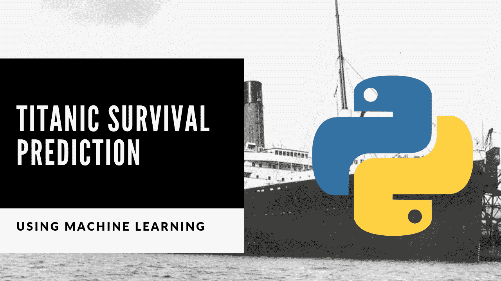

泰坦尼克号被称为不沉之船，是当时最大、最豪华的客轮。可悲的是，这艘英国远洋客轮于 1912 年 4 月 15 日沉没，1500 多人遇难，只有 705 人幸存。

在本文中，我们将分析泰坦尼克号的数据集，并做出两个预测。一个预测是看船上的哪些乘客会幸存，另一个预测是看我们是否会幸存。

# 数据集列描述

*   **pclass:** 客运班(1 =第一；2 =第二；3 =第三)
*   **幸存:**幸存(0 =否；1 =是)
*   **名称:**名称
*   **性:**性
*   **年龄:**年龄
*   **sibsp:** 船上的兄弟姐妹/配偶人数
*   **parch:** 船上父母/子女人数
*   **票价:**乘客票价(英镑)
*   **装船:**装船港(C =瑟堡；Q =皇后镇；S =南安普敦
*   **成年 _ 男性:**18 岁以上的男性(0 =否，1 =是)
*   **甲板:**船的甲板
*   **谁:**男人(18+)，女人(18+)，孩子(< 18)
*   活着:是，不是
*   装载港(瑟堡，皇后镇，南安普敦)
*   **等级:**客运等级(1 级；第二；第三名)
*   **孤独:** 1=孤独，0=不孤独(你至少有一个兄弟姐妹、配偶、父母或孩子在飞机上)

## **年龄**

如果小于 1，年龄是分数。如果估计年龄，是 xx.5 的形式吗

## **sibsp**

数据集以这种方式定义家庭关系:

*   兄弟姐妹=兄弟、姐妹、继兄弟、继姐妹
*   配偶=丈夫、妻子(情妇和未婚夫被忽略)

## **烤干**

数据集以这种方式定义家庭关系:

*   父母=母亲，父亲
*   孩子=女儿，儿子，继女，继子有些孩子只和保姆一起旅行，因此对他们来说 parch=0。

如果你不想读这篇文章，想要一个视频演示，你可以看看下面的 [YouTube 视频](https://youtu.be/rODWw2_1mCI)。它会更详细地介绍本文中的所有内容，并帮助您轻松地开始编写自己的机器学习模型，即使您的计算机上没有安装编程语言 [*Python*](https://www.python.org/) 。

或者两者都可以作为学习机器学习的辅助材料！

# 开始编程

在编写一行代码之前，我喜欢做的第一件事是在注释中描述代码的作用。这样，我可以回顾我的代码，并确切地知道它做了什么。

```
# Description: This program predicts if a passenger will survive on the titanic
```

现在导入包/库，使编写程序更容易。

```
#Import Libraries
import numpy as np
import pandas as pd
import seaborn as sns
import matplotlib.pyplot as plt
```

从 [seaborn](https://seaborn.pydata.org/) 包加载数据并打印几行。

```
#Load the data
titanic = sns.load_dataset('titanic')#Print the first 10 rows of data
titanic.head(10)
```

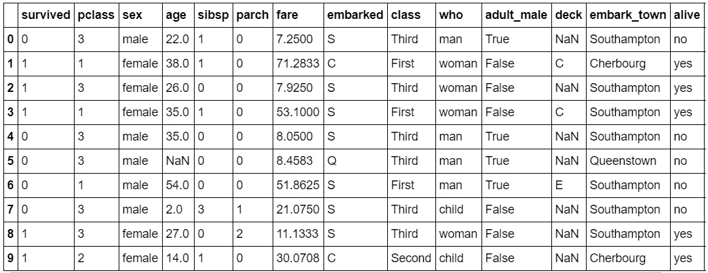

图 1 **:** 加载的泰坦尼克号数据集的 10 行。

现在，我将通过获取数据计数、存活率和创建图表来可视化数据来分析数据。

获取一个数据集中的行数和列数。请注意，每一行是船上的一名乘客，每一列是每位乘客的数据点。

数据集中有 891 行/乘客和 15 列/数据点。

```
#Count the number of rows and columns in the data set 
titanic.shape
```


图 2 **:** 数据集中 891 行/乘客，15 列/数据点。

获取数据集的一些统计数据，如计数、平均值、标准差等。

得到这些统计数据后，我看到该数据集中一名乘客为一张机票支付的最高价格/票价是 512.3292 英镑，最低价格/票价是 0 英镑。

我们还可以看到，年龄列缺少一些数据，因为它小于 891(该数据集中的乘客人数)。

平均年龄为 29.699 岁，该数据集中年龄最大的乘客为 80 岁，而年龄最小的乘客仅为 0.42 岁(约 5 个月)。

```
titanic.describe()
```

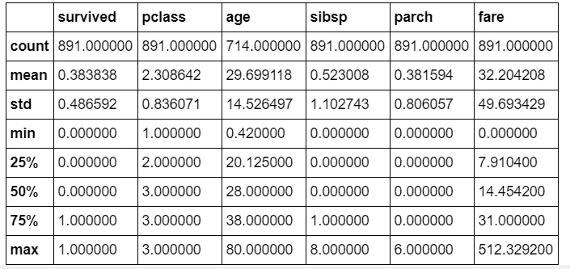

图 3 **:** 数值数据统计。

在这个数据集中，得到泰坦尼克号上幸存者人数的计数。注意，在这个数据集中，没有幸存的乘客(549)比幸存的(343)多。

```
#Get a count of the number of survivors  titanic['survived'].value_counts()
```

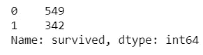

图 4: 幸存者人数(1)和非幸存者人数(0)。

想象一下泰坦尼克号上幸存者的数量。

```
#Visualize the count of number of survivors
sns.countplot(titanic['survived'],label="Count")
```

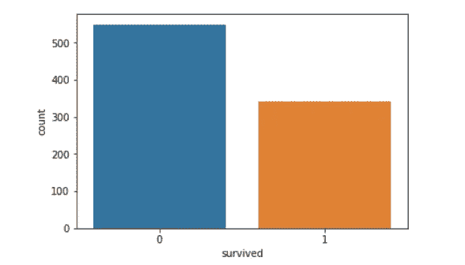

图 5: 幸存者(1)和非幸存者(0)人数图表。

将幸存者人数可视化为`who` *、*、`sex`、、`pclass`、*、*、`sibsp`、、`parch`、*、*、*、*、*。*

*   从下面的图表中，我们可以看到一名男子(18 岁或以上的男性)不太可能从图表中存活下来`who`。
*   女性最有可能从图表中幸存下来。
*   根据图表`pclass`，三等舱最有可能无法生存。
*   根据图表`sibsp`，如果你在船上没有兄弟姐妹或配偶，你不太可能幸存。
*   如果船上没有父母或孩子，根据图表`parch`显示，你不太可能幸存。
*   根据`embarked`图，如果你从南安普敦出发，你不太可能幸存。

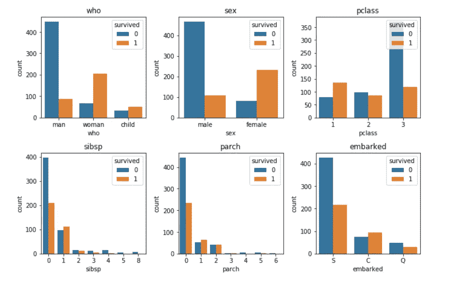

图 6

接下来，我想看看按性别划分的存活率。

从下表可以看出，女性存活的比例约为 74.2%，男性存活的比例约为 18.89%。

```
*#Look at survival rate by sex*
titanic.groupby('sex')[['survived']].mean()
```

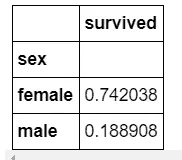

图 7 **:** 按性别分列的存活率。

看按性别和阶级的存活率。

从下面的数据透视表中，我们看到头等舱的女性存活率约为 96.8%，这意味着她们中的大多数都活了下来。

第三等级的男性存活率最低，约为 13.54%，这意味着他们中的大多数没有存活下来。

```
*#Look at survival rate by sex and class*
titanic.pivot_table('survived', index='sex', columns='class')
```

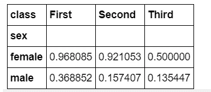

图 8 **:** 按性别和班级分列的存活率。

让我们形象化的按性别和阶级来看存活率。

```
*#Look at survival rate by sex and class visually*
titanic.pivot_table('survived', index='sex', columns='class').plot()
```

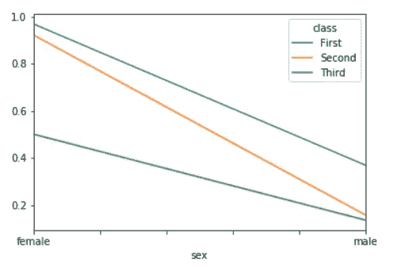

图 9 **:** 按性别和班级分列的存活率可视化。

使用柱状图直观显示各个类别的存活率。

头等舱 60%多一点的乘客幸存了下来。三等舱不到 30%的乘客幸存下来。这意味着与头等舱的乘客相比，三等舱只有不到一半的乘客幸存。

```
*#Plot the survival rate of each class.*
sns.barplot(x='class', y='survived', data=titanic)
```

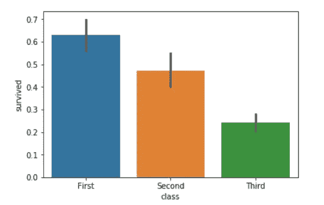

图 10 **:** 各等级柱状图存活率。

看一看按性别、年龄和阶级划分的存活率。

请注意，在这个数据集中，最老的人是 80 岁，所以这将是我们的年龄限制。

从下表可以看出，一等舱中 18 岁及以上的女性存活率最高，为 97.2973%，而二等舱中 18 岁及以上的男性存活率最低，为 7.1429%。

```
*#Look at survival rate by sex, age and class*
age = pd.cut(titanic['age'], [0, 18, 80])
titanic.pivot_table('survived', ['sex', age], 'class')
```

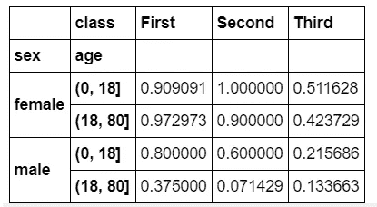

图 11 **:** 按性别、年龄、阶层分列的存活率表。

画出每门课的价格。

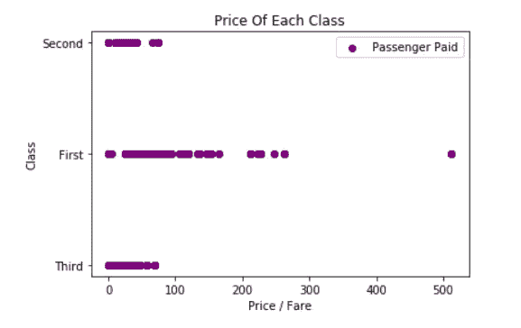

图 12: 乘客支付的各舱位票价。

检查哪些列包含空值( *NaN，NaN，na* )。看起来列`age`、`embarked`、`deck`和`embarked_town`缺少一些值。

所有其他列都没有丢失任何值。

```
*#Count the empty (NaN, NAN, na) values in each column* titanic.isna().sum()
```

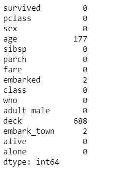

图 13 **:** 显示空值列。

为了显示一些冗余的列，我将查看每一列的值计数和名称。

```
*#Look at all of the values in each column & get a count* 
**for** val **in** titanic:
   print(titanic[val].value_counts())
   print()
```

接下来，我将删除多余的非数字列，并删除缺少值的行。

我还决定删除名为`deck`的列，因为它缺少 688 行数据，这意味着该列缺少 688/891 = 77.22%的数据。

```
*# Drop the columns*
titanic = titanic.drop(['deck', 'embark_town', 'alive', 'class', 'alone', 'adult_male', 'who'], axis=1)

*#Remove the rows with missing values*
titanic = titanic.dropna(subset =['embarked', 'age'])
```

现在，让我们看看 Titanic 数据集中新的行数和列数。

```
*#Count the NEW number of rows and columns in the data set*
titanic.shape
```


图 14:新的计数:712 行和 8 列。

查看数据类型，了解哪些列需要转换/编码为数字。看起来只有列`sex`和`embarked`需要转换。

```
titanic.dtypes
```

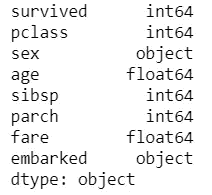

图 15: 列的数据类型。

打印非数字数据的唯一值。

```
#Print the unique values in the columns
print(titanic['sex'].unique())
print(titanic['embarked'].unique())
```

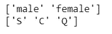

独特的价值观

将非数字数据更改为数字数据，并打印新值。

```
*#Encoding categorical data values (Transforming object data types to integers)*
**from** **sklearn.preprocessing** **import** LabelEncoder
labelencoder = LabelEncoder()

*#Encode sex column*
titanic.iloc[:,2]= labelencoder.fit_transform(titanic.iloc[:,2].values)
*#print(labelencoder.fit_transform(titanic.iloc[:,2].values))*

*#Encode embarked*
titanic.iloc[:,7]= labelencoder.fit_transform(titanic.iloc[:,7].values)
*#print(labelencoder.fit_transform(titanic.iloc[:,7].values))*

*#Print the NEW unique values in the columns*
print(titanic['sex'].unique())
print(titanic['embarked'].unique())
```

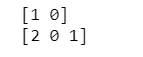

新转换的数据

将数据分成独立的“X”和相关的“Y”数据集。

```
*#Split the data into independent 'X' and dependent 'Y' variables*
X = titanic.iloc[:, 1:8].values 
Y = titanic.iloc[:, 0].values 
```

再次分割数据，这次分成 80%的训练(`X_train`和`Y_train`)和 20%的测试(`X_test`和`Y_test`)数据集。

```
*# Split the dataset into 80% Training set and 20% Testing set*
from sklearn.model_selection import train_test_split
X_train, X_test, Y_train, Y_test = train_test_split(X, Y, test_size = 0.2, random_state = 0)
```

或者，我们可以缩放数据，表示数据将在特定范围内，例如 0–100 或 0–1。

```
*#Feature Scaling*
from sklearn.preprocessing import StandardScaler
sc = StandardScaler()
X_train = sc.fit_transform(X_train)
X_test = sc.transform(X_test)
```

创建一个函数，其中包含许多不同的机器学习模型，我们可以使用这些模型来进行预测。

获取并训练所有模型，并将它们存储在一个名为`model`的变量中。

根据图 16，对训练数据最准确的模型是决策树分类器，其准确率为 99.29%。

```
*#Get and train all of the models*
model = models(X_train,Y_train)
```

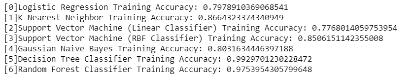

图 16: 各模型的训练精度。

显示测试数据上所有模型的混淆矩阵和准确性。

根据图 18，对测试数据最精确的模型是位置 0 处的模型，其是具有 81.11%精确度的逻辑回归模型。

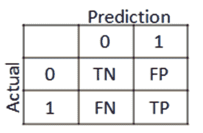

图 17 **:** 一个混淆矩阵。

*   **假阳性(FP)** =错误地表明特定条件或属性存在的测试结果。
*   **真阳性(TP)** =灵敏度(也称为*真阳性*率，或某些领域的检测概率)，衡量被正确识别为真阳性的比例。
*   **真阴性(TN)** =特异性(也称为*真阴性率*)，衡量被正确识别的实际阴性的比例。
*   **假阴性(FN)** =表明某个条件不成立的测试结果，而实际上它成立。例如，测试结果表明一个人没有活下来，而实际上这个人活了下来。

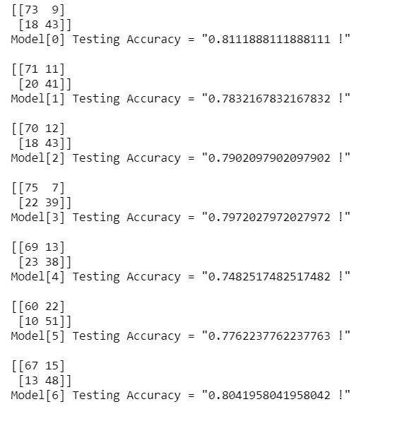

图 18 **:** 打印混淆矩阵并测试各模型的精度。

我将用来预测我是否幸存的模型将是位置 6 的模型，即*随机森林分类器。*

我选择该模型是因为它在训练和测试数据上表现第二好，在测试数据上的准确率为 80.41%，在训练数据上的准确率为 97.53%。

现在我们可以得到重要的特征。

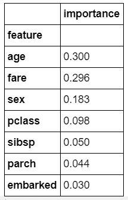

图 19 **:** 重要特性。

想象重要的特征。

```
*#Visualize the importance*
importances.plot.bar()
```

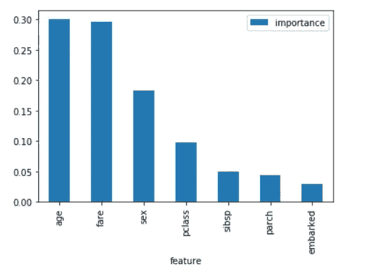

图 20 **:** 重要特性条形图。

打印每个乘客的随机森林分类器模型预测，并在其下方打印实际值。记住‘1’表示乘客生还，而‘0’表示乘客没有生还。

通过打印两者，我们可以直观地看到模型在测试数据上的表现，但是记住，模型在测试数据上的准确率是 80.41%。

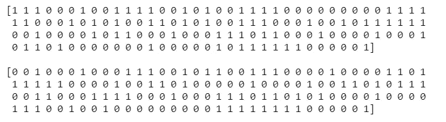

图 21:顶部 **:** 模型预测，底部 **:** 实际值。

现在，我们已经分析了数据，创建了模型，并选择了一个模型来预测谁会在泰坦尼克号上幸存下来，让我们测试一下，看看我是否会幸存下来。

我将创建一个名为`my_survival`的变量。

*   在这种情况下，我会有一个`pclass = 3`，这意味着我可能会在第三类，因为价格更便宜。
*   我是男性，所以`sex = 1`。
*   我比 18 大，所以我就放`age = 21`。
*   最有可能的是，我不会和兄弟姐妹或配偶在船上，所以`sibsp = 0`。
*   也不与任何子女或父母来往，所以`parch = 0` **。**
*   我会尽量支付最低票价，所以。
*   我会从皇后镇出发，所以。

将这些值放在一个数组中给了我`[3,1,21,0, 0, 0, 1]`。但是，要把这个放到模型的预测方法中，它必须是一个列表或 2D 数组的列表，例如`[[3,1,21,0, 0, 0, 1]]`。

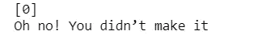

预测我无法在泰坦尼克号上幸存的模型

看起来如果我在船上，我就不会在泰坦尼克号上幸存。

# 结论和资源

就是这样，你已经完成了创建你的程序来预测一个乘客是否能在泰坦尼克号上幸存下来！

感谢阅读这篇文章，我希望它对你们所有人都是有趣的！如果你喜欢这篇文章，并发现它很有帮助，请留下一些掌声，以示感谢。如果你还不是 Medium 的[会员，那么考虑成为会员吧，如果不是为了我的文章，那么也是为了这个网站上所有其他了不起的文章&作者。在这里使用](https://randerson112358.medium.com/membership)[](https://randerson112358.medium.com/membership)**链接可以轻松**成为灵媒会员。继续学习，如果你喜欢金融、计算机科学或编程，请访问并订阅我的 [YouTube](https://www.youtube.com/channel/UCaV_0qp2NZd319K4_K8Z5SQ) 频道([randers 112358](https://www.youtube.com/channel/UCaV_0qp2NZd319K4_K8Z5SQ)&[计算机科学](https://www.youtube.com/channel/UCbmb5IoBtHZTpYZCDBOC1CA))。****

**同样，如果你愿意，你可以观看并听我解释我的 YouTube 视频中的所有代码。**

**如果你有兴趣阅读更多关于机器学习的内容，以立即开始处理问题和示例，我建议你阅读 [*使用 Scikit-Learn 和 TensorFlow 进行机器学习实践:构建智能系统的概念、工具和技术。*](https://www.amazon.com/Hands-Machine-Learning-Scikit-Learn-TensorFlow/dp/1491962291/ref=sr_1_1?crid=10QDWDNMUMCYF&keywords=hands-on+machine+learning+with+scikit-learn+and+tensorflow&qid=1563929293&s=books&sprefix=hands-on+machine%2Cstripbooks-intl-ship%2C143&sr=1-1)**

**这是一本帮助初学者学习编写机器学习程序和理解机器学习概念的好书。**

**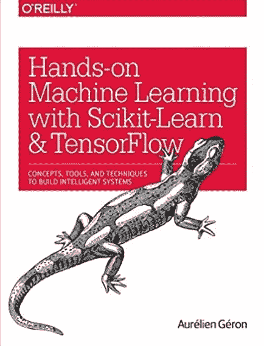**

**[使用 Scikit-Learn 和 TensorFlow 进行机器实践学习:构建智能系统的概念、工具和技术](https://www.amazon.com/Hands-Machine-Learning-Scikit-Learn-TensorFlow/dp/1491962291/ref=sr_1_1?crid=10QDWDNMUMCYF&keywords=hands-on+machine+learning+with+scikit-learn+and+tensorflow&qid=1563929293&s=books&sprefix=hands-on+machine%2Cstripbooks-intl-ship%2C143&sr=1-1)**

**感谢您阅读本文，希望对您有所帮助！**

## **其他资源**

1.  **[走向数据科学:预测泰坦尼克号乘客的生存](https://towardsdatascience.com/predicting-the-survival-of-titanic-passengers-30870ccc7e8)。**
2.  **[泰坦尼克号数据集](http://campus.lakeforest.edu/frank/FILES/MLFfiles/Bio150/Titanic/TitanicMETA.pdf)。**
3.  **[Python 数据科学手册](https://jakevdp.github.io/PythonDataScienceHandbook/03.09-pivot-tables.html)。**