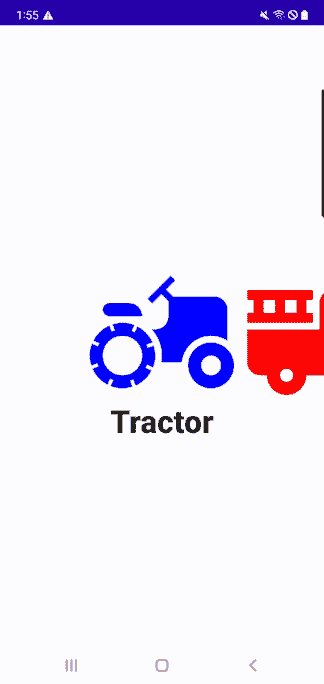
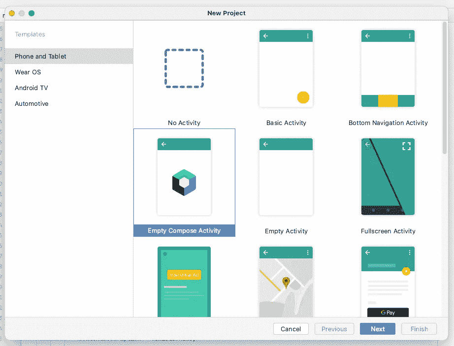
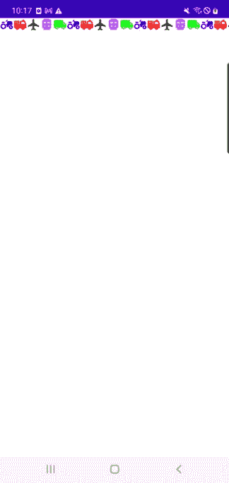
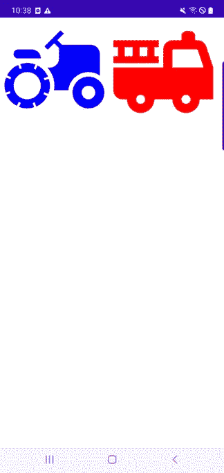
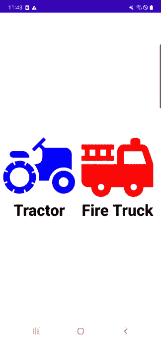
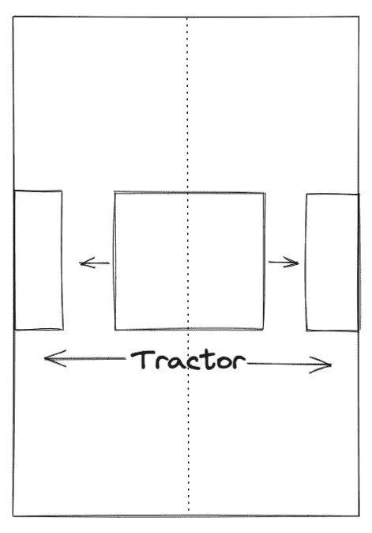
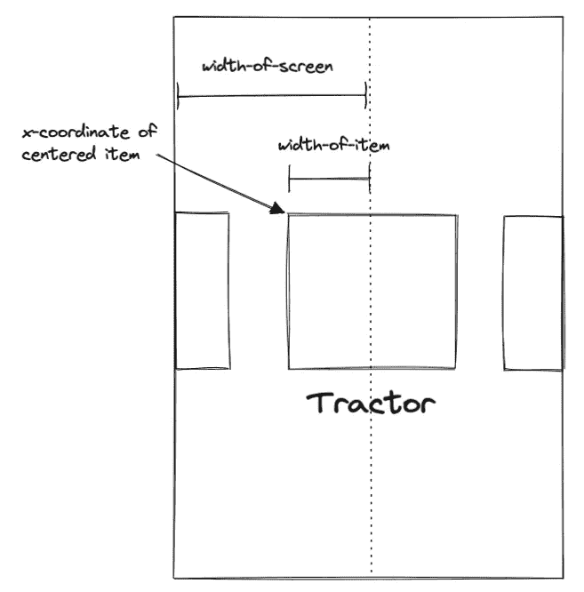
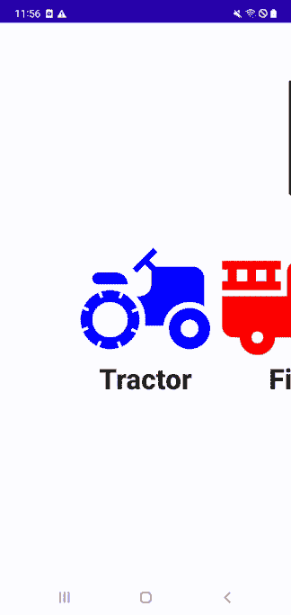

# 带有 Jetpack 合成的视差滚动

> 原文：<https://betterprogramming.pub/tldr-parallax-scrolling-with-jetpack-compose-ea2fe092a718>

## 以不同的方式移动物体和移动其他物体的艺术。


由[杰西卡·鲁斯切洛](https://unsplash.com/es/@jruscello?utm_source=medium&utm_medium=referral)在 [Unsplash](https://unsplash.com?utm_source=medium&utm_medium=referral) 上拍摄的照片

我爱你。对不起，那是我试图用英语口音发音说“你好”。没有吗？再试一次，特别强调 L？还是没有？好吧，我讨厌口音。让我们继续 Android 开发。

首先，我不是作曲专家来告诉你怎么做。我是一名坚定的 Android 开发人员，正在过渡到 Compose，并对不得不重新使用一些旧技巧感到焦虑。我有一些想法，我想记录一些概念证明可能会很好，因为我把它们敲出来，并与任何关心它们的人分享。因此，在您 DR 之前，因为这是 TL，所以让我向您展示我们将实现的目标:



非常可爱的有平行名字的彩色车辆。

现在你可能会想，“Hellajoey，这看起来很棒，但你也喜欢彩色汽车或其他东西吗？”答案是“不”,但我确实喜欢不用走路就能去的地方。拍我加了一点颜色。

此外，我总是有点哈……—讨厌是一个很强烈的词—当我浏览代码教程时，会有点沮丧，突然之间，教程项目被一堆嵌入的图片塞满了。然后我得自己去找一堆图像。我哈...它。

所以我的目标是确保我的 Android 教程可以在 Android Studio 中完全从零开始生成，这将不时地给你一些颜色鲜艳的车辆图像。

在 Android Studio 中创建彩色图标并不复杂，这篇文章在我们开始之前就已经是 TLDR 的了，所以我在这里又写了一篇文章来解释我是如何为那些想把它放在一边的人做的。

# 创建项目

好了，现在继续创建一个新的空编写活动，如下所示:



试一试。如果不行，就想办法。

打开您的`MainActivity.kt`文件，清除“问候”代码或默认实现中的任何“Hello World”模板代码。它应该看起来像这样:

现在我们要为一些有名字的东西创建一个`LazyRow`。如你所知，我的东西将是可爱的，彩色车辆。如果你跟着我，再一次，你可以去[这里](https://medium.com/@hellajoey/tldr-how-to-make-quick-sample-images-in-android-studio-fe77e21c8ef0)看看如何创建这些图像。

我们需要一个容器来存放单个车辆数据，所以我创建了这个数据类:

```
data class Vehicle(
   val name: String,
   val imageId: Int,
   val color: Color,
)
```

想放哪就放哪。我现在要在`onCreate()`中添加一个车辆列表，这样我们就有东西可以滚动了。

# 常规作曲材料

现在让我们添加一个标准的`LazyRow`实现。这是纯香草味的。此外，我只是将组件添加到`MainActivity`中以保持简单(单个文件演示，宝贝！).

如果你运行它，它应该是这样的。很漂亮，对吧？



小汽车行。

# 一些准备

好的，现在让我们在进入视差部分之前做一些清理和准备。作为铺垫，我们将需要一些复杂的数据位来配置视差效果。

为此，我将创建一个`VehicleUiInfo`数据类来包含上述数据。

```
data class VehicleUiInfo(val itemWidthDp: Float) {

   companion object {

      fun create(itemWidthDp: Float): VehicleUiInfo {
         return VehicleUiInfo(itemWidthDp)
      }
   }
}
```

这对于项目宽度来说绝对是多余的——这是我们目前所需要的——但是我们以后会添加更多的细节。

## 组合局部模式

现在我们还没有一个很深的可组合树，但是不管怎样，让我们从`CompositionLocal`模式开始吧。这真的很棒。

我不打算深入讨论所有的具体细节——您可以通过谷歌搜索细节——但我们的想法是，我们可以预先定义数据，并在需要时访问它，而不是将某些复杂的数据传递给所有的组件。`CompositionLocal`比这更强大，但我们将只使用这个最小的功能。

要开始，请创建:

```
val *LocalVehicleUiInfo* = *staticCompositionLocalOf* **{** VehicleUiInfo(0f) **}**
```

并将它放在可组合函数之上。我们必须在创建时提供一个缺省值，但是一旦我们解决了这个问题，我们就会用我们想要的值来替换它，所以现在就用一个哑弹吧。

接下来，我们将在`onCreate()`中创建真正的`VehicleUiInfo`对象，并将其设置为`LocalVehicleInfo`提供的值。您的`MainActivity`现在应该是这样的:

我们现在可以像这样使用`VehicleItem()`中的`vehicleUiInfo.itemWidthDp`值:

正义。现在事情变得更大、更好、更坏。



更大的车辆排。

您也可以使用 CompositionLocal 访问您的`vehicleList`对象，但是主要状态对象应该通过参数传递。深入 CompositionLocal 了解更多信息。

## ConstraintLayout(是，用于合成)

接下来，让我们将这一行放在屏幕的中心。是时候向你介绍我最好的朋友之一 ConstraintLayout 先生或夫人了。好吧，你可能已经从基于视图的布局中知道了他们的表亲，但是不要错过通过使用这个版本的 Compose 来继续这个令人敬畏的功能。

首先，将这个库引用添加到您的模块级`build.gradle`文件中:

```
implementation “androidx.constraintlayout:constraintlayout-compose:1.0.0”
```

然后，我们将把可组合的图像包装到可在 *VehicleItem()* 函数中组合的 ConstraintLayout 中。

这里需要注意一些事情:

```
val (image) = createRefs()
```

允许您引用您的组件，这样您就可以在`ConstraintLayout`中将它们相互关联起来。

```
.*constrainAs*(image) **{** top.linkTo(parent.top)
   bottom.linkTo(parent.bottom)
**}**,
```

将我们的图像在其父图像(具有全屏高度)中垂直居中。

## 添加可组合文本

现在是时候将我们的车辆名称添加到布局中了。在可在`VehicleItem()`中组合的图像下插入以下代码:

此外，为这个可组合到`ContraintLayout`引用的文本添加一个名称(是的，我将我的命名为“name”):

```
val (image, name) = createRefs()
```

这段代码将可组合文本居中放置在可组合图像的下方:

```
.*constrainAs*(name) **{** start.linkTo(image.start)
   end.linkTo(image.end)
   top.linkTo(image.bottom)
**}**
```

但我认为这有点太低了，所以我也提出了一点:

```
.*offset* **{** *IntOffset*(x = 0, y = -50) }
```

如果您运行该应用程序，您现在应该会看到以下内容:



居中并命名的车辆。

越来越近了！在我们视差之前还有一件事。

## 赶快

按照我的设计，我们希望滚动行为是这样的，中心项目将“捕捉”到位。

在撰写本文时(2022 年 5 月)，我不相信 Jetpack 对项目“捕捉”有内在支持。这让我很惊讶，所以也许他们确实在内心深处。但是我找不到它，所以我要用克里斯·贝恩斯的非常棒的 snapper 库。只需将这个引用添加到您的模块级`build.gradle`文件中:

```
implementation “dev.chrisbanes.snapper:snapper:0.2.0”
```

然后修改您的`VehicleHorizontalScroll()`函数，如下所示:

我不喜欢理所当然地依赖实验类，但我也怀疑我们应该很快就会有一个一流的公民，snapper 功能可用。

运行它，并确保它的工作。你会注意到，当屏幕启动时，它看起来和前面的图像一样。也就是说，当我们在这一行的两边时，我们没有一个水平居中的中间项目(除非你的手机屏幕宽度“非常”幸运)。在任何捕捉发生之前，您必须开始滚动。我真的很想通过添加缓冲区来解决这个问题，这样第一个项目就开始居中(相应的缓冲区在行尾)，但这将依赖于我们将用于视差效果的一些信息，所以我们稍后将混合这些信息。我们已经等得够久了。

# 添加视差效果

好了，这是开始变得有点真实的地方。我们要对屏幕的宽度进行数学计算。现在让我们来看看我们实际上在做什么:



视差图#1。

当一个项目完全居中时，我们希望它的名称完全居中，但当它向左或向右移动时，我们希望名称更快地向左或向右移动(是的，我知道项目实际上是齐平的，但我认为中间有一些空间看起来更酷。如果他们分开了，一切仍然正常。

因此，我们需要做的第一件事是找出一个项目何时完全居中。正如我们在下图中看到的，这将是当项目的 x 坐标是(屏幕宽度-项目宽度)/ 2 时。



居中项目的 x 坐标。

如果我们从 x = 0 开始，然后向右移动(屏幕宽度)/ 2，然后向后移动(项目宽度)/ 2，我们将得到居中项目的 x 坐标。当然还有:

```
(width-of-screen) / 2 - (width-of-item) / 2 = (width-of-screen - width-of-item) / 2
```

让我们继续将这个值添加到我们的`VehicleUiInfo`类中。我们就叫它`xForCenteredItem`。然而，要计算它，我们首先需要实际获得屏幕宽度(我们已经有了项目宽度)。有不同的方法可以做到这一点，我建议在应用程序启动时处理一次，以及在启动活动中设置的任何其他配置。

## 或者…用 LocalConfiguration 获得屏幕宽度

然而……因为我们试图保持简单，因为我发现了一种使用 Compose 获得屏幕宽度的新方法，所以我将违背我自己的建议，在我们的`setContent`块中随机获取屏幕宽度。这个方法只能在可组合函数的上下文中使用，但它也是一个很棒的一行程序:

```
screenWidthDp = *LocalConfiguration*.current.screenWidthDp.*dp*.value
```

现在我们已经有了屏幕宽度和项目宽度，将`VehicleUiInfo`更新为以下内容:

事实证明，我们实际上需要 dp 单位和 px 单位中的`xForCenteredItem`值，所以我们不会在每次重组时计算 px 值，而是将两个值都存储在`vehicleUiInfo`中，并且只计算一次。我们将 dp 值乘以器件密度。

如果我写得令人困惑——就像我写的那样——就像这样:

然后在`onCreate()`方法中弹出`setContent`(对于`LocalConfiguration.current`是必需的)内的`vehicleUiInfo`对象的实例化，如下所示:

是的，你还需要在`LocalVehicleUiInfo` *中更新你的默认`vehicleUiInfo`。*

## 简短的放在一边，以缓冲前排和后排

让我们暂时搁置，在我们之前讨论的行的两端添加缓冲区。请注意，所述缓冲区的宽度将等于居中项目的 x 坐标。(这就是为什么我们需要 dp 版的`xForCenteredItem`)。

在`VehicleHorizontalScroll()`中的`LazyRow`中，在现有的`items`函数前后增加一个`item`函数，分别渲染`VehicleScrollBuffer()`:

注意，我们将缓冲区的宽度设置为`xForCenteredItemDp`。很好。

如果您现在运行该应用程序，它应该像这样启动:


带缓冲器的居中车辆。

# 是真正实现并行的时候了

好了，现在是真正实现并行的时候了。因此，我们希望能够说的是“当项目从屏幕中心偏移时，文本将在同一方向偏移更多。”

多了多少？我们将把它作为一个名为`parallaxOffsetFactor`的变量，存储在我们的`vehicleUiInfo`对象中，如下所示:

这样，我们可以简单地调整它，直到我们喜欢它的样子。在这篇文章顶部的动画中，我将其设置为 0.33，如下所示:

```
val vehicleUiInfo = VehicleUiInfo.create(
   screenWidthDp = *LocalConfiguration*.current.screenWidthDp.*dp*.value,
   itemWidthDp = 200f,
   parallaxOffsetFactor = .33f,
)
```

这意味着无论项目相对于中心的绝对偏移量是多少，文本都会将该偏移量的 0.33 倍添加到自己的偏移量中。它应该以 4/3 的速度移动。

在此之前，我们首先需要知道该项的偏移量是多少。

因为我们知道`vehicleUiInfo.xForCenteredItemPx`是偏移量为 0 的项目的 x 坐标(x 坐标总是以 px 为单位)，所以任何给定项目的偏移量都是其 x 坐标与`vehicleUiInfo.xForCenteredItemPx`之间的差值。

给定项目的 x 坐标是多少？我们将在一个变量中跟踪它，该变量在整个重新组合中记住它的值，如下所示:

```
var itemX by remember { mutableStateOf(0f) }
```

并且我们可以在

```
Modifier.onGloballyPositioned {}
```

图像的属性可以这样组合:

```
Modifier.onGloballyPositioned { itemX = it.positionInWindow().x }
```

既然我们一直都知道一个项目的 x 坐标，并且我们知道这个项目从中心的偏移是它的 x 坐标和`vehicleUiInfo.xForCenteredItemPx`之间的差，我们可以定义我们最重要的变量。这是我们期待已久的时刻:

```
val offsetFromCenterPx = itemX - vehicleUiInfo.xForCenteredItemPx
```

哒哒。

因为`itemX`是用`by remember`委托的，并且它也是在 Image composable 中设置的，所以将您的`offsetFromCenterPx`声明放在 Image composable 下面。否则，它将启动一个无用的重组。

现在，当项目从中心偏移*更多*时，我们希望文本从中心偏移*更多*倍`vehicleUiInfo.parallaxOffsetFactor`。因此，我们将文本偏移修改器更新为:

```
.*offset* **{** *IntOffset*(x = (offsetFromCenterPx 
      * vehicleUiInfo.parallaxOffsetFactor).toInt(), y = -50)
**}**
```

您的`VehicleItem()`函数现在应该是这样的:

戴帽子的猫，就是这样。我们现在有多牛逼？！你的物品名称到处都是并列的！



到处游荡。

## 添加文本淡出

要使我们的滚动与这篇文章顶部的动画相匹配，剩下的唯一一步就是让名字从中间逐渐消失。现在的情况并不可怕，但有点奇怪的是，当那些非常可爱的车辆出现在屏幕上时，它们的名字就在屏幕之外，因为它们离它们太远了。

为了解决这个问题，我们将只显示中心项目的名称，当它视差太远时，我们将淡出它。

这部分就简单了。首先，我们将通过添加变量`parallaxOffsetFadeDistancePx`对`VehicleUiInfo`进行最后一次更新:

现在，当我们创建我们的`vehicleUiInfo`对象时，我们传入新的`itemWidthFactorForFadeDistance`变量。如果将此项设置为 1，当项目距离中心 1 个项目宽度时，名称将淡出。对于我的钱，我将值设置为. 5f(这是在一个新名字淡入的同时名字开始淡出的地方)。把你的设置成你想要的:

```
val vehicleUiInfo = VehicleUiInfo.create(
   screenWidthDp = *LocalConfiguration*.current.screenWidthDp.*dp*.value,
   itemWidthDp = 200f,
   parallaxOffsetFactor = .33f,
   itemWidthFactorForFadeDistance = .5f,
)
```

最后一步是实际应用渐变。将此变量添加到您的`VehicleItem()`函数中:

```
val alpha = ((vehicleUiInfo.parallaxOffsetFadeDistancePx - 
   abs(offsetFromCenterPx)) /
      vehicleUiInfo.parallaxOffsetFadeDistancePx).*coerceAtLeast*(0f)
```

这看起来可能很复杂，但它只是基于经典的归一化形式(K - x) / K，其中 K 是一个常数。请注意，当 x = K 时，值为 0，当 x = 0 时，值为 1。这正是我们想要的并行名字的阿尔法。

在我们的案例中，当:

```
*abs*(offsetFromCenterPx)) = vehicleUiInfo.parallaxOffsetFadeDistancePx
```

alpha 为 0，并且当:

```
*abs*(offsetFromCenterPx)) = 0
```

阿尔法值是 1。我们还使用:

```
.*coerceAtLeast*(0f)
```

因此，当:

```
*abs*(offsetFromCenterPx)) > vehicleUiInfo.parallaxOffsetFadeDistancePx)
```

我们不会以负数结束。

将 alpha 应用于可组合文本的修饰符:

# 实际完成

就是这样。你真的完了！

你的视差滚动，命名，可爱的车辆行现在应该看起来像这样:


视差滚动，命名，可爱的车辆行的东西。

给自己一个大大的掌声！！如果你能想到一些改进，请随时告诉我。我真的受得了。

感谢阅读！