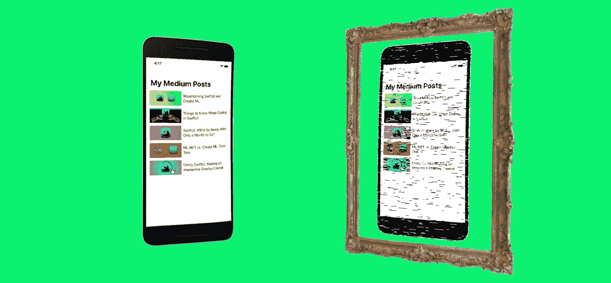

# 克隆还是不克隆？

> 原文：<https://betterprogramming.pub/to-clone-or-not-to-clone-c8e8d169ee8d>

## 克隆软件或消费现有软件的问题

你的模仿 app 有没有反映出里面真正的 app 是谁？

几年前，我试图在 Instapaper 上关注一个特定网站的文章，通过某种第三方服务或脚本获取每日提醒。然而，该网站的 feed 配置无法与 Instapaper 的任何 feed 工具(甚至是这个 [IFTTT 脚本](https://ifttt.com/connect/feed/instapaper))或任何其他 RSS 阅读器配合使用。

同时，我想学习 Python。随着我越来越深入，我开始探索一些开源的东西，并开始将我可能如何编写自己的解决方案联系起来。

长话短说，我创建了 [ArticlesOfEase](https://github.com/dbolella/articlesofease) ，它完美地消耗了独特的 RSS 配置。然而，它并没有就此停止。它还抓取文章(类似于 Instapaper)，将它们和它们的细节返回到一个 JSON，准备由 InstaCLONE(可以这么说)使用，如果我曾经冒险创建它的话。这很有趣，对学习 Python 很有帮助，而且不仅做出了一些东西，而且为我的需求定制了一些东西，这也是值得的。

这也让我感到有点内疚。

把我感到内疚的时刻戏剧化。Credit stocksnap.io

# 我的困境

在我完成最后的润色，在 Github 上发布，并幻想接下来会发生什么之后，我开始质疑我刚刚写的东西的存在。原因？感觉好像我已经*踩到了现有作品*的脚趾。

当然，我明白我在用一个几乎认不出来的蚁丘堆成一座山，但我很好奇。当我思考我可能采取的其他可能性时，我意识到我可以尝试联系现有的供应商，看看他们是否有兴趣以某种方式弥合差距。

## 可能的解决方案

一种方法是写信给网站，让他们知道他们的提要与一种工具不兼容，这种工具可以将他们与许多人每天用来阅读材料的应用程序连接起来。这种意识可能会改变他们的订阅格式，给他们带来更多的自动化流量和收视率。

另一个解决方案是给 IFTTT 脚本的作者留一个评论，或者甚至编写我自己的脚本流。老实说，ArticlesOfEase 的代码并不复杂(34 行代码- 9 行导入- 5 行空白= 20 行功能代码)。

最后，我本可以联系 Instapaper，建议一个原生的 RSS 功能。这会让 Instapaper 更像一个播客应用，可以订阅最喜欢的网站。

## 可能的好处

*   该网站或任何其他具有相同不兼容性的网站的观众可以受益于能够在一个伟大的观看应用程序上欣赏他们的内容
*   这些网站的读者群、浏览量和追随者会增加
*   通过自动化他们的 Instapaper 订阅，Instapaper 可能会有更多的用户采用甚至继续使用

# 谁对我的第一世界问题负责？

没有人会因为不兼容而犯错或受到责备，尤其是我为了自己的阅读乐趣而想要的第三方功能。

该出版商不需要符合第三方服务，可能不知道 IFTTT 脚本与 Instapaper 不兼容，和/或可能出于任何可能的原因不希望以这种方式访问(但为什么不呢？).

对于脚本，嗯，这是一个免费的第三方脚本，没有赚钱的组件。这是一个附带的项目，而不是一个资助的项目，它将确保一个脚本适用于所有的出版商。

至于 Instapaper，不包含 RSS 功能是他们的选择。事实上，他们确实有这个功能，但决定删除它。最终，当谈到该功能时(无论是作为第一方还是第三方提供)，采取的立场是[“请不要这样做。不是 Instapaper 为“](https://www.quora.com/I-have-subscribed-to-an-RSS-feed-on-Instapaper-How-can-I-unsubscribe)设计的。Instapaper 所提供的是关于网站如何通过他们设计和提供的服务变得更具消费性的信息，[可以在这里找到](https://www.instapaper.com/publishers)。

# 兄弟，冷静

所以回到我的“罪恶感”,我要先说，我没有执行过上面的任何一个解决方案——即使是几年后。很明显我不在乎这个！

从我开始设想进一步推进我的项目的那一刻起，我就开始思考这个项目的伦理问题。但是，让我们现实一点，我绝没有准备放弃一切，试图把 Instapaper 作为一个可行的竞争对手。

然而，即使是现在，我或其他人也可以使用 ArticlesOfEase 并从中制作一些东西，而不是使用 IP(这不是一个建议，不要这样做——我已经因为内疚而写了这篇文章！)

# 裁决

话虽如此，事实是我没做错什么。我想学习一些东西，还有什么比尝试重新创建一个我喜欢的服务来做这件事更好的方法呢(注意，它使用了其他开源库，所以我甚至没有写完整个东西，*本身*)。如果每次我想学东西的时候，我都必须为一个服务或应用想出一个原创的想法，我将永远学不到任何东西。见鬼，如果我有原创的想法，我经常可以在我从皇室购买的豪华游艇上写这篇文章！

从某种意义上来说，[“模仿是最真诚的奉承形式……”](https://www.goodreads.com/quotes/558084-imitation-is-the-sincerest-form-of-flattery-that-mediocrity-can)。

# 这条线和它的交叉点

最后一句话有结尾。完整的引语是“模仿是平庸之辈对伟大的最真诚的奉承。”这是有一定道理的。

当有人直接复制别人的想法或工作时，最缺乏的是激情——因为这是别人的思想宝贝，因此帮助产生这个想法的创造性汁液已经流动并致力于这个想法。

还因为一个长期模仿者的激情是为了*个人利益*，甚至以欺骗他人的辛勤劳动、宝贵时间、获得的荣誉、鲜血、汗水和眼泪为代价。通常，最终结果是一个廉价的仿制品，它“足够好”,可以在原作的炒作势头持续期间迅速获利。

## 模仿随着进步而进步

为了非盈利、非竞争，尤其是学习而模仿是有效的，因为它没有威胁。但它也能起作用，因为它是促进模仿者技能和教育进步的催化剂。正是在*进步*中，模仿盛行。

对于接受一个想法，让它成为你的激情，并让它成为你自己的想法(最后一部分是最重要的)，有一些事情要说。有时候，最终的结果确实是一个伟大的产品，值得拥有市场份额——特别是如果它还能推动 OG 软件向前发展的话。当一个项目背后的意图不仅仅是利润时，我们可以开始期待健康的竞争、高质量的产品和全面的进步。

最后，有时一个想法会因为各种原因(管理不善、不可预见的挑战、发展不足，或者因为[游说者想要破坏环境进步](https://www.whokilledtheelectriccar.com/))而失败。模仿一个死点子不一定是模仿。事实上，考虑到它的失败，人们会希望你会真正模仿。但是，取而代之的是，采纳这个想法，从它的错误中学习，并加入你自己的创新和新鲜感，可以让它有时间发光——就像凤凰浴火重生一样。

*附注——如果您之前错过了并正在寻找，那么可以在此处* 找到 [*商品回购*](https://github.com/dbolella/articlesofease/blob/master/articlesofease.py)