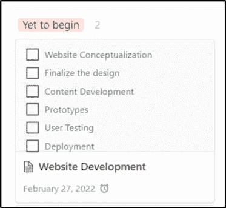

# 为了更好地完成工作，想象一下

> 原文：<https://betterprogramming.pub/to-get-better-at-your-work-visualize-it-ee4448dd2826>

## 知识工作的大(隐藏的)问题


空中对焦照片[无飞溅](https://unsplash.com?utm_source=medium&utm_medium=referral)

在过去的 30-40 年间，越来越多的工作已经演变成知识工作，包括在电脑或某种屏幕前工作。

虽然这种演变是一个巨大的积极转变，预示着我们进入一个以技术为先的时代，但它也有一些其他类型的工作没有的重大缺点。

首先，你的工作很大程度上是流动的和不可见的，因此，服从于多任务处理。您可能在编写一段代码的同时还在响应松弛的消息。你能想象一个伐木工人、焊接工，甚至牙医会这么做吗？我甚至不愿意去想我的牙医在给我做根管治疗的时候回复她手机上的即时消息

其次，因为你的工作是不可见的，你通常不知道什么时候停止，什么时候承担更多的工作。与制造单位相比。每个制造单元都有一个最佳的生产能力。根据原材料和正在进行的工作，它可以表明它是否可以承担更多的负载。另一方面，知识工作者依靠一些模糊的、主要是定性的指标来表明他们是否能承担更多的工作，并最终在工作中表现糟糕。

在本文中，我们将深入研究第二个问题，看看我们是否可以将一些最佳制造实践引入知识工作，以优化其产出。

“凤凰计划”这本书是一个很好的起点，可以帮助我们理解如何可视化我们的工作，并利用它来交付正确的成果。虽然这本书主要关注 IT 和开发，但书中强调的原则可以广泛应用于各种类型的知识工作。

把你的工作想象成一个制造仓库。在任何给定的时间点，您都有要交付的成果(成品)、进行中的项目(WIP)和要开始工作的项目(原材料)。最大的区别是，这些项目和工作流隐藏在你的视线之外，出现在 a)你的日历，b)你的待办事项列表，c)电子邮件收件箱，d) Slack 或 IMs，以及许多其他地方。

下面概述的步骤将帮助你把这些隐藏的工作从你大脑和数字系统的这些角落和缝隙中弄出来，并让它们对你可见。

# 1.设置您的仪表板

第一项任务是将所有这些项目和任务放在一个地方。这些是您可以将这些结合在一起的一些选项

a)特雷罗

b)概念(我使用的)

c) ToDoist

d) Google Sheets 或

e)您熟悉的任何其他任务管理软件。

我通常避免推广付费工具和订阅。然而，我认为在这些工具中的任何一个上小小的投资都会对你管理你的工作和生活有很大的帮助。你也可以使用 google sheets，但是它不像列表中的其他表单那样直观。我用的是付费版的概念。但是，您可以从使用免费版本开始。

下一步是在您选择的工具中创建看板。如果您不熟悉看板，它是一个奇特的术语，指的是带有列的工作流管理仪表板，您可以在其中将任务分组到桶中。在我们的练习中，这些存储桶可能 a)尚未开始 b)正在处理，c)已经完成。

您可以修改这些术语，并根据您的工作类型和其中涉及的阶段添加更多列。

这是典型仪表板的外观。


# 2.分析现有任务和项目

一旦你把所有的任务和项目都集中在一起，仔细分析它们。将你的任务分为以下三类

a)高价值任务:这些是你能产生最大影响的任务。如果做得好，执行得好，这些任务将对你的工作和成长产生最重大的影响。不超过 20-30%的任务属于这一类。高价值任务的一些例子是潜在客户(销售)、编码(开发人员)、填充人才管道(HR &招聘)等。一旦您确定了这些任务，就将它们添加到您的工作仪表板上的适当存储桶中(步骤 1)。

**b)支持性任务:**一旦你确定并组织了高价值的任务，继续支持性任务。这些任务支持高价值的任务。例如，在销售的情况下，为了有效地发现潜在客户而需要做的研究就属于这一类。也将这些任务添加到您的仪表板中。

**c)其他任务:**任何不是核心或辅助任务的任务都需要被质疑。这项任务值得解决或完成吗？像这样的任务会让你偏离你的核心活动吗？通常情况下，这些任务会让你很忙，但是会完全拖累你的时间和效率。弄清楚你如何自动化，委派，外包，或者完全取消这些任务。尽量不要把它们放在你的仪表板上。

# 3.重新整理

一旦你有了所有的核心和支持任务，把它们分成三类。

A)项目:项目是一组相关的任务，需要完成这些任务才能交付产出或取得成果。例如)网站开发是一个涉及许多任务的项目，如设计、内容、开发、部署。不要混淆项目和任务。在这些看板上将这些项目排列成一张卡片，并将它们的组成任务添加到该卡片中。查看下面的例子



**b)周期性任务:**这些是你需要定期做的任务，没有开始或结束日期。考虑销售中的潜在客户。你经常这样做是为了和客户见面。将这些周期性的任务放在你的仪表盘上的一个单独的栏目下，并在这些卡片中嵌入一个日历追踪器。

**c)一次性任务:**这些任务在一天中随机出现。一个简单的例子是回复客户的电子邮件。同样，将此任务安排在适当的类别(列)下。

确保将时间表放在每项任务或项目的前面。这会让你很好地了解你现在和将来的工作量。你可以把它形象化，并据此做出决定。不仅如此，你还可以从中提取截止日期日历，确保事情不会被遗漏。

在这个阶段，您的仪表板已经准备好了，它将为您提供一个关于您的工作负载的可视化表示。在下面找到一个工作仪表板示例。


# 4.执行

创建这个仪表板会让你对自己的工作有一些奇妙的见解，并帮助你掌握需要做的事情。然而，这仅仅是开始。将此作为您的主要操作模式至关重要。我不记得有多少次我创建了这个仪表板，一两个星期后就忘得一干二净了。不要犯那个错误。您已经花费了大量的时间来开发这个仪表板，如果您现在放弃它，下次您将不得不花费同样多的时间来重新创建它。

确保在一天结束时更新它，并适当地移动内容。如果您已经开始处理一项任务或项目，请将其从“尚未开始”移至 WIP 时段。这不仅有助于你保持更新，还能让你很好地了解你的工作量(WIP)以及目前在你的大脑和数字仓库中有多少想法(原材料)等着你去实施，并且不要忘记当你将事情从 WIP 类别转移到成品类别时获得的满足感(和多巴胺冲击)。

一旦你开始使用这个可视化仪表板，你会意识到你对收件箱以及记忆和执行任务的依赖将会大大降低。它不仅会让你更有效率，而且在正确的事情上也更有效率。

您还可以利用这一点来管理团队成员之间的协作，这样每个人都知道并关注正确的事情和成果。

这个仪表板最棒的部分是它给你正确的反馈，告诉你有多忙。基于这一点，你可以接更多的活或者拒绝它。

```
**Want to Connect?**I’m passionate about focus and its impact on improving growth and happiness. If you liked this and would like to get weekly strategies and tactics to improve your focus and habits, subscribe to [my newsletter here](https://bringbackfocus.substack.com/).
```