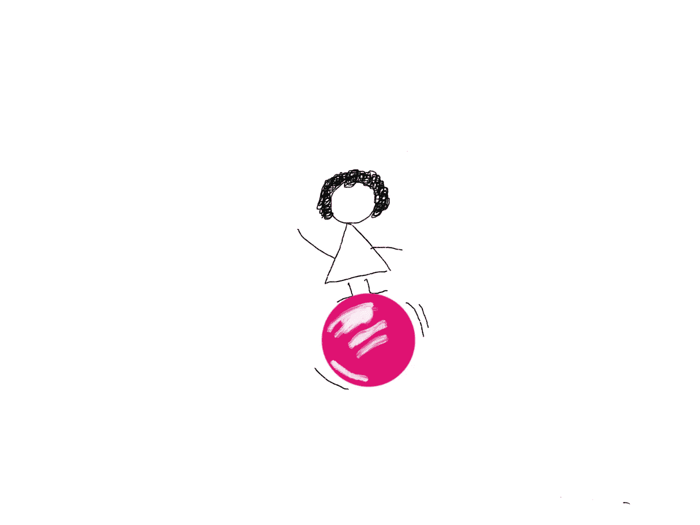
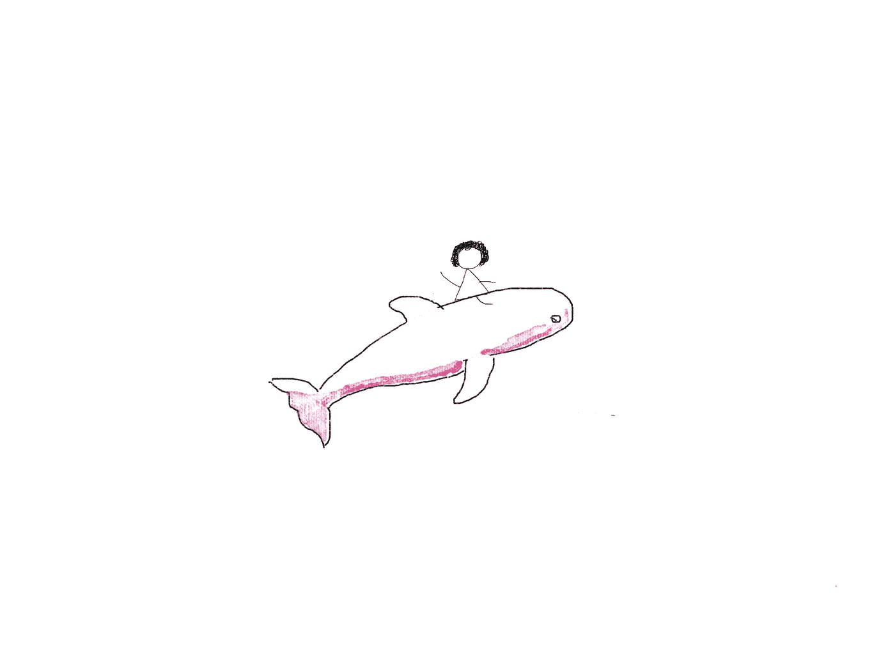
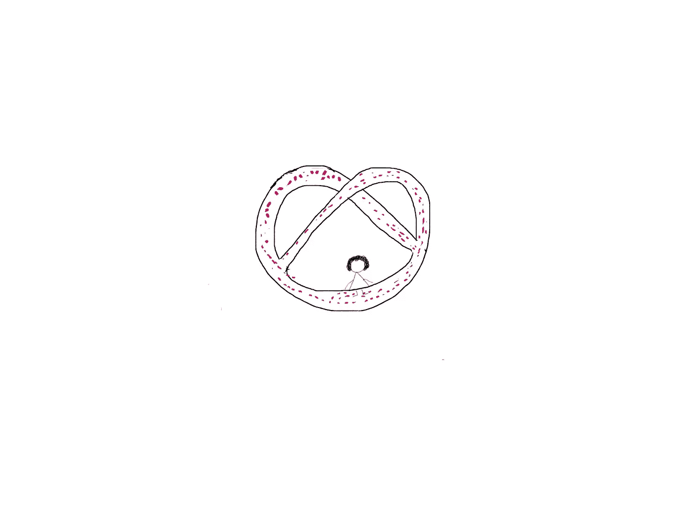
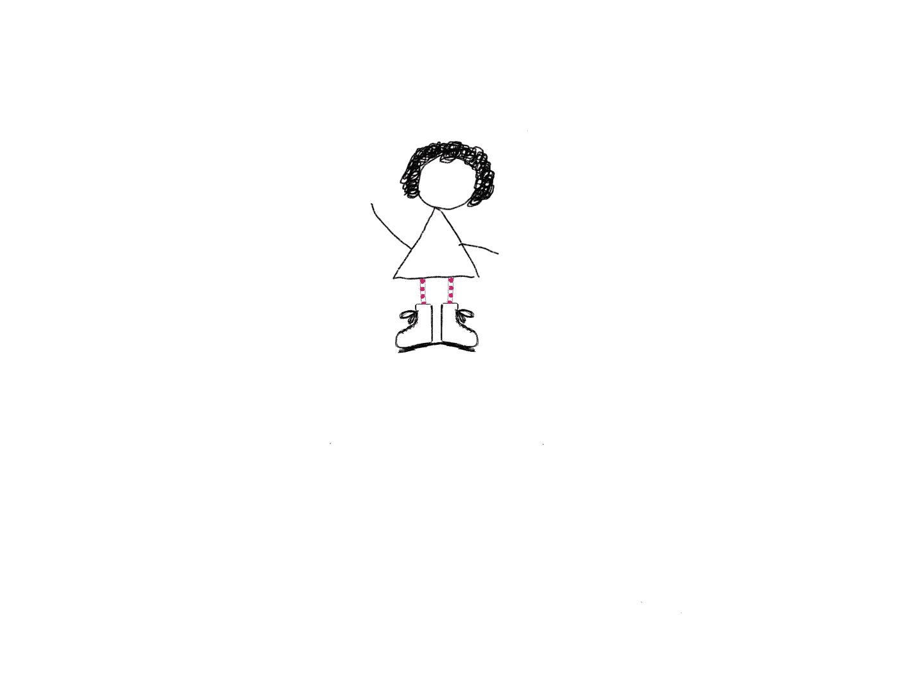
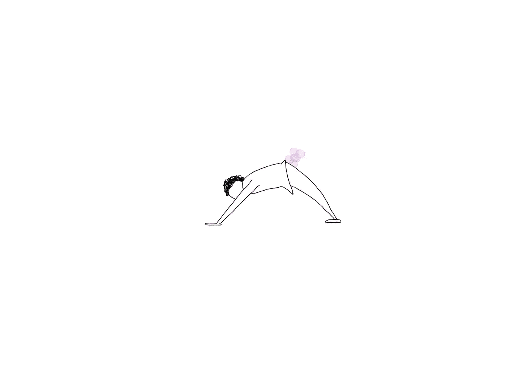
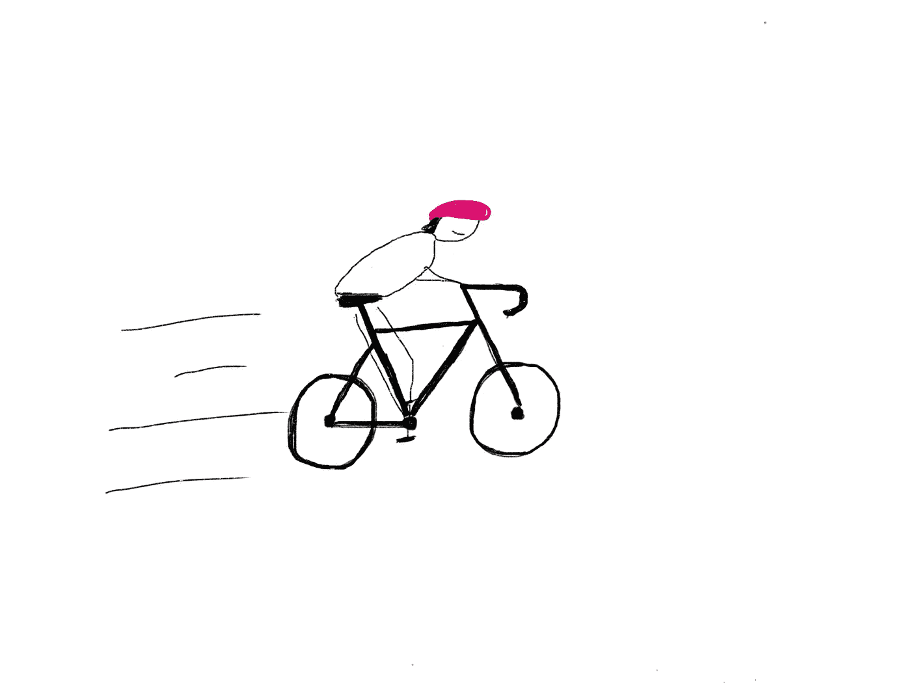
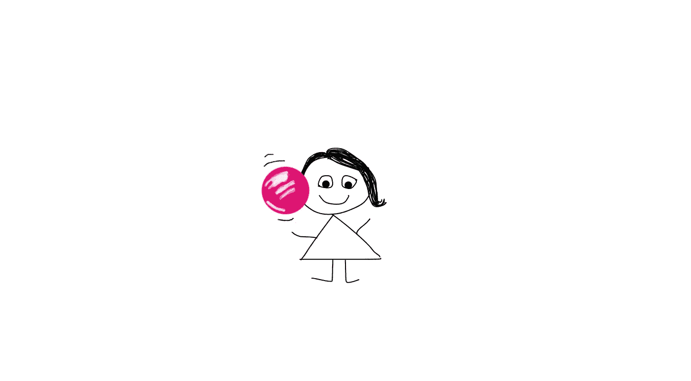

# 让平衡见鬼去吧

> 原文：<https://betterprogramming.pub/to-hell-with-balance-ba1413877429>

## 生活中有如此多的东西

现在要自由，现在要自由，要自由。作者照片。

我讨厌“平衡”这个词它意味着宁静、控制和无处不在的平静。一个我们都应该为之奋斗的天堂。如果说是基准，那么我们都在为失败做准备。我还不如开始寻找彩虹尽头的那罐金子——然后把我找到的金子都留给自己。

所以如果不平衡，那会怎样？在我们的个人和职业生活中，我们应该追求什么？

# 1.海豚

很高兴来到这里。这当然令人激动。

我说“海豚”，但我真正的意思是“目的”但我没说“目的”，因为太累人了。每个人都知道生活应该有目标。但是如果我们一生都在寻找大腹便便的海豚，那不是更有趣吗？你的海豚是什么？我的目标是把我的两个儿子培养成激烈的女权主义者，并且比以往更加尊重这个星球。目标不会让我到达那里，但是海豚的极度智慧也许可以。

# 2.像椒盐卷饼一样弯曲

他们一直在流行和过时，但他们保证提高微笑。

对于那些猜到的人来说，是的，这是指一部浪漫喜剧，充满了影射。*哈*。既然我们已经分享了一个傻笑，让我们认真起来。灵活性是在风暴中不崩溃的唯一方法。我知道你们中的许多人会同意生活常常是一场完美风暴的地狱。所以要么屈服，要么崩溃。这是一个艰难的选择，但它是你的。

# 3.磨损的靴子

我感觉到了，我感觉到了，我感觉到了。

只有一种方法可以得到磨损的靴子。通过步行。在别人的鹿皮鞋里。有人告诉过你不要把世界的重量都扛在肩上吗？真是一堆杂草。你需要承担一些重量。我们都是。换位思考是我们创造一个平等的世界和一个让我们自豪的星球的唯一方法。

# 4.一天 23 小时

歌手要唱一首歌，他希望你们都跟着唱。

别说你没时间。是时候去读那本书，画那幅涂鸦，带你的鱼去散步，或者做那条向下的狗了。承认吧:你就是没有腾出时间。如果你花一分钟做一个快乐的婴儿姿势，释放一点胀气，你会感觉更好。所以不要再期待一天中有几个小时了。你会用它做什么？如果你不能管理 24 小时，你就不会管理 26 小时。相反，在 23 岁的时候画一条线，不要告诉任何人你在这额外的一小时里做了什么。这是你的小秘密。

# 5.太多美好的事物

宝贝，现在自由了。

不管我妈妈说什么，太多的好东西是不够的(爱你，妈妈！).让你的生活充满所有让你振奋的事情。我没说“让你开心”我说“让你振作起来”让你充满活力。让你感觉顺风的东西。多做这些事情。包括你的家人和朋友。和陌生人。让他们沉浸在你的激情中。让这些记忆足以让你一生受用。

# 结论

所以再见了，平衡。我将不再关心你。相反，我把我的存在奉献给目标、灵活性、同理心、自我时间和一生的回忆。

从一个人到另一个人，感谢阅读。很情绪化。

我们是佩珀中士的孤独之心俱乐部乐队。我们希望你会喜欢这场演出。