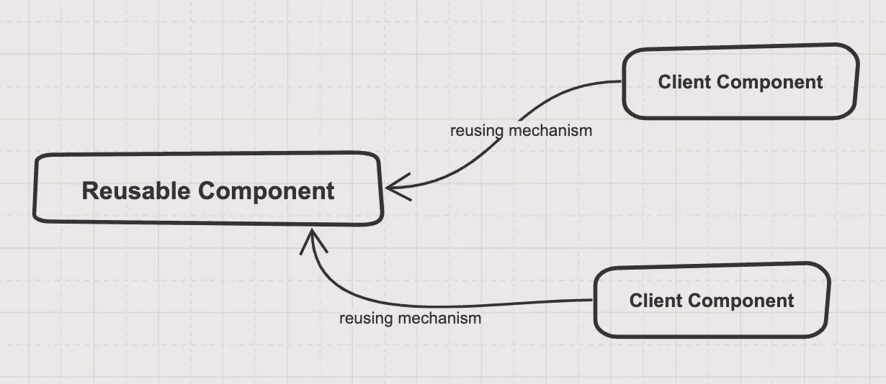

# 重用还是不重用，这是个问题

> 原文：<https://betterprogramming.pub/to-reuse-or-not-to-reuse-that-is-the-question-e5ac51c0475f>

## 什么时候重复自己，什么时候不重复


Erol Ahmed 在 [Unsplash](https://unsplash.com?utm_source=medium&utm_medium=referral) 上拍摄的照片

在我的职业生涯中，我参与了许多关于是否要让代码可重用的讨论，关于制作一个新的微服务以便其他人可以重用某个逻辑的讨论，或者关于重用某个库而不是做我们自己的代码的讨论。很多这样的讨论都以对所做决定的不确定感和不确定感而告终。

也有很多书直接或间接地谈论如何实现极大的可重用性，我最喜欢的一本书是经典的[设计模式:可重用面向对象软件的元素](https://en.wikipedia.org/wiki/Design_Patterns)。然而，我很少读到为什么以及什么时候重用性值得一试。

多年来，围绕可重用性问题的阅读和实验，我已经形成了一套相当系统的推理方法，我希望它能有助于为这类讨论提供一些框架。

关于可重用性的讨论通常遵循以下思路:

*   “我们应该使这个逻辑可重用，以便其他团队和服务可以从中受益，并避免恶性重复。”
*   “我们不应该试图重复使用这种逻辑。在这种情况下，复制是一个很好的选择。无论如何，这种逻辑将会逐渐瓦解。”
*   “我们应该创建一个新的微服务，以便其他团队可以重用这个业务逻辑。”
*   "我们应该(重新)使用这个现有的库还是编写我们自己的代码？"
*   “每个服务中的身份验证逻辑都是相同的。我们是否应该创建一个框架，以便每个服务都可以重用它？”

可重用性确实是软件中一个被频繁使用(和重用)的术语:每个人都在以这样或那样的方式谈论它。但更多的时候，这个概念及其含义并没有被讨论它的人很好地理解。

我参加了很多讨论，有人提出了一个新系统，并轻描淡写地使用术语*可重用性*作为卖点，没有人质疑为什么这是一件积极的事情而不是一个问题。

我也曾在交谈中发现，以前在可重用性方面有过糟糕经历的人，会对任何试图找到普遍性的尝试产生怀疑，因为重用可能是危险的:“让我们只是复制粘贴。这样，我们就可以确定我们可以做任何我们想做的事情。”

我总是惊讶于这个术语被如此轻率地使用，以及我们对它的理解是如此之少——尤其是考虑到我们有多少次不得不决定是否重用。

# 复用性到底是什么？

重用更基本的形式如下:



图片来源:作者

一个*组件，*在本文的上下文中，是任何种类的软件实体，如函数、类、Docker 映像、React 组件等。

一个*可重用组件*是我们打算使之可重用的组件。它可以是一个公共方法、一个抽象类、一个库、一个微服务、一个 Docker 映像等等。

*客户端组件*是利用可重用组件的所有代码实体，例如，从另一个继承的类，使用可重用微服务的移动应用程序，或者使用 Maven 库的 Java 应用程序。希望您有不止一个客户端组件。

*重用机制*是您的组件可以被重用的方式，例如只导入一个函数，包括一个作为依赖项的新库，创建一个 REST 客户端来与 web API 通信，或者只复制粘贴来自权威来源的代码。(等等，但是复制粘贴是重用的反义词！*……嗯，也许不是。稍后将详细介绍)。*

*重用机制在这里有很大的不同。这可能像使用导入然后调用一个函数一样简单，也可能像使用一个对 HTTPS 和 OAuth2 进行版本控制的 SOAP 端点和一个巨大的 XSD 文件一样复杂，没有人能完全理解这个文件。*

*重用机制越复杂，维护和使用的成本就越高。*

*当你在设计的时候考虑到可重用性，设计往往更加通用，你必须考虑客户的需求，他们可能存在，也可能不存在。这通常会带来新的复杂性。例如，如果你为一些公司内部的应用程序编写一个`validateEmail`函数，你可以对公司的普通邮件进行一些检查。但是如果你想在其他系统中重用它，你必须考虑 email RFC 标准(一个非常复杂的正则表达式)，你还必须考虑如何使你的`validateEmail`函数作为一个库可用。*

*确定额外的复杂性是否值得实际上是相当困难的，尤其是在多个人和团队受到这些决策影响的企业中。这篇文章的主要观点是给这个问题的推理带来一些结构。*

## *复用性的好坏是由什么决定的？*

*当给定组件没有或只有一个客户端时，谈论可重用性就没有什么意义了。然而，如果您的目的是为了可重用性而设计，而您最终没有或者只有一个客户端组件，那么您可能已经浪费了时间。这里意图很重要的原因之一是，通过使抽象更加通用以使它们可重用，您可能使代码比实际需要的更复杂。*

*一个“想要”的可重用组件只有一个客户就相当于开了一家公司，只有一个客户(通常不太好)。这听起来可能是显而易见的，但我见过很多以可重用为目的而创建的软件，最终只被一个客户端使用，甚至是零！*

*现在，失败的可重用组件并不意味着可重用性本身不好，同样，失败的业务也不意味着创建业务是个坏主意。这可能只是因为你的策略失败了，或者开发者没有被强迫去使用(和重用)你的作品，或者你的结果不够好去宣传它。*

*那么，当您实际上有两个或三个客户端组件时，情况会怎样呢？有没有一个神奇的数字可以让重用性得到回报？有，但是要回答这个问题，我们需要一个可重用性的模型。*

# ***一个真实的故事***

*为了阐明可重用性的某些方面，我将从一个简化的真实例子开始。*

*假设您正在实现一个图库来预览机场乘客的护照扫描，以帮助航班安全团队，作为该功能的一部分，您需要创建一个函数来生成护照的预览。*

*您知道，护照总是提供 125 × 88 大小的小 JPEG 文件，因此要创建预览缩略图，您只需将原始图像缩小 70%，就可以获得非常适合您图库的精美图像。你只需要这样做:*

```
*passport_preview = generate_passport_preview(passport_image)*
```

*您甚至不需要实现 70%的可参数化，因为您知道如果需要的话，以后可以在函数内部调整这个数字。*

*但是在您交付了令人惊叹的图库后不久，经理有了一个绝妙的想法，让这种图库逻辑可重用，以便其他处理扫描文档和生成预览的团队可以使用它。显然你想出名，你想让你的代码到达世界的每一个角落，所以你要迎接挑战。*

*现在你必须考虑新的方面。图像的大小可以改变，所以你应该支持宽度和高度。你不能保证预览会很好看，所以你需要处理好比例。有些图像可能太大而不适合图库，因此您需要添加裁剪图像以适合特定大小的选项。文件太大怎么办？如果它是一个文本文档，并且字母在图像处理过程中变得模糊不清怎么办？如果人们因为文件太大而需要不同级别的文件压缩怎么办？*

*现在，您的函数看起来更像这样:*

```
*document_preview = generate_document_preview(document, width = 300, keep_proportion= True, compression='low' ... and so on)*
```

*注意这个名字不再是`generate_passport_preview`。语义发生了变化:您创建了一个更通用的抽象。对于您的 passport 应用程序，您可以用原始的`generate_passport_preview`函数包装这个通用函数，但在内部，代码不像以前那么简单了。*

*您还需要使这个新代码可用，以便人们可以实际使用它，所以您从您的项目中提取它，并将其创建为一个单独的项目。首先，您需要定义一些过程来进行更改并发布库的新版本。因此，您创建了一个管道，以便当有变更时，它们可以在公司的存储库中发布。由于你的代码现在将被更多的人使用，你需要创建更多的测试，这样它就不那么容易被破坏，因为如果你破坏了它，你可能会影响一群用户。*

*通过使这个小函数可重用，您使您的客户端代码更难阅读，并且与保持函数原样相比，增加了许多额外的工作。而且现在改的时候还得小心翼翼；否则，你可能会破坏你的新用户。*

*但这并不意味着你的图书馆是浪费时间。那取决于不久的将来会发生什么。*

# *场景 A:很可能不值得*

*场景 A:你的功能只有少数几个用户，也许两三个(你妈妈是其中之一，因为她喜欢你做的一切)。*

*在这种情况下，如果维护通用函数的工作比这三个人制作自己的预览生成器函数更难，那么额外的可重用性工作就不值得了。*

*请记住，维护一个可重用的功能需要更多的工作，而不仅仅是为单个客户端编写和维护代码。例如，如果共享代码更改太频繁，您需要更多的会议和开发人员或其他团队之间的协调来更改它，有时您必须参加这些会议，因为没有人知道这种更改会如何影响您的客户端代码。*

*我不得不略带羞愧地承认，我好几次被制作漂亮的可重用抽象的快乐所欺骗，即使没有人会使用它们！我认为人性中有某种东西让你想要创建可重用的函数，这样其他人就可以看到你有多聪明，你对所有事情都考虑得有多好。*

*这也许是超越程序员的一种方式，它比仅仅交付一个特性更加个人化。客户通常不关心谁在网站上做了那个花哨的保存按钮。但是对于一个函数，你可以想象你的程序员同事看到你的小作品，并在提交中印上你的名字，他们心里想“哦，这么好的抽象！我会高兴地重用它，”尽管在现实中，大多数时候，他们会想“这家伙到底在想什么！”*

*人类的这种本性使得让东西变得可重用变得更加困难。我们可能最终偏向于做无价值的可重用组件，使事情变得比需要的更复杂，这在很大程度上可能会导致许多问题(并产生一堆新的程序员工作)。*

# *场景 B:我不知道这是否值得*

*场景 B:你的功能实际上被很多用户使用，但是维护和集成成本高。*

*您的功能现在被 20 多个客户使用。它变得如此受欢迎，以至于经理提议用它创建一个微服务，这样它就可以用于不同的语言，而不仅仅是 Python 项目。你出名了，有自己的服务。*

*你不再为小型护照安全小组工作了。现在，当您处理新的图像格式和来自 20 个使用它的客户端的错误时，您必须每天确保您的服务正常运行并维护负载。架构师已经告诉每个处理图像的团队使用你们的服务。*

*随着时间的推移，一些开发人员想知道为什么他们不能为他们简陋的用例使用他们的本地语言功能来实现他们的小型缩略图生成器。但是，“建筑师知道得更清楚；这项大服务的出现是有原因的。”*

*在这个场景中，有很多团队已经在使用你的缩略图生成器了。但是他们真的需要那台发电机吗？如果他们前阵子实现了自己的简单缩略图生成器，总成本不是比维护一个新服务和一个致力于此的团队的成本更低吗？他们因必须与您的团队协调新用例而招致的时间成本如何？你的专门团队不得不处理 bug，这些 bug 更多的是因为复用的复杂性，而不是因为解决了真正的领域问题。*

## *现状和威权主义*

*在这种情况下，很难知道这样做是否值得。很多人会假设大图像服务的现状，甚至不会考虑编写自己的小代码，即使这样做比与您的服务集成更容易。这是一种人类的偏见，认为一切都有一个好的理由，而我们文化中的许多东西都是偶然出现的。(你知道吗,“早餐是最重要的一餐”的想法实际上是由一个广告引入的，目的是为了销售更多的谷类食品。)*

*为了维持现状，一些公司甚至强制使用某些库或服务，理由是“这是我们的企业解决方案。”我喜欢称这种现象为“可重用性权威主义”(我不想在这里涉及政治，但我怀疑这与威权政权控制的市场一样危险)。*

## *伪可重用性*

*下面是我见过的一些经常发生的事情。可重用组件已经很流行了，起初，它似乎是一个可重用的解决方案。但是当你开始尝试使用它的时候，下面的事情可能会发生。*

*   *用法被可怕地记录下来，所以你必须和拥有组件的团队开会，以弄清楚如何使用它。*
*   *每次一个新的小特性出现在你的团队中，你最终不得不与其他团队进行大量的协调，只为你的用例添加对他们代码的修改。*
*   *可重用组件已经根据每个客户的具体需求有机地发展起来，所以虽然从外部看起来是可重用的，但它有许多显式的功能，只被少数客户使用(或者没有)。*

*一般来说，很多公司的内部项目都属于这种情况。一旦你到了这里，就很难决定是放弃还是继续投资于可重用组件。此外，这个阶段可能是向成功的可重用组件发展的中间状态。*

# *场景 C:耶宝贝！*

*场景 C:你的职能成为公司事实上的职能，不需要大量维护。*

*这显然是双赢的局面。你现在是一个著名的开发人员，人们邀请你喝咖啡，因为你节省了他们很多时间！*

*   *您的团队没有花费大量时间来维护可重用组件，因为它非常稳定。*
*   *对于其他开发者来说，集成和使用你的库或服务比每次自己完成这些功能要容易得多。*
*   *您的库的接口和扩展机制非常好，它们满足了大多数用例，而不必在每次新客户需要新东西时更改可重用组件。*
*   *文档是如此之好，以至于你不需要一直和那些试图弄清楚如何使用你的组件的人开会。*

*不幸的是，上述情况并不常见。我在内部公司只见过几次。流行的互联网图书馆和产品就是这种情况的一个很好的例子。例如，React 被世界上成千上万的开发人员使用，但是开发和维护它的团队比重用它的人数少几个数量级。*

*然而，值得注意的是，对于公共图书馆来说，有一个主要的经济差异(同样，我不打算在这里谈政治)。互联网上的公共组件更像一个自由市场经济(大多数库会消亡，只有少数会存活)，而公司内部的组件更像一个受控的经济(市场更小，许多组件被人工维持，无论可重用组件有多好或多坏，开发人员都会得到报酬)。*

# *重复使用的经济性*

*上面的三个场景告诉您什么是可重用性，但是您如何知道在您的特定情况下是否应该这样做呢？实际上有什么方法可以评估重用是否是一个好主意吗？你能做些什么不同的事情来提高你成功的几率吗？*

*我发现从经济角度考虑可重用性是很有用的。(我知道这不会让事情变得更容易，但请支持我。我保证不深究数学)。*

*下面的公式试图捕捉可重用性是否值得努力:*

***可重用性的效用** =重用节约-可重用组件成本*

***重用节省** =团队或开发人员使用可重用组件节省的成本。这种节省是相对于团队的成本而言的，如果他们自己为他们的特定用例实现组件的话。*

***可复用组件成本** =所有者团队创建和维护可复用组件的成本。*

*用简单的英语来说，这意味着如果创建和维护可重用组件的成本加上其他人重用它的成本低于每个人首先编写自己的代码的成本，那么就有了效用。*

*坏消息是没有简单的方法来计算这些成本。这些成本受多个方面的影响，例如:*

*   *你使用什么技术使你的逻辑可重用(一个库，一个框架，一个 Docker 映像，一个 web 服务)*
*   *文档有多好，或者代码的自我文档化有多好*
*   *有多少客户拥有可重用组件*
*   *这种可重用的逻辑在整个公司中表现一致是多么重要*
*   *更改可重用组件的影响是什么*
*   *您需要多久更换一次组件*
*   *使用它的界面有多稳定*
*   *重用组件内部的逻辑有多复杂和专业*

*好消息是，如果我们更好地了解这些方面，我们可以做出更明智的决定，即使没有 100%的把握。在这篇文章中，我不会详细阐述每一点，否则会太长。我计划稍后就此发表一篇更详细的文章。*

# *一些重用启发法*

*基于前面的概念，我们已经可以开始思考一些启发法来帮助我们做出更明智的决定:*

## *考虑再利用的理由*

*   *重构是女王:当在几个地方有重复的代码，并且你可以找到一个合理的抽象来捕捉大部分的重复时，你就有了一个可重用的组件！(这就像在创业之前就有了客户一样。)*
*   *这里有一些危险，因为你可能会过度抽象，使得代码比以前更难理解。然而，无论如何，你应该继续尝试找到一个好的抽象——熟能生巧。*
*   *要重用的逻辑是否非常复杂和专业。
    例如，开发自己的加密功能，即使代码不多，通常也不是一个好主意。*
*   *当一些业务逻辑频繁地改变时，并且每次它改变时，您都需要改变许多系统来与这个逻辑同步*
*   *当组织中的每个人都立即与某些逻辑保持同步非常重要时。这方面的一个例子可以是安全协议。*
*   *当可重用组件非常容易使用，并且在您最终不需要它时也很容易移除时*

## *怀疑再利用的理由*

*   *当**你需要很少的可重用组件必须提供的特性**时。这里总是有陷入一厢情愿的诱惑，比如“也许我将来会需要它。”最好像玛丽·近藤一样。*
*   *当**有很少的客户端**(或者没有)并且文档很差或者界面看起来太普通的时候*
*   *当某些**特性或功能非常相似，但** **重新实现** **和维护**并不困难时。最好只做两次，除非他们因为相似的原因经常改变。*
*   *当感觉像**时，你会花很多时间在会议上**与拥有可重用组件的团队协调新的特性，如果你想要的特性小得可笑，那就更是如此。例如，我曾经花了两个月的时间尝试与企业调度系统集成，而我本可以在一个小时内用一个简单的 Linux cron 作业交付该特性。*
*   *当**你不知道组件是否真的可以重用**；在这种情况下，你不应该花太多时间让它变得可重用和通用(在创业之前了解你的市场！).*
*   *当您想要重用的组件是您业务的核心，并且您知道**您将需要非常高程度的定制化。每一个抽象和概括都会在定制的压力下崩溃。***
*   *您需要集成库的代码和上下文的数量比您自己创建库的数量要多。有时候大量的上下文会给你带来很多好处。例如，开始时学习 React/Redux 对我来说有点难，但所有这些新的内容后来变得非常有用。其他时候，语境多半是浪费时间。例如，不久前我学习了如何免费使用许多晦涩难懂的 SOAP 特性。*
*   *当**框架或库如此雄心勃勃**以至于一旦你开始使用它，就很难摆脱它。*

*上面的启发可以帮助您在做出可重用性决策时了解更多的结构。然而，故事并没有就此结束；正如标题所示(我承认我选择这个标题是因为我想让自己看起来像读过莎士比亚)，这个决定不仅仅是重用还是不重用的问题，而是如何重用对重用的经济性有很大的影响。*

*要重用一个应用程序逻辑，您可以决定公开一个方法、创建一个库、创建一个框架、创建一个微服务、从一个受信任的企业源复制粘贴(或者更常见的是堆栈溢出)、使用 Docker 映像等等。这些机制中的每一个实际上都专注于可重用组件和它的客户之间关系的不同方面:它们能承受多少定制，什么样的东西正在改变，以及它们随时间改变了多少。*

# *结束语*

*我希望通过上面的想法，我已经展示了可重用性的整个业务是如何不像我们通常所做的那样被轻视的一个概念。这确实是一个需要深思熟虑的复杂想法。然而，为了避免这篇文章变得更长，我省略了对某些要点的更详细的分析，例如:*

*   ***更多关于可重用性的经济性—** 你如何估计制造一个可重用组件或继续使用一个组件的成本？营销和复用性有什么关系？人的因素如何影响这些经济？*
*   ***从复制粘贴到 Docker:可复用性的光谱—** 复制粘贴、继承、库、框架、服务模板、web 服务、Docker 容器……这些都是复用现有代码的方式，各有不同的特点和后果。对于我的用例来说，什么样的可重用性机制是最好的？这些机制如何影响可重用性成本？他们的取舍是什么？*

*如果我的拖延症允许的话，我打算以后再详细阐述这些观点。*