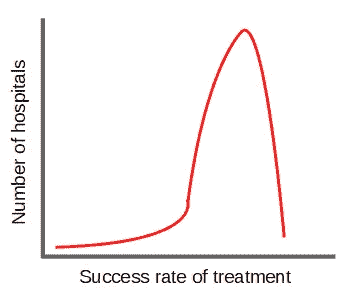
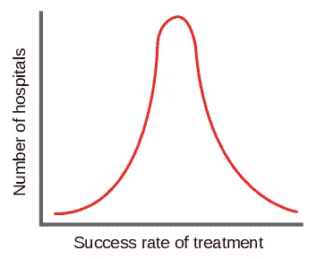

# 要开启卓越，无视你的导师

> 原文：<https://betterprogramming.pub/to-unlock-excellence-disregard-your-mentor-64b8766125ed>

## 你的导师不能教你的

费利佩·科雷亚在 [Unsplash](https://unsplash.com?utm_source=medium&utm_medium=referral) 上的照片

导师形成了我们天真的大脑，让我们为未来做好准备。

伟大的导师无私地分享他们的经验，让我们在知识方面与他们平起平坐。导师教给你他们所知道的和认为正确的东西。

然而:

> 只有那些尝试荒谬的人才能实现不可能的事情。
> 
> — [阿尔伯特·爱因斯坦](https://www.goodreads.com/quotes/226265-only-those-who-attempt-the-absurd-can-achieve-the-impossible)

这就是为什么它们最终会成为你发展的障碍的确切原因。

但是让我从头解释一下为什么会这样，以及如何避开这些障碍。这样你就可以释放你的全部潜能。

# 跟随者滋生平庸

为了让你明白为什么导师会在某些时候拖你后腿，我想和你分享几年前我在一本书上读到的一件事。

该书由美国著名外科医生兼作家阿图尔·加万德出版。它的标题是**更好。**

**他批判性地剖析了医疗行业，在这个行业中，人为错误经常会导致生命损失。他消除了所有医疗设施在成功治疗方面或多或少相同的神话。**

**这个神话是基于这样一个假设，即医学是一门有精确治疗标准的科学，这是真的。**

**如果我们画一张图来描述所有医院的成功率，我们可能会得到这样的结果:**

****

**图片由作者提供，灵感来自阿图尔·加万德的《更好》**

**绝大多数医院都很相似，成功率很高。治疗效果差的医院也就那么几家。**

**理论上是这样。然而，正如 Atul Gawande 在他的书中指出的，实际的图表看起来像这样:**

****

**图片由作者提供，灵感来自阿图尔·加万德的《更好》**

**有一些医院表现不佳。绝大多数医院提供的结果一般，而少数医院表现出色。**

**退伍军人管理局的一项研究显示了接受疝气手术的患者的不同成功率。在最差的医院接受治疗的患者有 10 %的疝气复发风险。**

**最成功的医院治疗的病人边际风险为 0.002 %。**

## **永恒的平均值**

**优秀的医院会做哪些其他医院不会做的事情？**

**答案是:他们不仅使用被认为是最先进的方法和工具。**

**相反，他们质疑现状，发明新方法和新工具来改善他们的治疗。他们试图荒谬地实现不可能的事情。他们定义了最先进的。**

**所有其他人只是应用这些先驱创造的东西。**

**现在你可能会想，最终，普通医院会赶上先行者。嗯，是也不是。**

**虽然他们确实会适应先驱者所设想的新方法和工具，但他们仍然永远不会达到他们的目标。**

**这是因为他们需要时间来适应新的现状。在此期间，先锋们已经在着手下一件大事了。**

**普通人永远被困在那里，因为他们所做的一切都是为了赶上来。**

**这种情况直接转化为导师和被保护者之间的关系:**

1.  **导师定义了最先进的技术。**
2.  **导师将他们的知识传授给被保护者。**
3.  **被保护者接受新知识，而导师则重新定义最先进的技术**
4.  **我们又回到了起点。**

## **指导的局限性**

**我并不是说导师没有价值。对于任何开始新工作或跳槽的人来说，导师都是很棒的。**

**学习新技能最有效的方法之一就是从大师的肩膀上看过去。**

**如果你已经更有经验，而且没有真正的导师，这同样适用于你为自己选择的榜样。**

**跟随一位导师或一个榜样对于建立基础是有价值的。**

**但是请记住:只要你走在他们的脚步中，你就永远无法超越他们或找到自己的路。**

# **剪断脐带**

**让我们把你的导师想象成一个你想榨出来的橘子。果汁是你想喝的导师的知识。当你挤压新鲜水果时，美味的果汁不费吹灰之力就流了出来。**

**然而，你挤得越多，剩下的果汁就越少。为了吐出最后一滴，你需要努力到手指韧带几乎撕裂的程度。**

**结果不值得努力。因此，就从你的导师身上获得最大收益而言，80/20 法则是适用的。用 20 %的能量，你得到了 80 %的汁液。**

**一旦你达到了 80 %,是时候切断脐带，学会自立了。如果你不这样做，你将面临两种风险:**

*   **你仍然在你导师的阴影下。**
*   **你的同事并不把你看作一个正式的同事，而是一个实习生。**

## **你需要剪断脐带的迹象**

**很难看出你什么时候应该放弃被保护人的身份。这不是一门精确的科学。尽管如此，我认为每个人都会感受到开始赶上导师的那一刻。**

**有几个迹象表明那一刻:**

*   **你意识到你经常不同意你的导师所说的或所做的。**
*   **你和你的导师取得了相似或更好的结果。**
*   **你的导师会更频繁地征求你的意见。**
*   **你的导师无视或轻视你的想法，尽管你深信不疑。这可能是一个迹象，表明他们感觉受到了一个正在崛起的对手的威胁。**

**一旦你看到这些迹象，准备好剪刀剪断脐带。**

## **被保护人的压力**

**根据导师的类型，他们或多或少会以平等的态度欢迎你。运气好的话，你作为被保护人的角色自然会淡出。你将成为一名合格的团队成员。**

**然而，一些导师似乎难以接受他们的前养子成为正式同事。**

**如上所述，这是一个困难的局面。如果你的导师规定了你的每一步，你就不能追求自己的想法。此外，如果一家公司的权威系统地压制你，它可能会影响到其他同事。**

**你的同事可能不重视你的想法，因为他们认为你是晚辈。**

**在公司接受过培训的人经常目睹这种现象。他们最终被迫离开公司，以重获应有的尊重。**

## **如何剪断脐带**

**放弃被保护人的地位没有一个放之四海而皆准的解决办法。但最终，这一切都是为了让自己成为一个成熟的、受重视的同事。**

*   **对主题进行研究，提出你独特的想法来解决问题。**
*   **如果你认为可以做得更好，挑战现状和建议。即使这些想法来自你的导师。但要尊重地去做。**
*   **自己承担起导师的角色。这可能是剥夺初级头衔的最快方法之一。**
*   **表现出主动性，用大局观思考问题，把自己表现成一个专家。**

## **最后的手段**

**如果你的导师一直贬低你，你有两个选择来保护你的声誉和发展:**

*   **对抗**
*   **逃跑**

**在你做出任何激烈的决定之前，和你的导师谈谈。解释问题和你的愿望。一个行之有效的解决冲突的方法是[非暴力沟通](https://en.wikipedia.org/wiki/Nonviolent_Communication)。**

**如果你导师的行为没有改变，将问题上报给他们的主管。或者，面对你的未来在另一个部门或公司的事实。**

**你太有价值了，任何人都不能不尊重你。**