# 好得令人难以置信:这些免费字体附带商业许可

> 原文：<https://betterprogramming.pub/too-good-to-be-true-these-free-fonts-come-with-a-commercial-license-a4c8a2db26ad>

## 预算低还是没有预算？用这些字体。它们是免费的，并带有商业许可证

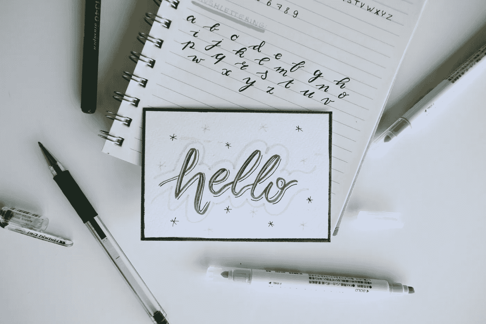

在 [Unsplash](https://unsplash.com/s/photos/font?utm_source=unsplash&utm_medium=referral&utm_content=creditCopyText) 上由[埃斯特·扬森斯](https://unsplash.com/@esteejanssens?utm_source=unsplash&utm_medium=referral&utm_content=creditCopyText)拍摄的照片

之前，我谈了很多关于购买有完整许可的[字体包](https://medium.com/sketch-app-sources/https-medium-com-madihayameen-its-like-buying-wholesale-but-in-fonts-169928977c7c)。最终，你只需为每种字体支付几分钱。

但如果连这看起来都超出了你的能力范围，我有这 26 种漂亮的字体和完整的字体系列。

排名不分先后:

# 1.[有一天](https://thehungryjpeg.com/freebie/46463-free-font-one-day-typeface/Madiha/)

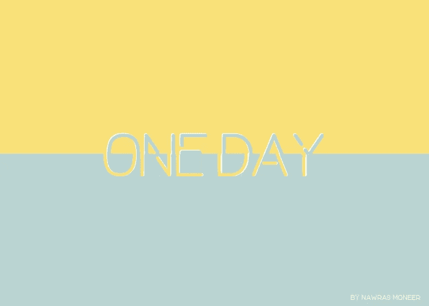

一天是由 [Nawras Moneer](https://hackernoon.com/tagged/nawras-moneer) 设计的细长大写字体。它清新、现代、简单——不太严肃，而且恰到好处。

# 2.[休闲](https://thehungryjpeg.com/freebie/83168-free-casual-font/Madiha/)

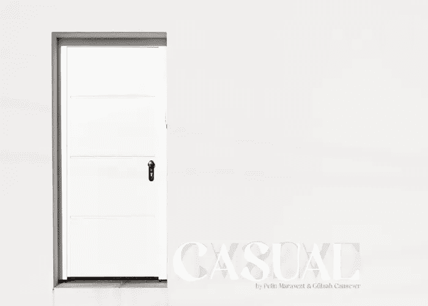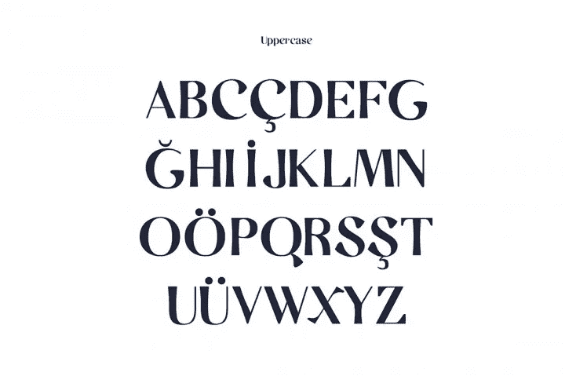

这种字体用它的简单欺骗了你。一旦你开始使用它，你将开始看到每个字母的所有细节。[佩林·马拉文特](https://www.behance.net/pelinmaravent)和[古尔莎·坎瑟尔](https://www.behance.net/gulsahcansever)是这款休闲字体的设计者。

# 3.[d 料斗](https://thehungryjpeg.com/freebie/3523639-free-dpopper-font/madiha)

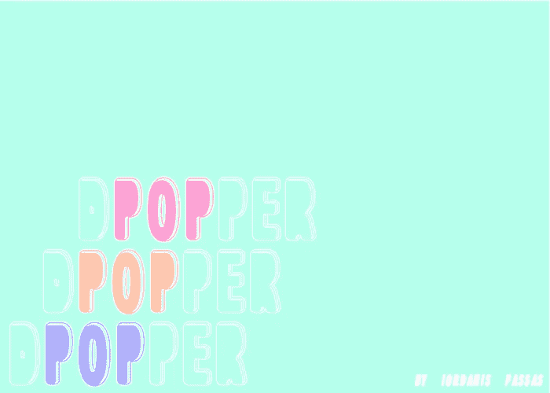

这种可爱的，可爱的，具有漫画 3D 外观的字体是由 Iordanis Passas 设计的。天空是这种字体的极限，就像字面意思一样。

# 4.法昆达

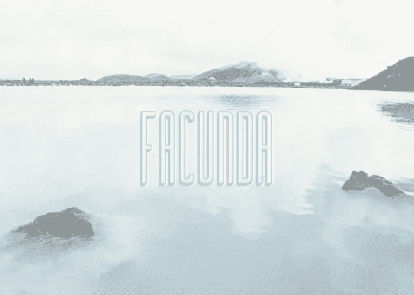

这是另一个有深色细节的 3D 字体。它有五种不同的风格。Facunda 是由 Bu 设计的一种高，黑边，无衬线字体。

# 5.[阿尔库比耶](https://thehungryjpeg.com/freebie/55841-free-font-alcubierre-typeface/Madiha/)

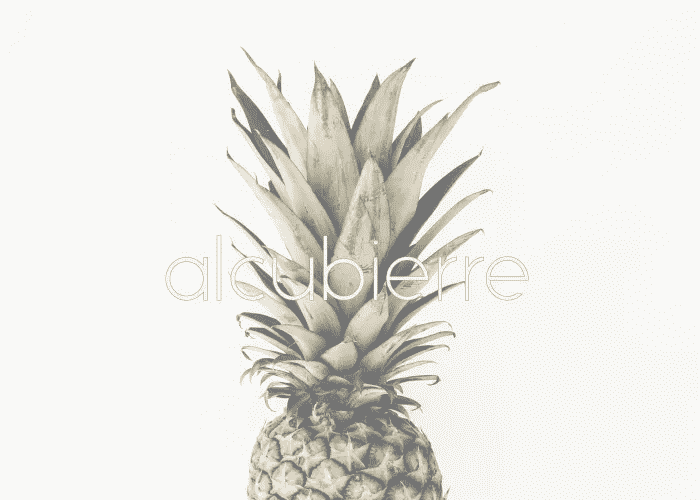

如果让我一辈子用一种字体，我会选马特·埃利斯的《阿尔库比耶》。它薄，直，几何但不粗糙，光滑但不太尖锐，它的简约外观可以走很长的路，取决于你如何使用它。

# 6.[殷虹婷](https://thehungryjpeg.com/freebie/50567-free-font-amada-typeface/Madiha/)

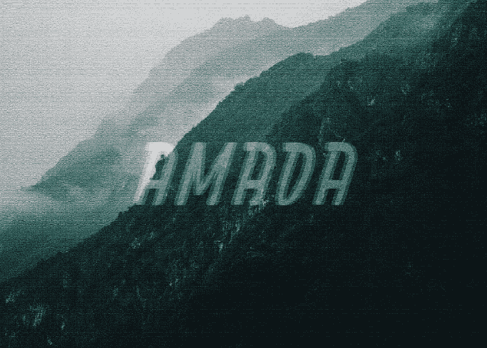

这个由 edu·奥利维拉设计的字体背后有一个故事。设计师的灵感来自于他的家乡 Limoeiro 街道墙上的文字。这种严肃的字体可以有多种用途！

# 7.[雅典](https://thehungryjpeg.com/freebie/62331-free-font-athene-typeface/Madiha/)

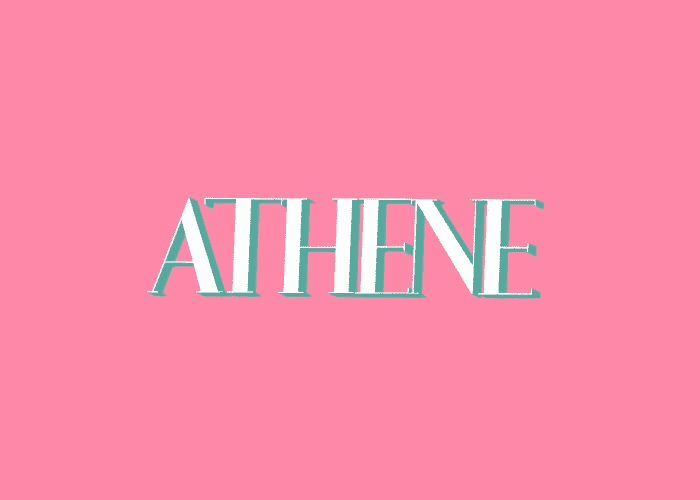

这种经典的衬线字体非常容易配对[。雅典娜带有口音，数字，和绝对可爱的小写风格。简洁的几何外观非常适合极简主义，甚至是公司设计。](https://hackernoon.com/fool-proof-font-combinations-for-non-designers-1ec601356af3)

# 8.[阿蒂法](https://thehungryjpeg.com/freebie/77453-free-font-atifa-serif/Madiha/)

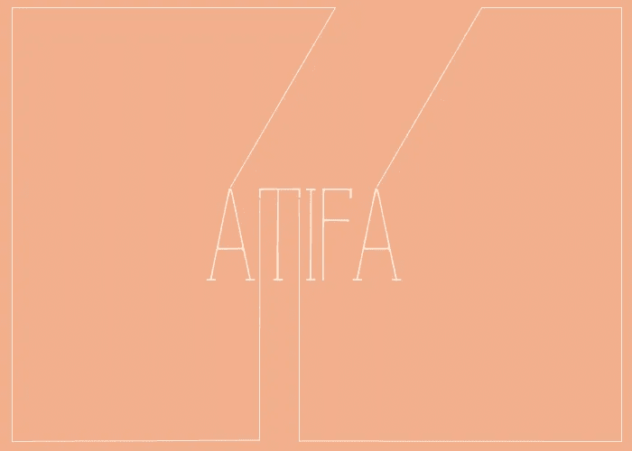

这是一种全大写的衬线字体，具有手写的感觉。细节设计绝对准确。你可以看到不同字母的墨水随着手的压力越来越浓，越来越稀。爱不一致！

# 9.[扫把](https://thehungryjpeg.com/freebie/74496-free-font-besom-brush-typeface/Madiha/)

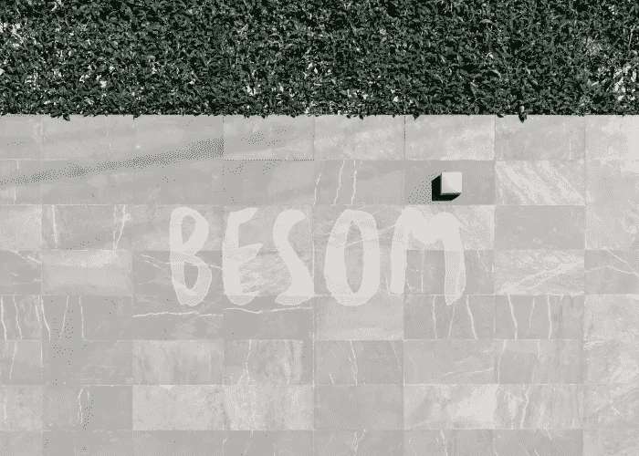

Besom 是由 [Krisijanis Mezulis](https://www.behance.net/krisijanis) 和 [Gatis Vilaks](https://www.behance.net/gatisvilaks) 创作的。这是一种手写的毛笔字体，带有怀旧的感觉。它与你脑海中所有的宝丽来照片、90 年代的氛围主题相呼应。

# 10.[打击](https://thehungryjpeg.com/freebie/87112-free-font-blow-brush-typeface/Madiha/)

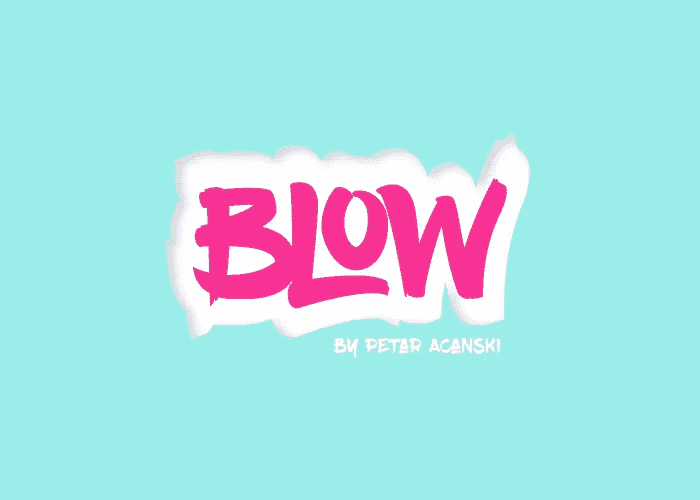

Petar Acanski 受嘻哈文化和涂鸦艺术的启发，设计了这种大胆而充满泡沫的笔刷字体。为了保持易读性和清晰度，Acanski 在字体中添加了一些变化。你可以从上面的链接下载。

# 11.[可爱的朋克](https://thehungryjpeg.com/freebie/76290-free-font-cute-punk-typeface/Madiha/)

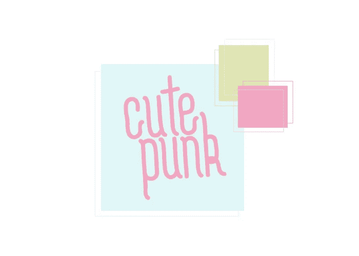

可爱的朋克有三种不同的重量。该字体也有重音。取决于你如何使用它，你可以拿这个给它一个复古旋转或 K-Pop，泡泡糖的氛围。

# 12.[蕾娜](https://thehungryjpeg.com/freebie/79927-free-font-lena-typeface/Madiha/)

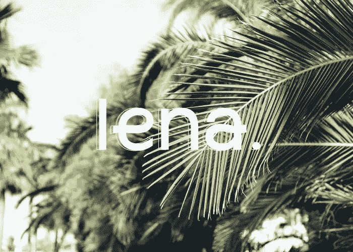

看到那些简单的曲线了吗？这是优质字体的标志。它是几何的，但它是柔软的，它是简单的，但做出了声明。太完美了！

# 13.[可能类型](https://thehungryjpeg.com/freebie/44517-free-font-mightype-script/Madiha/)

带你去托斯卡纳的葡萄园(甚至不确定他们是否有这些)，这种字体在边缘卷曲的方式，只会让你想点击下载按钮。

# 14.[奶昔](https://thehungryjpeg.com/freebie/61113-free-font-milkshake/Madiha/)

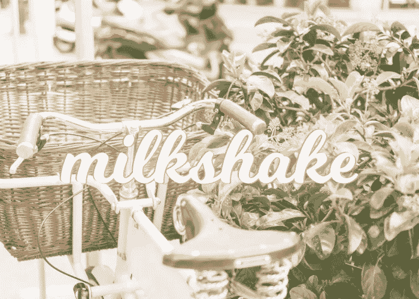

劳拉·沃星顿端上了奶昔。它有很多奖励，每个角色有八种选择。这就像偷窃！

# 15.[蒙特佩特伦](https://thehungryjpeg.com/freebie/75728-free-font-montepetrum-font-with-3-weights/Madiha/)

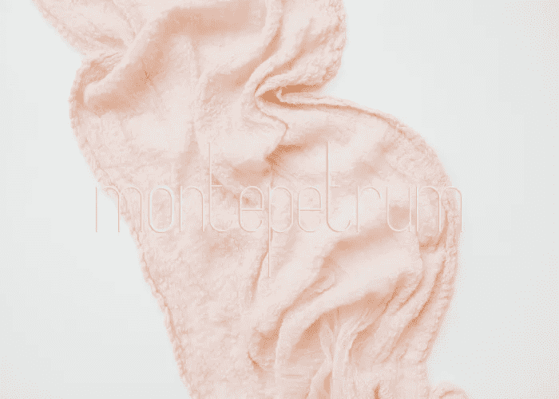

有三种粗细可供选择，Montepetrum 是一种无衬线字体，细线梦想是由。如果 [Lato](https://fonts.google.com/specimen/Lato) 、[生存之光](https://www.dafont.com/existence.font)或 [Alcubierre](https://thehungryjpeg.com/freebie/55841-free-font-alcubierre-typeface/) 都不起作用——试试 Montepetrum 也无妨。

# 16.[雨木](https://thehungryjpeg.com/freebie/69238-free-font-rainwood-typeface/Madiha/)

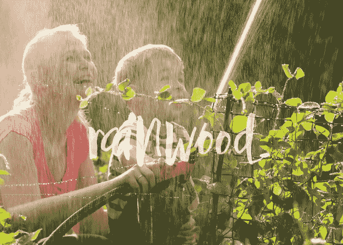

IanMikraz Studio 位于 Rainwood 之后，Rainwood 是一种手工笔刷字体，具有 232 个字形、52 个备选字符、两种风格备选、标准连字等等！

# 17.[维罗纳乐天](https://thehungryjpeg.com/freebie/66297-verona-lotte/Madiha/)

这种手写毛笔字体就是手写字体看起来那么好看的原因。

放大可以看到字母的不一致性，它看起来不像是假的，看起来像手工制作的字体。字母的粗糙使它更加优雅十倍。

# 18.[萨尔瓦多](https://thehungryjpeg.com/freebie/45477-free-font-salvador-condensed/Madiha/)

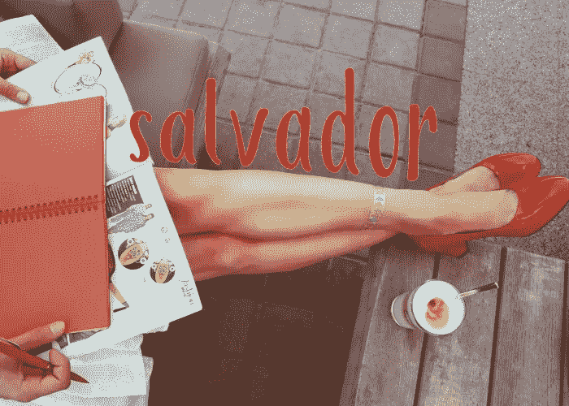

不同的厚度，微妙的手工细节，以及每个字母的轻微曲线，萨尔瓦多将是一个不断的最爱。

# 19. [Shellahera](https://thehungryjpeg.com/freebie/45474-free-font-shellahera-demo-typeface/Madiha/)

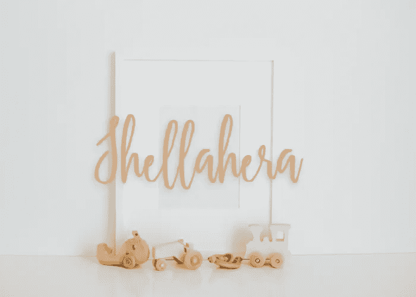

Shellahera 由毛笔制成，是一种漂亮的字体，基线可变。Lostvoltype 也有该字体的完整版本。

# 20.[怀尔德拉](https://thehungryjpeg.com/freebie/68684-free-font-wildera-a-display-typeface/Madiha/)

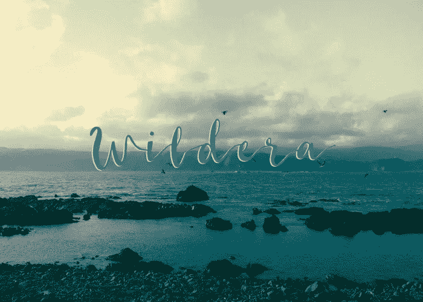

这个可爱的小字体有大写，小写和连字。华丽的装饰和精确的字距使它成为一种必备的字体。

# 21.[朱莉](https://thehungryjpeg.com/freebie/39783-free-joli-font/Madiha/)

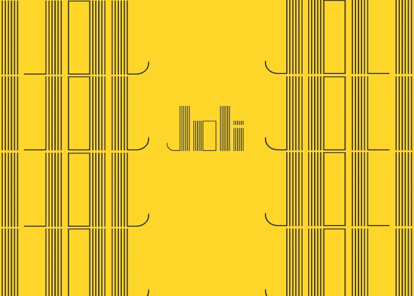

朱莉不是每个人都喜欢的。该字体的摩天大楼般的结构使它成为一个独特的选择。它非常流行和时尚。人们可以用它创造奇迹。

# 22.[卡诺](https://thehungryjpeg.com/freebie/106351-free-kano-font/Madiha/)

卡诺的独特之处在于几何边缘。卡诺看起来并不严肃和直率，而是有一种古怪的感觉。创新满分！

# 23.基尔维

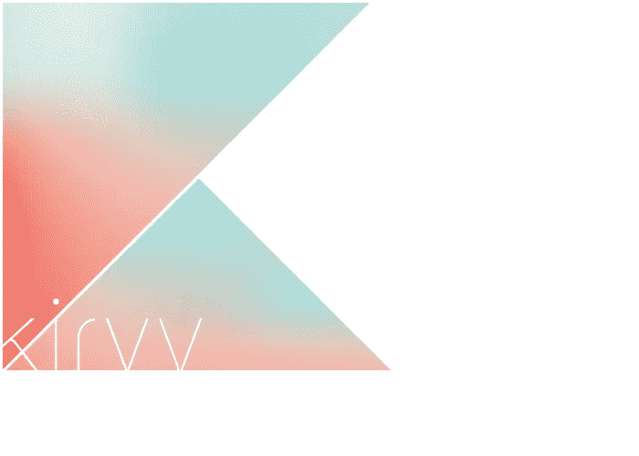

这种无衬线字体系列有四种粗细。它是直的，几何形状的，边缘圆润柔和。无论规模如何，都能完美运行。

# 24.[塞利玛](https://thehungryjpeg.com/freebie/39093-free-selima-brush-script/Madiha/)

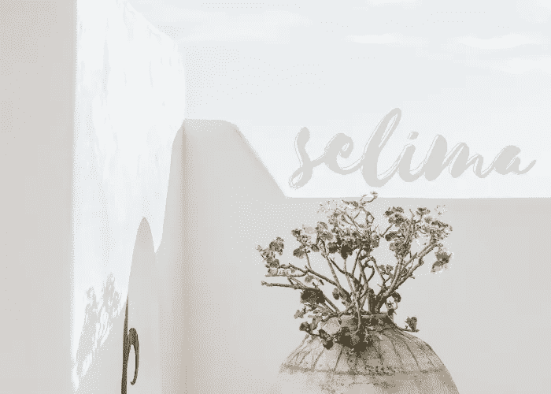

另一种毛笔字体。它带有粗糙的边缘，使文字看起来超级真实。这是一个大胆的一面，但它仍然保持了优雅和精致的外观。

# 25.[不计后果](https://thehungryjpeg.com/freebie/80468-free-font-reckless-brush/Madiha/)

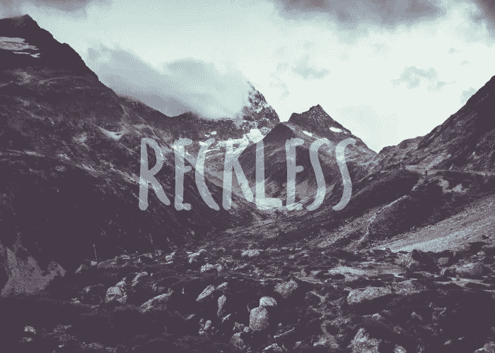

鲁莽是一种刷无衬线字体。这种直而略带斜体的字体纹理丰富。感谢 Nadi Spasibenko，他是这款字体的设计者。

# 26.[合成](https://thehungryjpeg.com/freebie/44828-free-font-synthesia/Madiha/)

Synthesia(或库中显示的 Flogreen)是一种窄边无衬线字体。它有一种复古的感觉，可以用在很多方面。

感谢阅读！