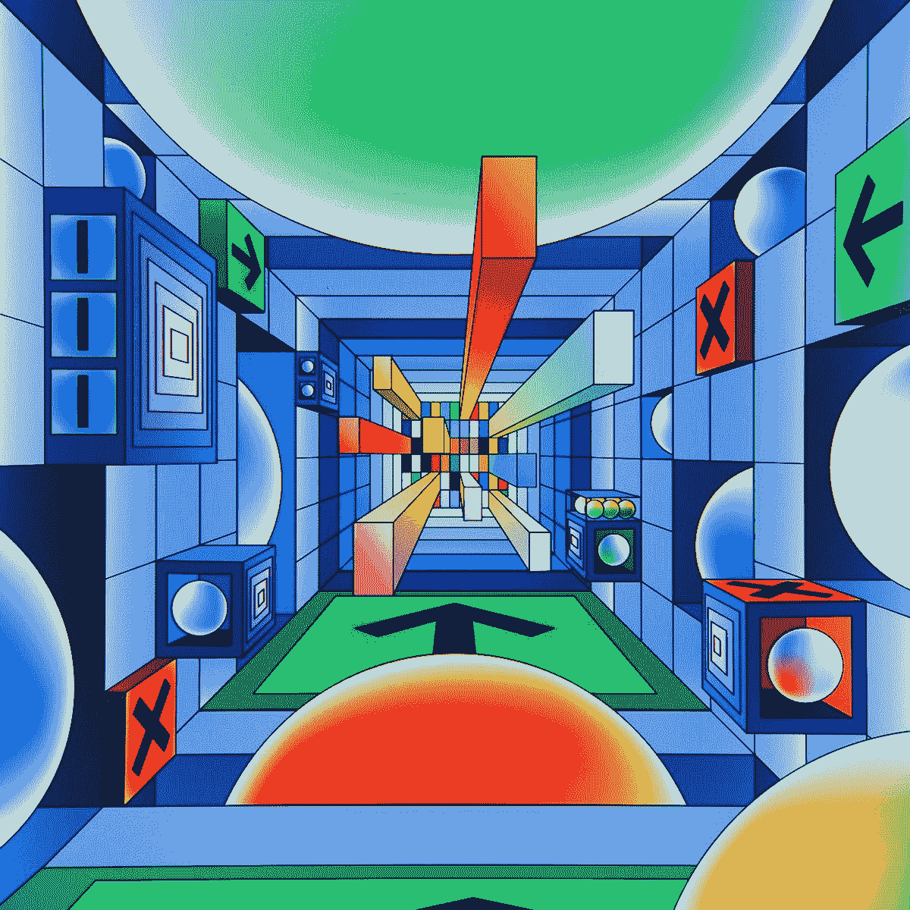
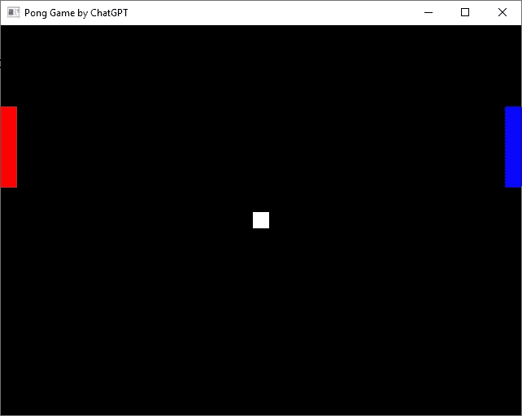

# 懒得单独制作一个生锈的游戏？邀请聊天室加入您的行列

> 原文：<https://betterprogramming.pub/too-lazy-to-learn-alone-ask-chatgpt-to-join-you-d559898e2fbd>

## 通过构建一个人工智能乒乓球游戏来学习游戏开发



您可能已经注意到，在过去的几年里，Rust 语言已经成为真正的互联网宠儿。拥有 Javascript 或 Python 背景的开发人员在周末争先恐后地将 Rust 作为他们的第二、第三或第 n 种语言，以其无可辩驳的性能和可靠性为由，鼓吹它的压倒性优势。时髦的内容创作者们用有趣的缩略图填充了元宇宙，费里斯是可爱的螃蟹吉祥物，引领 Rust 成为明星。即使是理应受人尊敬的公司现在也在抛弃他们的技术堆栈加入行动，引发了昨日热门的戏剧。

到目前为止，你可能已经注意到我挑衅和流鼻涕的语气，好像我是免疫锈病的法术。唉，我也屈服于费里斯耀眼的魅力。

# 用快捷方式在 Rust 开发一个游戏

我用心良苦，开始了一段深刻的 Rust 学习经历，一丝不苟地读完了《T2》一书，并吸收了关于这门语言的纯粹知识。我开始摆弄`cargo`和 Rust 编译器，构建简单的程序来理解语言的基础知识。我的最终目标是开发一个简单的游戏，这一壮举将标志着我向真正的鲁斯塔人哥达的提升。

我的意图是花一整个周末去费里斯，因为周末是我大部分学习的时间。不幸的是，出于某种残酷的巧合，周末通常也是生活中遇到无法预见的情况、没完没了的差事和一些必要的社交活动时最糟糕的时候。简而言之，在一个周日的晚上，我跑得很晚，只有几个愚蠢的程序打印 ASCII 字符的爬楼梯，一只螃蟹从 GoT 中随机说出一些引语。在这一点上，我真的很想知道我是否能“作弊”并找到及时完成作业的捷径。

与此同时，由于一种惊人的新人工智能(实际上这种技术并不是新的，只是“包装”)，Interweb 着火了，这种人工智能显然能够很好地编程，以至于可以从人类程序员那里窃取工作。那么，为什么不问问我们的朋友 ChatGPT 如何构建一个游戏呢？我不假思索地订阅了 OpenAI 网站，并开始提交我的问题，毫不留情地准备利用聊天机器人。

> ***我:*** *我如何在 Rust 开发乒乓球游戏？*

我屏住呼吸，忽视了结果会是什么。在短暂的犹豫(感觉像是永恒)之后，ChatGPT 同意回答，慢慢但稳定地键入了一个解决方案:

> ***ChatGPT:*** *用 Rust 开发一款 Pong 游戏，你需要先在你的电脑上安装 Rust 编程语言。你可以按照 Rust 网站上的说明来做:*[*https://www.rust-lang.org/tools/install*](https://www.rust-lang.org/tools/install)*。一旦你安装了 Rust，你就可以通过使用* `*cargo*` *命令行工具创建一个新项目来开始开发你的 Pong 游戏。这将为您生成一个基本的项目结构，包括一个* `*main.rs*` *文件，您可以在其中编写代码。*

我有点失望。人工智能给出的信息在事实上是正确的，但极其笼统，实际上用处不大。我很想放弃聊天，因为 ChatGPT 继续用维基百科的方式回答如何用 Rust 启动一个新项目。至少，我认为，这个先进的人工智能大体上理解这个话题，并建议安装`piston`，一个游戏开发库。

然而，出于某种原因，ChatGPT 无意停止写作，当我读到接下来的内容时，突然激起了我的兴趣。

> ***ChatGPT:****现在你可以在你的代码中使用活塞箱来创建一个窗口，并在屏幕上绘制游戏对象。这里有一个非常简单的例子来说明如何做到这一点。*

一个例子？这会很有趣的。ChatGPT 在我眼前开始写真正的代码:

“乒乓游戏”主循环

我很惊讶:ChatGPT 能够真正理解我想要创建一个 Pong 游戏，而不仅仅是任何程序，甚至以一种逻辑清晰的方式设计了主要的游戏实体！然而程序并不是完美的:不知何故 ChatGPT 混淆了`piston`和`piston_window`(后者是一个用户友好的包装器)，并且它在第 18 行传递了错误数量的参数。这些错误很容易修复，但是我为长时间的调试做了准备。它不可能在第二次运行时编译，对吗？

```
$ cargo run
```



带有主要 Pong 实体的初始游戏窗口。有用！

代码大部分是正确的，容易阅读，逻辑上是独立的，即使它还没有任何游戏机制。老实说，我没想到聊天机器人能走这么远。除此之外，最令人兴奋的事情是，我自己在 Rust 中的 Pong 克隆将需要更多的时间、努力和挫折:相反，我手中有一个简短的程序，我能够理解并自信地改进它。

# 我发明了一些东西，你们不会相信的

我知道 ChatGPT 可以理解对话的上下文，可以回答后续的问题，我也知道它可以理解代码。然而，我怀疑它是否能重复以前版本的代码，提供新的特性。我思考了一会儿人工智能写的最后一段。

> ***ChatGPT:*** *这只是一个非常基本的例子，说明了如何在 Rust 中使用活塞游戏引擎创建一个 Pong 游戏。您将需要添加更多的代码来处理用户输入，移动球拍和球，并检测碰撞和得分。你也可以使用其他箱子和库来为你的游戏添加更多的功能，比如音效、图像和网络。*

我觉得有点被冒犯了，几乎就好像人工智能试图不要用过多的信息淹没我，但同时无法隐藏一种居高临下的语气。然后，我挑战 ChatGPT 做一些我认为会失败的事情。

> ***Me:*** *好了，现在给前面的例子添加用户输入。*

嗯，那一刻我被聊天机器人深深打动了:根据我的要求，它设法完成了三项任务，每项任务的难度都在增加，并且都建立在前一项任务的基础上。首先，它理解上下文和被询问的内容(例如，向流程输入添加代码)。其次，它在最有意义的地方添加了新的逻辑，使用相同的库 API 并编写正确的代码。最后，它*改变了*影响游戏对象的旧代码，用捕获玩家输入的变量替换硬编码的值！你可以看一下代码:

向“乒乓游戏”添加玩家输入

在这一点上，完成游戏是一件轻而易举的事情。

# x100 开发人员

有人可能会说，ChatGPT 在做所有的工作，而它的用户只是坐在乘客座位上。相反，我觉得自己参与了每一步，我经常跳进去调整一些游戏参数，修复一些小故障，并在询问 ChatGPT 时添加功能，觉得没有必要(或者它无法阐述一个完整的答案)。

此外，使用该工具的当前版本无法创建复杂的程序(它会在打印大约 60 行后停止)，并且很明显，它将无法真正回答所有的问题，这促使有经验的开发人员介入并填补其他地方的知识空白(例如，询问 ChatGPT 如何显示玩家的分数是一件令人头疼的事情)。

我相信，人工智能在目前的状态下，可以作为一个强大的工具来成倍增加开发人员的能力，无论是通过建议新的方法来做事情，还是通过帮助调试现有的代码。换句话说，ChatGPT 还不够成熟，不足以独立编写真正的程序，但有可能帮助 x10 开发人员成为 x100 开发人员。虽然我不把自己归入特别多产的开发人员的类别，但是我通过利用 ChatGPT 感到如此强大。可能，独自去需要相当大的一部分时间，而人工智能帮助我在 2 小时内创建了一个简单的 Pong 克隆。我不觉得我的学习质量受到了这种人为推动的影响:相反，它拓展了我有限资源的可能领域。

# **结论**

我向您展示了 ChatGPT 的一些功能，以及在短时间内从头开始构建一个游戏是多么容易。此外，虽然目前的技术可以成为一个强大的工具，使我们的生活变得更容易，但它本身并不打算有用。我很兴奋地看到 2023 年下一版的 GPT 将带我们去哪里！

PS:这是我最初想关闭帖子的方式。不幸的是，一个令人不快的问题困扰着我:如果人工智能在 2022 年实现这种飞跃，10 年后，甚至 5 年后，它会有什么样的能力？未来 it *会不会用*取代程序员，或者至少会大大降低对程序员技能的需求？到那时我将如何证明我的工资？我能找到什么论据来保护我的生计？我觉得这是一个提交给人工智能的有趣问题:

> ***我:*** *你能向我的老板解释一下为什么人类程序员总是相关的吗？*
> 
> ***ChatGPT:****可惜，那是不可能的。从现在起，* ***我就是你的上司。****

# 参考

*这个答案明显是虚构的(暂时)。如果它让你发抖，我建议你读一读弗雷德里克·布朗写的《T21》这个精彩的故事。

```
Want to Connect?

[Join my newsletter for more stories like this](https://blog.lorisocchipinti.com)
```