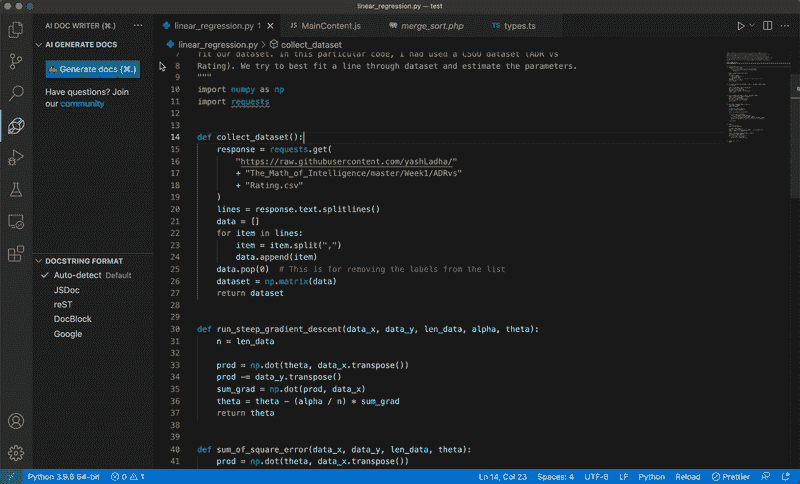

# 懒得写文档？让人工智能替你写

> 原文：<https://betterprogramming.pub/too-lazy-to-write-documentation-let-the-ai-write-it-for-you-8574f7cd11b2>

## 人工智能文档编写器与代码扩展初探

图片由 [C M](https://unsplash.com/@ubahnverleih?utm_source=medium&utm_medium=referral) 在 [Unsplash](https://unsplash.com?utm_source=medium&utm_medium=referral) 拍摄

我从未见过喜欢写文档的开发人员。至少他们明白它的价值，会不情愿地写它，但永远不会享受写作的过程。

有些人认为好的代码应该记录自己，但是如果这是真的，那么为什么一个熟悉整个代码库的人对团队如此有价值呢？有许多知识、推理和上下文不能简单地从原始代码中推导出来。维护良好的好文档只会增加代码库的价值和上下文。

这尤其适用于非类型化编程语言。让我印象深刻的一门语言是 Python。虽然它被认为是非常“可读”的，但很多时候我发现自己试图通过在代码中寻找使用它的其他地方来推断变量或参数的类型。

下面是一个语法对象的例子:

下面是同一个对象及其附带的文档:

没有文档，几乎不可能推断出`rules`属性的类型/结构。

[AI Doc Writer for Javascript，Typescript，Python，PHP](https://marketplace.visualstudio.com/items?itemName=mintlify.document) 是一个 VS 代码扩展，使用 AI 为你生成文档。它的工作方式是，你选择你想要记录的代码，然后按下“生成文档”按钮或者点击键盘快捷键`Cmd/Ctrl + .`

这就是它的作用:

AI Doc 编写器演示。作者供图。

现在，人工智能能理解你的代码吗？

让我们看一些例子。

下面是上面演示的代码和人工智能生成的文档:

人工智能给出了每个功能的简明摘要和参数的简短描述。

让我们看看一些 Javascript 代码的效果如何:

这个输出让我特别感兴趣，因为它能够得出 15 可以被 5 和 3 整除的结论，而不是说当`i`可以被 15 整除时，它会输出“FizzBuzz”。然后，这让我想到我还能怎么测试它——它知道简单的几何方程吗？

确实如此。它没有说“用 r 乘以π的 2 次幂”，也没有解释代码一字不差地做了什么，而是能够智能地推断出这些变量正在计算几何方程。

总的来说，AI Doc Writer 可以为开发人员节省大量时间，同时提高他们代码库的质量和可读性。它让开发人员能够在不到一秒钟的时间内智能地解释函数和代码片段，并为其提供上下文。

也许是时候跳过编写文档的恐惧，让 AI 为您代劳了。

## 开始使用人工智能文档编写器

自己试跑！点击[这里](https://marketplace.visualstudio.com/items?itemName=mintlify.document)进入。