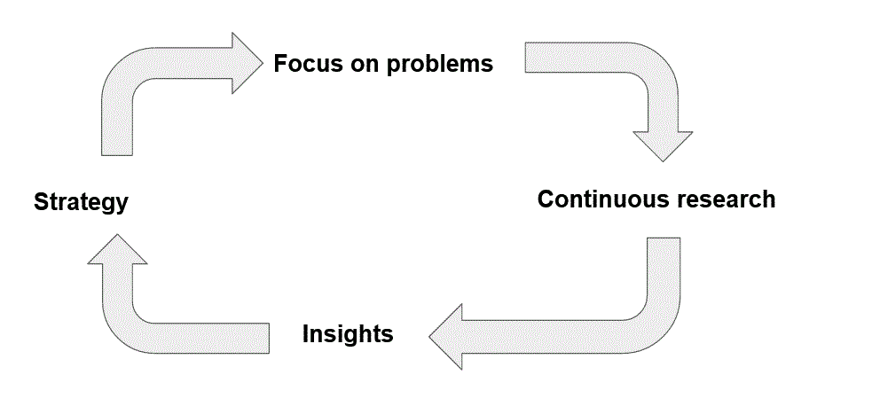

# 过多的产品路线图可能会要了你的命——这里有一个更好的策略

> 原文：<https://betterprogramming.pub/too-much-product-roadmap-may-kill-you-heres-a-better-strategy-a383823d53f5>

## 不要做特色工厂。相反，获得授权

照片由 [slon_dot_pics](https://www.pexels.com/photo/model-figure-standing-on-map-408503/) 从 [Pexels](https://www.pexels.com/) 拍摄。

> “我向你保证，你的路线图上至少有一半的想法不会实现你的愿望。(顺便说一句，真正优秀的团队假设至少四分之三的想法不会像他们希望的那样执行。)”—马蒂·卡甘，《灵感》(第二版)，第 19 页

Marty Cagan 对传统软件产品路线图的批评对许多人来说是违反直觉的。为了理解它，我们需要理解 Cagan 的产品管理哲学。Cagan 的方法解决了软件行业面临的一个大问题:功能工厂问题。

卡甘强调了科技公司[最具创新性的公司](https://svpg.com/best-vs-rest-faq/)的运营方式与导致许多公司成为功能工厂的运营模式(大量生产功能，却不知道它们是否为客户服务)之间的差异。让我们试着理解这种差异的本质，以及做出这种改变涉及到什么。

# 从功能工厂到授权产品团队

> “你可以发布你想要的所有特性，但是如果它不能解决底层的业务问题，你就没有真正解决任何问题。”— *马蒂·卡甘，*灵感(第二版。)，第 137 页

决定构建什么是软件中风险最大的部分。我们被自己的想法冲昏了头脑，忽视了它们的风险。路线图放大了这种风险。在我们知道这些想法是否可行之前，我们会试着提前说出我们要做什么。

我们知道我们应该利用常规的用户反馈来充分利用敏捷，但是计划的需要驱使我们说出我们将用最少的反馈构建什么。我们用各种方式告诉自己这是可以的:

*   借口 1:想法最初来自用户(不幸的是，用户也有不好的想法或者表达不好)。
*   借口 2:我们稍后会得到反馈(此时我们已经付出了努力，并转移到了其他事情上)。
*   借口 3:我们遵循方法论 X(但是我们真的在用它来帮助我们实现有意义的创新和满足我们的商业目标吗？).

大问题不在于我们有需要修改的想法。问题是我们把这些想法写在纸上，然后宣布我们正在做。然后我们会被这些想法束缚住，最终无论如何都会坚持下去。

让我们确切地了解这最终会造成多大的损害，然后看看另一种模型，在这种模型中，团队被授权去试验他们实现业务成果的方式。

# 路线图的微妙风险

> “问题是，每当你在一份名为‘路线图’的文件上列出一系列想法时，不管你在上面写了多少免责声明，公司上下的人都会把这些想法理解为一种承诺。”—马蒂·卡甘，灵感(第二版。)，第 111 页

大多数路线图都是建议解决方案的列表。他们按照提议开始，但是路线图被共享，人们投入其中，提议被锁定。所以我们被困在可能行不通的想法中。

卡甘讨论了[关于产品](https://svpg.com/the-inconvenient-truth-about-product/)的两个难以忽视的事实:

1.  大多数最初的产品想法都没有成功。
2.  即使想法确实可行，通常也需要多次迭代才能从中获得价值。

大多数路线图没有反映这一现实。所以，如果你把工作分成几个冲刺阶段，努力做到敏捷，这并不重要。您已经被锁定在无法提供价值的解决方案中。

让我们真正理解为什么最初的产品创意如此危险。然后我们就会明白这种天真对组织的影响，以及如何更好地规避产品创意中固有的风险。

## 为什么我们会选择解决方案

> “值得注意的是，在绝大多数公司(不是那些擅长产品的公司)，实际的产品团队自己并不做太多的构思。这是因为真正发生的事情是，想法已经以产品路线图上优先功能的形式交给了产品团队，其中路线图上的大多数项目要么来自大客户(或潜在客户)，要么来自公司利益相关者或高管。不幸的是，这些很少是我们所寻求的想法的质量。”—马蒂·卡甘，灵感(第二版。)，第 208 页

我们大多数人都知道过早解决问题是危险的。我们知道我们应该收集用户反馈，并根据数据做出决策。但是很容易忘乎所以。

让我们想象一下，一个客户抱怨他们在我们应用程序的某些页面上迷路了。我们可以很容易地想象，有人从这个问题跳到想要用交互式弹出窗口来构建一个交互式帮助系统。可能是支持人员或客户自己。但是帮助系统只是一个提议。更好的页面设计可能是更好的解决方案或者更好的文档。往往需要一些调查才能发现。

不幸的是，我们很少喜欢把一个项目放在路线图上，说“提高 X 页面的可用性”相反，即使必要的调查还没有完成，也倾向于在路线图上找到它的方法的是一个解决方案提议。

技术人员也不能幸免于这种解决方案。对于工程师来说，往往是很酷的新技术让我们看不到其他选择。酷技术被赋予了许多想象中的好处(例如灵活性或性能)，这些好处可能会实现，也可能不会实现，对用户来说可能有也可能没有很大的价值。

管理层同样也不能幸免。对于管理者来说，有一种被自由使用的诸如“平台”、“统一系统”或“简化的体验”等难以捉摸的词汇所欺骗的趋势。这些词语被附加到解决方案提案中。这些含糊不清的词语暗示了好处，但没有具体说明积极的结果是什么，或者特定的解决方案将如何实现这些好处。它们成为不仔细检查解决方案及其风险的借口。

这很难抗拒。即使是最好的团队也会有一些解决方案。但是最好的团队也会认识到这一点并加以纠正。他们将风险评估视为产品流程的一个连续部分——而不是在需要路线图时匆忙完成和争夺的东西。路线图是功能工厂破坏性文化的核心。

## 特色工厂的破坏性文化

> “优秀的团队知道，他们最喜欢的许多想法最终不会为客户所用，即使是那些可以为客户所用的想法，也需要多次迭代才能达到他们想要的结果。糟糕的团队只是构建路线图上的东西，并满足于满足日期和确保质量。”—马蒂·卡甘，灵感(第二版。)，第 313 页

当然，没有人会被一个特定的想法所束缚，当它进入路线图草案的时候。我们可能会把“帮助系统”放在路线图上，并对自己说，“这可能是修复可用性问题的任何东西。”但之后我们必须说服公司里的其他人，这已经足够重要了。分配给它的时间可能会受到挤压，以确保它被包括在内。然后，公司领导将开始展示路线图，并告诉每个人该产品的发展方向。很快，每个人都有了一个帮助系统的图片——而不是可用性问题。

当人们必须倡导路线图项目时，他们会投入其中。当资深人士鼓吹某件商品时，人们会变得不愿意挑战它们——尤其是如果挑战一件商品还会产生连锁反应，并可能会影响交付日期的话。

于是公司变成了一个功能工厂。人们庆祝的是交付功能，而不是解决问题。没有人检查这些特性是否给客户带来了预期的好处，甚至没有人检查它们是否解决了客户的关键问题。开发人员只是交付路线图所说的内容，而没有任何实验。

这也是关于公司对生产力的看法。人们很容易把生产率理解为*产出*。查看交付的特性数量和达到的里程碑是查看产出的典型案例。衡量产出比衡量结果更容易。但是产出本身没有什么价值。

重要的是*的结果*。我们在为客户解决什么问题？我们如何测试客户现在是否从我们这里获得了更多的价值？最具创新精神的公司围绕这些结果来组织他们的工作。

# 授权团队模式

> “如果你只是用你的工程师来编码，你只能得到他们价值的一半。产品中的小秘密是，工程师通常是创新的最佳单一来源；然而，在这个过程中，他们甚至没有被邀请参加聚会。”—马蒂·卡甘，灵感(第二版。)，第 20 页

没有人想成为一个功能工厂，但许多人看不到将功能放在路线图上的替代方案。但是有一个方法。我们可以根据问题而不是解决方案来制定计划。我们可以留下实验的空间。我们可以在实施解决方案之前降低风险。我们可以构建我们的方法来鼓励实验和与客户/用户的合作。

让我们了解授权团队模式是如何工作的。其主要特点是:

1.  团队对客户问题进行持续研究。
2.  在团队内部和整个组织内分享研究成果。
3.  基于洞察力的明智策略。
4.  目标以结果而不是产出为中心。

## 授权意味着什么

> “仅仅让强壮的人拥有现代工具和技术是不够的。产品团队需要具备必要的*业务背景*。—马蒂·卡甘，灵感(第二。ed)，第 116 页

有些人谈论授权，好像这意味着工程师可以做他们想做的任何事情。没有路线图，没有结构。只是工程师想写什么就写什么。这不是授权。

授权意味着给工程师所需的背景和方向，让他们看到大问题是什么。这意味着建立结构，以便产品团队能够[与他们的客户持续协作](https://svpg.com/continuous-discovery/)。这意味着在团队层面尝试解决方案，并保持顶层规划专注于问题。

这种工作方式有一个良性循环。战略指导团队关注哪些客户问题。团队更多地了解他们的客户，并收集关于他们面临的问题的数据。这有助于制定可能的解决方案，供用户试用。它还能带来洞察，为未来的战略提供信息。

图片由作者提供。 [CC BY-SA](https://creativecommons.org/licenses/by-sa/2.0/) 。

良性循环有助于使授权产品模型如此有效。这也使得组织很难看到如何向它前进。各个层面都需要变革，而不仅仅是路线图(尽管路线图是核心)。

## 授权产品团队的工作方式

> “优秀的团队从他们的愿景和目标中获得灵感和产品创意，从观察客户的斗争中获得灵感和产品创意，从分析客户使用其产品产生的数据中获得灵感和产品创意，并不断寻求应用新技术来解决实际问题。糟糕的团队从销售和客户那里收集需求。”—马蒂·卡甘，灵感(第二版。)，第 312 页

一个被授权的产品团队不仅仅是一个开发团队，而且不会把所有的时间都花在编码上。该团队的目标不仅仅是提供特性。它还旨在发现如何最好地解决客户问题。

产品发现是授权产品团队的一个关键优势。产品发现的关键目标是选择最佳解决方案来解决手头的问题，因为总是有许多不同的功能和实现方式可供选择。

产品发现可以被视为一个去风险的过程。产生想法通常是比较容易的部分(尽管不太容易，而且有[技术来帮助](https://medium.com/agileinsider/what-lies-beneath-the-world-of-product-ideation-da2e8bc9da23))。更难的部分是过滤出价值最高的想法，并加以提炼，使其可行。为此，我们需要了解如何对想法进行批评，以及它们如何可能无法如我们所愿地实现。我们必须暴露他们周围的风险。

Cagan 将软件解决方案的风险分为[四类](https://svpg.com/four-big-risks/):

1.  *重视风险。*客户不得不购买或者用户不得不选择使用。否则就不应该在产品里。
2.  *可用性风险。有些功能提案在纸面上很棒，但对客户来说太复杂了。*
3.  *可行性风险*。组织有能力在可接受的时间内交付它吗？
4.  *商业生存风险。*对于更广泛的组织来说，实现这一目标是否可行？例如，它会与其他产品竞争吗？

产品管理层应带头确保评估这些风险。对一些人来说，这意味着从其他功能中收集观点(例如，可用性风险设计)。最大的问题是价值风险。这是没有真正解决客户问题的风险。要很好地应对这种风险，你必须做好适合关键问题战略背景的[产品研发](https://svpg.com/discovery-judgement/)工作。这不仅仅是事后的想法或者偶尔发生的事情。它应该是产品工作的一个连续部分，与交付和你如何构建客户关系交织在一起。

好的产品发现可以采取不同的形式。根据环境是 B2C(消费者)还是 B2B(企业),评估价值风险会有很大不同。

对于 B2C 环境，这可能意味着与用户进行焦点小组讨论。或者这可能意味着在特性上运行 A/B 测试。您可能有来自产品使用统计或所报告问题模式的背景证据。

对于 B2B，有可能与客户密切合作。你可以[绘制原型](https://svpg.com/flavors-of-prototypes/)并向客户寻求反馈，而不是告诉客户他们将得到什么或者让客户询问功能。看看他们更喜欢哪个选项。询问他们的主要问题是什么，以及他们是否认为这些建议能够解决他们的问题。锁定你最合适的客户，并要求与你试图解决其问题的人交谈。

这并不是说一切都应该以客户为导向。关键在于，如果你*向正确的人*提出正确的问题，那么在构思之前向客户展示你的想法是降低这些解决方案风险的理想方式。请记住，如果你向客户提供解决方案，他们不太可能说不。客户不使用该功能的风险是你的，而不是他们的。未使用功能的成本是您将在维护和理解所有膨胀的开销中支付多年的费用。

## 愿景和战略

> “优秀的团队有令人信服的产品愿景，他们以传教士般的热情追求这一愿景。烂队就是雇佣兵。”—马蒂·卡甘，灵感(第二版。)，第 311 页

产品愿景有多种用途。它将整个公司的利益相关者联系在一起。它为产品团队提供了清晰度。它作为一种招聘工具来吸引受产品概念启发的人才。它可以帮助制定客户的价值叙述。

典型地，[产品愿景](https://www.productplan.com/glossary/product-vision/)被表述为简洁描述产品及其目标的几句话。它由一套产品原则补充，这些原则更详细地说明了产品的性质、目标客户以及最重要的是什么。这对于为优先顺序决策提供信息非常重要。

产品愿景不会凭空出现。它以研究为基础，是对当前市场状况的回应。随着这些条件的变化，愿景也将发生变化，但它通常着眼于几年的时间范围。

*授权*建议超越书面愿景陈述，使用*愿景类型*。这些视频以引人注目的方式记录了你希望产品成为的样子。svpg.com 网站(由*授权*作者维护)[给出了例子](https://svpg.com/examples/)。

visiontype 的一个关键优势是它可以满足潜在客户，否则他们可能会要求一个具体的路线图。通常，当一个企业购买一个 B2B 产品时，他们购买的是该产品的未来以及它现在的功能。visiontype 可以让他们感觉到产品在未来会给他们带来什么，并说服他们加入你的旅程。

战略着眼于不到一年的较短时间范围。它是关于专注于你认为对你的产品成长特别重要的特定问题领域。这需要一套有重点的举措(大约五个)。如果有太多的计划，没有一个会得到足够的关注。[必须权衡](https://svpg.com/product-strategy-overview/)在产品增长的这个阶段应该关注哪些领域。

战略应该基于洞察力。你应该研究竞争对手和技术趋势。你应该分析来自客户和市场调查的数据。你需要吸收这一点，并做出明智的猜测，在哪里可以找到最大的价值。

## 路线图上的 okr

> “你不能让你的旧组织基于功能团队、路线图和被动的经理，然后覆盖一种来自完全不同的文化的技术，并期望它会工作或改变任何事情。”——马蒂·卡甘和克里斯·琼斯,《赋权》,第 272 页

okr 现在相当受欢迎，T2 授权 T3 推荐它们也就不足为奇了。许多公司认为 okr 相当容易。理论上，设定一个目标(如“显著减少新客户上线所需的时间”)和一个关键结果(如“平均入职时间少于三小时”)看起来足够简单但对于功能工厂公司来说，从 OKRs 获得价值并不容易。

如果你没有进行持续的产品发现，那么你可能不会有设计好的 okr 所需的洞察力。你不知道客户在努力解决什么问题(无论是在你的产品中还是在它的总体空间中)，也不知道这些问题如何被框定为机会。你可能没有关注结果所需的数据。那么关键的结果就是特性的交付。但这只是一个路线图，并没有抓住要点。

okr 应该是战略性的。它们抓住了我们将集中精力创造价值的问题领域，而路线图更像是遗愿清单。这并不意味着我们应该双管齐下。*授权*建议使用 okr 进行季度规划*而不是*路线图。

除了缺乏最佳使用 okr 所需的洞察力和数据收集，功能工厂公司往往以错误的方式接近 okr。okr 被视为[管理层生产的东西，然后逐级向下](https://svpg.com/team-objectives-overview/)。相反，OKRs 应该是一个谈判。设定顶级目标，然后团队和管理层一起工作，看看哪些团队可以实现哪些目标，以及团队在一个季度内要做什么是现实的。

你需要[首先做发现和战略工作](https://svpg.com/team-objectives-overview/)并为授权构建你的团队。那么你就可以从 OKRs 中获得最大收益。在*授权*、中有一个详细的例子，但是我们在这里没有足够的空间来涵盖它。

重点不是 okr 很棒。它们甚至不是用更有力的方法取代路线图季度规划的唯一方法。例如，YouTube 决定反对 OKRs 的季度节奏，而是采用六个月和六周的大小计划周期。

## 领导的角色

> “说这些公司中的大多数产品战略薄弱是不公平的，因为事实上，大多数公司根本没有战略。他们只是试图用他们所拥有的人力、时间和技能来取悦尽可能多的利益相关者。”——马蒂·卡甘和克里斯·琼斯，增强能力，第 4 页

许多人认为敏捷意味着更少的管理。Cagan 认为这应该意味着更好的管理。在授权团队模型中，我们可以看到[许多管理角色](https://svpg.com/product-leadership-is-hard/):

*   制定业务目标(公司使命)以及实现产品愿景和进一步实现这些目标的战略步骤。
*   从各种类型的研究(市场和用户研究、竞争对手分析、产品反馈、技术趋势等)中收集见解。)并将其转化为战略举措。
*   帮助团队了解他们的工作和挑战如何融入整体——让背景和*为什么*的问题变得清晰。
*   确保[团队有最好的结构](https://svpg.com/factors-in-structuring-a-product-organization/)来拥有所有权并管理他们的问题领域。
*   清除障碍，化解政治。
*   确保授权结构到位(如焦点小组、用户研究、客户委员会、团队拓扑)。
*   为公司配备授权的工作方式。
*   在公司内部发展技能，从模型中获得最大价值。

最后几个经常被忽视，但在授权团队模型中尤为重要。我们要求团队练习各种各样的技能，并超越各自为政。很难雇用已经这样工作的人，因为许多公司不这样工作。这不是一个简单的技能，可以简单地掌握，然后练习。*赋权*强调教练文化是一种让每个人都能不断提高技能的方式。

# 如何获得授权

你现在可能会想，“这听起来很棒。我是怎么做到的？”当然，这并不容易，这篇文章不可能涵盖*启发*和*授权*做的所有事情。这里有一些提示，解决了如何应用这些想法的一些障碍。

## 没有放之四海而皆准的方法

*赋权*声称最具创新性的科技公司共有的是“技术的角色，从事技术工作的人的目的，以及他们期望这些人如何合作解决问题”(第 6 页)。尽管主题相同，但它承认顶级公司之间存在许多差异。

公司之间的一些差异也不是偶然的。例如，你如何进行持续的发现，将取决于你的商业模式和你的市场。如果你向企业销售，那么你可以与特定的客户建立非常密切的关系。企业为产品支付了很多钱，有些企业愿意与你合作来塑造它的方向。从消费者那里获得洞察力更加间接。然后你更加依赖分析、用户焦点小组和市场研究。

很好地应用 OKRs 可能是最难完成的事情之一。正如我们所看到的，要对战略计划做出明智的选择，需要很多背景知识，如果没有收集数据的文化，很难很好地制定关键结果。跨团队应用 okr 也存在挑战。

例如，平台团队提供的支持服务被其他团队的服务所消费。因此，平台团队对客户互动有间接影响，他们的 okr 通常需要与其他团队共享。如果你的组织平台过多，那么这会使 OKRs 更难申请。

有了 OKRs，根据你的情况调整技巧会很有用。如果你还没准备好做数据驱动的关键结果，那就接受吧。关键的一点是避免在你知道什么有效之前就给团队开出解决方案。所以一个过渡的方法可以是指定团队将要工作的主题。关键结果不是基于简单地交付功能，而是从功能中获得有意义的反馈或分析(并意识到发现用户不喜欢当前形式的功能是一种胜利)。

*灵感启发*讲述了一个团队模型，每个团队中都有一名产品经理和一名 UX 设计师，他们与团队领导和团队其他成员(尤其是团队领导)一起工作，不断探索。这种模式需要适应环境。一些团队没有 GUI，可能从 UX 设计师那里获得的价值更少。平台团队往往需要更侧重于技术的产品管理技能。有些团队规模太小，不值得让所有这些人担任专门的角色。

## 克服概念障碍

采用【T2 授权】理念的最大挑战之一就是理解它有多么不同，以及为什么这些不同很重要。对软件交付的既定态度会变得非常深刻。正如*授权*所说(第 4 页):

> “以我的经验来看，不是这些公司*不想*转型，而是转型是*难*，他们只是不知道*如何*。甚至不知道*转变的真正含义是什么。*

本着这种精神，以下几点可能会让你突破概念障碍:

*   任何利益相关者都没有权利获得他们所要求的特性。每个人都有责任解决关键问题，但不是规定如何解决。
*   数据胜过观点。甚至你的意见。
*   工程需要解决问题，而不是提供功能。
*   花在产品发现上的时间就是在交付和维护无用功能上节省的时间。我们总是低估维护成本以及它们如何增加新功能的成本。
*   研究不是白费力气。从长远来看，它能拯救你。
*   开发人员不能做所有的研究，但他们应该参与进来，并能做出重要的贡献。
*   在你了解背景之前，结果很难确定。
*   根据结果来判断自己。重视你避免了多少无用的维护负担——而不是你交付了多少功能。
*   研究为战略提供了信息。如果你不做持续的研究，那么就很难真正制定策略。
*   不要认为处理和优先处理请求就足够了。你需要找出并分析高质量的反馈。收集数据，做市场调查，从你所学到的东西中制定策略。
*   数据胜于观点，但确实需要解读。这不仅仅是数字的问题。也重视定性反馈。
*   当你已经有了可以交流的用户(尤其是 B2B)时，“我们做一些原型制作”是不够的。你可以每周多次分享低保真度的原型。
*   遵循“敏捷”过程是不够的。没有一个过程能为你把创新装进瓶子里。
*   不时需要高度诚信的承诺(有日期和细节)。
*   你必须保持灯亮着。最重要的事情并不总是需要创新。

## 改变组织

对这篇文章来说，在组织中实现变革是一个太大的主题。我们将不得不用更多的指针:

*   我们正在谈论组织变革。这意味着领导层必须理解并相信变革，才能充分发挥作用。
*   有了远见和发现，就有了先有鸡还是先有蛋的局面。你想要一个愿景来指导发现，你想要洞察力来通知愿景。接受可能会有一些迭代。
*   意识到信号的力量。你可能需要继续做一段时间的路线图，但是你可以用减少损失的方式来组织和讨论它们。
*   看看你在组织中与客户互动的每个地方，以及客户是如何使用你的软件的。问问你是否在收集所有这些方面的数据，你是否把这些数据整理成可以分析的形式。
*   文化变革不需要大规模的员工变动。相对较少的关键雇员可以带来很大的不同。来自高层的信号会带来更大的不同。
*   小心改变音调。持续改进的语气比需要解决问题的语气更有可能建立盟友。
*   透过表面看。你可能会发现已经发生的发现工作比你想象的要多。
*   你不能一下子改变一切。选择那些可以实现并能带来改变的领域。

最后，在寻找需要关注的关键事情时，这里有一条来自*授权*的重要建议(第 390 页):

> “在你的授权团队之旅中，如果我必须从整本书中挑选一个概念，我希望你会铭记在心，那就是*授权工程师*的想法……授权工程师意味着你为工程师提供*要解决的问题*和*战略背景*，他们能够利用技术找出*问题的最佳解决方案*。”