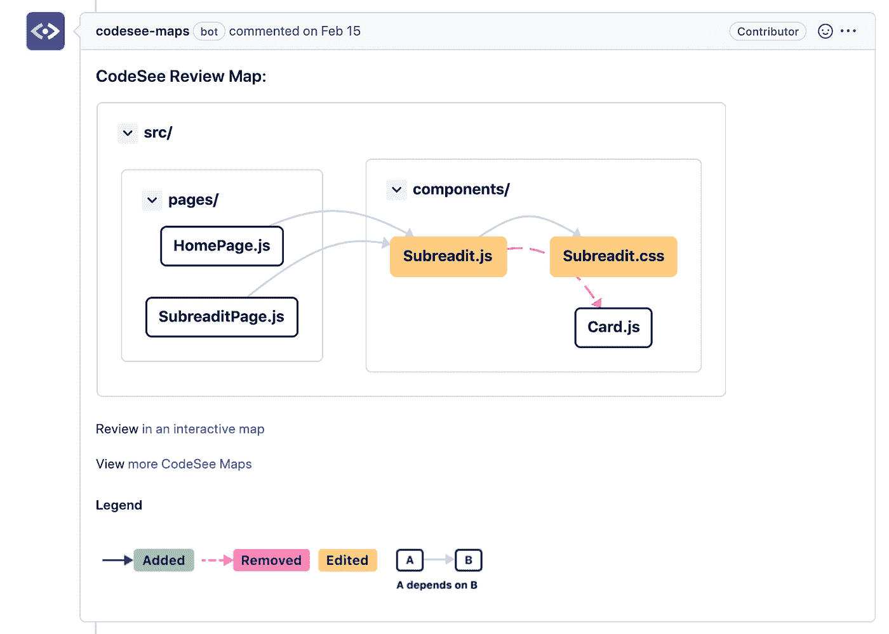
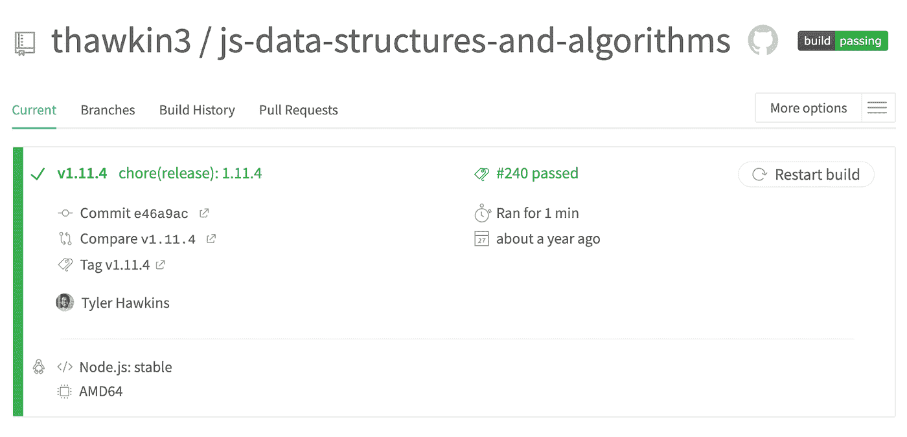
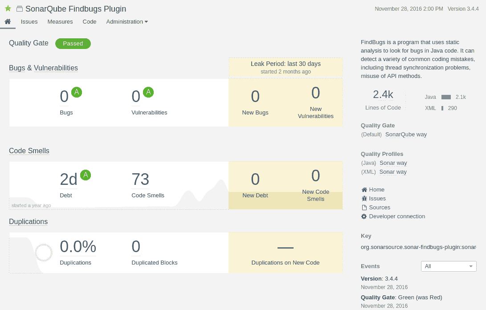
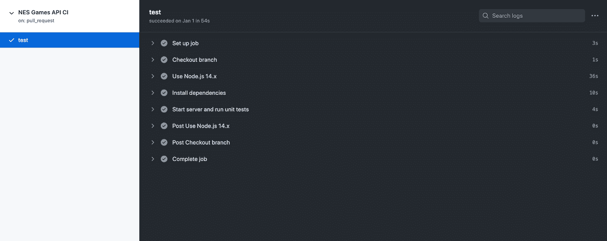

# 显著改善 GitHub 中代码审查的工具和集成

> 原文：<https://betterprogramming.pub/tools-and-integrations-to-significantly-improve-code-review-in-github-b6cb67014fea>

## Travis CI、CircleCI、Codecov、SonarQube、CodeSee、GitHub Actions 等等

代码查看有关拉取请求的查看映射示例

作为软件工程师，我们喜欢自动化。然而，代码审查通常是一个相当手工的过程，占用了我们很大一部分时间。我们如何改善这一点？有大量的[提示和技巧](/7-ways-to-dramatically-reduce-your-time-in-code-review-febe05e9f38c)可以让[有效地进行代码评审](https://google.github.io/eng-practices/review/)，所以我们在这里就不赘述了。相反，让我们专注于我们可以自动化的代码审查部分。

在本文中，我们将考虑五种工具和集成，它们可以显著改善您在 GitHub 中的代码审查体验。

# 特拉维斯 CI 或 CircleCI

首先，我们来谈谈持续集成(CI)。为您的 repos 设置 CI 是自动化代码审查流程的第一步。有了 CI 管道，您可以运行任何您想运行的东西！至少，您应该让您的 CI 管道包含格式化、林挺和单元测试的工作。您还可以考虑创建额外的工作来构建工件，部署评审应用程序，或者运行端到端测试。

持续集成有助于您保持主分支处于良好状态。它还通过处理计算机擅长而人类不擅长的所有繁琐的事情来加速您的代码审查过程。在代码评审期间，不再为代码风格或最佳实践争吵不休！有了 CI 管道，您可以为您创建的每个新的拉请求运行自动检查。

Travis CI 示例

[Travis CI](https://www.travis-ci.com/) 和 [CircleCI](https://circleci.com/) 都是持续集成的绝佳选择。两者都允许您使用 YAML 文件配置 CI 管道，使您能够将基础设施编写为代码。在 YAML 文件中，您可以指定要使用哪个 Docker 映像、要运行哪个版本的节点，以及要遵循哪些安装和构建步骤。

最棒的是，Travis CI 和 CircleCI 可以免费用于开源项目。

# 笑话和代码

接下来，我们来看看测试覆盖率。单元测试很重要。它们有助于防止倒退，作为您的代码库的活文档，并使您能够自信地进行更改。

测试很容易在 CI 管道中实施。如果有任何测试失败，测试作业就会失败，并且在修复测试之前，拉请求不会被合并。

重要的不仅仅是你的测试通过，还有你的代码覆盖率高。通过只覆盖 20%代码库的测试并不能保证在进行任何给定的更改后，其余 80%的代码库处于良好的状态。更高的代码覆盖率意味着更少的 bug 藏身之处。

像 [Jest](https://jestjs.io/) 这样的测试框架允许您收集代码覆盖率结果，并强制执行某些代码覆盖率阈值。如果您想让这些覆盖报告更进一步，您可以在您的 CI 渠道中添加一个像 [Codecov](https://about.codecov.io/) 这样的工具。

Codecov 获取 Jest 的数据，并将其转化为您可以在 pull 请求中内联查看的报告。Codecov 可以让您深入了解如果覆盖率增加或减少，每个 pull 请求如何影响整体覆盖率，以及哪些文件受到了影响。Codecov 很容易集成到您可能使用的任何 CI 工具中，无论是 Travis CI、CircleCI、GitHub Actions、GitLab CI、Jenkins 还是其他工具。

CodeCov 可以免费用于开源项目。

Codecov 报告示例

# SonarQube 和 SonarCloud

第三，我们来讨论一下静态分析检查器。像 ESLint 这样的棉绒对于任何项目都是必须的。Linters 对于执行最佳实践和达成一致的编码风格非常有用。

像[sonar cube](https://www.sonarsource.com/products/sonarqube/)这样的静态分析工具，除了普通的 linter 可以发现的以外，还可以提供额外的见解。SonarQube 可以帮助识别代码气味、代码复杂性、代码重复和安全问题。

SonarQube 示例

SonarQube 可以作为自我管理的服务运行，或者您可以在云中作为 [SonarCloud](https://www.sonarsource.com/products/sonarcloud/) 运行。您还可以将 SonarQube 集成到您的 CI 管道中，这样它就可以在您的 pull 请求上发布评论。

Sonar 为企业公司和开源项目提供解决方案。像我们讨论的其他工具一样，SonarQube 和 SonarCloud 可以免费用于开源项目。

# CodeSee 审核地图

第四，让我们探索可视化我们的代码库和我们在拉请求中所做的更改的方法。知道每个改变的方法或文件如何影响应用程序的其余功能不是很好吗？

[CodeSee Review Maps](https://www.codesee.io/code-reviews) 帮助您可视化哪些文件发生了更改，以及这些更改如何影响上游和下游的依赖关系。集成你的 GitHub repo，CodeSee 可以自动在每个 pull 请求上发布评论和图表。

代码查看有关拉取请求的查看映射示例

CodeSee 使您更容易按照逻辑顺序浏览更改的文件，而不仅仅是按字母顺序查看。它甚至可以让你——作为代码作者— [创建你的代码的互动之旅](https://app.codesee.io/maps/review/github/Codesee-io/oss-port/pr/244?_ga=2.26313149.1847448165.1658437521-1515474781.1650061133),让审查者了解你的修改。

而且——你猜对了——CodeSee 审查地图可以免费用于开源项目。

# GitHub 操作

第五，如果我们没有提到 [GitHub 动作](https://github.com/features/actions)，这就不是一篇关于 GitHub 中代码审查自动化部分的合适文章。

GitHub 动作允许你创建任何你能想象的工作流程。这些工作流可以在 GitHub 中作为作业或检查运行，因此它们的功能类似于其他 CI 工具，如 Travis CI 或 CircleCI。

作为 CI 管道的一部分运行单元测试的 GitHub 动作示例

[GitHub Actions Marketplace](https://github.com/marketplace?type=actions&query=sort%3Apopularity-desc+) 非常适合在你的项目中寻找开源动作。您可以通过类别来过滤结果，比如“代码质量”、“代码评审”或者“持续集成”

仅仅作为一个引子，那些类别中吸引我眼球的一些有趣的动作是[语义拉取请求](https://github.com/marketplace/actions/semantic-pull-request)和[自动重置基础](https://github.com/marketplace/actions/automatic-rebase)动作。

语义拉-请求动作“确保你的 PR 标题匹配[常规提交规范](https://www.conventionalcommits.org/)”，如果你挤压和合并你的拉请求，然后在你的发布过程中依赖那些提交消息来进一步自动化，这是非常有用的。

automatic-rebase 动作允许您简单地通过在 pull 请求上注释`/rebase`来重新设置提交的基础。重置基础变得简单！

有了 GitHub Actions，我们可以自动化所有的事情！而且——剧透提醒——GitHub Actions 可以免费用于公开回购。

# 结论:改进 GitHub 中代码评审的 5 个工具

总的来说，这里有五个工具可以改善你在 GitHub 中的代码审查体验:

1.  Travis CI 或 CircleCI(用于持续集成)
2.  Jest 和 Codecov(用于代码覆盖)
3.  SonarQube 和 SonarCloud(针对代码气味和安全问题)
4.  代码查看审核图(对于代码图)
5.  GitHub 操作(用于其他所有操作)

感谢您的阅读，祝您编码愉快！