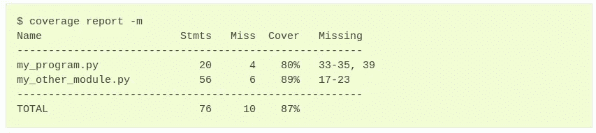

# 5 种更好的 Python 项目设置工具和技术

> 原文：<https://betterprogramming.pub/tools-and-technics-for-better-project-setup-9909abca263f>

## 让我们创建一个设计良好的 Python 项目。


照片由[屋大维丹](https://unsplash.com/@octadan?utm_source=medium&utm_medium=referral)在 [Unsplash](https://unsplash.com?utm_source=medium&utm_medium=referral)

# 1.为了编写更好的代码并避免常见错误

有时，当我们向应用程序添加新功能时，会影响现有代码或破坏其功能。

为了避免这种情况，我们会编写单元测试，并且每次都运行它们，以确保我们添加的新功能不会对应用程序造成损害。

关于测试，有一些库和框架可以用来编写更好的测试并轻松运行它们，比如 [Pytest](https://docs.pytest.org/) 和 [tox](https://tox.wiki/) 。

Pytest 不仅可以帮助我们运行测试，还可以配置如何运行测试、运行哪些文件等。Pytest 有一个配置文件 pytest.ini，您可以在其中描述其配置，例如哪个版本应该是 pytest，或者哪些是如下所示的测试文件。

```
# pytet.ini
[pytest]
minversion = 6.0
addopts = -ra -q — cov=src — cov-report=html
python_files = test_*.py
```

此外，它还具有集成功能，其中之一是将[覆盖率](https://github.com/nedbat/coveragepy)与 pytest 集成在一起的 [pytest-cov](https://github.com/pytest-dev/pytest-cov) ，覆盖率可以通过提供关于应用程序的哪个部分被测试覆盖以及哪个部分没有被测试覆盖的信息来帮助我们，它还提供各种格式的覆盖率报告，如 XML、JSON、HTML，并显示测试覆盖了多少百分比的代码。



截图来自[https://coverage.readthedocs.io/en/6.3.2/](https://coverage.readthedocs.io/en/6.3.2/)

Tox 是一个通用的`virtualenv`管理和测试命令行工具。
使用不同的 Python 版本和解释器检查您的包是否正确安装
在每个环境中运行您的测试，配置您选择的测试工具
作为持续集成服务器的前端，极大地减少样板文件并合并 CI 和基于 shell 的测试。
Tox 也有它的配置文件。

```
[tox]
isolated_build = True

envlist =
    py{38}

[testenv]
usedevelop = true
deps =
    -r src/requirements_dev.txt
```

这些工具可以帮助您确保所做的任何更改都不会影响之前完成的功能。

# 2.如何避免代码气味

有时代码中可能会有未使用的变量，或者编写的代码风格无法对应 PEP8 规则。这里静态代码分析器来帮助我们。
这里有几个静态代码分析器及其配置示例。
[Pylint](https://github.com/PyCQA/pylint) ， [Flake8](https://github.com/pycqa/flake8) ， [MyPy](http://www.mypy-lang.org/) 。
这些工具可以帮助我们避免死代码、不适用的代码(例如违反 PEP-8 规则)、代码中未使用的变量等...
Pylint 配置:创建`.pylintrc`文件

```
[MESSAGES CONTROL]
disable=
    missing-docstring,
    too-few-public-methods[REPORTS]
output-format=colorized
files-output=no
reports=no
evaluation=10.0 - ((float(5 * error + warning + refactor + convention) / statement) * 10)
```

Flake8 配置:创建`.flake8`文件

```
[flake8]
ignore = E203, E266, E501, W503, F403, F401, E402
max-line-length = 120
max-complexity = 18
select = B,C,E,F,W,T4,B9
exclude =
    .git,
    tests
```

这些类型的工具可以帮助你为整个应用程序定义一种代码风格，开发者将会保留它！

# 3.如何避免破坏工作应用程序

想象一下，有人在没有运行所有测试和静态代码分析器的情况下推送代码，这可能会影响现有的特性。
所以为了避免这种情况，pre-commit 来帮我们了。
Pre-commit 是一个框架，它创建 git 挂钩来确保您的代码是按照您定义的代码风格编写的。
它扫描你的源代码并运行你将在预提交配置文件中定义的所有检查器:`.pre-commit-config.yaml`

```
repos:
  - repo: 'https://gitlab.com/pycqa/flake8'
    rev: 3.8.2
    hooks:
      - id: flake8
        name: Style Guide Enforcement (flake8)
        args:
          - '--max-line-length=120'
  - repo: 'https://github.com/pre-commit/mirrors-mypy'
    rev: v0.720
    hooks:
      - id: mypy
        name: Optional Static Typing for Python (mypy)
```

这些类型的工具可以帮助您避免 git 存储库中的有害代码。

# 4.漏洞扫描

每个应用程序都可能被黑客攻击，存在数据泄露或源代码泄露、数据加密、应用程序崩溃或任何其他有害事情的风险。
漏洞扫描有一堆工具，但我们还是来看看 [Sonarqube](https://www.sonarqube.org/) 。Sonarqube 是一个开源的强大的代码质量和安全扫描工具，也是这个行业的领先工具之一。
详见[官方文件](https://docs.sonarqube.org/latest/)。
您可以使用 Docker 镜像设置本地 Sonarqube 服务器，并定义`sonar-project.properties`

```
# must be unique in a given SonarQube instancesonar.projectKey=python_app_blueprint# --- optional properties ---# defaults to project key#sonar.projectName=My project# defaults to 'not provided'#sonar.projectVersion=1.0# Path is relative to the sonar-project.properties file. Defaults to .#sonar.sources=. # Encoding of the source code. Default is default system encoding#sonar.sourceEncoding=UTF-8
```

# 5.构建您的应用程序

你可能读过 SRP——单一责任原则和变量命名，所以它们不仅仅是关于 python、java、c#或任何其他语言的编程，它们是通用原则，几乎在任何地方都有效，甚至在文件夹创建中。

因此，最好将您的应用程序拆分到不同的文件夹中，并给它们指定相应的名称，并将您的数据分开存储。
例如:

```
├── LICENSE
├── Makefile
├── project.toml
├── pytest.ini
├── README.md
├── setup.cfg
├── setup.py
├── sonar-project.properties
├── .ci
│   ├── some_pipeline.yaml
│   ├── scripts
├── src
│   ├── app
│   ├── requirements_dev.txt
│   └── requirements.txt
├── tests
│   ├── integration
│   │   └── __inti__.py
│   └── unit
│       └── __init__.py
└── tox.ini
```

这里有一个[示例应用蓝图](https://github.com/aram2726/python_application_blueprint)。感谢阅读。