# 使用 SQL 查询日志的工具

> 原文：<https://betterprogramming.pub/tools-for-querying-logs-with-sql-dd03c835d807>

## 监控你的项目变得简单多了


从开发到日常管理，日志对于任何软件项目都是至关重要的。维护日志对于确定应用程序的状态、监控和故障排除至关重要。如今，日志记录通常嵌入在整个应用程序中，从简单的用户访问日志到数据库活动、错误日志和网络流日志。

在本帖中，我们将介绍以下 SQL 和日志选项:

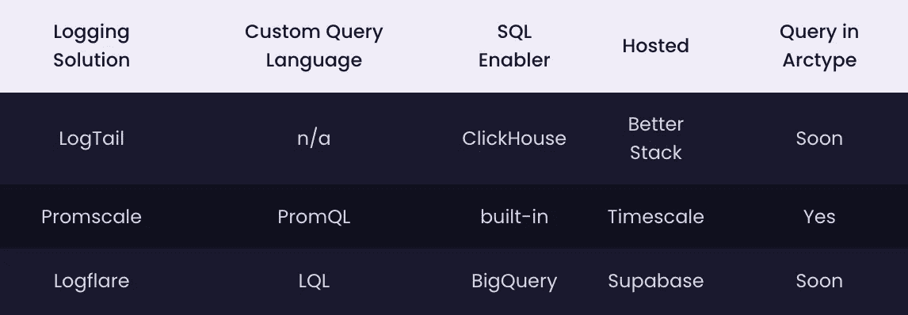

# 查询日志的基础

查询日志的可用选项因平台而异。虽然有些平台提供基于或衍生自其他语言和模式的特定领域查询语言(如 NoSQL、SQL、JSON 和 Regex)，但其他平台可能提供利用众所周知的语言的能力，如 SQL。上表对此进行了总结。

## 为什么要用 SQL 查询日志？

SQL 是业内最常用的与数据库交互的语言。使用它来搜索日志意味着您不必学习新的语法。像 SQL 触发器这样更新数据库对象的功能是内置的。例如，日志表中的更新可能会触发一个事件来清除数据并将其复制到新格式化的表中。

## SQL 相对于其他日志查询方法的优势

*   与特定领域语言和其他选项(如 Regex)相比，SQL 相对简单。
*   在查询日志时，SQL 支持 SQL 触发器和存储过程等高级功能。
*   SQL 是事务性数据的有效选择，比如具有静态结构的日志。
*   与其他选项相比，SQL 在运行分析查询时速度更快。

让我们看一下市场上三种相互竞争的查询解决方案。我们将从 ubuntu 服务器上的 Nginx 安装中查询系统日志，以了解以下所有示例。

# 对数尾

[LogTail by Better Stack](https://betterstack.com/logtail) 基于开源的、面向列的数据库管理系统 [ClickHouse](https://clickhouse.com/learn/lessons/gettingstarted/) ，为日志管理提供了一个 SQL 兼容的结构。它允许用户收集整个软件栈的日志，从系统日志到数据库、Docker 等等。

LogTail 具有使用 Grafana 创建仪表板的内置特性，Grafana 集成为平台的一部分，支持团队成员之间的协作。LogTail 还与 AWS S3 冰川等外部数据存储相集成，以满足长期、经济高效的归档需求。该平台在设计时考虑了安全性，并利用符合 GDPR 标准的 DIN ISO/IEC 27001 认证数据中心来存储和管理客户数据。

## 如何使用 LogTail

LogTail 是一个托管服务，需要用户在平台上创建一个账户。然后，他们需要获得一个 API 令牌来授权代理向平台接收数据的请求。这是通过在 LogTail 中创建连接源来实现的。只有在完成此步骤后，用户才能使用首选代理接收日志。

虽然推荐的转发器是 Datadog 的 [Vector，但 LogTail 也支持其他选项，如 Fluent Bit、Logstash、Fluentd 和 Syslog。用户只需要创建一个 LogTail 帐户，并获得一个 API 令牌来授权来自代理的将数据摄取到平台的请求。](https://docs.logtail.com/log-forwarding/vector)

# 使用 LogTail 接收和查询日志

## 数据摄取

转到 sources 并单击“Connect source”以提供名称并指定收集日志的平台。LogTail 将使用可以连接到数据源的源令牌创建一个数据源。

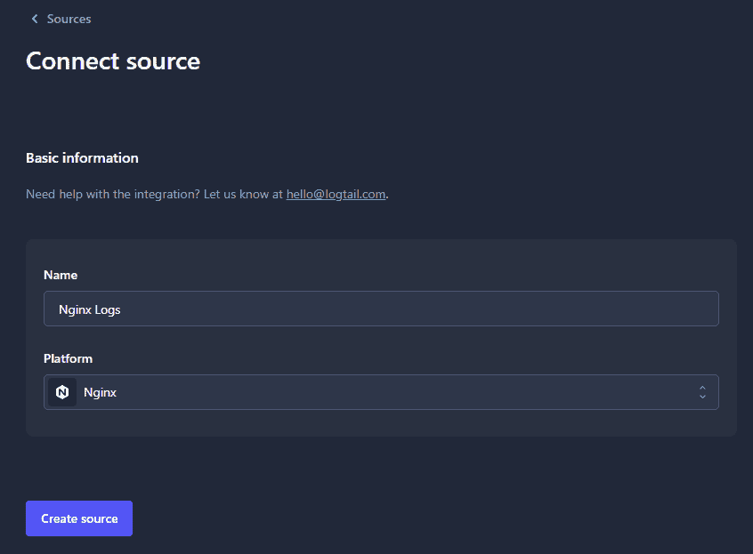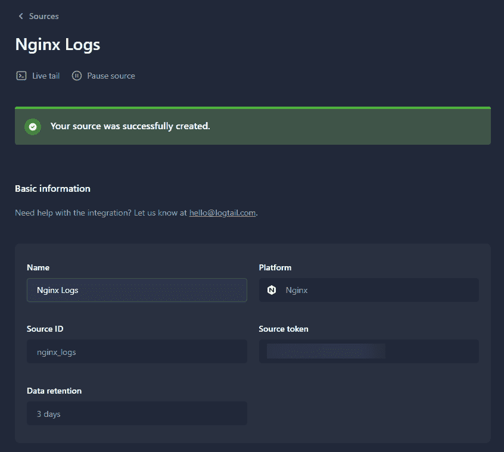

接下来，安装首选代理。推荐客户端矢量的[安装说明](https://docs.logtail.com/integrations/nginx)在安装说明部分的数据源中提供。但是，用户可以自由使用任何支持的选项。

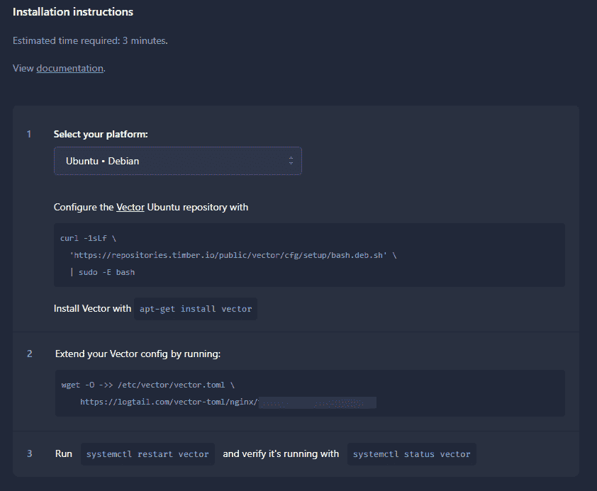

设置代理配置并重新启动服务后，您将能够在 Live Tail 部分看到收集的日志。

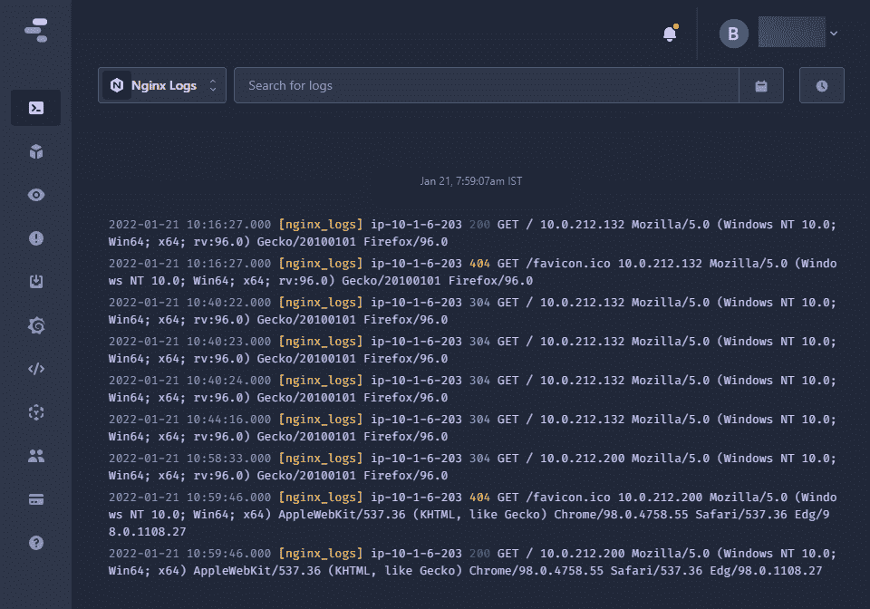

## 查询日志

导航到 SQL 部分中的浏览。在这里，用户可以使用 SQL 语法查询任何收集的日志。在下面的例子中，我们从 Nginx 服务器查询成功的响应(`nginx.status_integer = 200`)。

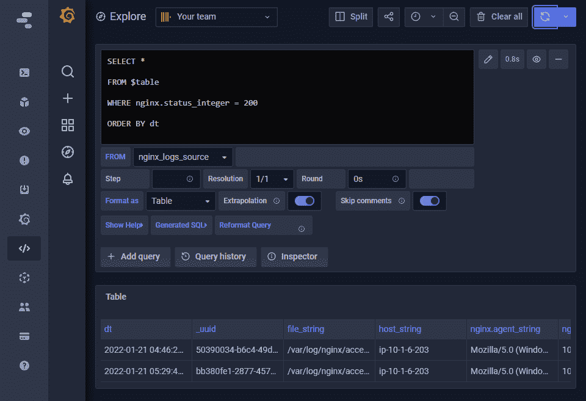

# Promscale

[Promscale](https://prometheus.io/docs/prometheus/latest/querying/basics/) 是领先的开源监控解决方案之一 [Prometheus](https://prometheus.io/) 的连接器。Promscale 由[时标](https://arctype.com/postgres/connect/timescaledb)开发，这是一个与 Postgres 完全兼容的时间序列数据库。由于日志是时间序列事件，[时标开发了 Promscale](https://blog.timescale.com/blog/promscale-analytical-platform-long-term-store-for-prometheus-combined-sql-promql-postgresql/) 来接收来自 Prometheus 的事件，并使它们在 SQL 中可用。您可以通过多种方式[安装 Promscale](https://github.com/timescale/promscale/blob/master/docs/docker.md) 。

## 如何设置 Promscale

在我们使用 Prometheus 的配置来收集日志之前，下面是如何使用 Docker 运行 [Promscale。在这个例子中，我们使用本地主机时间刻度实例，但是我们也可以将 Promscale 连接到时间刻度云。例如，如果您正在运行一个安装了 Prometheus 的 Kubernetes 集群，这是很常见的。](https://docs.timescale.com/promscale/latest/installation/docker/#installing-promscale-using-docker-run )

运行这些命令，假设您已经设置了 docker 网络。首先，启动本地时间刻度实例，如下所示:

```
docker run --name timescaledb -e POSTGRES_PASSWORD=getarctype -it \
	-p 5432:5432 --network promscale-timescaledb \
    timescaledev/promscale-extension:latest-ts2-pg13 \
    postgres -csynchronous_commit=off
```

然后启动 Promscale 连接器。

```
docker run --name promscale -it -p 9201:9201 \
	--network promscale-timescaledb timescale/promscale:latest \
    -db-password=getarctype -db-port=5432 -db-name=postgres \
    -db-host=timescaledb -db-ssl-mode=allow
```

要将 Promscale 实例连接到时间刻度云，您可以执行以下操作:

```
docker run --rm --name promscale -it -p 9201:9201 \
	--network promscale-timescaledb timescale/promscale:latest \
    -db-user=tsdbadmin -db-password=<PASSWORD> \
    -db-port=31035 -db-name=tsdb \
    -db-host=<HOST>.tsdb.cloud.timescale.com \
    -db-ssl-mode=allow
```

# 如何与普罗米修斯联系

Prometheus 由 Cloud Native Computing Foundation 管理，已经在行业范围内被采用来收集和汇总指标。它有一个很大的客户端库集合，用于将应用程序代码植入到特殊用途的服务导出器，如 HAProxy、Graphite 等。

Prometheus 有自己强大的查询语言 PromQL，可用于查询日志和功能，如短期任务的推送网关。最重要的是，它提供了一个警报管理器，用于根据收集的指标进行更改。

虽然与其他解决方案相比，Prometheus 可能有更长的学习曲线，但它提供了最佳的可定制性和集成选项来收集任何类型的指标或日志。与其他两种解决方案不同，普罗米修斯[可以自托管](https://prometheus.io/docs/prometheus/latest/installation/)，同时仍然提供托管服务选项，如普罗米修斯的亚马逊托管服务。

Prometheus 主要使用出口商和客户库来收集数据。一些软件工具如 Kubernetes 和 Traefik 直接向 Prometheus 公开度量，消除了对导出器的需求。

查询日志可以在 PromQL 的帮助下通过 Prometheus web UI、API 客户端或 Grafana 等外部可视化工具来完成。

# 使用 Prometheus 摄取和查询日志

## 摄取数据

假设您想从 Nginx 安装中获取日志。这可以通过像`prometheus-nginxlog-exporter`这样的导出器来实现，它允许用户将 Nginx 日志摄取到 Prometheus。

有多种方式来配置这个导出器，从通过 DEB 或 RMP 包直接安装 docker 到在 Kubernetes 环境中作为 sidecar 容器运行等等。在下面的例子中，我们已经将`prometheus-nginxlog-exporter`安装为 DEB 包，并使用定制配置文件运行导出器。

```
listen:
  port: 4040
  address: "0.0.0.0"consul:
  enable: falsenamespaces:
  - name: nginxlogs
    format: "$remote_addr - $remote_user [$time_local] \"$request\" $status $body_bytes_sent \"$http_referer\" \"$http_>    source:
      files:
        - /var/log/nginx/access.log
    labels:
      service: "nginx"
      environment: "production"
      hostname: "nginx.example.com"
    histogram_buckets: [.005, .01, .025, .05, .1, .25, .5, 1, 2.5, 5, 10]
```

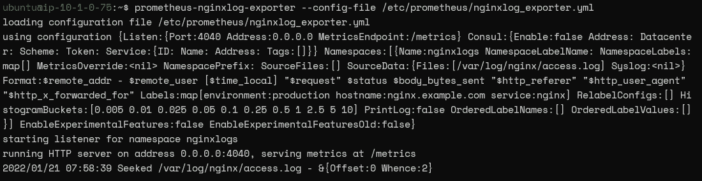

**注意:**您可能需要修改 Nginx 服务器的日志格式，以匹配导出器的预期格式。

```
og_format custom   '$remote_addr - $remote_user [$time_local] '
                      '"$request" $status $body_bytes_sent '
                      '"$http_referer" "$http_user_agent" "$http_x_forwarded_for"';
```

然后在 Prometheus 端，我们可以修改 prometheus.yml 以包含一个指向`prometheus-nginxlog-exporter`的新作业配置。

```
- job_name: 'nginx'
    scrape_interval: 15s
    static_configs:
      - targets: ['18.184.64.170:4040']
```

重启 Prometheus 后，当您使用指向创建的服务的`up{}`命令进行查询时，您将能够看到一个新的实例。

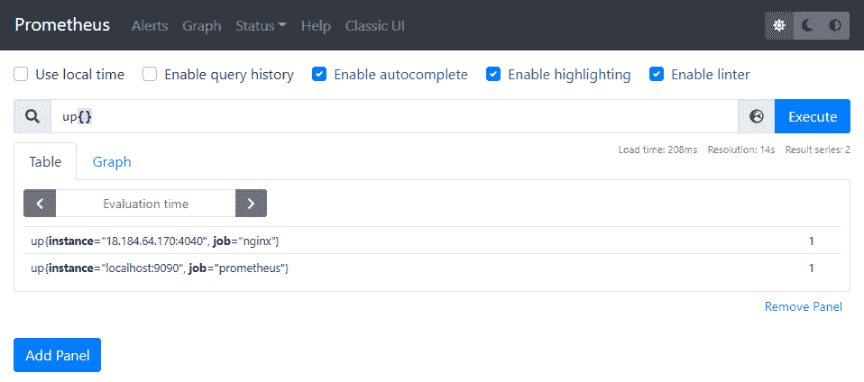

## 查询日志

查询日志时，可以使用上面的 Promscale 配置和时间刻度。您还可以使用 Prometheus web 界面和 PomQL 命令来查询收集的指标。假设我们需要看到向服务器发出的成功请求(HTTP 200)。可以使用下面的命令来完成。

```
nginxlogs_http_response_count_total{service="nginx",status="200"}
```


Prometheus 查询语言允许用户实时选择和汇总时序数据。这些数据可以显示为图表视图、表格格式，或者通过 HTTP API 向外部系统公开。在上面的例子中，我们已经使用`nginxlogs_http_response_count_total`命令指定了指标，将查询范围限制为来自`nginxlogs`名称空间的指标。

尽管 [PromQL 是一种强大的语言，](https://prometheus.io/docs/prometheus/latest/querying/basics/)用户需要在有效地利用它从 Prometheus 查询数据之前学习它。这使得 SQL 成为一个更好的解决方案，尤其是如果你已经在运行 Postgres 并且可以使用时间刻度的话。

# 对数耀斑

[Logflare，](https://logflare.app/)现在是 Supabase 的[部分，旨在简化基于 Cloudflare、Elixir 和 Vercel 的应用程序的日志记录体验。但是，它可以支持任何类型的日志。Logflare 提供了结构化的日志记录能力，没有限制或增加延迟。它旨在为支持的应用程序平台处理日志时，以最小的开销提供最佳的性能。](https://supabase.com/blog/2021/12/02/supabase-acquires-logflare)

Logflare 允许几乎无限的事件历史，并由 Google BigQuery 提供支持。此外，Logflare 允许用户直接与 [BigQuery 和 DataStudio 集成，以便使用 SQL 和可视化工具进行进一步分析](https://logflare.app/guides/overview)。此外，LogFlare 支持电子邮件和 SMS 警报功能，使用 Regex 将日志路由到不同的源，甚至提供向日志添加元数据的能力。

## 如何使用 Logflare

作为托管服务提供商，Logflare 要求用户在其平台上创建一个帐户。或者，如果你有一个 [Supabase 账户](https://arctype.com/postgres/connect/supabase-postgres)，你可以在`/settings/logs/database`访问你项目的日志，如这个 [Supabase YouTube 视频](https://www.youtube.com/watch?v=MdKWR_Zpu50)所示。它还提供了一个渐进式 web 应用程序，允许 Android 和 iOS 客户端直接访问 Logflare 平台。

Cloudflare 和 Vercel Logflare 提供了一键式安装工具来为本机支持的平台配置日志代理。它们还提供了集成其他支持平台的指南，如 Gigalixir、Heroku、Elixir、JavaScript (Pinto Transport)、Github Actions/Webhooks、FluentBit 和 General Webhooks。

日志可以直接通过 Logflare 平台查询，也可以通过 Google BigQuery 查询。Logflare 甚至允许用户[配置他们的 BigQuery 后端](https://logflare.app/guides/bigquery-setup)来直接管理他们的存储和成本，同时只需为管理日志管道支付 LogFlare。

# 使用 Logflare 接收和查询日志

## 摄取数据

首先，用户必须创建一个 Logflare 帐户。然后，他们应该创建一个新的数据源，允许他们使用管道的源密钥接收数据，并提供必要的 API 密钥进行身份验证。

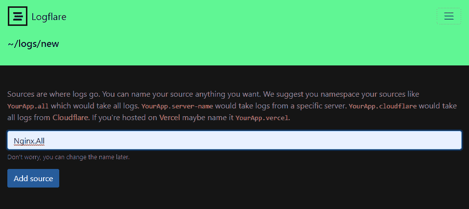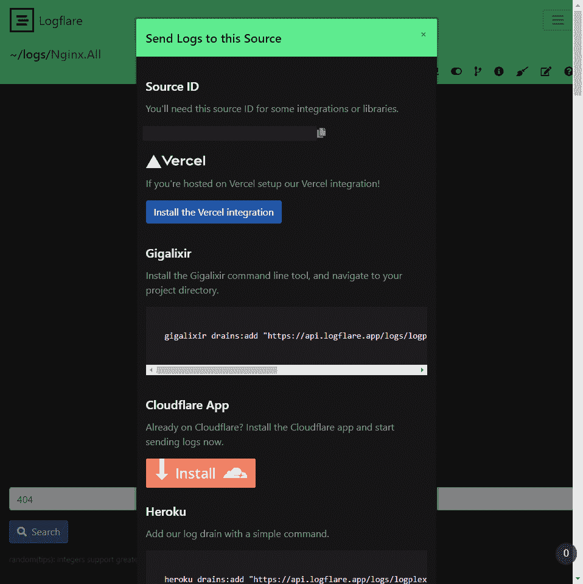

接下来，我们将使用 Fluent Bit 接收 Nginx 数据。我们将使用[Fluent Bit package TD-agent-Bit for Ubuntu](https://docs.fluentbit.io/manual/v/1.0/installation/td-agent-bit)来实现它，并修改配置以将输入反映为 Nginx 日志，同时将输出指向 Logflare。

```
[INPUT]
        Name        tail
        Path        /var/log/syslog [OUTPUT]
        Name             http
        Match            *
        tls              On
        Host             api.logflare.app
        Port             443
        URI              /logs/json?api_key=IVJaC85Mk79K&source=ffbda396-e1f2-4c0e-851a-4b99de24b398
        Format           json
        Retry_Limit      5
        json_date_format iso8601
        json_date_key    timestamp
```

重启`td-agent-bit`，您将能够在每次向服务器发出请求时看到 Nginx 访问日志。

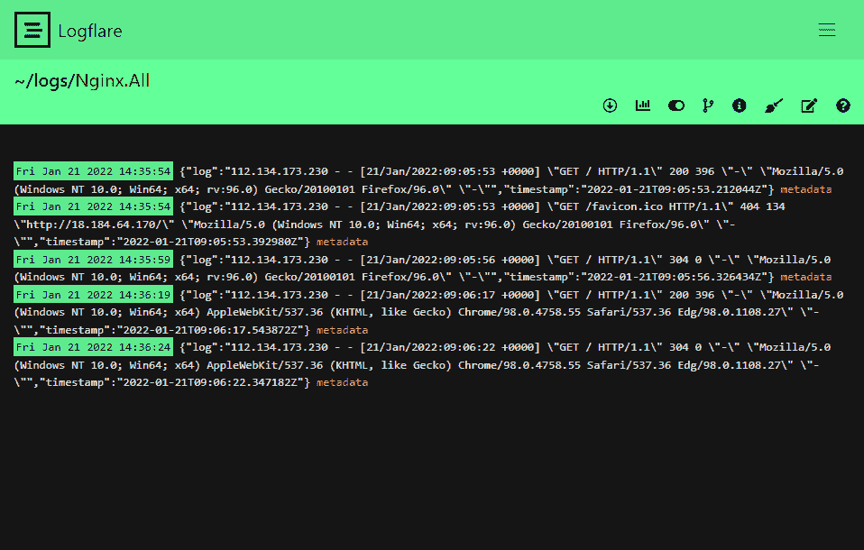

## 查询数据

Logflare 有自己的[查询语言，叫做 LQL](https://github.com/Logflare/logflare/blob/master/test/logflare/lql/lql_parser_test.exs) 。让我们看看如何使用下面的命令查询 HTTP 200 成功响应。

```
200 c:count(*) c:group_by(t::minute)
```

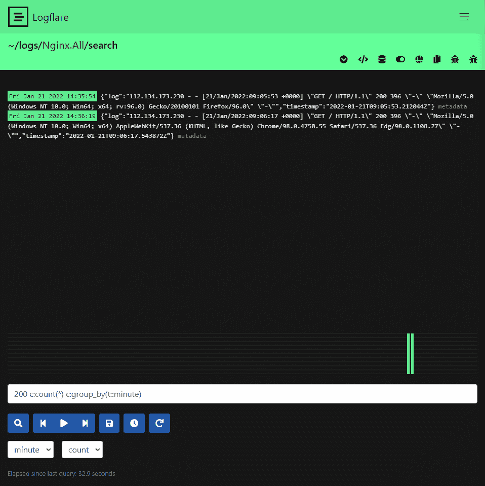

Logflare 的另一个很棒的特性是它能够提供 BigQuery 后端。对于付费用户，它既可以通过 Google Data Studio 探索[数据，也可以使用 BigQuery 直接使用 SQL 查询后端。您现在还可以在 Supabase 中使用 SQL 搜索日志。](https://logflare.app/guides/data-studio-setup)

# 结论

所有上面讨论的用于查询日志的解决方案都能够进行日志管理。LogTail 凭借其内置的 SQL 查询和可视化功能被认为是最简单的选项，其次是 Logflare，它的一键式安装选项支持平台和移动支持。最后是普罗米修斯，这是三个方案中最复杂的一个。

尽管很复杂，Prometheus 提供了一个完整的解决方案来满足您所有的监控需求，而不仅仅是日志管理。Prometheus 由于增加了 Promscale 而变得更容易使用。根据您的需求，从这三个工具中选择最适合您的日志管理需求的工具。