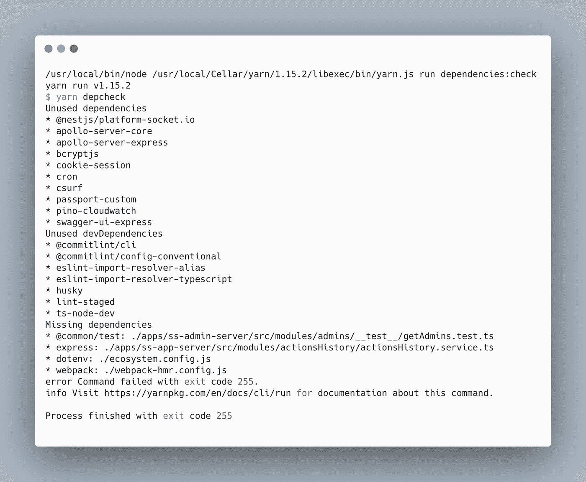
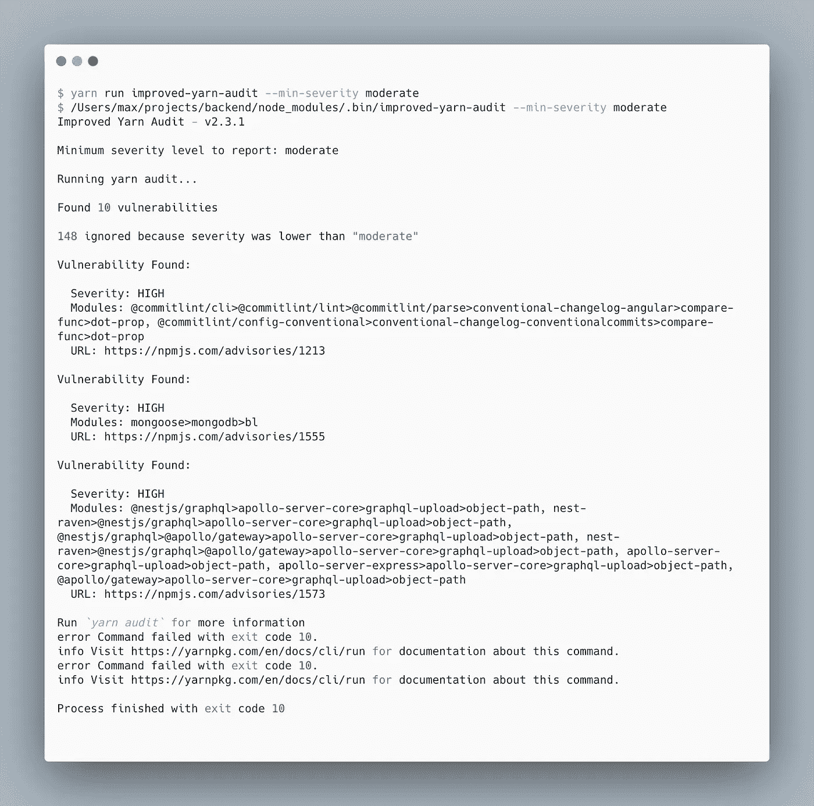
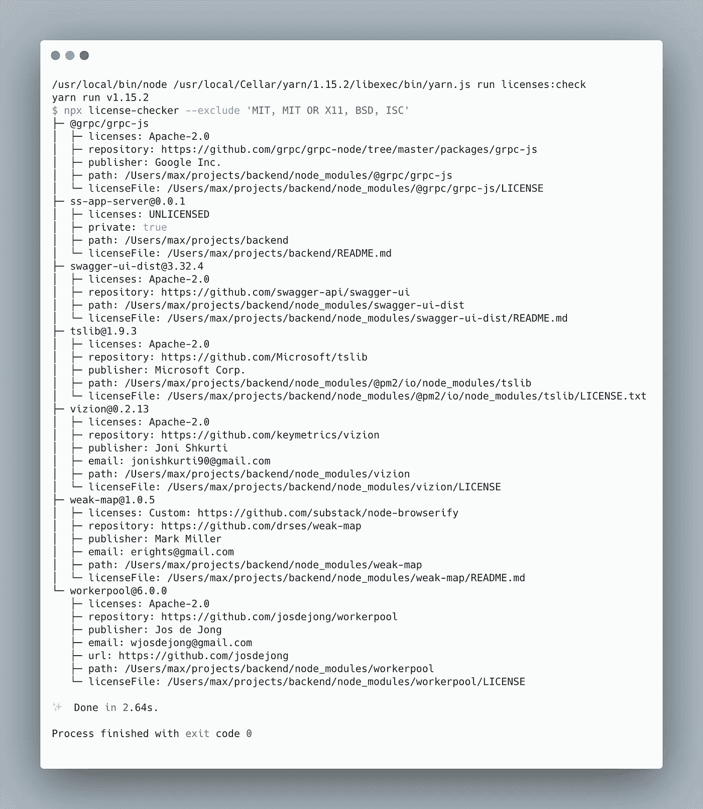
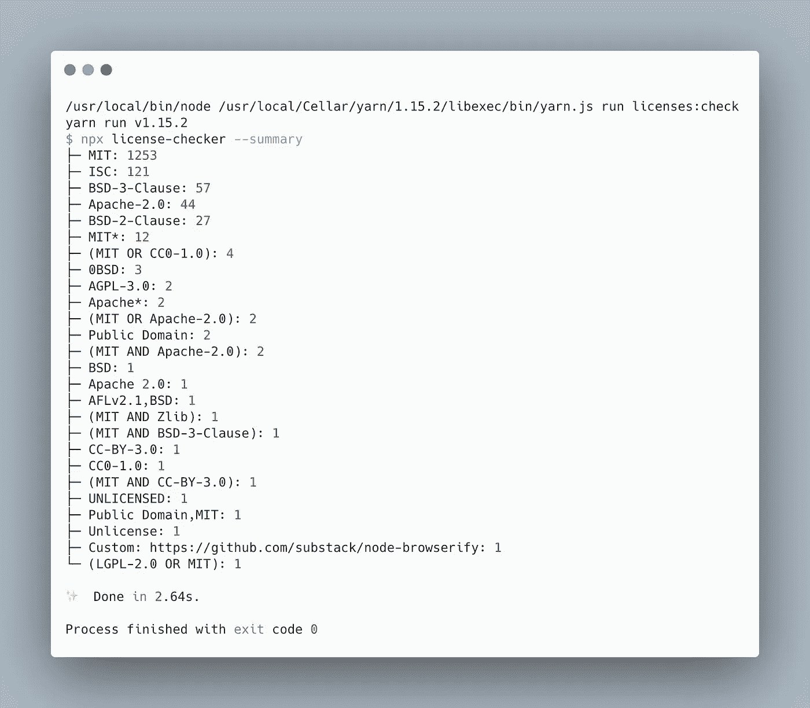

# 管理项目中 NPM 依赖项的工具

> 原文：<https://betterprogramming.pub/tools-to-manage-npm-dependency-in-your-project-as-a-professional-b95c4d35844a>

## 查找项目中缺少或未使用的依赖项等


费伦茨·阿尔马西在 [Unsplash](https://unsplash.com?utm_source=medium&utm_medium=referral) 上拍摄的照片。

为什么我们这么多谈工程质量和技术债？因为这直接或间接地影响了开发的速度、支持的复杂程度、实现新功能的时间以及扩展当前功能的可能性。

影响项目质量的因素很多。其中一些很难理解，很难检查，需要经验丰富的开发人员或 QA 工程师进行人工检查。其他的就简单明了。它们可以被自动检查和修复。尽管如此，它们代表了整个项目质量的一个重要部分。

在本文中，您将发现 NPM 包可以自动检查项目的一些关键方面，例如 NPM 依赖项、它们的许可证以及验证安全问题。

# **查找遗漏或未使用的依赖关系**

Depcheck 是一个非常有用的小库，可以检查哪些依赖项没有被使用，哪些依赖项在`package.json`中没有，但是在你的代码库中使用了。

[](https://www.npmjs.com/package/depcheck) [## 深度检查

### 检查节点模块中的依赖关系

www.npmjs.com](https://www.npmjs.com/package/depcheck) 

强烈建议在本地(例如，在预提交挂钩上)或在远程 CI 中使用它，以避免以下问题:

*   冗余依赖增加了构建/捆绑包的大小，从而导致以下后果:Docker 映像变得更大，AWS Lambda 处理程序的冷启动时间也更长，并且事件可能会超过 Lambda 大小限制。
*   在生产中，缺失的依赖关系会以完全意想不到的方式破坏您的应用程序。此外，如果它们是开发依赖项，它们可能会使您的 CI/CD 管道崩溃。

## 安装和使用

```
npm install -g depcheck
// or
yarn global add depcheck
```

## 用法示例

```
// usage as npm script"dependencies:check": "yarn run depcheck",
```

通过运行此命令，您可以看到已发布依赖项的列表:



纱线运行深度检查

# **检查依赖关系中的漏洞**

[npm-audit](https://docs.npmjs.com/cli/v6/commands/npm-audit) 、 [yarn audit](https://classic.yarnpkg.com/en/docs/cli/audit/) 、 [improved-yarn-audit](https://www.npmjs.com/package/improved-yarn-audit) 是可以发现依赖漏洞的工具。此外，它们会自动更新软件包来解决问题。npm 审计和 yarn 审计都预装了包管理器，但我更喜欢改进的 yarn 审计。它是一个围绕 yarn audit 的包装器，提供了一些改进——特别是在 CI 管道中的使用(来自 docs ):

> -无法忽略咨询
> 
> -无法过滤低严重性问题
> 
> -NPM 注册中心的持续网络问题导致误报

[](https://www.npmjs.com/package/improved-yarn-audit) [## 改进的纱线审计

### 这个项目旨在改善现有的纱线包装经理审计功能。

www.npmjs.com](https://www.npmjs.com/package/improved-yarn-audit) 

## **安装**

```
npm install -g improved-yarn-audit
// or
yarn global add improved-yarn-audit
```

## **用法示例**

```
"dependencies:audit": "yarn run improved-yarn-audit — min-severity moderate",
```

下面，您可以看到在真实项目代码库中使用此命令的结果。该工具也搜索可传递依赖关系中的漏洞:



纱线运行改善-纱线审计-最低-中等严重程度

# **检查依赖关系的许可证**

对于实际的生产项目，依赖项许可证的使用是至关重要的，因为您使用依赖项的方式可能会被软件包的许可证所禁止。为了避免这种情况，您应该持续检查您在项目中使用的所有依赖项的许可证。如果你的项目是一个创业公司，根据他们的许可证适当地使用依赖关系是强制性的，这样才能让投资者认可你的产品。[许可证检查器](https://www.npmjs.com/package/license-checker)是最好的方法！

[](https://www.npmjs.com/package/license-checker) [## 执照检查员

### 从 v17.0.0 开始，failOn 和 onlyAllow 参数使用分号代替逗号作为分隔符。一些许可证名称…

www.npmjs.com](https://www.npmjs.com/package/license-checker) 

## **安装**

```
npm install -g license-checker 
// or 
yarn global add license-checker
```

## **用法示例**

```
"licenses:check": "yarn run license-checker --exclude 'MIT, MIT OR X11, BSD, ISC'",
```



纱线运行许可证检查器—不包括'麻省理工学院，麻省理工学院或 X11，BSD，ISC '

但是对于 CI/CD 中的用法，我更喜欢下面的变体，因为它要短得多:

```
"licenses:check:ci": "yarn run license-checker — summary",
```



纱线运行许可检查器—摘要

我希望这篇文章能帮助你解决或避免 NPM 软件包的问题。感谢阅读！