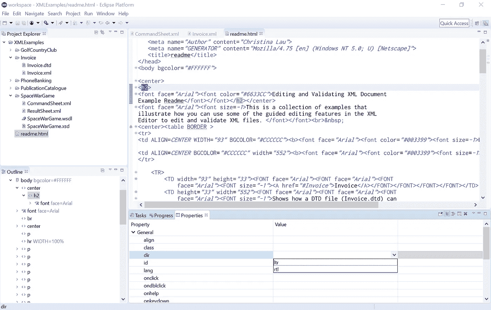
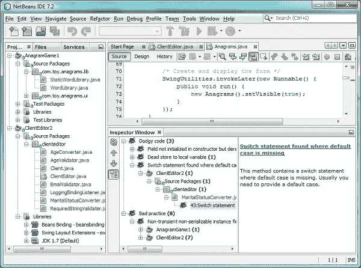
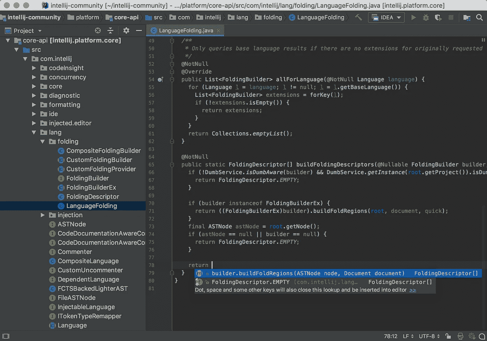
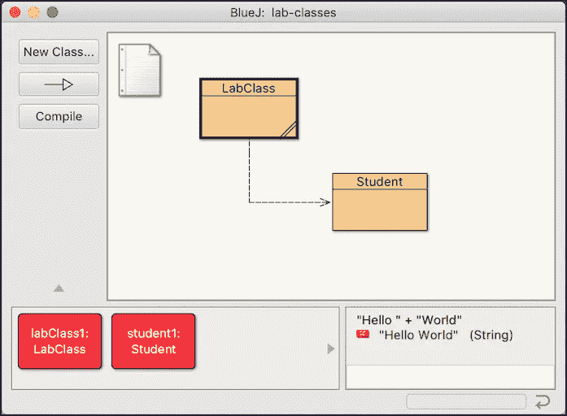
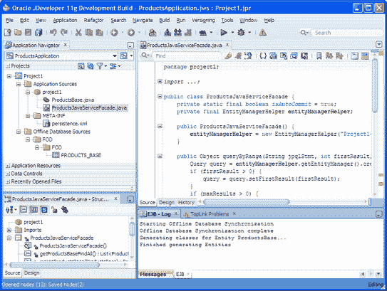
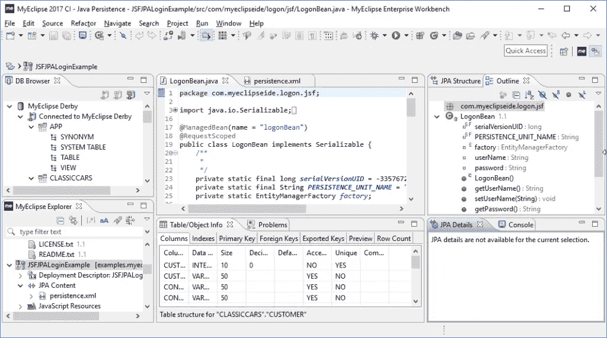
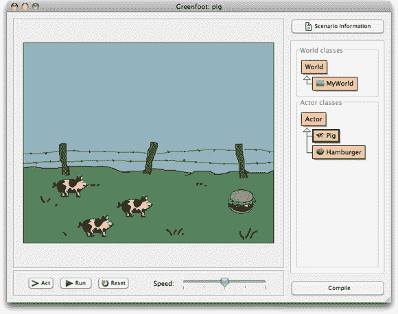
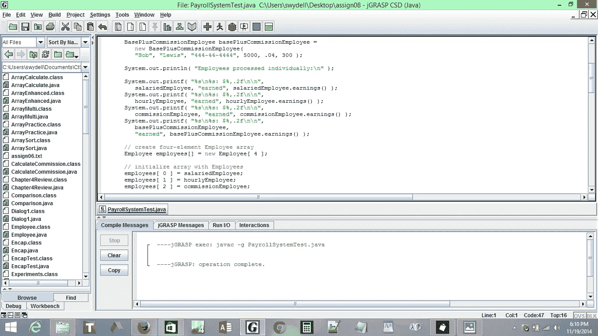
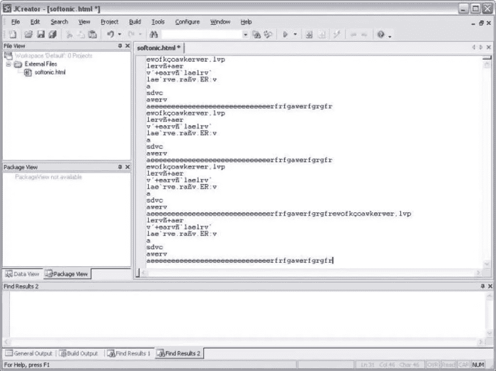
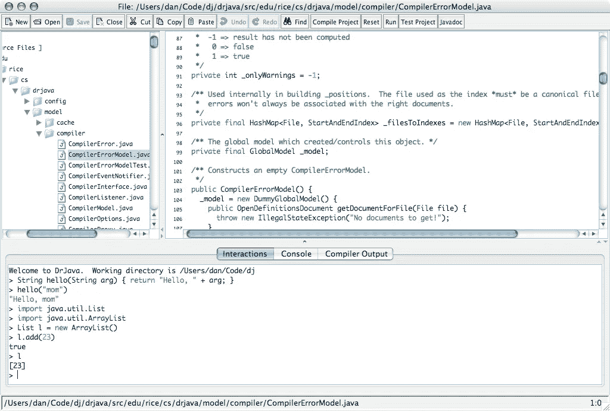

# 2021 年十大最佳 Java IDEs

> 原文：<https://betterprogramming.pub/top-10-best-java-ides-for-2021-1c3a28cca08f>

## 除了 Eclipse，还有很多选项

虽然您可以在简单的文本编辑器中编写 Java 程序，但带有有用工具的 Java IDE 将大大提高您的效率。IDE 将包括源代码编辑器、构建自动化工具和调试器，以使 Java 编程更容易。但是市场上有这么多选择，很难决定哪种 IDE 最适合您。

今天，我们将讨论选择 Java IDE 时需要考虑的基本要求，并看看 2021 年前 10 名最佳 Java IDE。

**我们将介绍:**

*   什么是好的 Java IDE？
*   黯然失色
*   NetBeans
*   智能理念
*   BlueJ
*   JDeveloper
*   MyEclipse
*   绿脚
*   jGRASP
*   jCreator
*   DrJava
*   你学习的下一步

# 什么是好的 Java IDE？

IDE 或集成开发环境捆绑了编写、调试和测试代码所需的所有工具。IDE 允许开发人员在单一环境中工作，并改进他们的编程工作流程。每个 IDE 都有不同的资源，但是它们都包括文本编辑器、构建工具和调试器。

当决定使用 Java IDE 时，重要的是首先确定您需要什么，以确保它拥有满足您需求的基本工具。无论您的经验水平如何，总有一款理想的 Java IDE 适合您。

# 基本 Java IDE 工具

*   **调试:**虽然不同的 ide 中调试器各不相同，但拥有一个工具来突出潜在的错误并帮助您单步调试代码是非常重要的。
*   **语法高亮:**内置高亮对于可读性和效率至关重要。这个工具可以帮助你发现代码中的错误，并让你以更快的速度筛选代码。
*   构建自动化:一个好的 IDE 将允许你在同一个窗口中编写和运行你的 Java 代码，提高你的程序的生产率和效率。
*   **代码完成:**这个工具识别并插入代码组件，以节省您的时间并降低打字错误和错误的风险。
*   **图形用户界面(GUI):** 有效的 GUI 支持直观的编程界面。

# 十大 Java IDEs

## 黯然失色

Eclipse 是市场上最流行的 Java IDEs 之一。它是免费的、开源的，有一个广泛的插件生态系统，允许用户为应用程序开发定制功能。

Eclipse IDE 有桌面版和云版，云版允许开发人员在 web 浏览器中编码。

Eclipse 因其开发工具而成为首选。Eclipse 提供了 Eclipse Marketplace，其中包含各种可供下载的插件，以及允许开发人员创建自己的特性的插件开发环境。

Eclipse 支持 100 多种编程语言，包括 JavaScript、Groovy 和 Scala，并且它有一套健壮的建模、制图和测试工具。

**优点:**

*   运行时核心
*   定制编译器
*   简单的 Git 和 Apache Maven 集成
*   安装插件的市场
*   编辑、调试、浏览和重构功能
*   代码完成

**缺点:**

*   跑得慢的名声
*   使用大量的 CPU
*   频繁碰撞的重型工具
*   复杂的插件环境

**用例:**您是一名多语言开发人员，正在寻找一个提供广泛插件环境的 IDE，并且不介意花时间定制您的体验。

**跨平台:** Windows、Mac OS、Linux、Solaris

**价格:**免费

## NetBeans

Apache NetBeans 是 Java 8 的官方 IDE，使其成为创建桌面、移动和 web 应用程序的顶级 Java IDE。NetBeans 是开源的，与 HTML5 和 C++一起用于开发桌面、web 和移动应用程序。

使用 NetBeans，很容易定制软件应用程序，因为它从语法和语义上突出了 Java 代码。

借助强大的重构和调试工具，NetBeans 提高了准确性和效率。开发人员主要使用 NetBeans for Java，但它有一些扩展，允许您使用其他编程语言，如 C、C++和 JavaScript。

**优点:**

*   简单插件环境
*   有 28 种语言版本
*   脚本编写的预制模板
*   并排代码比较
*   源代码分析以增强代码
*   项目管理工具
*   延伸到移动使用
*   Maven 支持

**缺点:**

*   调试器可能会很慢
*   消耗大量内存

**用例:**您是一名多语言开发人员，正在寻找一款具有开发人员协作工具和 Maven 支持的现成 IDE。

**跨平台:** Linux，Mac OS，Windows，Solaris

价格:免费

## 智能理念

IntelliJ 是 Java 开发的最佳 ide 之一。这是一个功能强大且符合人体工程学的 IDE，其功能可以提高工作效率，而不会扰乱用户界面。它包括一套工具，使编程更容易，如智能完成，跨语言重构，数据流分析和语言注入。

IntelliJ 有两个版本:Apache 2 许可社区版和专有终极版。社区版是免费开源的，专注于 Android 和 Java 虚拟机(JVM)开发。终极版是付费的，侧重于 web 和企业开发。

**优点:**

*   强大的定制功能
*   支持基于 JVM 的编程语言，如 Kotlin
*   支持各种编程语言
*   内置版本控制支持
*   强大的插件和集成支持
*   强大的编译器
*   梯度构建系统

**缺点:**

*   终极版成本高
*   占用大量系统资源
*   新开发人员的陡峭学习曲线

**用例:**你是一名开发人员，他的公司将为你购买一个 IDE，你正在寻找一个开箱即用、直观易用的 IDE。您还拥有一台能够处理更重的 IDE 的快速计算机。

**跨平台:** Linux，Mac OS，Windows

价格:社区版——免费，终极版——每月 49.90 美元(每年 499.00 美元)

## BlueJ

BlueJ 最初是为教育内容而创建的，但现在被小规模地用于软件开发。虽然 BlueJ 对于初学者来说是一个很好的 Java IDE，但是许多 Java 老手选择使用 BlueJ，因为它的交互和整洁的用户界面。

BlueJ 允许与对象进行简单的交互，并有一个强大的编辑器，可以帮助开发人员直观地扫描他们的代码并创建动态对象。这是一个创新的 Java IDE，具有许多其他软件所没有的独特特性，比如作用域着色、代码板和对象工作台。BlueJ 是可移植的，支持各种操作系统。

**优点:**

*   简单的 GUI 能够直接调用 Java 表达式
*   物体间的相互作用
*   显示项目的 UML 图表

**缺点:**

*   由于频繁的崩溃，对于大项目来说不是很好
*   对于初学者来说很棒，但是缺少许多用于更健壮的应用程序的特性

**用例:**您是 Java 开发的新手，希望在直观、轻量级的环境中创建简单的项目。

**跨平台:** Windows、Linux、Mac OS

**价格:**免费

## Oracle JDeveloper

JDeveloper 是 Oracle 提供的免费 IDE。它包括用 Java、PHP、SQL、XML、HTML 和 JavaScript 开发应用程序的特性。JDeveloper 涵盖了整个开发生命周期:编码、设计、调试、优化、分析和部署。

它与 Oracle 应用程序开发框架(Oracle ADF)相集成，以简化开发。

JDeveloper 提供可视化和声明性编辑器，使开发人员能够从编码环境中直接编辑他们的应用程序。它有一个拖放功能，可以简化应用程序开发。它还支持 Java EE 和 Java SE。

**优点:**

*   与敏捷开发和软件版本组件的强大集成
*   完整的生命周期管理
*   可视化 HTML 5 编辑器
*   与数据库的紧密联系
*   执行 SQL 查询的能力

缺点:

*   初学者的陡峭学习曲线
*   占用大量内存
*   繁重并且会降低程序的执行速度

**用例:**您是一名经验丰富的 Java 开发人员，正在寻找一套广泛的工具，并且拥有一台可以运行繁重程序的计算机。

**跨平台:** Windows、Linux、Mac OS

**价格:**免费

## MyEclipse

MyEclipse 是构建在 Eclipse 平台上的专有 Java IDE。它在开发环境中使用专有代码和开源代码，其工具可用于 Java 应用程序开发和 web 开发。MyEclipse 提供对 Angular、HTML、TypeScript 和 JavaScript 的支持。

它还支持数据库和应用服务器连接器，并增强了对 Maven 和 Spring 的支持。MyEclipse 有助于构建强大的前端和后端。

**优点:**

*   数据库可视化
*   支持带实时预览的 CodeLive
*   Java EE 开发
*   快速准确的验证
*   简化的 SQL
*   源代码重构和格式化

**缺点:**

*   慢速编译器
*   昂贵的
*   笨重并且占用大量资源

**用例:**您熟悉 Eclipse，您的公司将为 IDE 买单。你也有一个快速的计算机来处理沉重的 IDE。

**跨平台:** Linux、Mac OS、Windows

**价格:**标准版——每年 31.75 美元，安全版——每年 75 美元

## 绿脚

Greenfoot 的设计初衷是让年轻的开发人员更简单、更愉快地进行 Java 编程。Greenfoot 使用二维图形创建交互式程序、游戏和模拟。

这个 IDE 吸引了老师和学生的注意力，并为他们提供了一个在线互动的平台。Greenfoot 提供对声音和动画的免费访问，并演示了诸如面向对象编程、对象交互和参数等概念。

**优点:**

*   教师和程序员资源
*   全球互动体验
*   强大的在线社区
*   简单易学

**缺点:**

*   缺少许多特性，不利于健壮的应用程序开发
*   过时的用户界面

**用例:**你是一名新的 Java 开发人员，正在寻找一个具有强大在线社区和交互式体验的简单易学的 IDE。

**跨平台:** Windows、Linux、Mac OS、Solaris

价格:免费

## jGRASP

jGRASP 是一个轻量级的 Java IDE，可以自动生成软件可视化。它是用 Java 开发的，所以它是平台无关的，可以在所有使用 JVM 的平台上运行。jGRASP 提供了一个工作台、一个集成的调试器和 UML 类图。

jGRASP 可以在运行时生成源代码的静态软件可视化和数据结构的可视化。它甚至可以为 Python、C++、Objective-C 和 Ada 等其他编程语言生成控制结构图。

这个轻量级 IDE 可以为不同的编程语言配置大多数免费和商业编译器。

**优点:**

*   通过可靠的文档易于学习
*   为 Junit 提供插件，查找 bug，检查风格等。
*   自动生成软件可视化
*   对非 Java 语言有用的源代码编辑器

**缺点:**

*   大项目运行缓慢
*   没有导航工具
*   弱用户界面

**用例:**你是一名多语言开发人员，喜欢可视化你的项目，你不需要一个花哨的 GUI。

**跨平台:** Linux，Mac OS，Windows

**价格:**免费

## JCreator

JCreator 是一个用 C++编写的功能强大的轻量级 Java IDE，这使得它比其他 Java IDE 更快。它的界面类似于微软的 Visual Studio，使得源代码导航更加容易。JCreator 可以为多个项目处理各种 JDK 配置文件，并为开发人员提供强大的 API 指南。

对于初学者来说，这是一个很好的选择，因为它有直观的用户界面。它提供了项目模板、代码完成、语法突出显示和向导等功能。它允许开发人员直接编译或运行他们的 Java 代码，而无需触发主文档。JCreator 有专业版和阿乐版。

**优点:**

*   工作空间结构
*   集成的 CVS JDK 工具
*   付费版有 Ant 支持
*   自动缩进
*   源代码导航
*   运行时配置

**缺点:**

*   仅在 Windows 上运行
*   缺乏有效的插件环境
*   昂贵的付费版本
*   缺乏与其他应用程序的集成

**用例:**你是一名 Windows 用户，正在寻找一个界面简洁的快速 IDE，并且你愿意为此付费。

**不跨平台:** Windows

价格:JCreator Pro——79 美元，JCreator LE——35 美元

# DrJava

DrJava 是一个为初学者和学生开发的轻量级 IDE**。尽管它不如列表中的其他 ide 强大，但它有一个整洁的界面和在不同平台上一致的外观。**

**DrJava 允许开发人员从一个控制台交互式地评估他们的代码，并在同一个控制台中呈现他们的输出。它通过查找/替换、自动完成、自动缩进、注释和语法着色等功能来帮助开发人员。它甚至通过插件集成到 Eclipse 中。**

****优点:****

*   **允许通过 JavaDoc 功能生成文档**
*   **为应用程序提供 JUnit 测试工具**
*   **用于交互式评估 Java 表达式和语句的 REPL 特性**
*   **整洁的图形用户界面**
*   **不需要初始设置**
*   **适用于快速故障排除和测试**

****缺点:****

*   **具有最少功能的基本 IDE**
*   **不适合实时应用**

****用例:**您是 Java 开发的新手，想要在不做任何设置的情况下练习基本项目。你不想为安装和定制一个笨重的 IDE 而烦恼。**

****跨平台:** Linux，Windows，Mac OS**

****价格:**免费**

# **你学习的下一步**

**既然您可以选择理想的 Java IDE，那么您就可以开始编码了！最好的练习方法是通过实践教程和项目。如果您是 Java 新手，需要学习的一些好东西是:**

*   **用 Java 进行面向对象编程**
*   **Java 条件语句**
*   **用 Java 打印**
*   **更多**

***快乐学习！***

# **继续阅读关于 Java 的内容**

*   **[Java 面试准备:15 个 Java 面试问题](https://www.educative.io/blog/15-java-interview-questions)**
*   **[Java 比其他语言更安全的 6 个原因](https://www.educative.io/blog/why-java-is-more-secure-than-other-languages)**
*   **[通过这些简单的步骤从零开始学习 Java](https://www.educative.io/blog/learn-java-from-scratch)**
*   **[5 种简单有效的字符串和数组 Java 技术](https://www.educative.io/blog/5-java-techniques-strings-arrays)**