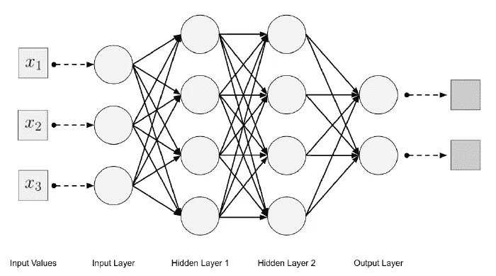
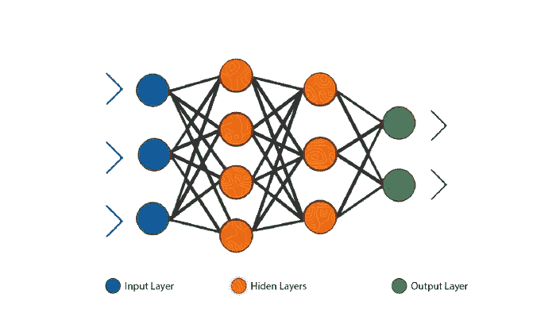
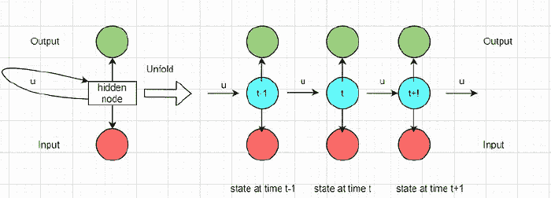
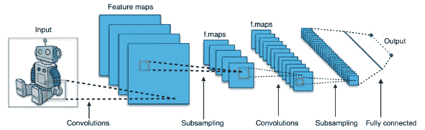
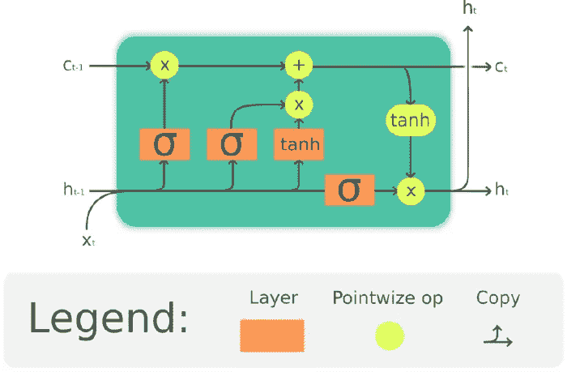
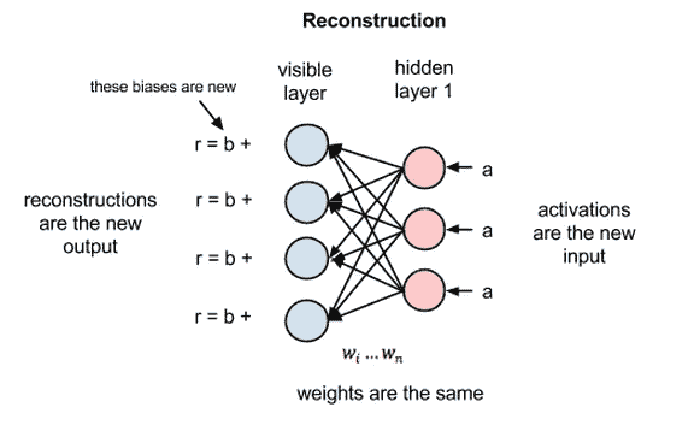
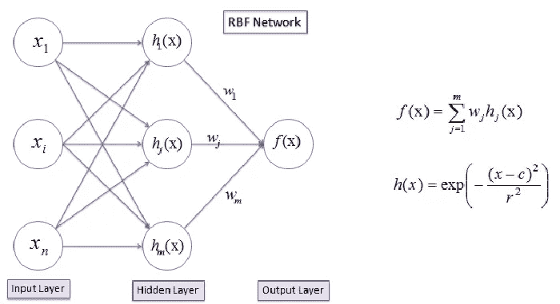
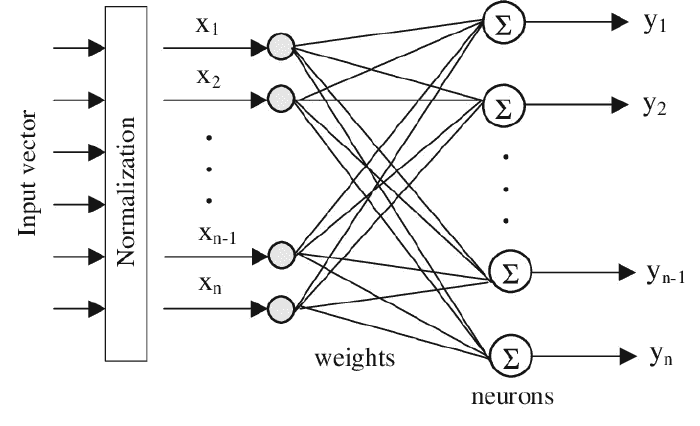
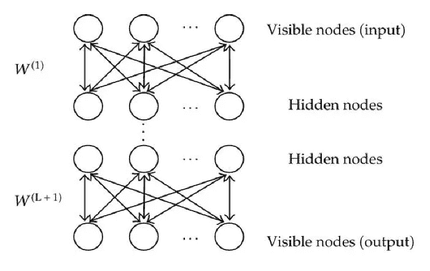
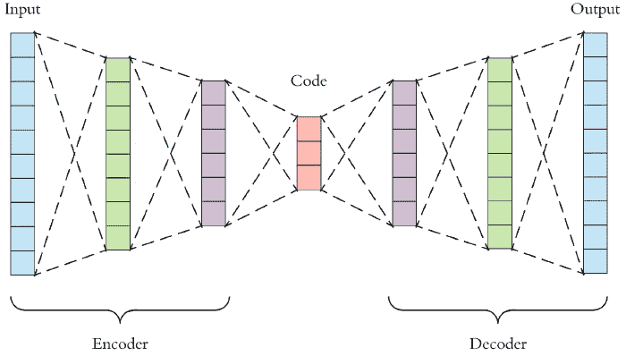

# 你应该知道的 10 大深度学习算法

> 原文：<https://betterprogramming.pub/top-10-deep-learning-algorithms-you-should-know-80363c9460b9>

## 你应该从今天开始学习和实现算法

蒂姆·莫斯霍尔德在 [Unsplash](https://unsplash.com?utm_source=medium&utm_medium=referral) 上的照片

人工智能正在以飞快的速度前进，并处于炒作的顶端。它涉及开发计算机系统，深度学习使它们能够执行需要人类智能的任务。因此，我们需要了解深度学习的基础知识，因为它已经改变了我们生活的世界。

在讨论机器用来模仿人脑的顶级深度学习算法之前，我将涵盖以下主题:

*   深度学习简介
*   什么是神经网络？
*   深度学习算法的工作原理
*   要学习的顶级深度学习算法
*   结论

# 深度学习简介

你有没有想过谷歌翻译和亚马逊 Alexa 是如何工作的？自动驾驶汽车是如何感知周围环境和检测物体的？脸书如何推荐页面、好友、产品等？嗯，都是因为深度学习才管用的。它是机器学习的一个子集，随着技术和每个商业领域的进步，它已经彻底改变了世界。它采用算法来处理数据，模仿思维过程，理解人类语言，并在视觉上识别物体。

但在技术领域，这并不是一个新概念。

深度学习的历史可以追溯到 1943 年，当时沃尔特·皮茨和沃伦·麦卡洛克通过模仿人脑的神经系统设计了一个计算机模型。他们使用阈值逻辑，即算法和数学的结合，来模拟人类的思维过程。从那以后，深度学习已经发展并在人类生活自动化中发挥了重要作用。

在深入探讨深度学习算法在各个领域的细节之前，我们必须知道什么是深度学习。因此，深度学习，人工智能世界的一个热门话题，是机器学习的一个子领域，它处理受人脑结构和功能启发的算法。它教会计算机从例子中学习，以便它们可以执行人类直观的任务。

# 什么是神经网络？

在深度学习中，神经网络发挥着至关重要的作用。我们可以将它们定义为识别数据集中相关关系的一组算法或数学处理单元。神经网络以人脑为模型，由以下部分组成:

*   输入层
*   多个隐藏层
*   输出层

深度神经网络架构

这些数据被输入到神经元中。然后，使用适当的权重和偏差将信息传递到下一层。输出是由输出图层预测的最终值。神经网络依赖于训练数据进行学习，并随着时间的推移提高其准确性。它们成为人工智能和计算机科学中的强大工具，允许我们在精确调整后高速分类和聚类数据。

# 深度学习算法的内部工作原理

深度学习模仿人脑处理数据以解决复杂问题的能力。随着这些年来它的应用越来越广泛，它的应用正在为众多行业提供动力。深度学习算法通过几层人工神经网络运行，并将简化的数据表示传递给下一层。在训练期间，他们使用输入分布中的未知元素来提取特征、分组对象和发现有用的数据模式。

例如，如果我们考虑一个非结构化的图像数据集，深度学习算法在通过每个神经网络时会逐步学习每个图像。早期的神经网络层检测边缘等低级特征，后续层通过组合早期层的特征来提供更全面的图像表示。

# 要学习的顶级深度学习算法

以下是解决复杂现实问题所需学习的顶级深度学习算法列表:

1.  多层感知器
2.  递归神经网络
3.  卷积层网络(CNN)
4.  长短期记忆网络
5.  受限玻尔兹曼机器
6.  径向基函数网络
7.  自组织地图
8.  生成对抗网络
9.  深度信念网络
10.  自动编码器

让我们简单讨论一下这些算法。

# 多层感知器

MLP 是最基本也是最古老的深度学习算法之一。它也被称为前馈神经网络的一种形式。让我们讨论一下 MLP 是如何工作的？

## MLP

*   MLP 的第一层获取输入，最后一层基于隐藏层产生输出。每个节点都连接到下一层中的节点。MLP 被称为前馈网络，因为信息在各层之间不断向前传递。

MLP 建筑

MLP 使用 sigmoid 函数如`ReLU`和`tanh`作为激活函数来确定要触发的节点。

*   MLP 使用反向传播进行训练，这是一种流行的监督学习技术。
*   每个隐藏层都有一些随机分配的值，称为权重。具有权重组合的输入被提供给激活函数，并被传递给下一层用于输出确定。如果我们没有达到期望的输出，我们计算损失并回溯以更新权重。这个过程一直持续到获得预期的输出。

# 递归神经网络

你知道为什么当你开始输入一些东西时，谷歌会自动完成句子吗？这是因为 RNN。让我们了解一下递归神经网络是如何工作的。

## RNN

*   rnn 被称为多前馈神经网络，并且在互连的节点之间具有定向循环。
*   它们是独一无二的，因为它们接受一系列没有大小限制的输入。
*   它们不仅依赖于权重来确定输出，还依赖于从先前输入中学习到的信息。
*   它们使用内存来处理下一个输入序列，实现自动完成功能。

RNN 建筑

上图显示了 RNN 每个时间状态的不同步骤。产生的输出被复制并像循环一样提供给网络。除了谷歌搜索引擎和网络浏览器，rnn 还用于文本识别，分析视频帧等。

# 卷积层网络(CNN)

CNN 是一种众所周知的深度学习算法，在对象检测和图像识别领域有许多应用。它也被称为 ConvNets。我们来讨论一下它是如何工作的。

CNN 架构

## 美国有线新闻网；卷积神经网络

CNN 的三个基本构件是:

*   卷积层——这是 CNN 最重要的部分，它使用了一组过滤器，可以被视为一层神经元。它们对输入进行加权，并根据输入大小提供输出。当应用于输入图像时，这些过滤器生成特征图。对于每个图像位置，特定的神经元被激活，并且输出被收集在特征图中。
*   池化图层-池化图层执行下采样操作，以缩小要素地图的大小。从卷积层获得的输出是一个巨大的网格阵列。因此，我们使用最大池算法来减小数组的大小，只保留数组中最重要的输入块。
*   完全连接的层-当来自汇集层的展平矩阵作为输入被馈送到完全连接的神经网络时，即所有神经元都连接时，形成该层。CNN 最常用的激活函数是 ReLU。

查看我们的[介绍 CNN 使用 keras](https://livecodestream.dev/post/a-quick-and-simple-dive-into-deep-learning-with-keras/) 来了解更多。

# 长短期记忆网络

长短期记忆网络是一种能够学习长期依赖性的递归神经网络。网络由称为单元的不同内存块组成，如下图所示:

LSTM 建筑

## LSTM

细胞记忆事物，对它们的改变是通过称为门的机制完成的。让我们讨论一下 LSTM 是如何工作的。

*   LSTM 中的`sigmoid`层决定哪些信息应该保持完整，哪些应该从单元状态中丢弃。
*   LSTM 用新信息替换上述步骤中确定的不相关信息。`sigmoid`和`tanh`在识别过程中起着重要作用。
*   单元状态有助于确定最终输出。

如果我们想了解更多，并看到一个实际的例子，请查看我们关于用 LSTM 网络预测比特币价格的[文章](https://livecodestream.dev/post/predicting-the-price-of-bitcoin-intro-to-lstm/)。

# 受限玻尔兹曼机器

RBM 是最简单的深度学习算法，由两层基本结构组成:

*   可见的输入层
*   隐蔽层

## 局部骨质量

让我们讨论一下 RBM 是如何工作的:

*   输入`x`在每个隐藏节点乘以各自的权重 w。
*   隐藏节点接收乘以各自权重和偏差值的输入。
*   激活函数将结果传递给输出层进行重建。
*   RBMs 将重建与原始输入进行比较，以确定结果的质量。

RBM 建筑

# 径向基函数网络

RBFN 使用径向基函数(RBF)作为激活函数，通过试错法确定神经网络的结构。让我们看看它是如何工作的。

## RBFN

*   在第一步中，RBFN 使用无监督学习算法(如 k-means 聚类)来确定隐藏层的中心。
*   在下一步中，它通过线性回归确定权重。均方误差(MSE)决定误差，相应地调整权重以最小化 MSE。

rbfn 架构

# 自组织映射(SOMs)

som 用于了解要素之间的相关性，并在数据集包含数百个要素时可视化数据。让我们看看它们是如何工作的。

## 索姆

*   SOMs 创建 1D 或 2D 地图，并将相似的数据项组合在一起。
*   就像其他算法一样，每个节点的权重是随机初始化的。
*   在每个阶段，从输入数据集中随机抽取一个样本向量`x`，并计算`x`与所有其他向量之间的距离。
*   在所有其他向量中投票后，选择最接近 x 的最佳匹配单元(BMU)。
*   一旦 BMU 被识别，权重向量就被更新。
*   BMU 和它的邻居被移动到更靠近输入空间中的输入向量`x`。我们重复这个过程，直到我们得到预期的结果。

SOM 架构

# 生成对抗网络

GAN 是一种无监督的学习算法，它自动发现数据，学习模式，并生成与原始数据集相似的新示例。让我们看看它是如何工作的。

## 开始

生成对抗网络包含如下两个神经网络:

*   生成器网络—这是一个生成新示例的神经网络。
*   鉴别器网络-它评估生成的示例，并决定它们是否属于实际的训练数据集。

GAN 架构

gan 生成卡通人物，编辑图像，并广泛用于游戏行业的 3D 对象生成。我们可以使用未标记的数据有效地训练 gan，以便它们可以产生真实的高质量结果。

如果你想从 GANs 的实际例子中学习，请查看我们的[用深度学习教程](https://livecodestream.dev/post/generating-images-with-deep-learning/)生成图像。

# 深度信念网络

当附加几个受限玻尔兹曼机(RBM)层时，就产生了 DBN。让我们看看网络是如何工作的。

## DBN

*   使用贪婪算法对 dbn 进行预处理。他们使用逐层方法学习所有的生成权重和自上而下的方法。
*   吉布斯采样的一些步骤在网络的顶部两个隐藏层上运行。
*   为了从可见单元中获取样本，我们对模型的其余部分使用单遍祖先采样。
*   在下一步中，潜在变量的值的学习可以通过单次自下而上的传递来结束。

DBN 建筑

# 自动编码器

自动编码器是将多维数据转换为低维数据的无监督算法。让我们看看它们是如何工作的。

## 自动编码器

自动编码器的三个主要组件是:

*   编码器—它用于将输入压缩成潜在空间表示，稍后可以对其进行重构以获得原始输入。
*   code——是潜在空间表示，即编码后得到的压缩部分。
*   解码器——用于将代码重建为原始形式。

自动编码器架构

# 结论

深度神经网络架构、计算能力和大数据的大规模部署改善了预测优化知识的传统统计模型。除了我们日常生活中的很多深度学习应用，很多人都没有认识到它的意义。

目前，许多组织正在采用先进技术的突破，如机器学习、物联网、人工智能等。，以保持行业竞争力。因此，在解决自然语言处理、语音识别和图像分类等复杂问题时，深度学习胜过了其他技术。这是因为我们不必太担心特征工程。

感谢阅读！