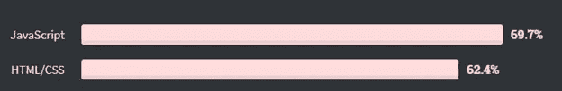
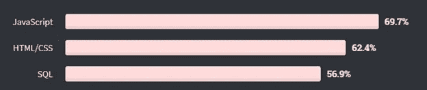
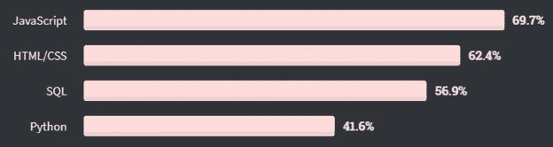
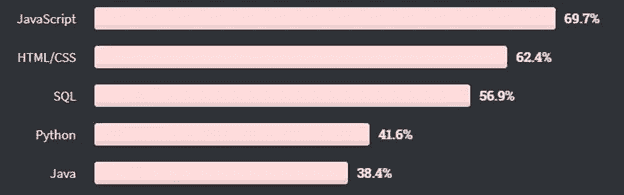
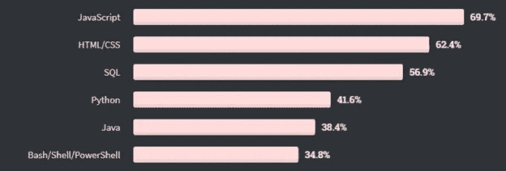
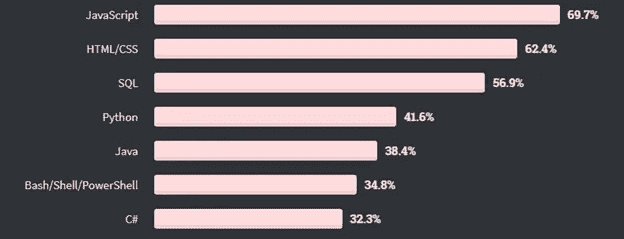
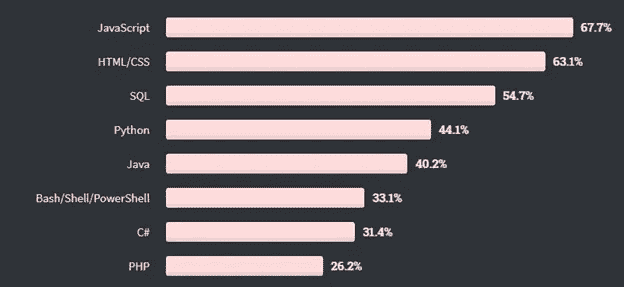
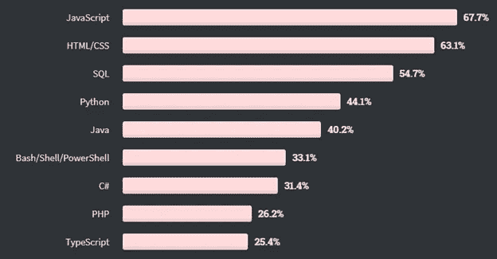
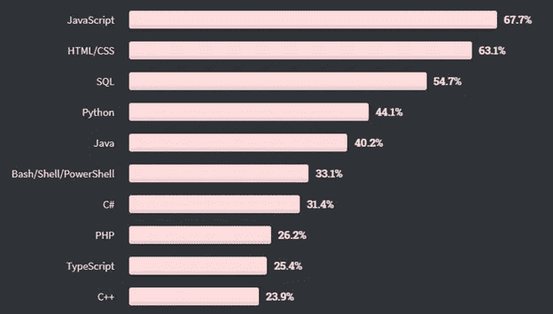
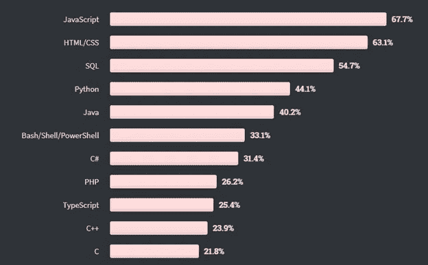

# 十大最常用的编程、脚本和标记语言

> 原文：<https://betterprogramming.pub/top-10-most-commonly-used-programming-scripting-and-markup-languages-22b16a7d8ee3>

## “设计最差”的语言领先群雄

里卡多·佩拉蒂在 [Unsplash](https://unsplash.com?utm_source=medium&utm_medium=referral) 上拍摄的照片

在世界卫生组织宣布新冠肺炎在 2020 年成为疫情之前，Stack Overflow——全世界开发者的家园——对最常用的编程、脚本和标记语言进行了年度调查[。](https://insights.stackoverflow.com/survey/2020#technology-programming-scripting-and-markup-languages-professional-developers)

对于那些不知道的人来说，Stack Overflow 的调查到现在已经运行了十年。最近的调查涉及近 65，000 人。

让我们来看看编程、脚本和标记语言哪个排名第一。

# 十大最常用的编程、脚本和标记语言

## 1.Java Script 语言

JavaScript 已经连续八年占据榜首。尽管一些程序员认为 JavaScript 不是一种设计良好的语言，但它仍然是第一名。25 岁的语言获得了 69.7%的开发者投票。

堆栈溢出

## 2.HTML/CSS

听说很多程序员都把 HTML/CSS 降级了。但是这种标记和样式语言的结合为 web 提供了动力。这是网络的开端，而且似乎不会很快消失。

二十多年前的超文本标记语言(HTML)和层叠样式表(CSS)对于 web 开发人员来说是至关重要的，就像空气对于人一样。HTML/CSS 获得 62.4%的投票。

堆栈溢出

## 3.结构化查询语言

查询语言 SQL 来了。随着人们越来越意识到数据库的重要性，懂 SQL 的人也需求量很大。

尽管仅凭 SQL 技能很难找到工作，但查询语言仍然和以前一样重要。

堆栈溢出

## 4.计算机编程语言

这种编程语言对初学者很友好。这是我在编程语言中的第一个爱好——谈谈自动化、快速构建、通用性等等。Python 能做的事情会让你大吃一惊。

我不认为这种语言会很快消失——人工智能只是要统治世界。

堆栈溢出

## 5.Java 语言(一种计算机语言，尤用于创建网站)

Java 依赖于 20 年前编写的编程代码。它会很快死去吗？

人们说这种编程语言不会很快走向任何地方。这不仅是因为它的生态系统，还因为甲骨文正在努力投资，让这种语言牢牢扎根。

堆栈溢出

## 6.Bash/Shell/PowerShell

他们在 6 号。我记得当我的电脑上的蟒蛇无法工作，Jupyter 笔记本没有用的时候——没有蟒蛇，没有 Jupyter 笔记本。

使用命令语言解释器，我[让 Jupyter 笔记本起死回生，没有 Anaconda](/install-jupyter-notebooks-without-anaconda-5a19ac20bae2) 。

我称它们为快速修复的后台。

堆栈溢出

## 7.C#

微软在 2001 年推出了这种编程语言。我读到 C#不会很快消亡而是会进化。程序员们提出了 C#是作为一种面向对象的语言开始的论点。随着时间的推移，它成为一种多范式语言，允许支持性、泛型、声明性和函数式编程风格。

你认为 C#的未来会怎样？

堆栈溢出

## 8.服务器端编程语言（Professional Hypertext Preprocessor 的缩写）

[W3Techs](https://w3techs.com/technologies/details/pl-php) 曾经报道过，在他们知道的所有服务器端编程语言的网站中，有 79.2%使用 PHP。但是这五年对 PHP 开发者的需求到底有多高？

美国劳工统计局预计，2019 年至 2029 年间，网络开发人员的就业增长将达到 8%。然而，将技能扩展到 PHP 之外的开发人员将会经历最多的工作增长。

堆栈溢出

## 9.以打字打的文件

TypeScript 是一种开源编程语言，也是由微软在 2012 年开发的。这种语言不到十年。TypeScript 和 JavaScript 是两种不同的语言，尽管 TypeScript 在很大程度上基于 JavaScript。

TypeScript 会像 JavaScript 一样通过时间的考验吗？时间会证明一切。

堆栈溢出

## 10.C++

比雅尼·斯特劳斯特鲁普创造了这种语言，并于 1985 年发布了第一版。[2006 年](https://dl.acm.org/doi/abs/10.1145/3386320)，C++开发者人数上升到 300 万。快速跟踪到 2020 年，这个数字达到 450 万。你会说这是一个小小的增长。

Stroustrup 呼吁简化 C++的使用。我们等着看这将把语言引向何方。

堆栈溢出

# 最终想法

编程的世界是不可预测的。你不能保证一种编程语言永远处于领先地位。

尽管语言在发展，但大部分工作仍取决于语言使用者，他们需要不断学习并保持更新。

无论你决定使用哪种语言，都要坚持学习并保持更新。你不会很快失业的。