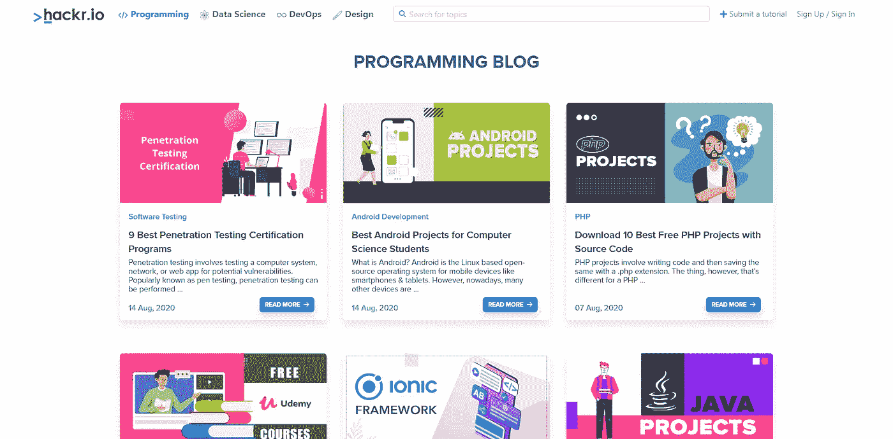
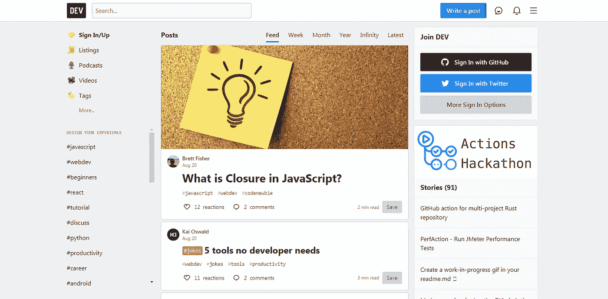
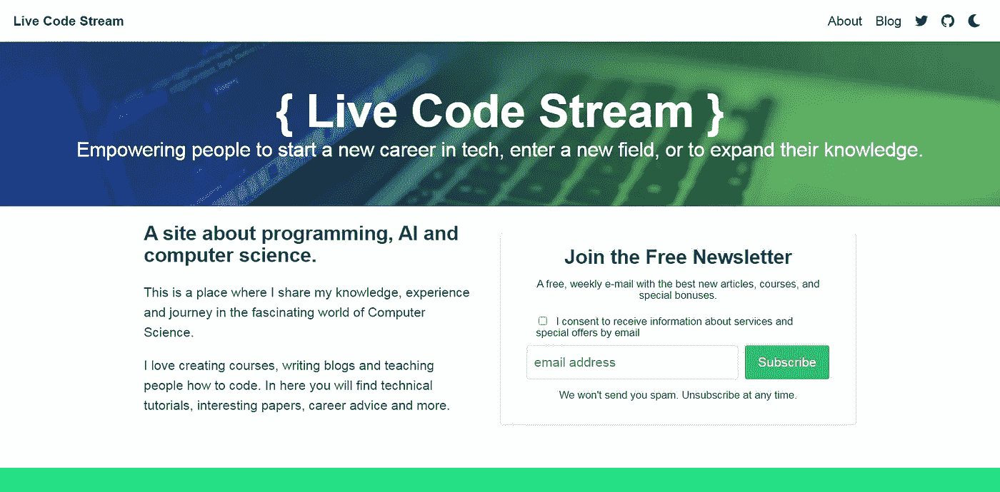
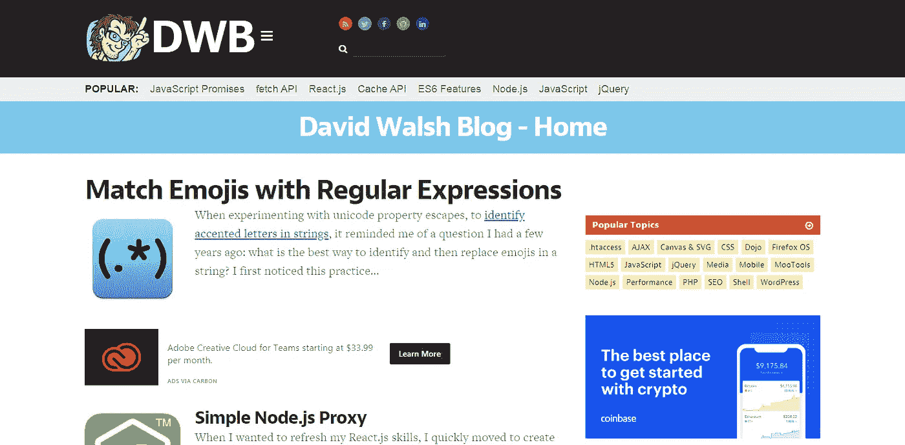
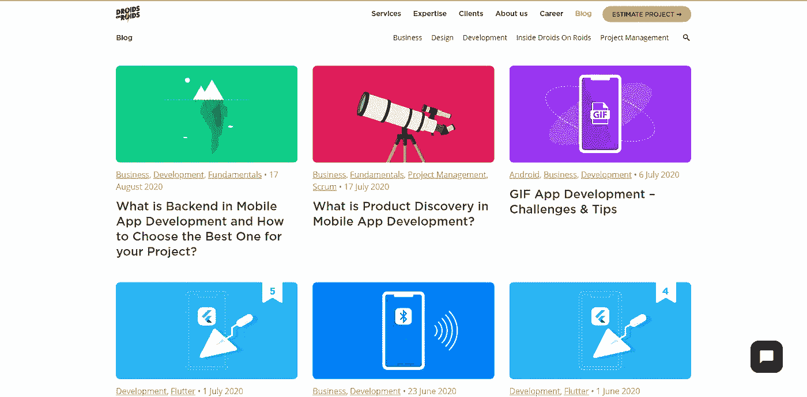
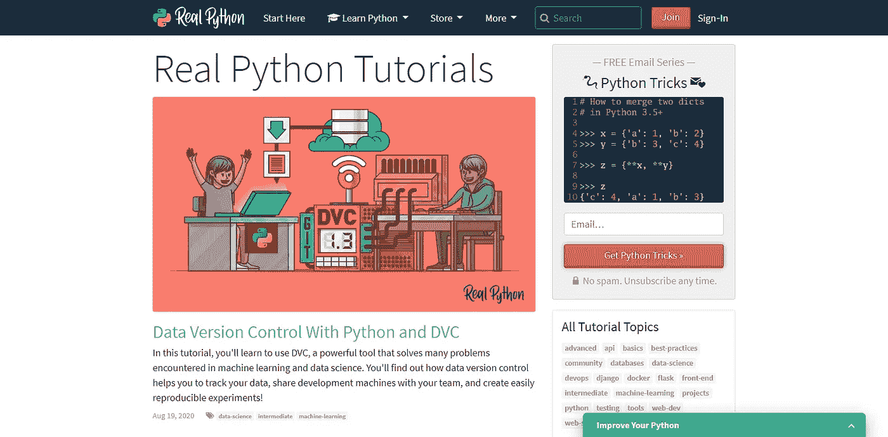
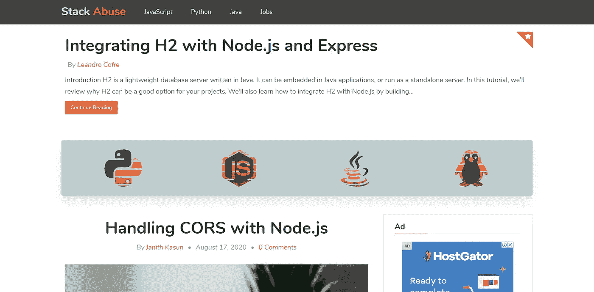

# 2020 年十大编程博客

> 原文：<https://betterprogramming.pub/top-10-programming-blogs-in-2020-dda86feead1f>

## 我钦佩的人或大型社区的博客

乔尔·穆尼斯在 [Unsplash](https://unsplash.com/s/photos/reading?utm_source=unsplash&utm_medium=referral&utm_content=creditCopyText) 上拍摄的照片

编程是一个有趣的领域，因为它赋予我们控制计算机系统的超能力。它可以用于飞机、交通控制、机器人、自动驾驶汽车、网站、移动应用程序以及许多其他用例。

现在最主要的是软件工程师创造了几种编程语言，每一种都适合解决不同的问题。

今天，我将与你分享一些网站和博客，它们描述了不同的编程语言以及使用它们的最佳实践。

这个列表没有特定的顺序，所有的都是很好的读物！

(这不是赞助帖。所有列出的博客都是我最喜欢读的。)

# [hackr.io 博客](https://hackr.io/blog)

Hackr 主页

hackr.io 基本上就是一个大家推荐编程课程的网站，最好的排名靠前。提到这个博客的原因是他们的团队定期为软件开发人员发布有趣的教程和信息指南。

例如，您可以了解移动和 web 开发框架、Java 项目、软件测试、面试问题等等。

但是请记住，他们每次发表文章都会写一个完全不同的主题。因此，如果你对特定的编程语言感兴趣，这可能不是最好的博客。

# [更好的编程](https://medium.com/better-programming)

更好的编程主页

Better Programming 是一个致力于编程的[媒体](https://medium.com/)出版物。他们每天发布来自多个作者的多篇文章，所有文章都经过策划和编辑，以保证内容精彩，阅读量大。

它们涵盖了各种主题和编程语言，内容面向初学者和非常高级的读者。如果你想发展你的编程技能，这是你每天必不可少的。

坦白地说，我是 Better Programming 的一名普通作家，但在我开始创作自己的内容之前，我曾经是一名读者。当我有机会和他们一起发表我的文章时，我非常高兴。

# [开发](https://dev.to/)

DEV 社区主页

协作在开发高质量软件中起着关键作用。这是 DEV 社区存在的唯一原因。它使软件开发者能够通过发布信息文章与全世界分享他们的知识。

我个人建议你定期访问这个网站，关注开发领域正在发生的事情。

DEV 的一大优点是他们的网站代码是完全开源的。这意味着你可以很容易地看到这个神奇网站的源代码。

# [黑客正午](https://hackernoon.com/)

黑客正午主页

和 DEV 一样，Hacker Noon 也是一个社区运营的网站。它拥有 7000 多名活跃的贡献者，为软件开发人员撰写各种各样但相关的主题。

它专注于编程、创业、技术、企业家精神、商业、营销等方面。

在我看来，我们开发人员对软件和技术的商业方面还不够熟悉。所以 Hacker Noon 可以成为一个学习编程以及如何从中赚钱的绝佳平台。

# [直播码流](https://livecodestream.dev/)

实时代码流主页

这是我自己创作的博客。它致力于编程和人工智能，旨在与您分享我的开发经验。

你会看到我写关于人工智能、编程(主要是 Python 和 JavaScript)、机器学习，以及在项目中使用它们的最佳方式。

该网站针对加载速度和阅读舒适度进行了优化，为喜欢黑暗模式的人提供了黑暗模式。

实际上，与许多其他博客不同，我使用了一个名为 [Hugo](https://gohugo.io/) 的静态站点生成器来生成这个网站。与 WordPress 这样的 CMS 相比，它的主要优势是速度。

我用 AWS 和用户友好的 URL 创建了一个关于[静态托管的教程。](https://livecodestream.dev/post/2020-05-08-static-hosting-with-aws/)

# [大卫·沃什博客(DWB)](https://davidwalsh.name/)

大卫·沃尔什主页

David Walsh 是开发人员社区中非常受欢迎的博客作者。基本上，他是一名在科技巨头 Mozilla 工作的软件工程师。

如果你曾经试图学习 web 开发，那么你可能会遇到由[Mozilla Developer Network(MDN)](https://developer.mozilla.org/en-US/)提供的循序渐进的文档。大卫·沃尔什是那个网站最大的改进者。

所以考虑到他在 web 开发领域的知识和经验，你肯定会从他的博客中学到很多。

# 机器人博客上的机器人

roids 主页上的机器人

想学习移动应用程序开发吗？

这个博客定期为初学者发布最佳实践和操作指南。它将帮助你理解创造优秀用户体验的重要性。

他们有关于 Android、iOS、Flutter 和许多其他应用程序开发框架或工具的文章。

因此，请跟随他们，了解最新的移动开发趋势。

# [真正的蟒蛇](https://realpython.com/)

真正的 Python 主页

毫无疑问，Python 是一种全天候的语言——这意味着你可以使用 Python 开发移动应用、游戏、网站、嵌入式应用，甚至是机器学习项目。

顾名思义，Real Python 是一个完全专注于提供关于 Python 编程语言的高质量教程和课程的网站。

如今，Python 也作为第一编程语言在世界各地的不同学校被教授。如果你也开始了，那么我强烈建议你访问这个网站，并遵循他们的一步一步的指南。

# [Golang 节目](https://www.golangprograms.com/)

Golang 计划主页

Go 是由谷歌聪明的软件工程师设计的一种编程语言。它的性能比大多数高级编程语言都要好。这就是程序员喜欢在他们的技术堆栈中添加 Go 的原因。

如果你是一个完全陌生的人，那么这个网站将帮助你快速入门。他们有初学者友好的教程系列和由专业人士撰写的参考资料。

不时地，您还会看到不同问题的示例和解决方案，这是了解 Go 编程语言的真实实现的好方法。

# [堆栈滥用](https://stackabuse.com/)

堆栈滥用主页

堆栈滥用主要集中在 Python、JavaScript、Java 和 Unix 操作系统等主题上。它由斯科特·罗宾逊和一个内容作者团队管理。

他们通常会发布操作指南，并通过示例代码片段来教你。

这将是学习基于项目的概念的有用资源。但在此之前，您必须对 JavaScript、Python 和 Java 的基础有所了解。

# 结论

作为初学者，学习编程语言可能会成为一项艰巨的任务。所以写这篇文章的主要目的是向你介绍有趣的编程博客。

现在，轮到你关注这些网站，让你的编程技能更上一层楼。

感谢阅读！