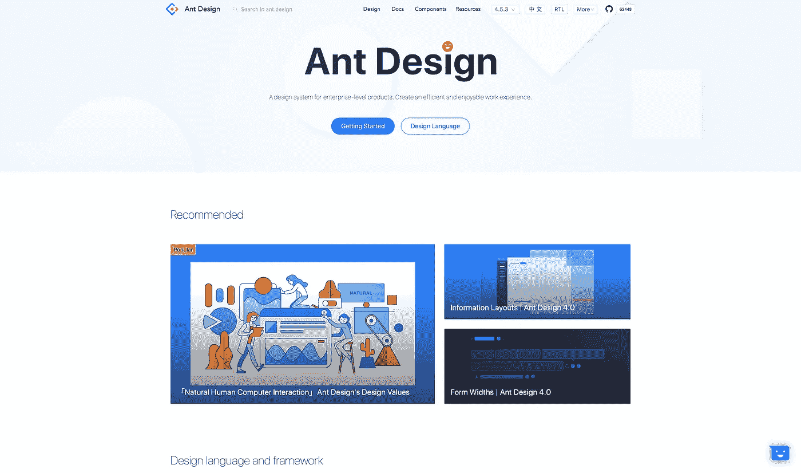
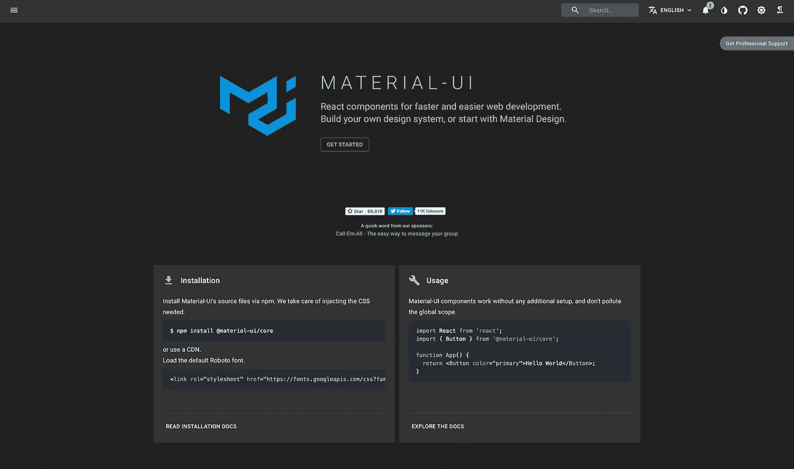
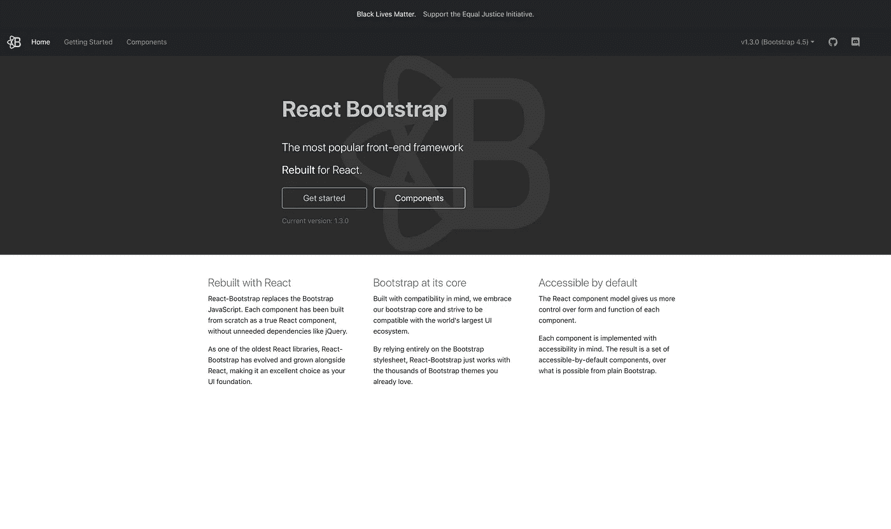
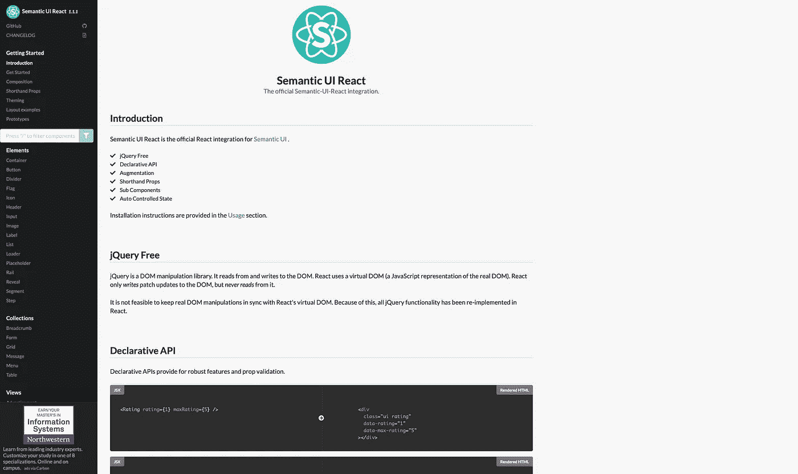
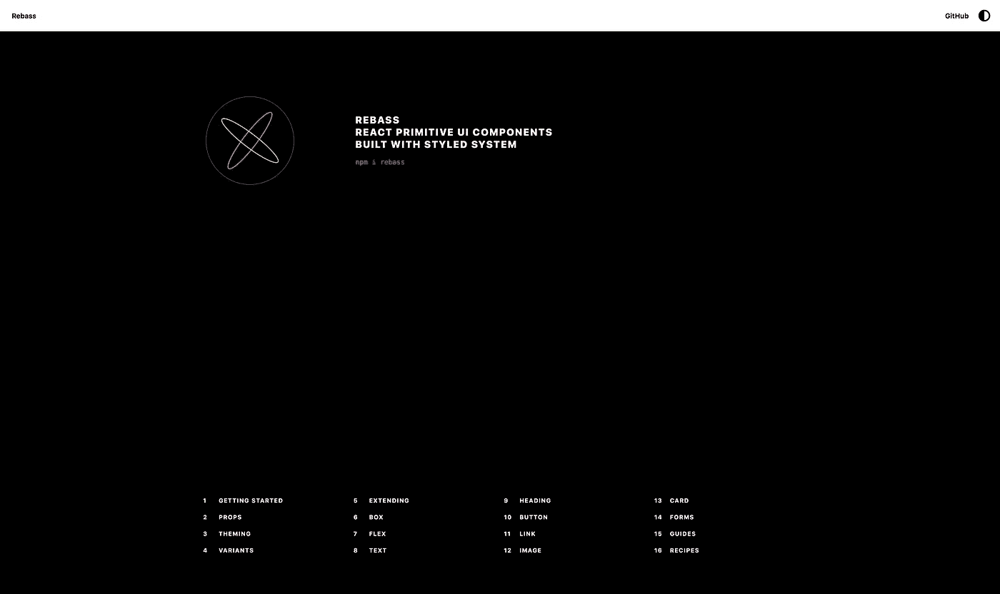
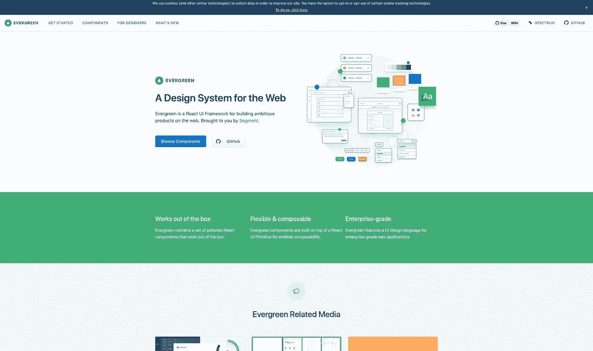
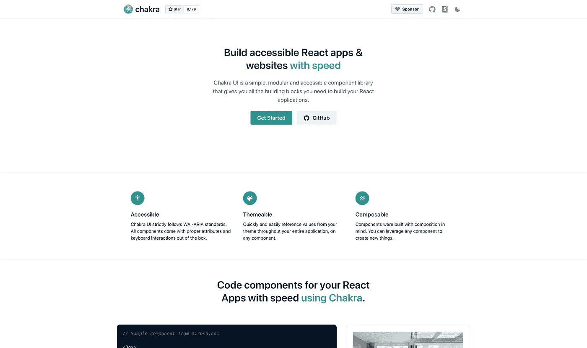
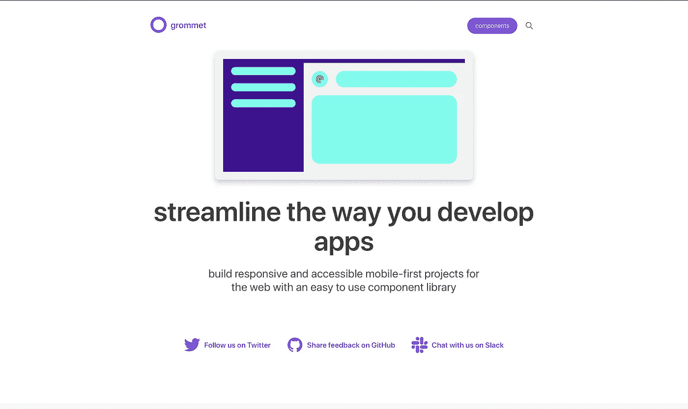

# 十大 React 组件库

> 原文：<https://betterprogramming.pub/top-10-react-component-libraries-6c83954bfc68>

## 不要花时间担心设计，从一开始就让你的项目变得漂亮

费伦茨·阿尔马西在 [Unsplash](https://unsplash.com?utm_source=medium&utm_medium=referral) 上的照片

React 是开发人员创建单页面应用程序(spa)最流行的前端框架之一。React 社区开发了大量组件库来帮助加速开发。

在本文中，我们将看看 2020 年左右最好的 React 组件库。

# 1.蚂蚁设计

[蚂蚁设计](https://ant.design/)是一套为 web 应用设计的企业级 ui。

它提供了 50 多个可定制的组件，可以用来制作漂亮的应用程序，比如卡片、按钮、各种布局助手、导航条等等。

蚂蚁设计最近击败了 Material UI，成为了 [GitHub](https://github.com/ant-design/ant-design) 上最受欢迎的 React UI 库，拥有超过 56k 颗星。它被用在[大量的应用中](https://ant.design/docs/spec/cases)，跨越了众多的行业，所以它得到了很好的支持。

Ant 设计的每个方面都是经过深思熟虑的，甚至是最小的细节。它是基于制造商创造的[设计系统](https://ant.design/docs/spec/introduce)建造的。

它是专门为内部桌面应用程序创建的，基于几个原则和统一的规范。使用 Ant Design，您可以轻松地在应用程序的所有组件之间创建一致的外观。

还有一个为 React Native 设计的[移动版](https://mobile.ant.design/)。

# 2.材料用户界面

[Material UI](https://material-ui.com/) 是一组围绕 Google Material spec 设计的组件。有了创建一个杀手级 React 应用程序的所有必要组件，Material UI 提供了一种将 Google Material style 系统集成到您的应用程序中的简单方法。

MaterialUI 有一群活跃的维护者和强大的社区支持。它目前在 GitHub 上有超过 54k 颗星星，使它成为最受欢迎的组件库之一。

更好的是，组件彼此完全独立，只注入它们需要显示的样式，这对性能更好。

如果你想快速构建一个轻量级的、一致的、干净的界面，Material UI 是一个不错的选择。

你可以在他们的入门信息中了解更多关于 [Material UI](https://material-ui.com/getting-started/installation/) 的信息。

# 3.反应引导

你可能对流行的[引导库](https://github.com/react-bootstrap/react-bootstrap)很熟悉。React Bootstrap 是 React Bootstrap 的翻版，用组件代替了样式。

如果你有 web 开发背景，由于熟悉 React Bootstrap，你可能会感觉很舒服。

它多年来越来越受欢迎，现在在 GitHub 上有超过 18k 颗星，在 [NPM 周刊](https://www.npmjs.com/package/react-bootstrap)上有超过 50 万次下载。

这是目前为止在 React 中开始使用 Bootstrap 的最佳方式。

# 4.蓝图用户界面

[蓝图 UI](https://blueprintjs.com/) 是另一个 React 组件库。它针对构建需要在所有平台上得到支持的数据密集型应用程序进行了优化。它不是移动优先的工具包，而是为桌面应用程序设计的。

Github[上有超过 16k 颗星星，它得到了很好的支持，非常受开发者欢迎。如果您的应用程序需要显示大量数据，Blueprint UI 可能是一个很好的选择。](https://github.com/palantir/blueprint)

要了解它的工作原理和它提供的组件，你可以在 [CodeSandbox](https://codesandbox.io/s/nko3k41y60) 上查看。

# 5.语义 UI 反应

[语义 UI React](https://react.semantic-ui.com/) 是语义 UI 的官方 React 集成。它不含 jQuery，并使用声明式 API 方法，这使得它更简洁易用。

语义 UI React 在 [Github](https://github.com/Semantic-Org/Semantic-UI-React) 上有 11.5k 颗星，所以虽然不像其他一些框架那样受欢迎，但它得到了语义的良好支持。

如果你想用 React 构建应用，并想确保 100%语义友好的代码，你绝对应该去看看。

# 6.雷巴斯

[Rebass](https://rebassjs.org/) 是一个非常轻量级的库，基于[风格的系统](https://styled-system.com/)库创建可主题化的组件。

Rebass 是一个原始组件库，这意味着它在默认情况下没有风格化(注入自己的风格),并且只关注原始组件(如按钮、布局组件等)。)

如果你不想完全依赖组件库，并打算在开发过程中扩展一个已经存在的组件库，你一定要看看 Rebass。

它正迅速流行起来。该项目目前在 [GitHub](https://github.com/rebassjs/rebass) 上有超过 6k 颗星星。

# 7.流畅的用户界面

如果你用过微软的产品，你就用过流畅的 UI。 [Fluent UI](https://developer.microsoft.com/en-us/fluentui/#/) 是一套基于微软设计语言构建的 UI 组件。

UI 库提供了与桌面、Android 和 iOS 设备的兼容性，并由 Office 365、OneNote、Azure DevOps 和其他微软产品等网站使用。

它包含许多预构建的组件，可以非常快速地构建应用程序原型。

该库在 [Github](https://github.com/microsoft/fluentui) 上有 9k 颗星星，并得到了微软的大力支持。

# 8.常绿树

[Evergreen UI](https://evergreen.segment.com) 是一个分段设计的组件库。这是一个开源项目，拥有所有基本 web 功能的组件。

最好的事情之一是它们解释了所有的设计决策。

Evergreen 的设计轻巧、简单、直观。您可以使用它快速开始构建优雅的用户界面。

Evergreen 在 [Github](https://github.com/segmentio/evergreen/stargazers/) 上差不多有 10k 颗星。

# 9.Chakra UI

[Chakra UI](https://chakra-ui.com) 是一个简单的模块化组件库，拥有所有必要的 web 构建模块。

它的设计考虑了无障碍规范，符合 WAI-ARIA。

所有组件都很容易主题化，因为所有值都可以在整个应用程序中引用。

通过将所有的构件放在一起，也很容易组成新的组件。

它在 [Github](https://github.com/chakra-ui/chakra-ui) 上拥有近 9k 颗星星，并在 React 开发者社区中迅速流行起来。

# 10.索环

[Grommet](https://v2.grommet.io) 是一个 React 框架，它在一个整洁的包中提供了可访问的、模块化的、可响应的和可主题化的组件。

Grommet 提供了对 W3c 的 WCAG 2.1 规范的现成支持，因此每个人都可以访问它。

Grommet 拥有强大的主题工具，可以轻松定制每个组件的任何方面。

Grommet 被许多大公司使用，如网飞、Github 和优步，在 Github 上有将近 7k 颗星。

# 结论

选择 React 组件库并非易事，因为没有放之四海而皆准的解决方案。我建议仔细查看您的需求、首选的开发人员风格和每个框架，看看哪一个最吸引您。

最后，最好的框架是适合你的。

感谢阅读！