# 2022 年您需要的 10 大智能合同开发工具

> 原文：<https://betterprogramming.pub/top-10-smart-contract-developer-tools-you-need-for-2022-b763f5df689a>

## 智能合约、区块链、Web3、以太坊和 Solidity 开发者的全面工具指南。另外，简要介绍一下 Solana、Terra 和其他基于 rust 的工具

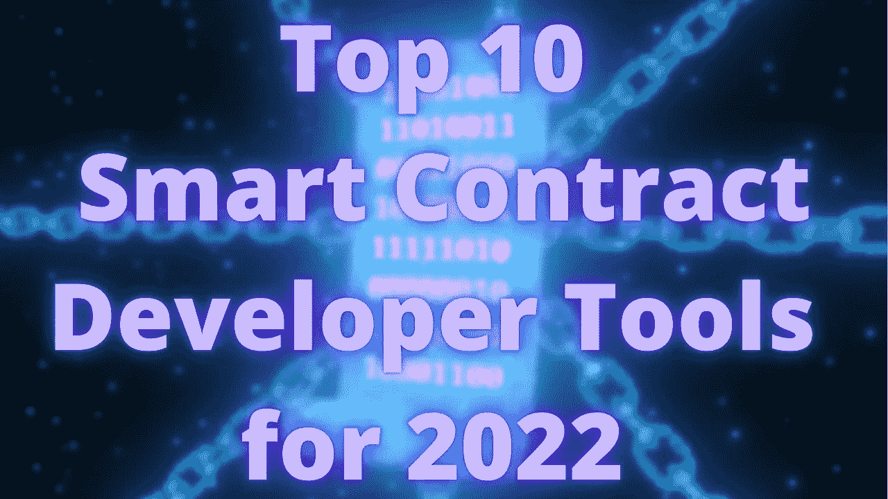

原始图片来自 Getty Images IncrediVFX

去年，我关注了[顶级智能合同开发者框架、](/the-top-blockchain-developer-frameworks-for-2021-89afa5e7bd04?sk=e7e2b2fb5b34d58e3cd20877fa33df51)，今年，我们将继续关注更多、*方式*。

我们将看看十类工具，然后看看每个类别中针对智能合约/区块链/solidity/vyper/rust/web3 开发人员的顶级工具(我们现在有太多“区块链开发人员”的术语了，不是吗)。

我在某种程度上使用过这个列表中的每一个工具，所以你可以放心，我不是在复制粘贴某个列表。对于那些不认识我的人来说，我生活在智能合同中，与一些业内最优秀的人一起工作，我是 [Chainlink](https://chain.link/) 项目的开发者倡导者，我自己的[区块链基础设施公司](https://alphachain.io/)的首席执行官，也是 web3 的爱好者。这些将会给你世界上最好的开发人员所使用的东西。然而，这个列表并不是所有东西的列表，所以如果我错过了你的工具，对不起！这只是我认为每个开发人员都需要注意的一个列表。所以，让我们开始吧！

```
**Table Of Contents**Smart Contract Langage
Smart Contract Essentials
Deployment & Testing Framework
Wallet
Block Explorer
Layer 1 Connection
Front End Tools
Help & Support
Security Analysis
Monitoring & Maintainance
```

另外，我们制作了一个关于这个话题的视频，如果你想看的话！

我关于这个主题的精彩视频

# 1.智能合同语言

该语言是任何智能合同开发人员最基础的部分，也是如何编写智能合同的部分！从这些语言中选择一种，然后开始。

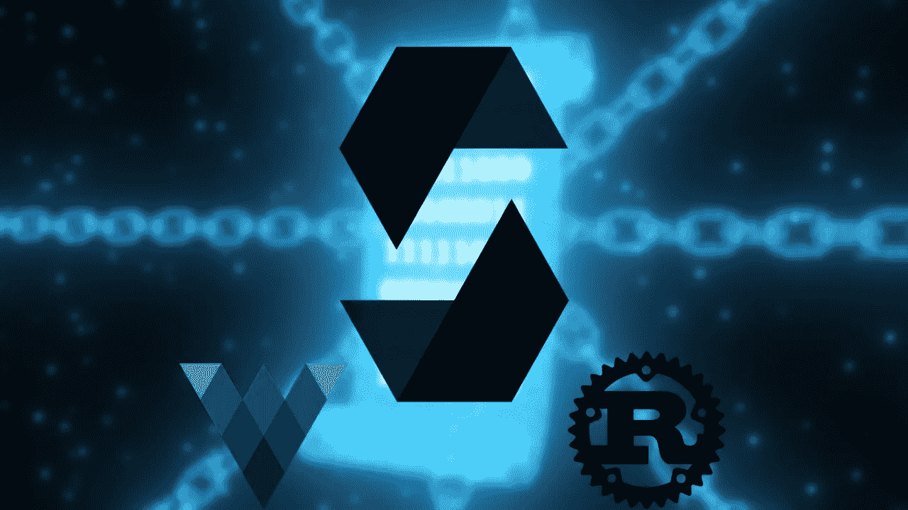

原始图片来自 Getty Images IncrediVFX

## 固态

如果你是新来的，你应该从[坚实度](https://docs.soliditylang.org/)开始。如果你一直在做聪明的合同，你可能知道可靠。Solidity 是最主要的、使用最多的智能契约开发语言，这也难怪。Solidity 适用于大多数智能合约平台，如以太坊、雪崩、月光、多边形、BSC 等等。这是因为大多数区块链采用了[以太坊虚拟机(EVM)](https://ethereum.org/en/developers/docs/evm/) ，这就是 solidity 的初衷。在目前十大 Defi 项目中，十个中有九个使用 solidity 作为他们的主要编程语言。

如果让我猜的话，我会想象世界上 90%的智能合同价值都是由可靠性完成的。这种语言得到了积极的维护和大量的支持。

你也可以把 [yul/assembly](https://docs.soliditylang.org/en/v0.8.9/yul.html) 定义为另一种语言，但是它是和 solidity 一起使用的，所以我不把它算作自己的语言。

## Vyper

[Vyper](https://vyper.readthedocs.io/en/stable/) 是另一种 EVM 兼容语言，它主要由[十大 Defi 项目](https://defillama.com/)中的一个使用(其他一些项目也将其作为辅助语言)，即 [Curve.fi](https://curve.fi/) 。Vyper 是一种基于 python 的语言，我很喜欢使用它。它没有 EVM 兄弟的坚固性那么有用；然而，如果你喜欢 python，这是一种你可能想尝试的语言。

## 锈

Rust[是这个街区的新成员，你将无法使用它与我们的 EVM 区块链像以太坊，多边形，币安智能链，等等。然而，有了 Rust，你将能够部署到像](https://www.rust-lang.org/)[索拉纳](https://solana.com/)、[特拉](https://docs.terra.money/Tutorials/Smart-contracts/Overview.html)这样的链上，并用[波尔卡多特](https://polkadot.network/)建造区块链。Rust 是一种高性能的通用语言，甚至可以在智能合约之外使用；因此，其他连锁店正选择捡起它。逻辑是，“哦，好吧，有些开发者已经知道 rust 了，我们还不如让人们到处使用 rust。”

如果你想进入这些崭露头角的区块链，Rust 是个不错的选择。如果非要我猜的话，我会说 Rust 包含了目前世界上锁定在智能合约中的大约 5%的价值…但这只是一个猜测。

## 智能合同语言摘要

**必读:**扎实

Python 爱好者:Vyper

Terra，Solana，Polkadot 等:锈病

# 2.智能合同要点

这就是我们谈论在您的智能合同中使用*的工具的地方。你不必在这里只选择一个。如果你喜欢，你可以使用所有这些！我不确定如何对这些进行分类，但我认为“必需品”是好的，因为…嗯，它们是必不可少的。*

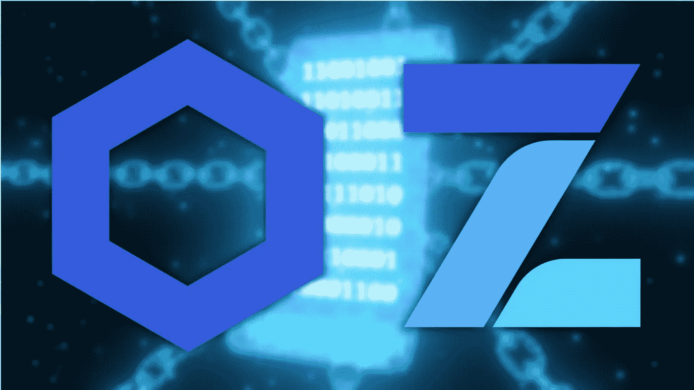

原始图片来自 Getty Images IncrediVFX

## 链环

Chainlink 是所谓的[区块链甲骨文](https://chain.link/education/blockchain-oracles)，这意味着它是一种使你的智能合约成为[混合智能合约](https://blog.chain.link/hybrid-smart-contracts-explained/)的设备，这意味着它们包括一些链外组件，并与现实世界连接。智能合约很棒，但它们有一个巨大的问题，就是无法以任何方式与世界联系起来。现在，要使用一些链外组件(如数据或外部计算)来保持我们的智能契约分散化，我们必须*也*让我们的外部数据和计算分散化，这正是 Chainlink 网络和工具的用途。

绝大多数顶级智能合约平台都是混合智能合约，并使用这些 oracles 作为其基础架构的关键组件。看看 [DeFipulse](https://defipulse.com/) 的前 10 个项目，看看哪些是混合的。

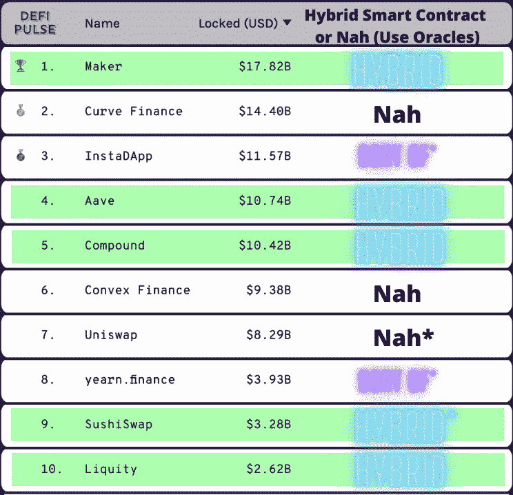

Asterik 的解释*: Uniswap 有一个 oracle 产品。和 Instadapp 是使用 oracles 混合协议的聚合器。Sushiswap 使用甲骨文进行杠杆交易。

我们可以看到，至少有 50%的人将 Oracle 作为基础设施的重要组成部分，另外 30%(总共 80%)的人以某种方式使用 Oracle。您可以获得资产[定价信息](https://docs.chain.link/docs/get-the-latest-price/)、[随机数](https://docs.chain.link/docs/get-a-random-number/)、[事件驱动执行、](https://docs.chain.link/docs/chainlink-keepers/introduction/)等等。

对于任何进入这个领域的智能合约开发者来说，Chainlink 都是一个必不可少的特性，[无论是语言还是区块链](https://docs.chain.link/)！

此外，在 2020 年*和 2021 年*，我们[目睹了](https://rekt.news/leaderboard/)[闪贷攻击](https://www.coindesk.com/tech/2020/11/11/flash-loans-arent-the-problem-centralized-price-oracles-are/)甲骨文操纵攻击的无数黑客攻击，以及在 Defi 领域造成近*数十亿*美元损失的类似攻击。最让我受不了的是，通过使用像 Chainlink 这样的神谕，其中一半以上都是可以避免的。求求你，求求你，2022 年不要让你或者你的朋友使用集中式或者不安全的神谕。

请使用安全的 oracle 解决方案，如 Chainlink。我们不能让 2022 年成为另一个年，我们会“哎呀，用了一个集中式 oracle，我的用户损失了 1 亿美元”。因此，请熟悉 Chainlink，以制作惊人的、健壮的应用程序，并保护自己免受可避免的攻击。

## Openzeppelin

Openzeppelin 已经巩固了自己作为“可靠性标准库”的地位任何时候，任何开发人员(包括我自己)都在寻找一种快速部署 NFT/ERC721 、 [ERC20](/python-blockchain-token-deployment-tutorial-create-an-erc20-77a5fd2e1a58) 、[可升级契约](https://www.youtube.com/watch?v=bdXJmWajZRY)、[DAOs/治理](https://github.com/brownie-mix/dao-mix)的方法，或者许多开发人员在这一领域所做的任何事情，十有八九，你会想要一个 Openzeppelin 包。

Openzeppelin 是一套已经编写好的智能合约，因此您不必重新发明轮子。在我的项目中使用他们已经审核过的可扩展智能合同，我已经节省了无数的时间。我不能强调 Openzeppelin 有多重要。我想在我大约 80%的教程中，我都会在某种程度上使用 Openzeppelin。

## 智能合同要点摘要

**必读:** Chainlink & Openzeppelin

你可以(或许应该)同时使用这两种方法。我怎么强调对这些技术的了解都不为过。

# 3.部署和测试框架

去年，我的评论[专门针对这一类别](/the-top-blockchain-developer-frameworks-for-2021-89afa5e7bd04)，所以今年，我将确保给你我认为这些框架目前所处的位置`diff`。智能契约框架是任何开发人员旅程的重要组成部分。它们允许您有效地测试和部署您的智能合约。至少拥有一个是成功的关键一步。

为了让你开始，看一下我根据 Defipulse 和他们使用的框架编辑的显示顶级 Defi 项目的图表。

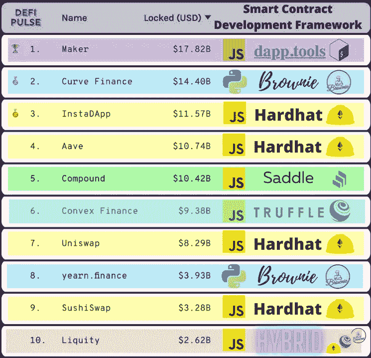

展示了 Defipulse 的 10 大 Defi 项目及其使用的智能合同开发框架。

此外，以下是我对当前框架前景的看法:

## 最大的惊喜是:

[安全帽](https://hardhat.org/)、[布朗尼](https://eth-brownie.readthedocs.io/en/stable/)、[小工具](https://dapp.tools/)

## 好的方面:

[混合](https://remix.ethereum.org/#optimize=false&runs=200)，[松露](https://trufflesuite.com/)，[阿佩沃克斯](https://www.apeworx.io/)，[铸造厂](https://github.com/gakonst/foundry)

## 另类的:

[华夫饼](https://github.com/EthWorks/Waffle)，[SBT-以太坊](https://www.sbt-ethereum.io/)， [web3j](https://www.web3labs.com/web3j-sdk) ，[开船](https://framework.embarklabs.io/)，[马鞍](https://github.com/compound-finance/saddle)

## 非 EVM 国家:

[锚](https://project-serum.github.io/anchor/getting-started/introduction.html)， [TerraSDK](https://docs.terra.money/)

## 过时:

以太石灰、Openzeppelin SDK、眼镜蛇、阳伞

我不会报道过时的内容；见[我去年对它们的评论](/the-top-blockchain-developer-frameworks-for-2021-89afa5e7bd04)。

我们开始吧。

# 令人惊奇的大家伙

## 建筑工人

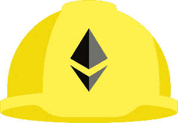

[安全帽](https://hardhat.org/)标志

现在，hardhat 框架无疑是最主要的智能契约开发框架。Hardhat 是一个基于 javascript 和 solidity 的开发框架，它很好地完成了让您的应用程序快速运行的工作。你可以查看[安全帽初学者工具包](https://github.com/smartcontractkit/hardhat-starter-kit)来看看安全帽项目的例子。

有了 Hardhat 的测试速度、typescript 支持、广泛的采用、令人难以置信的注重开发人员体验的团队，难怪它会如此迅速地流行起来。大约在去年的这个时候，我把这个框架放在了首位，直到今天它还在那里。它在后端使用 [ethersjs](https://docs.ethers.io/v5/getting-started/) ,它自己的本地区块链进行测试，该团队目前正在建立[一个新的尖端开发平台](https://medium.com/nomic-labs-blog/slang-rethnet-2ad465fd7880),集成到 Hardhat 中，我很兴奋能在 2022 年尝试。

如果你了解我的话，我并不是 javascript 的最大粉丝，因为它的所有[古怪之处](https://www.youtube.com/watch?v=3se2-thqf-A)，所以我通常更喜欢使用带有 typescript 的 Hardhat。Hardhat 无疑是我第二常用的框架。

如果你喜欢 javascript 或者你想使用最受欢迎、支持最多的框架，我强烈推荐这个框架。

## 布朗尼

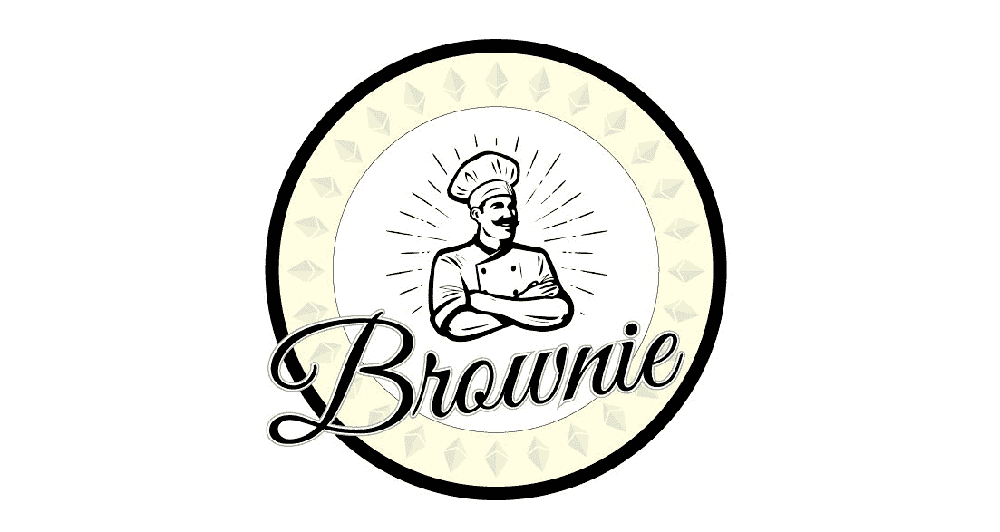

[ETH Brownie](https://github.com/eth-brownie/brownie) 标志

我喜欢这个框架，如果你读过我的其他材料，你会知道这一点。

Brownie 是一个基于 python 的开源框架，构建在 [web3.py](https://web3py.readthedocs.io/en/stable/) 之上，由 [Curve.fi](https://curve.fi/) 、[earning . finance](https://yearn.finance/)和 [Badger](https://badger.com/) 等协议使用。它支持 solidity 和 vyper，但是这个框架的主要吸引力是基于 python 的。Brownie 的诞生是因为很多 python 工程师鄙视使用 javascript，他们想要一个 python 框架。此外，大多数传统的金融科技世界使用 python 而不是 javascript，因此随着 Brownie 的创建，从金融科技转向 Defi 变得更加容易。

Brownie 是我在创建新项目时的首选框架，我自封为 brownie 开发者倡导者。您可以查看[核仁巧克力饼入门工具包](https://github.com/smartcontractkit/chainlink-mix)(在核仁巧克力饼世界中也称为“混合”)，开始您的框架工作之旅。请务必查看[布朗尼混合食品](https://github.com/brownie-mix)回购，了解其他入门套件列表。

我**强烈推荐**这个框架如果你喜欢 python，想用更直白的框架或者用我最喜欢的。

## DappTools

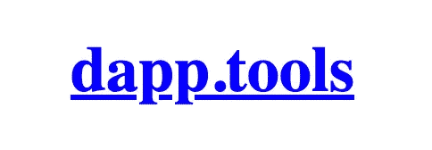

[Dapptools](https://dapp.tools/) logo？

虽然 [Dapptools](https://dapp.tools/) 没有[花哨的 logo](https://github.com/dapphub/dapptools/issues/903) ，但它是用 Haskell 构建的引人注目的应用程序。不过，不要担心；使用它不需要了解 Haskell！。

Dapptools 主要由 [MakerDAO](https://makerdao.com/en/) 团队(戴[背后的团队)使用，其灵感来自于](https://en.wikipedia.org/wiki/Dai_(cryptocurrency)) [Unix](https://en.wikipedia.org/wiki/Unix) 的哲学，“编写做一件事的程序，并把它做好。”Dapptools 是一个以命令行为中心的工具，您可以使用您已经熟悉的命令行/shell 工具，如 [bash](https://www.gnu.org/software/bash/) 或 [zsh](https://en.wikipedia.org/wiki/Z_shell) ，而不必使用 python、javascript 或其他高级编程语言来帮助您的开发。这有效地减少了一项您必须熟悉的技术，并迫使您更好地使用 shell 脚本！它附带了一套工具，如 dapp、seth、ethsign 和 hevm，每一个工具都是专门为智能合约开发人员需要做的一部分工作而设计的。

我最近开始更多地使用 Dapptools，我喜欢它背后的思想。我启动了一个 [Dapptools 初学者工具包](https://github.com/smartcontractkit/dapptools-starter-kit)向其他人展示如何使用这个工具。如果你使用 Dapptools，你可能会使用[makefile](https://www.gnu.org/software/make/manual/html_node/Introduction.html)和 shell 脚本来“生产化”你的代码。Dapptools 认为测试应该写得更扎实，模糊化应该是内置的。

我使用它的经验有点笨拙，但是我觉得很大一部分来自于我平庸的 bash 脚本技能。然而，我喜欢它迫使我在 shell 脚本方面做得更好，我认为每个人都应该这样做。

我**强烈推荐**这个框架如果你不想学习另一种语言比如 javascript 或者 python，你更喜欢在你的设置中使用尽可能少的工具，你喜欢 MakerDAO，或者 [@transmissions11](https://twitter.com/transmissions11) 已经转化了你。

# 好的那些

## 再搅拌


[混音](https://remix.ethereum.org/) Logo

每个人和他们的妈妈都应该知道如何使用 [Remix](https://remix.ethereum.org/) ，但不一定用于制作。简而言之，这就是对混音的评论。

Remix 本身并不是一个框架，更像是一个 IDE。Remix 是一个工具，我认为每个人都应该至少开始使用它，这样当每个人试图分享想法时，它就可以成为一个共同点。不是每个人都知道 python、javascript 或 bash 脚本来连接，所以使用像 Remix 这样的工具是完美的，因为它是一个更加可视化的工具。

当您部署一个契约时，您会得到与其交互的按钮。选择可靠性版本、编译、运行可靠性测试等等都很容易。如果你想让*使用 javascript，它也有 javascript 脚本！它是完全可扩展的，所以如果你想添加一个特性，你可以改进它，你甚至可以[连接你的本地磁盘来重新混合](https://ethereum.stackexchange.com/a/60118/57451)以运行你的版本控制回购的代码。*

Remix 是一个将所有人聚集在一起的工具，我很高兴我们有一个团队致力于开发这样一个神奇的工具来帮助所有人。不过，我不建议高级用户使用 Remix，因为你将在本地开发环境中获得更多微调的工具，而不是总是依赖于 web IDE。我不推荐它用于高级设置；但是，如果你喜欢使用它，就使用它！

我**强烈推荐**大家熟悉 Remix(知道扎实就直接上手了)。

## 松露


[松露](https://github.com/trufflesuite/truffle)标志

块菌是最初的框架之一，最初是[议会](https://consensys.net/)的一部分，从那里分离出来，然后又合并回去。这是一个基于 javascript 的框架，附带了一些工具，如 [Ganache](https://trufflesuite.com/ganache/) (甚至像 brownie 这样的框架也在使用)[毛毛雨](https://trufflesuite.com/drizzle/)和现在已经晚了的[松露团队](https://trufflesuite.com/blog/sunsetting-truffle-teams/)。Truffle 是所有框架中最具历史影响力的，你可以看到他们对行业的影响，许多框架都采用了 Truffle 的实践。我们应该感到幸运的是，这个团队的出现为框架建立了如此优秀的基线。如果你想尝试一下，看看[松露入门套件](https://github.com/smartcontractkit/truffle-starter-kit)。

他们最近更新了他们的[文档](https://trufflesuite.com/docs/truffle/testing/writing-tests-in-javascript.html)，他们正在[发布 Ganache](https://github.com/trufflesuite/ganache/releases) 的第 7 版，我已经和他们的团队谈过了，他们告诉我他们有很大的计划，这让我很兴奋。

早在 2019 年，每个人都听说过或正在使用松露，但从那以后，情况发生了变化。Hardhat 一直在 gogogo 模式下巩固自己作为事实上的 javascript 框架。我在处理松露的时候经常会碰到奇怪的虫子；他们的类型支持是微妙的，测试运行比 [Hardhat](https://hardhat.org/advanced/hardhat-runtime-environment.html) 慢得多。目前很难证明松露的存在，因为它让人觉得哈德哈特做的每件事都更好一点。

2021 年初，我为松露感到紧张，我甚至[提到了 2021 年初，](/the-top-blockchain-developer-frameworks-for-2021-89afa5e7bd04)我对框架的储备，看起来 2021 年是哈德哈特接手的一年。不过，我觉得松露的未来还是光明的。他们有一个很棒的团队，他们已经找到了松露将生活在哪里(现在有了 Consensys)，我期待他们在 2022 年有大作为。


[加纳切](https://trufflesuite.com/ganache/)标志

如果你想支持开创这一切的框架，并且喜欢 Truffle 的语法，那么你应该使用 Truffle 这个框架。在大多数情况下，我会推荐安全帽而不是松露；然而，我认为 Ganache 仍然是一个强有力的工具，我建议任何希望使用本地 testnet 的人看一看 Ganache。它有一个漂亮的 UI 组件，您可以使用它更容易地“看到”事务；它安装简单，可以在全球范围内安装。

## ApeWorX

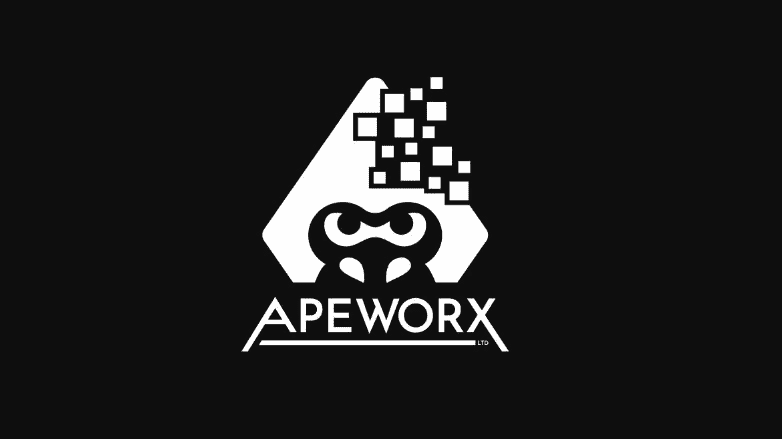

[ApeWorX](https://www.apeworx.io/) 标志

[ApeWorX](https://www.apeworx.io/) 是 python 的新成员，它从 brownie 社区中分支出来，创建了一个比其祖先 [brownie](https://eth-brownie.readthedocs.io/en/stable/) 更加模块化的金融框架。

Apeworx 使用与 Brownie 相同的设置和语法，并对生活质量进行了一些有趣的改进。

我只和 Apeworx 合作过一点点，感觉很像布朗尼，我喜欢插件的加入。目前还不清楚这是否会是布朗尼的续集(类似于哈德哈特如何接管松露精神股份)，或者两人是否会合作。在任何情况下，我都非常兴奋地看到 [Doggie](https://twitter.com/fubuloubu) 和他的团队将在 2022 年创造什么，而且肯定是一个让你关注的框架，甚至尝试一下你是否想要一些类似布朗尼的东西，你可以添加插件。

## 铸造

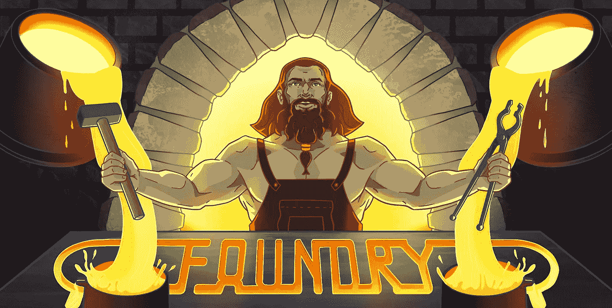

[铸造厂](https://github.com/gakonst/foundry)标志

[铸造厂](https://www.paradigm.xyz/2021/12/introducing-the-foundry-ethereum-development-toolbox/)就是 [dapptools](https://dapp.tools/) 写的铁锈。这是对该工具最直接的总结。

我和 foundry 合作的时间比和 daptools 合作的时间少一点，感觉这可能是 daptools 的续集，但我不确定。它仍然侧重于命令行，期望类似的文件结构，几乎所有来自 Dapptools 的命令都有一个铸造类比。[范型](https://www.paradigm.xyz/)团队的[圣乔治](https://twitter.com/gakonst)和朋友们对流行的 Dapptools 进行了惊人的重新想象，甚至在他们的[发布文章](https://www.paradigm.xyz/2021/12/introducing-the-foundry-ethereum-development-toolbox/)中向 Dapptools 致敬(这是你喜欢在这个空间看到的。)

许多命令和文件结构设置都与 Dapptools 相同，您几乎看不出区别。这个框架快速、强大，并且专注于用内置的模糊化和其他强大的工具构建可靠的测试。

Rust 越来越成为推动区块链应用基础设施的最受欢迎的技术之一，这似乎符合这一趋势。我很高兴看到哪些大玩家同时选择了 foundry 和 Dapptools。

# 另类的

在这一部分，我会讲得快一点，因为这些可能是您想要使用的框架，但是我对它们不太熟悉，或者我自己没有花太多时间来尝试它们。

## 华夫饼

Waffle 仍然是一个流行的框架，除了它更侧重于测试而不是一整套工具。您可以将 waffle 与 Hardhat 一起使用，因为它们都是基于 javascript 的，许多人使用这种组合设置。

## 车座

[马鞍](https://github.com/compound-finance/saddle)是[大院的](https://compound.finance/)松露的翻版。如果你喜欢复合，试试这个吧！

## SBT-以太坊

在过去的几年里，我很少使用 java，这在我试用 [sbt-ethereum](https://www.sbt-ethereum.io/) 时表现出来。SBT-以太坊将自己定位为:

> “一个**交互式的基于文本的平台**，有了这个平台，那些“业余爱好者”——不是程序员的人——[SBT-ether eum . io](https://www.sbt-ethereum.io/)

这是我去年回顾的另一个框架，遗憾的是我的 scala 技能并没有提高多少。然而，如果您想留在命令行世界中，这是您可能想要尝试的另一个方法。

## Web3j/Epirus

我去年回顾的另一个框架；看看他们的网站，似乎他们已经把他们的主要产品从框架转向了企业块浏览器。然而，他们仍然有他们的 [web3j](https://www.web3labs.com/web3j-sdk) 包，这是一个基于 java 的框架。如果你懂 java，你可能想试试这个，看看感觉如何。

## 从事

Embark 是我去年给了一个非常好的评价的一个。我能够从他们的框架中测试和部署智能合约，并使用一些 UI 工具。然而，它已经一年多没有收到 git 提交了，从那时起，智能合约生态系统中的一些事情已经发生了变化，所以我不确定这对这个框架的未来意味着什么。

# 非 EVM 人

## 锚

到目前为止，我可以说[主播](https://project-serum.github.io/anchor/getting-started/introduction.html)框架是与[索拉纳](https://solana.com/)合作的最大的非 EVM 框架。如果你想和索拉纳一起工作，我强烈推荐尝试 Anchor，因为感觉这是目前最好的解决方案。

## TerraSDK

[Terra](https://docs.terra.money/SDKs/) 是另一个基于 rust 的智能合约区块链为开发者构建 SDKs 框架。他们现在有了 [Terra.js](https://terra-money.github.io/terra.js/) 和 [python SDK](https://terra-money.github.io/terra.py/) 来开始与他们合作。这是另一个我没有花太多时间使用的框架，但我计划今年继续使用它。

# 4.钱包

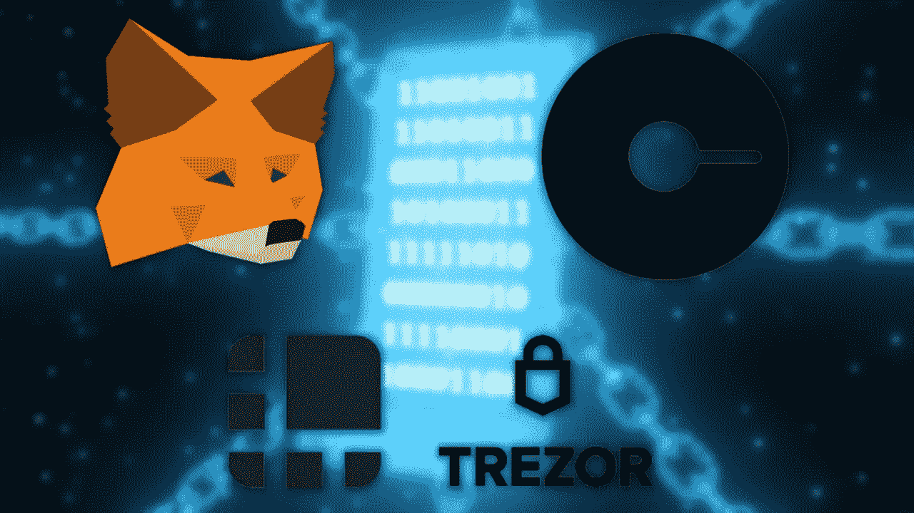

原始图片来自 Getty Images IncrediVFX

如果你在某种程度上部署智能合约，你需要一个钱包来储存资金，或者至少需要 [testnet 资金](https://faucets.chain.link/)。许多人会出于各种目的组合使用以下钱包。

## 元掩码

[Metamask](https://metamask.io/) 是这个领域的每个人都知道或应该知道的工具。这个概念很简单，非常适合在浏览器中进行测试，所有前端开发人员都需要这样做。几乎每个人都应该有一个元面具或类似元面具的浏览器钱包(就像索拉纳的[幻影](https://phantom.app/))。

Metamask 是一个简单易用的[热门钱包](https://www.gemini.com/cryptopedia/crypto-wallets-hot-cold)。这些的问题是，一旦你的私钥泄露，你就完了！此外，他们总是连接到互联网上，所以如果有人进入你的电脑，你可能也不走运！幸运的是，我们还有其他一些有用的工具。

## 灵知安全

Gnosis safe 被称为多签名钱包，这意味着发送一笔交易需要 X 个签名。这样，如果一个钱包受损，也没关系，因为攻击者需要损害至少一半的密钥持有者。

对于智能合同开发者来说，这是一个巨大的工具，尤其是那些处理大量资金并希望确保其资产安全的人。许多 Dao 也使用 Gnosis safe 来存放他们的国库。此外，gnosis safe 还集成了许多其他 DAO 工具，比如用于投票的 [Snapshot](https://snapshot.org/#/) 。

## 分类帐/ Trezor

[莱杰](https://www.ledger.com/)和[特雷佐](https://trezor.io/)被称为“冷钱包”，或者过渡起来有点麻烦的钱包。这种繁琐是有意的；他们让你，尤其是攻击者，更难转移资金。

您可以在您的项目中使用冷钱包、热钱包和多 SIG 的任意组合，并且您可能应该这样做！对于需要经常/快速存取和移动的小额资金，使用热存储；对于长时间不想动用的东西，使用冷存储；对于希望保护的大额资金，使用多 SIG。你甚至可以连接你的冷藏钱包作为一个多签名的关键之一！

# 5.块浏览器


原始图片来自 Getty Images IncrediVFX

对于想要“看到”事务和世界上正在发生的事情的人来说，块浏览器是至关重要的工具。如果你有一个第一层连接，你有所有的工具来构建其中的一个，但是 99%的时候，你会想要使用别人的。

## 以太扫描

啊[以太扫描](https://etherscan.io/)，你怎么有空。以太扫描是我希望每个人都知道并理解如何使用的工具之一。我很乐意看到它们是开源的，但我明白这不会是一个很好的激励，让他们保持目前令人印象深刻的状态。大多数服务都内置了以太扫描，它们做得非常好。Etherscan 无疑是 ETH 社区最主要的块浏览器，他们已经为诸如 [Polygon](https://polygonscan.com/) 、 [ETH 2](https://beaconscan.com/) 和[币安智能链](https://bscscan.com/)等项目提供了支持。

## 以太链

然而，我很高兴他们有竞争，所以他们必须保持警觉！ [Etherchain](https://etherchain.org/) 是一个轻量级的 block explorer，它还发布了一个精彩的 [ETH 2 explorer](https://beaconcha.in/) ，我目前使用的比 Etherscan 还多！

## Ethplorer

另一个 ETH 块资源管理器， [Ethplorer](https://ethplorer.io/) ，可能是您想要查看的另一个资源管理器。

大多数其他区块链也有多个 block explorer 客户端；然而，EVM/联邦理工学院社区很快就拥有了最多，因此我选择在这里关注他们。

# **6。第一层连接**

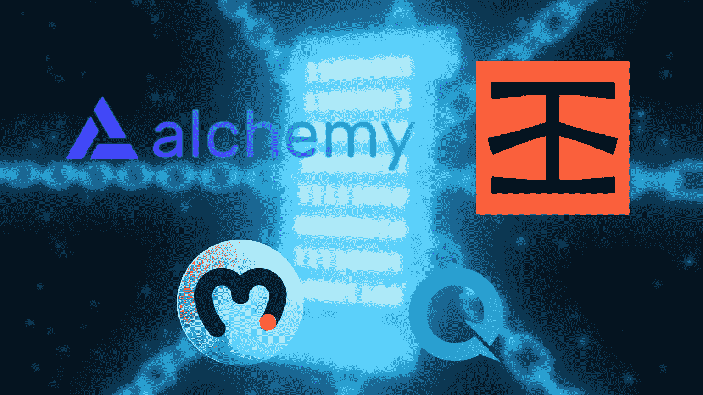

原始图片来自 Getty Images IncrediVFX

现在要发送交易，您需要一个区块链来发送它们！现在，如果您担心成本，我强烈建议您尝试所有这些免费选项，但您也可以自己运行自己的第一层节点！一个“第一层节点”是指那些不熟悉的你的区块链连接。例如，要在 ETH 链上发送事务，您需要将事务发送到 ETH 节点。甚至元掩码和钱包都与后台运行的第一层节点有连接！

## 魔力

[炼金术](https://alchemy.com/?a=673c802981)非常棒，是我联系 ETH 和所有 EVM 人的首选。它速度很快，有一个漂亮的跟踪请求的用户界面，有大量的第一层，而且运行良好。他们的响应速度令人难以置信，拥有强大的支持和开发者权益团队，我对他们为 2022 年所做的一切感到非常兴奋。

## Infura

Infura 是另一个在 2020 年很容易占据主导地位的应用程序，并且可能仍然如此。他们已经扩展到更多像 IPFS 这样的产品，拥有一批坚实的追随者，并且许多工具本身就可以与 Infura 一起工作。如果你正在寻找一个坚实的第 1 层，这是一个给你的。

## 道德

直到几个月前，我才知道 [Moralis](https://moralis.io/) 有第 1 层产品，我已经使用过几次了，效果非常好！它没有 Infura 或 Alchemy 那样的花哨功能，但我认为这是因为 Moralis 的附加值更多地体现在他们的前端服务中(这很神奇，我们很快就会谈到)。但是我认为，对于任何想使用这些工具的人来说，Moralis 仍然是一个不错的选择。

## 快速节点

如果上面的其中一个没有我想要的区块链，有机会 [QuickNode](https://www.quicknode.com/) 会有。QuickNode 拥有大量可以连接的节点，并且设置简单，是另一种可能适合您的服务。

# **7。前端工具**


原始图片来自 Getty Images IncrediVFX

对于构建全栈 dapps 前端，您可能仍然会使用所有的标准工具，如 javascript、HTML、CSS，也可能使用 react、angular 或 svelte 等框架。除此之外，几个奇妙的工具会让你的前端建筑生活*好得多*。

## Web3js/Ethersjs

[Web3js](https://web3js.readthedocs.io/en/v1.5.2/) 和 [Ethersjs](https://docs.ethers.io/v5/) 是世界上使用的两个主要的 javascript 框架，它们在前端都表现得非常好。如果你正在建立一个网站，你几乎必须使用这些工具中的一个，它们做得非常出色。最近，流行趋势正朝着更加流行的方向发展；然而，他们都将做这项工作。

## 道德

道德是一个我认为每个人都应该了解的工具。它有现成的 web3js 支持和大量工具来改善您的前端生活。它被称为“密码的燃烧基”，我认为它确实做到了这一点。也许你想要一个数据库来使你的前端更快；也许你想建造一个[以太扫描](https://etherscan.io/)或者[Opensea](https://opensea.io/)；也许你需要一个地址拥有的 NFT 列表。有很多你可能想做的事情，Moralis 都有内置的支持。

它拥有开源工具包和基于云的服务框架所需要的一切。

我强烈推荐每个在 2022 年建立 web3 网站的人都知道 Moralis。他们有许多[样板文件](https://github.com/ethereum-boilerplate/ethereum-boilerplate)让你的项目开始。

## UseDapp

Usedapp 是另一个开源项目，它有很棒的插件，可以与 web3 协同工作。我已经在一些项目中使用了它，并且很喜欢它。检验

## 下毛毛雨

[毛毛雨](https://trufflesuite.com/drizzle/)来自松露、Metamask、Infura 和 [Consensys](https://consensys.net/) 家族，做得很棒。它在您的 javascript 中创建了一些简单的包装器来处理您的合同，并且它内置了 React 支持！看看 Dapp 大学关于使用毛毛雨的视频。

## 图表

[图表](https://thegraph.com/en/)是做索引的基础工具。当我们想在区块链上查找一些东西时，可能需要进行一些查询。例如，如果我们想查看链中包含 1，000 个 DAI 令牌的所有地址。这将是非常漫长的，遍历链上的每一个地址并调用`balance`函数。相反，我们可以做的是构建一个所谓的[子图](https://thegraph.com/docs/en/developer/define-subgraph-hosted)，它可以索引我们想要的这些查询，并将它们存储在一个比整个区块链还要小得多的数据库中。这使得获取区块链的具体数据更加容易！

> 注意:根据 ERC20 的设置，做类似上面描述的事情可能是微不足道的，但这只是一个示例查询。

## 更多工具

另外，我想每个人都应该知道 [create-eth-app](https://github.com/paulrberg/create-eth-app) 和 [scaffold-eth](https://github.com/scaffold-eth/scaffold-eth) 。确切地说，它们不是“工具”，而是构建 web3 应用程序/dapp 的入门工具包，所以我认为每个人都应该了解它们！

# **8。帮助&支持**

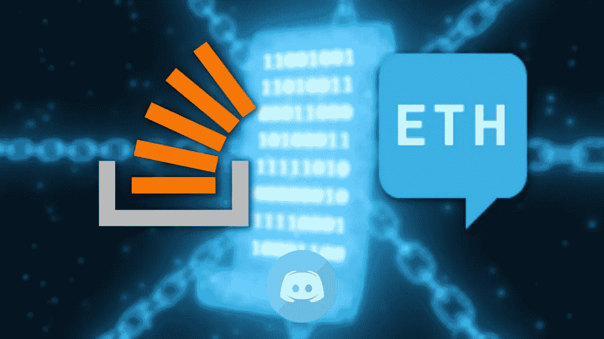

原始图片来自 Getty Images IncrediVFX

每个开发人员都应该知道在遇到问题时获得帮助的基本路线图。

1.  谷歌准确的错误
2.  查看[堆栈溢出](https://stackoverflow.com/)或[堆栈交换 ETH](https://ethereum.stackexchange.com/) (或任何堆栈交换)
3.  在项目的 Github 上做文章
4.  在论坛上提问
5.  不和谐地问一个问题

在这里提问时，您希望您的问题是:

*   **可搜索:**这样其他有同样问题的人也能找到你的问题。
*   **最小且可重复:**你得到的使用越具体，你得到答案的可能性就越小。

您希望将在论坛或堆栈溢出中提出的问题视为“活文档”你的问题格式越好，就越容易回答。没有不好的问题，只有格式不好的问题；让[成为你的美好家园！](https://stackoverflow.com/help/how-to-ask)

## [Stack overflow](https://stackoverflow.com/)&[Stack Exchange ETH](https://ethereum.stackexchange.com/)

这是你的经验法则:“如果我遇到了一个问题，而它的答案没有出现在谷歌搜索结果的第一页，我应该把它贴在 stack overflow 上。”

使用这个，你将得到你想要的答案，并帮助整个社区！现在你不会*总是*从这些网站得到回应，因为有时你的问题可能太难了，以前没有人做过，或者右眼没有看到过。有时，我会在 discords 中弹出我的问题的链接，以获得更多关注。但是经验法则是，当我遇到问题时，Stackoverflow 或 Stack Exchange ETH 应该是我首先查看的地方之一。

现在，您应该发布到哪个网站？嗯，说实话，没关系。Stack Exchange 通常会友好一点，但是 StackOverflow 的搜索排名更好，所以看你的了。这两个论坛都是针对特定的技术问题。不要用这些论坛来讨论更多的理论问题或海量问题。那更多的是为了一个不和或者推特。

## 不调和

在 2022 年，我希望我们从不和谐转向像 StackOverflow 这样的论坛，作为支持和提问的主要方式。不和谐问题不会被编入索引，因此无法进行排名。不和谐对于快速聊天和跳跃的想法是很好的，但不应该被用作支持渠道。

## 论坛

论坛很棒，因为它们的索引和排名像 StackOverflow 一样。一个很好的例子就是 [Openzeppelin 论坛](https://forum.openzeppelin.com/)，排名很好，问的问题很惊人。

# **9。安全分析工具**

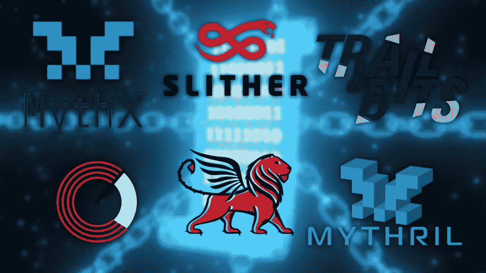

原始图片来自 Getty Images IncrediVFX

众所周知，在区块链上发布代码时，审计是至关重要的，因为一旦代码出现，任何人都可以查看并潜在地利用它！因此，拥有工具来帮助确保我们在代码中犯更少的错误是必不可少的，一些工具已经出现在这个领域，使我们的智能合同更加安全。

遗憾的是，我还没有使用过本节的所有工具。我做过的一些审计使用了 Bits suite 和 MythX(以及手动滚动每一行代码！).您可以查看来自 [charingane](https://medium.com/u/33f62953c0db?source=post_page-----b763f5df689a--------------------------------) 和 [Matt Solomon](https://medium.com/u/5d4dbc7a8078?source=post_page-----b763f5df689a--------------------------------) 对这些工具的其他评论。

* *记住，这些工具不会总是捕捉到每个 bug，一定要做好自己的本职工作！**

## 滑行

Slither 正在成为[静态分析](https://www.securecodewarrior.com/blog/what-is-static-analysis)的首选之一。slither 是由[比特轨迹](https://www.trailofbits.com/)团队(我在这个领域最喜欢的审计员之一)开发的，它易于使用，可以发现工程师可能犯的许多简单错误。我**强烈推荐** every 试用这个开源的捕虫器！

## 神话

MythX 是另一个基于云的测试 bug 的 Consensys 工具，据说可以做更深入的研究。许多像 Aave 和我一样的用户喜欢它的深度。它确实有一个用户付费墙，但如果你有钱，这是值得的。

## 米斯里尔

[Mythril](https://github.com/ConsenSys/mythril) 是 MythX 产品分析工具的开源子集。我并没有深入研究这个问题，但是看起来它会给你一些有希望的简单结果。

## 蝎狮

[蝎狮](https://github.com/trailofbits/manticore)是另一个 Bits 跟踪工具，但它不是静态分析，而是符号执行，它计算出什么将触发您的智能合约工作。如果你已经使用 Slither 了，你也可以试试这个！

## 鼹鼠

下一个*来自比特踪迹的*(你知道为什么它们是我的最爱之一)是[鼹鼠](https://github.com/crytic/echidna)。这是一个针对 EVM 合同的[模糊器](https://en.wikipedia.org/wiki/Fuzzing),如果你正在使用其他 Bits 工具，不妨再次尝试一下！

## 安全化

Securify 是一个不可思议的开源工具，因为它寻找特定的漏洞。这是另一个你不妨试试的！

# 10。监控&维护

我们的最后一部分没有图片，因为为了监控，我通常使用很多我自己的脚本。然而，我认为 [Openzeppelin 的防御者](https://openzeppelin.com/defender/)和[温柔](https://tenderly.co/)是你应该 100%熟悉的工具。它们都是工具，允许您监控您的生产代码，并确保它们保持安全！

如果您还没有，我强烈推荐您尝试这两种工具，并让我知道您的想法！

# 摘要

这是我迄今为止最大的文章之一，它包含了大量的工具列表。我知道有很多，但是你在这个领域做得越多，你就越会意识到这些工具对于快速构建应用程序有多重要。

2022 年将是疯狂的一年，我希望我已经给了你一些想法，让你在这一年尝试构建你令人惊叹的、独特的、鼓舞人心的 web3 应用程序。

在评论区让我知道你认为我错过了什么工具！祝你新年快乐！让我们做一个大的！

如果你想在今年开始你的区块链之旅，一定要看看[如何成为区块链工程师](/how-to-become-a-blockchain-engineer-fa4386a0504f?sk=745ae4e8f9389907eb98e68b736afaf1)和这个[列出的 10 个不可思议的资源](https://dev.to/patrickalphac/top-10-smart-contract-solidity-developer-learning-resources-46db)来开始。