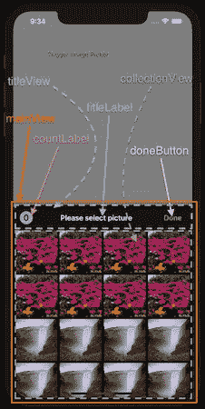
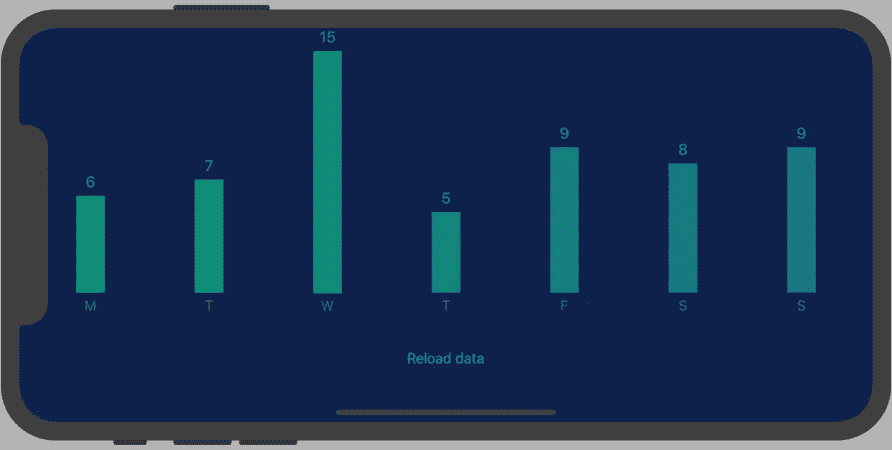
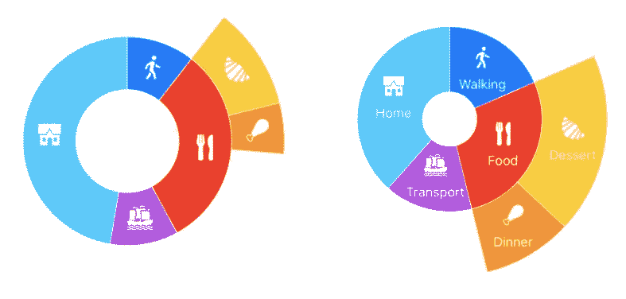
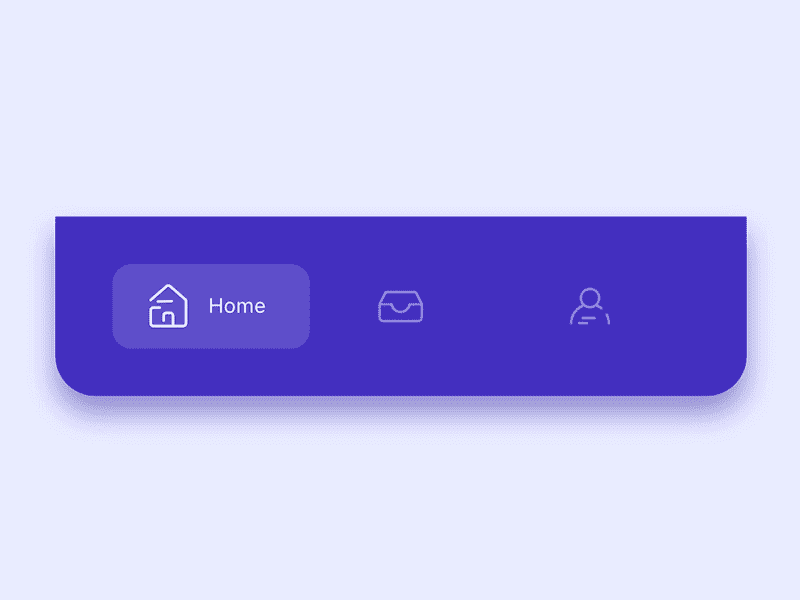
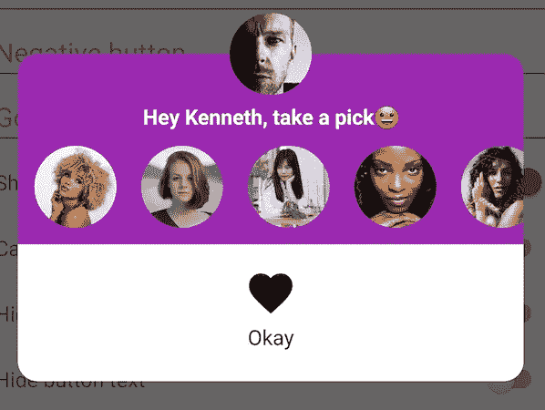
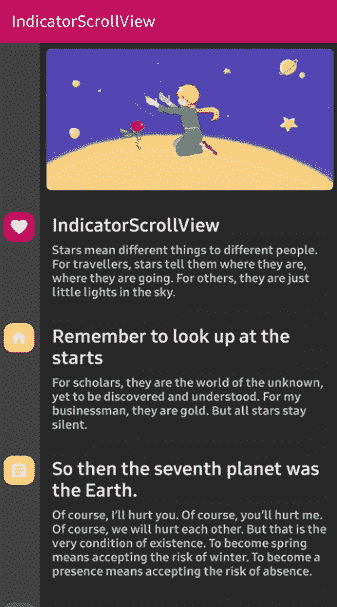
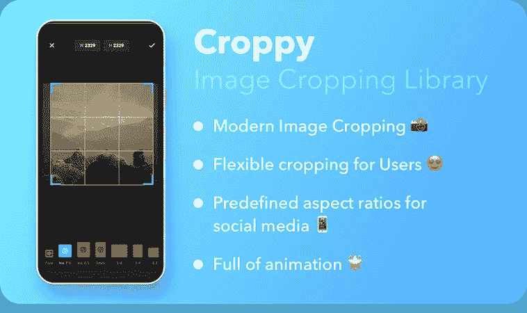
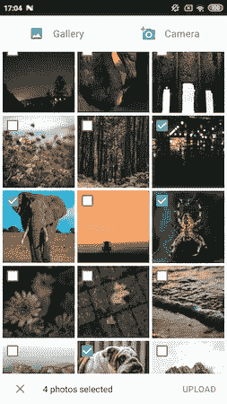

# 十月份十大热门 Android 和 iOS 库

> 原文：<https://betterprogramming.pub/top-10-trending-android-and-ios-libraries-in-october-e7dd18f8b75b>

## 有些人制造噪音，有些人统治这个月

照片由[阿尔方斯·莫拉莱斯](https://unsplash.com/@alfonsmc10?utm_source=medium&utm_medium=referral)在 [Unsplash](https://unsplash.com?utm_source=medium&utm_medium=referral) 拍摄

为了保持[九月版](https://medium.com/better-programming/top-10-trending-android-and-ios-libraries-in-september-b2db51e94f6c)的传统，这里列出了 2019 年 10 月期间流行的 5+5 个 Android 和 iOS GitHub 库。

# 五大热门 iOS 库

## 1.瀑布网格

这里有一个 SwiftUI 库，它需要 SwiftUI 列表等可识别数据来填充网格布局视图。此视图中的项目垂直填充了大部分可用空间。

它是高度可定制的——支持更新时的间距、填充和动画项目。它兼容所有苹果设备。

pod '瀑布网格'

## 2.分区套件

与名称相反，这与存储的数据和分区没有任何关系。PartitionKit 基本上是一个 SwiftUI 库,允许使用可调整大小的分区创建动态大小的内容。

## 3.ConvenientImagePicker

总是需要一个支持多选的图像拾取器。

[这里有一个可定制的](https://github.com/CLOXnu/ConvenientImagePicker)，它有更好的手势控制，让我们在模态表中显示相册或特定图像。

pod '方便图像拾取器'

## 4.StackViewBarChart

这个可定制的条形图库完全是使用 UIStackViews 构建的，当需要在应用程序中显示分析时非常方便。

它有一个可定制的图例，并且只有一个很小的代码库，很容易修改和重构这个库。

## 5.快速日照图

使用这个支持图像和文本的酷炫 SwiftUI 库构建饼图、甜甜圈或多级图表。

此外，它支持无限数量的圆，并且有一个反应式用户界面，在选择或聚焦一个节点时会有动画更新。

# 五大趋势 Android 库

## 1.SmoothBottomBar

这里有一个轻量级的 Android 材料[底部导航栏库](https://github.com/ibrahimsn98/SmoothBottomBar)灵感来自运球设计。

它在活动类中提供了所有的定制和状态回调。

## 2.优雅的对话

[这是一个名副其实的](https://github.com/muigukenneth/ElegantDialog)交互式对话库。这个 Kotlin 库可以实现的一些奇特功能有:

*   顶部和底部背景定制
*   自定义布局—如 RecyclerView
*   自定义图标、文本和字体
*   使用 Glide 或 Picasso 加载图像

## 3.指示器滚动视图

这是对滚动视图的不同看法。[这个库](https://github.com/skydoves/IndicatorScrollView)为每个滚动位置制作一个指示器。我们甚至可以自定义展开和折叠动画。

指示器滚动视图扩展`NestedScrollView`并在滚动改变时与`IndicatorView`反应。

## 4.剪短发的人

这个[图像裁剪库](https://github.com/lyrebirdstudio/Croppy)非常灵活，提供了多种裁剪选项。无论是长宽比还是自由形式，它都有。它通过向用户显示位图的当前宽度和高度来增强用户体验。

通过双击聚焦、缩放、动画和自动居中等功能，views 使其成为一个方便使用的库。

## 5.ChilliPhotoPicker

这是一个用于从相机或图库中获取照片和视频的库。此外，它负责处理所有的权限，并且没有任何额外的依赖性，如数据绑定或 RxJava。

当设计底部表单对话框时，这可以用于单张或多张照片的选择。它允许我们选择如何将图像加载到 ImageView 中。

# 结论

这是 10 月份的总结。感谢阅读。