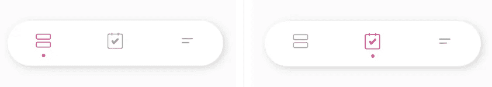
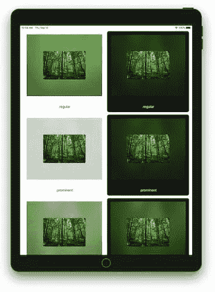
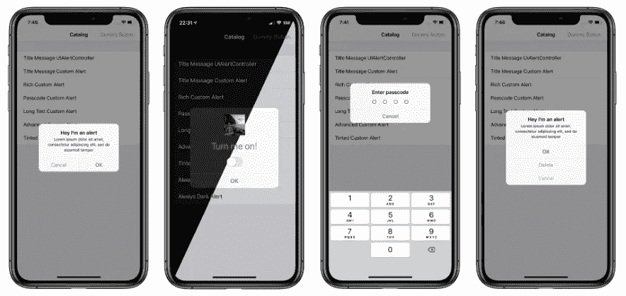
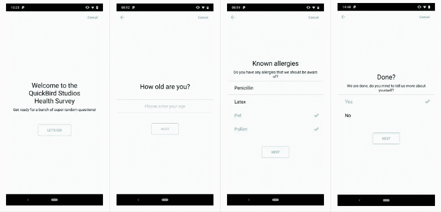
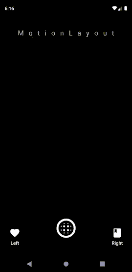
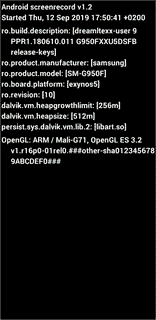
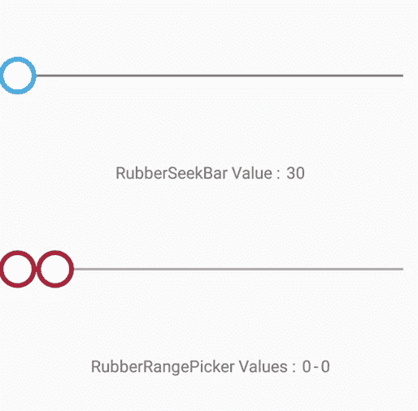

# 9 月份十大热门 Android 和 iOS 库

> 原文：<https://betterprogramming.pub/top-10-trending-android-and-ios-libraries-in-september-b2db51e94f6c>

## SwiftUI、MotionLayout 等等

照片由[🇸🇮·扬科·菲利— @specialdaddy](https://unsplash.com/@thepootphotographer?utm_source=unsplash&utm_medium=referral&utm_content=creditCopyText) 在 [Unsplash](https://unsplash.com/s/photos/small-library?utm_source=unsplash&utm_medium=referral&utm_content=creditCopyText) 上拍摄

这是我在 2019 年 9 月期间在 GitHub 上发布的第一版趋势 Android 和 iOS (5+5)库。

# 五大热门 iOS 库

## 1.同心入职

让我们从基于 [SwiftUI 库的 onboarding](https://github.com/exyte/ConcentricOnboarding) 库开始。通过设置您自己喜欢的颜色，将它用于演练和入职培训。

## 2.PTCardTabBar

这里我们有一个[卡片式标签栏](https://github.com/hussc/PTCardTabBar)，我们可以用它来代替 iOS 项目中的默认标签栏。

## 3.SwiftUIBlurView

另一个基于 SwiftUI 的库[模糊你的视图](https://github.com/danielsaidi/SwiftUIBlurView)。它允许你在亮暗模式下使用所有系统的模糊效果。

## 4.FMSwipify

使用嵌套集合视图时，您将不再有任何麻烦。这里有一个[现成的 Swift 框架](https://github.com/FranckNdame/FMSwipify)，用于在你的 iOS 项目中快速配置集合视图。

## 5.DWAlertController

更容易定制的`UIAlertController`的[定制实现](https://github.com/podkovyrin/DWAlertController)。

除了黑暗模式支持(即使是 iOS 12 和更低版本)，这有一个简单的内置转换，从一个内容控制器到另一个在单个`DWAlertController`。

# 五大趋势 Android 库

## 1.调查工具包

这个库内置于 [Kotlin](https://kotlinlang.org/) ，[中，简化了调查和问卷的创建。它允许从一个调查到另一个调查的线性或基于决策树的过渡。](https://github.com/quickbirdstudios/SurveyKit)

## 2.SnapUI

一个漂亮的使用`MotionLayout`的类似 Snapchat 的主屏幕的[实现。](https://github.com/sivze/SnapUI)

## 3.Kaspresso

这是一个 [UI 测试框架](https://github.com/KasperskyLab/Kaspresso)，使用类似 [KaKao](https://www.kakaocorp.com/?lang=en) 的语法来编写 [Espresso](https://developer.android.com/training/testing/espresso) 测试。它提供了一种处理浓咖啡剥落的机制。

## 4.ParallaxScrollingView

[视差滚动](https://github.com/kibotu/ParallaxScrollingView)通过偏移或自动。它允许以自定义设置的速度、矢量和位图绘制方式自动滚动，还支持 [ViewPager2](https://developer.android.com/jetpack/androidx/releases/viewpager2) 。

## 5.橡胶捡拾器

[橡胶捡拾器](https://github.com/Chrisvin/RubberPicker)库包含`RubberSeekBar`和`RubberRangePicker`，灵感来自 [Cuberto 的橡胶范围捡拾器](https://github.com/Cuberto/rubber-range-picker)。

这是九月份的总结。感谢阅读。

## **十月版**

 [## 十月份十大热门 Android 和 iOS 库

### 有些人制造噪音，有些人统治这个月

medium.com](https://medium.com/better-programming/top-10-trending-android-and-ios-libraries-in-october-e7dd18f8b75b)