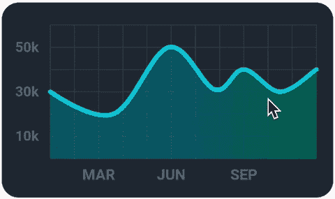
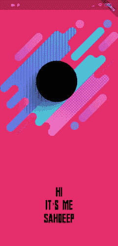
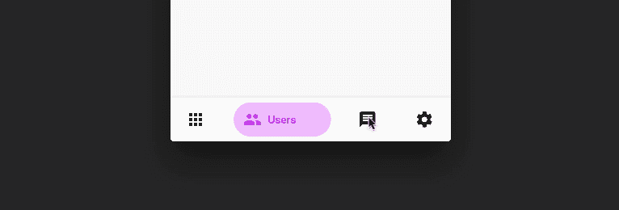
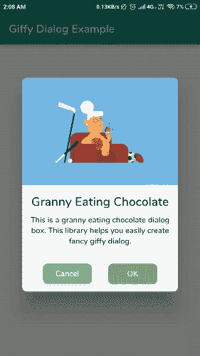
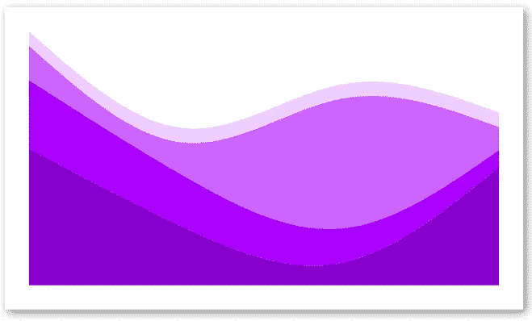
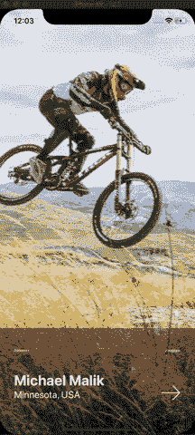
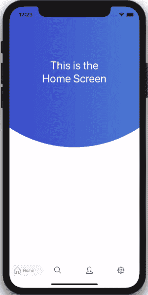

# 今年十大趋势 Flutter 和 React 原生 UI 库

> 原文：<https://betterprogramming.pub/top-10-trending-flutter-and-react-native-ui-libraries-this-year-dea66a9050a4>

## 欣赏一些流行的跨平台库

micha Parzuchowski 在 [Unsplash](https://unsplash.com?utm_source=medium&utm_medium=referral) 上的照片

Flutter 和 React Native 正在跨平台应用程序开发领域制造各种噪音。下面是今年一些在 Android 和 iOS 平台上都能工作的流行 UI 库。

# 五大趋势颤振库

## 1.FL 图表

[FL Chart](https://github.com/imaNNeoFighT/fl_chart) 是一个强大的 Flutter 图表库，支持折线图、条形图和饼图。它对于在应用程序中显示统计数据、股票价格和不同类型的数据分析非常有用。

## 2.液体擦拭

流畅用户界面的时间到了。[液体滑动](https://github.com/iamSahdeep/liquid_swipe_flutter)在滑动时显示惊人的液体状过渡。在入职培训中很有用，它的灵感来自于 [Cuberto 的液体滑动](https://github.com/Cuberto/liquid-swipe)和 [IntroViews](https://github.com/aagarwal1012/IntroViews-Flutter) 。

## 3.BottomNavyBar

[BottomNavyBar](https://github.com/pedromassango/bottom_navy_bar) 是一个精彩的标签栏动画，在 Android 和 iOS 设备上看起来都很相似。

## 4.之前之后

这个在 Flutter 中是一个非常酷的 diff 工具。只需在两幅图像上滑动，就可以更容易地显示它们之间的差异。

## 5.礼物对话框

Giffy Dialogs 是一个漂亮的可定制的颤振警告对话框。我们可以通过设置来自 URL 和 gif 的图像以及按照我们想要的样式设置文本来自定义内容。

# 前 5 名 React 本地库

## 1.反应-本机-SVG-图表

[这个](https://github.com/JesperLekland/react-native-svg-charts)库是您在 React Native 中构建各种图表的一站式目的地。使用该工具可以轻松定制条形图、折线图、饼图和堆积面积图等图表。

## 2.反应-原生-定时-幻灯片

这里有一个[定时图像幻灯片](https://github.com/LMestre14/react-native-timed-slideshow)，它是高度可定制的。它允许本地动画，设置图像页脚，过渡，等等。

## 3.反应-本机-气泡-标签-栏

这里有一个[气泡状的标签栏](https://github.com/max-lychko/react-native-bubble-tab-bar)可定制的 UI 库，就像我们在 Flutter 中看到的一样。

## 4.反应本机标题视图

[React 原生标题视图](https://github.com/WrathChaos/react-native-header-view)允许我们在 iOS 和 Android 应用中使用不同类型的工具栏和导航栏样式。

从新的 iOS transcluent 栏到经典的 Android 栏，它有一切可供选择。

## 5.漂亮的导航

React Native 中有一个[漂亮的导航库](https://github.com/Mindinventory/react-native-navigation-animation)，灵感来自运球设计。它的 USP 是不同 UI 组件之间的转换。

这就结束了。我希望你喜欢。