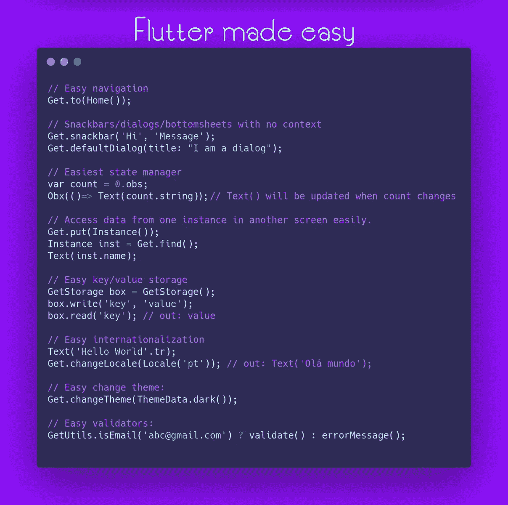
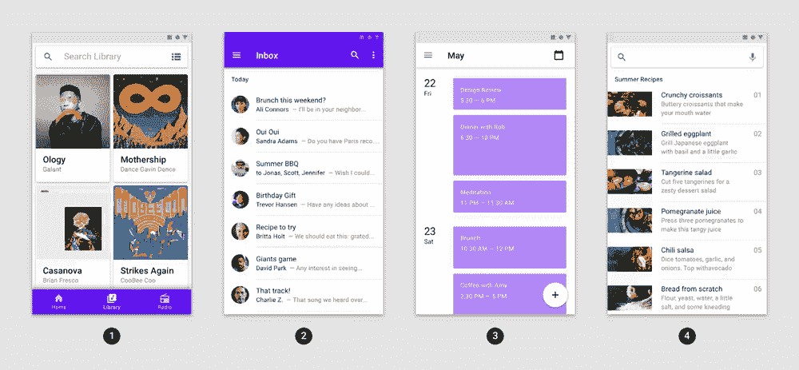
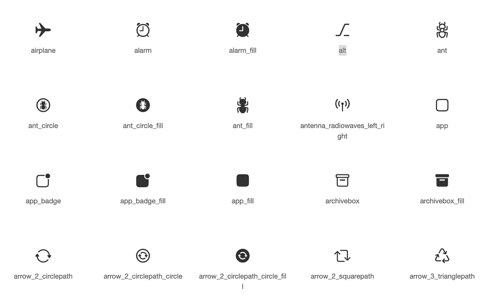
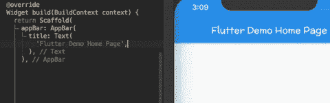

# 2022 年十大趋势颤振包

> 原文：<https://betterprogramming.pub/top-10-trending-flutter-packages-in-2021-51977d0ff528>

## 构建漂亮的 Android 和 iOS 应用程序


照片由 [Unsplash](https://unsplash.com?utm_source=medium&utm_medium=referral) 上的 [Onur Binay](https://unsplash.com/@onurbinay?utm_source=medium&utm_medium=referral) 拍摄

为了设计漂亮的原生应用，谷歌在 2017 年推出了 [Flutter UI](https://flutter.dev/) 。这种跨平台的 UI 套件可用于从单一代码库构建 web、Android、iOS 或桌面应用程序。

Flutter 是用 C++编写的，但是使用 Dart 语言进行编程。它有一个不断增长的社区和来自谷歌本身的良好支持，包括关于可重用部件的 YouTube 视频。

通过网站 [pub.dev](https://pub.dev/) ，Flutter 团队可以发布和共享可重用的包来编写 Dart 和 Flutter 应用程序。

本文列出了一个最受欢迎的包来展示 flutter 框架的巨大潜力。

# 1.get/ GetX

网址:[https://pub.dev/packages/get](https://pub.dev/packages/get)
支持平台:安卓、iOS、Linux、macOS、Web、Windows
人气:5788 赞

GetX 是软件包中的多面手。它试图通过为依赖、注入、状态和路由管理等过程提供支持来简化整个应用程序开发过程。它还提供了各种实用工具，可以用来简化验证、主题化、国际化等等。



[https://raw . githubusercontent . com/jonataslaw/getx-community/master/getx . png](https://raw.githubusercontent.com/jonataslaw/getx-community/master/getx.png)

带有 GetX 的计数器应用程序:

[https://github.com/jonataslaw/getx](https://github.com/jonataslaw/getx)

[https://www.youtube.com/watch?v=V0oxG3tWiwk](https://www.youtube.com/watch?v=V0oxG3tWiwk)

# 2.供应者

网址:[https://pub.dev/packages/provider](https://pub.dev/packages/provider)
支持平台:安卓、iOS、Linux、macOS、Web、Windows
人气:4855 赞

提供者包包装 InheritedWidget 以使其更易访问。它提供了延迟加载、简化的分配和减少的现成样板代码。

下面是一个使用 provider 的简单示例应用程序:

[https://flutterbyexample . com/lesson/the-most-basic-example-using-provider](https://flutterbyexample.com/lesson/the-most-basic-example-using-provider)

https://www.youtube.com/watch?v=K2ampPUTfIQ

# 3.共享 _ 首选项

网址:【https://pub.dev/packages/shared_preferences】T4
支持平台:安卓、iOS、Linux、macOS、Web、Windows
人气:3850 赞

SharedPreferences 通过包装 Flutter 的基本功能，允许数据在 iOS 和 Android 设备上异步持久保存。鉴于其外观，它不应用于存储关键数据。

[https://pub.dev/packages/shared_preferences](https://pub.dev/packages/shared_preferences)

[https://www.youtube.com/watch?v=uyz0HrGUamc](https://www.youtube.com/watch?v=uyz0HrGUamc)

# 4.超文本传送协议（Hyper Text Transport Protocol 的缩写）

网址:[https://pub.dev/packages/http](https://pub.dev/packages/http)
支持平台:安卓、iOS、Linux、macOS、Web、Windows
人气:3162 赞

http 包使易于使用的高级函数和类能够访问 http 资源。它是多平台的，支持所有常见的设备。

下面是一个使用 http 的简单 get 请求应用程序:

[https://pub.dev/packages/http/example](https://pub.dev/packages/http/example)

[https://www.youtube.com/watch?v=WdXcJdhWcEY](https://www.youtube.com/watch?v=WdXcJdhWcEY)

# 5.url _ 启动器

网址:[https://pub.dev/packages/url_launcher](https://pub.dev/packages/url_launcher)
支持平台:安卓、iOS、Linux、macOS、Web、Windows
人气:2981 赞

URL-launcher 包的作用是打开外部链接。这包括网站 URL，以及电子邮件、电话和短信链接。然后，它们将由您的智能手机(或其他电子设备)在相应的应用程序中执行。

[https://www.youtube.com/watch?v=x7u6t4glGlU](https://www.youtube.com/watch?v=x7u6t4glGlU)

下面是一个简单的启动 URL 示例应用程序，带有 url_launcher:

[https://medium . com/code chai/how-to-launch-URLs-in-flutter-66611 ef 141 F8](https://medium.com/codechai/how-to-launch-urls-in-flutter-66611ef141f8)

[https://www.youtube.com/watch?v=qYxRYB1oszw](https://www.youtube.com/watch?v=qYxRYB1oszw)

# 6.动画片

网址:[https://pub.dev/packages/animations](https://pub.dev/packages/animations)
支持平台:安卓、iOS、Linux、macOS、Web、Windows
人气:2777 赞

动画包包含几个动画，为您的应用程序带来更多的运动和可访问性。您可以根据自己的兴趣定制它们，并直接放入您的应用程序中。



【https://pub.dev/packages/animations 

动画包的 OpenContainer 示例代码:

[https://www.youtube.com/watch?v=HHzAJdlEj1c](https://www.youtube.com/watch?v=HHzAJdlEj1c)

[https://www.youtube.com/watch?v=HHzAJdlEj1c](https://www.youtube.com/watch?v=HHzAJdlEj1c)

# 7.库比蒂诺 _ 图标

网址:[https://pub.dev/packages/cupertino_icons](https://pub.dev/packages/cupertino_icons)
支持平台:Android、iOS、Linux、macOS、Web、Windows
人气:301 赞

cupertino_icons 包提供了一组默认的图标资源，供 Flutter 的 cupertino 小部件使用。

一套所有库比蒂诺图标可以在:
[**https://flutter.github.io/cupertino_icons/**](https://flutter.github.io/cupertino_icons/)找到



[https://pub.dev/packages/cupertino_icons](https://pub.dev/packages/cupertino_icons)

Cupertino 图标用法:

```
Icon(CupertinoIcons.<icon-name>,)
```

【https://www.youtube.com/watch?v=3PdUaidHc-E】

# 8.谷歌 _ 字体

网址:[https://pub.dev/packages/meta](https://pub.dev/packages/google_fonts)
支持平台:安卓、iOS、Linux、macOS、Web、Windows
人气:2505 赞

google_fonts 包提供了 1000 多种免费的 google 字体供您在应用程序中使用。建议在您的应用程序中始终只使用少数几种字体。



[https://pub.dev/packages/google_fonts](https://pub.dev/packages/google_fonts)

下面是一个 google_font 应用程序的例子:

[https://pub.dev/packages/google_fonts/example](https://pub.dev/packages/google_fonts/example)

[https://www.youtube.com/watch?v=g_nu7IlTqEw](https://www.youtube.com/watch?v=g_nu7IlTqEw)

# 9.收藏品

网址:【https://pub.dev/packages/collection】T2
支持平台:安卓、iOS、Linux、macOS、Web、Windows
人气:257 赞

这个包包含了大量的实用函数和类来简化集合的工作。这包括处理列表、等式函数、优先级队列和包装类的算法。

这里有一个`ListEquality`与集合的例子:

[https://www.youtube.com/watch?v=Ymw9xfRucK0](https://www.youtube.com/watch?v=Ymw9xfRucK0)

# 10.秘密党员

网址:[https://pub.dev/packages/crypto](https://pub.dev/packages/crypto)
支持平台:Android、iOS、Linux、macOS、Web、Windows
人气:500 赞

crypto 为您提供了一组在纯 Dart 中实现的加密哈希函数，例如:

*   SHA-1
*   沙-224
*   SHA-256
*   SHA-384
*   SHA-512
*   SHA-512/224
*   SHA-512/256
*   讯息摘要 5
*   HMAC(即 HMAC-MD5，HMAC-SHA1，HMAC-SHA256)

使用 SHA1 加密算法的示例代码:

[https://www.youtube.com/watch?v=cZYgnrOYGLY](https://www.youtube.com/watch?v=cZYgnrOYGLY)

根据 Flutter 在`pub.dev`的排名，这是我的十大榜单。你最喜欢的颤振包有哪些？请在评论中告诉我！

[给我买个晴天](https://www.buymeacoffee.com/lucianojung)如果你喜欢支持这类内容。