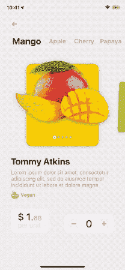
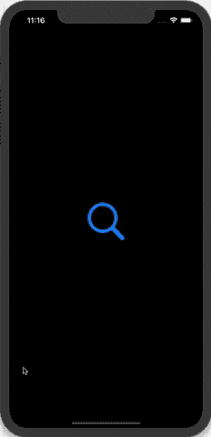
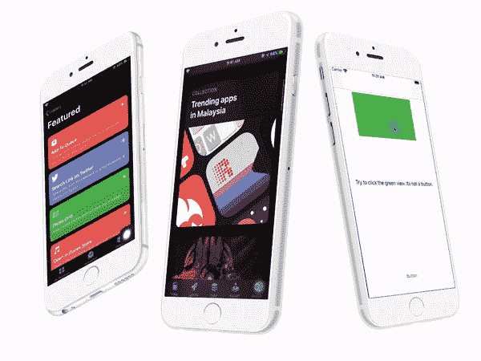
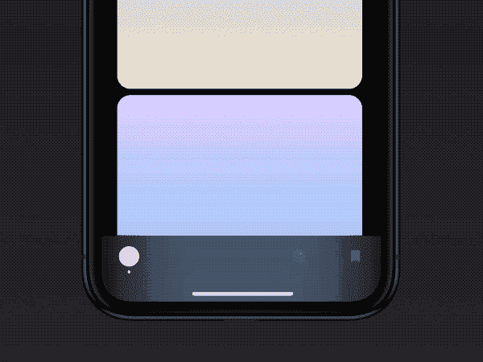
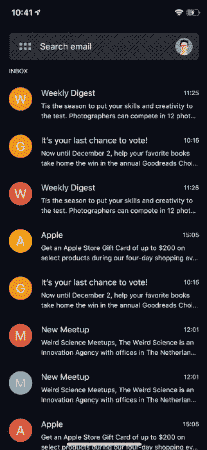
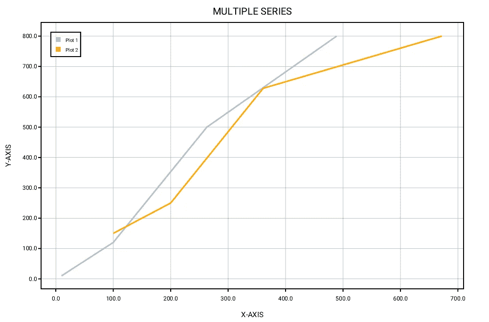
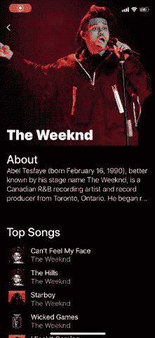

# 12 月十大热门 iOS 库

> 原文：<https://betterprogramming.pub/top-10-trending-ios-libraries-in-december-e100c9064a54>

## 探索 iOS 社区在这十年的最后一个月提供的服务


卡斯帕·卡米尔·鲁宾在 [Unsplash](https://unsplash.com?utm_source=medium&utm_medium=referral) 上的照片

2019 年催生了大量新的有趣的 iOS 库，上个月也不例外。虽然有些人受到 Dribbble 设计的启发，但有许多人利用 SwiftUI 框架和经典 UIKit 来开发基于惊人的 UI/UX 的库，这将极大地改善您的 iOS 应用程序的外观。

不浪费任何时间，这里有一个在 2019 年 12 月脱颖而出的十个开源 iOS 库之旅。

# 1.CollectionViewPagingLayout

首先，我们有一个定制`UICollectionViewLayout`的[库](https://github.com/amirdew/CollectionViewPagingLayout)，允许你在滚动时转换单元格。通过遵守`TransformableView`协议，您可以在滚动单元格时获得进度值，从而允许您在转换期间定制单元格。



下面是一个例子，说明当你导入并设置`CollectionViewPagingLayout`作为你的集合视图的布局时，一个简单的转换是如何完成的:

```
extension MyCollectionViewCell: TransformableView {
    func transform(progress: CGFloat) {
        let transform = CGAffineTransform(translationX: bounds.width/2 * progress, y: 0)
        let alpha = 1 - abs(progress)

        contentView.subviews.forEach { $0.transform = transform }
        contentView.alpha = alpha
    }
}
```

# 2.聚光灯搜索

接下来，我们有一个[令人敬畏的 SwiftUI 库](https://github.com/boraseoksoon/SpotlightSearch)，它允许你在你的 iOS 应用中复制 macOS 中的 spotlight 搜索体验。该库完全使用 SwiftUI 和 Combine 编写，旨在通过简单易用的 API 为搜索功能提供简单的 UI/UX。



# 3.交互式视图

一个[流畅的交互界面库](https://github.com/fahidattique55/InteractiveView)，旨在通过让视图对用户动作有响应、可中断和可重定向的感觉来提供无摩擦的用户体验。如果你想让你的用户界面反应灵敏，用户体验流畅，这个库是很方便的。



# 4.优先标签栏

下面是一个定制 TabBar 的[实现](https://github.com/RedMadRobot/PrioritizedTabBar)，用于 [Dribbble Design](https://dribbble.com/shots/8720663-For-iOS-engineers) ，它展示了 UITabBar 按钮的优先布局，带有一个指示器标记，突出显示当前活动的标签栏项目。要在您的应用程序中使用它，您需要做的就是安装 pod `PrioritizedTabBar`。



# 5.MBVideoPlayer

接下来，我们有一个基于视频播放器的[库](https://github.com/mwaqasbhati/MBVideoPlayer)构建在 AVQueuePlayer 之上，具有自定义标题、播放列表项、播放、暂停、搜索滑块、时间、全屏调整、前进、后退、水平和垂直功能。此外，它还允许您设置自定义配置，如搜索持续时间和纵横比。

由于支持不同的方向、颜色主题、显示缩略图，并且能够将播放器嵌入到另一个视图中，这个库拥有视频播放器所需的一切。


# 6.格梅努

另一个优秀的基于 SwiftUI 的[实现](https://github.com/amirdew/gmenu)是 iOS 中重新设计的 Gmail 菜单，它使用了最新声明式 UI 框架的所有常用工具。



# 7.快速绘图

接下来，我们有一个用于数据可视化的[跨平台库](https://github.com/KarthikRIyer/swiftplot)，它不仅可以在 iOS 和 macOS 上工作，还支持 Windows 和 Linux 操作系统，以及 Jupyter Notebook。下面给出了一个创建简单线图的示例:

```
import SwiftPlot
import AGGRenderer

let x:[Float] = [10,100,263,489]
let y:[Float] = [10,120,500,800]

var agg_renderer: AGGRenderer = AGGRenderer()
var lineGraph = LineGraph<Float,Float>(enablePrimaryAxisGrid: true)
lineGraph.addSeries(x, y, label: "Plot 1", color: .lightBlue)
lineGraph.plotTitle.title = "SINGLE SERIES"
lineGraph.plotLabel.xLabel = "X-AXIS"
lineGraph.plotLabel.yLabel = "Y-AXIS"
lineGraph.plotLineThickness = 3.0
lineGraph.drawGraphAndOutput(fileName: filePath+"agg/"+fileName, renderer: agg_renderer)
```



跳到 [GitHub 库](https://github.com/KarthikRIyer/swiftplot/blob/master/README.md)来试用这个库，并参考完整的 API 文档来看看这个库如何支持在笔记本上显示图形。

# 8.StackableTableView

这里有一个[库](https://github.com/omaralbeik/StackableTableView)，它提供了 UIKit 的 TableView 组件的定制实现。它允许你通过利用强大的`UIStackView`类将一系列视图作为`UITableView`的页眉和页脚堆叠起来。


# 9.SOPullUpView

这个[库](https://github.com/Ahmadalsofi/SOPullUpView)常见于谷歌地图，旨在为你的视图提供类似的易于使用的拉手势——包括 TableView、CollectionViews 或任何子视图。


它所需要的只是通过使用方法`pullUpControl.setupCard(from: view)`在期望的视图上设置`SOPullUpView`实例，并符合`SOPullUpViewDataSource`。该协议提供了在折叠状态下调整视图高度的方法。

# 10.FancyScrollView

最后但同样重要的是，我们有一个棒极了的 [SwiftUI 实现](https://github.com/nerdsupremacist/FancyScrollView)的滚动视图，还有一些额外的好处。它支持视差、非视差、粘性标题、模糊和苹果股票应用程序中常见的效果，如 App Store 和 Music。

下图展示了视差+粘性:



# 结论

我们探索了 2019 年 12 月发布的一系列库。当然，对于 iOS 开发者来说，年底有很多惊喜和有趣的新发布。从 SwiftUI 到跨平台图表和自定义集合视图布局，我们都有涉及。

这一次到此为止。如果你喜欢这个版本，也请看看 11 月版的。