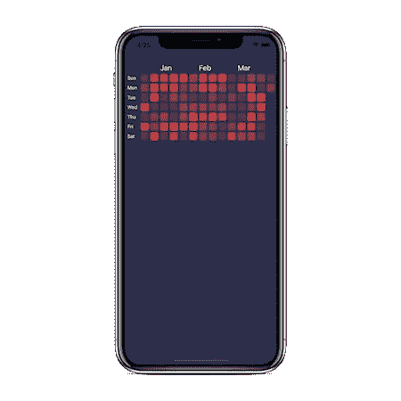
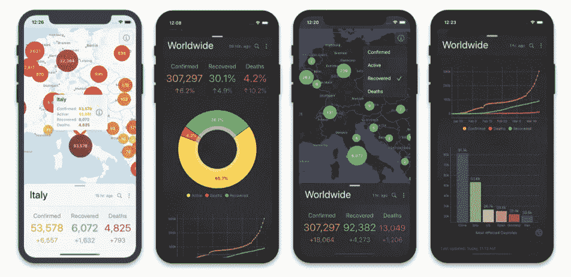
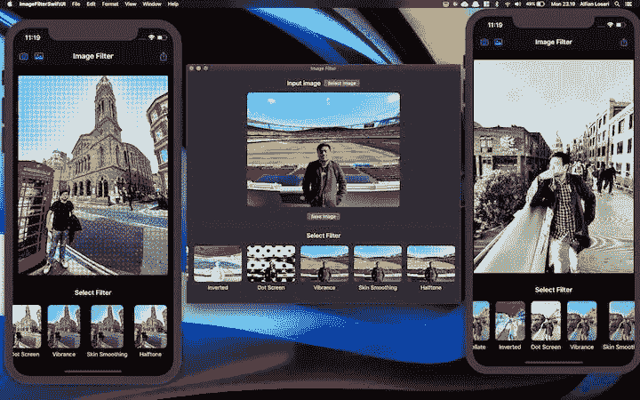
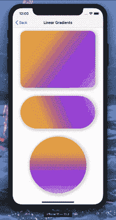
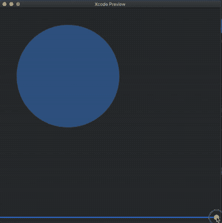
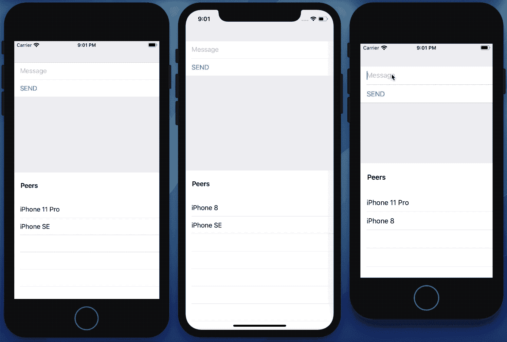
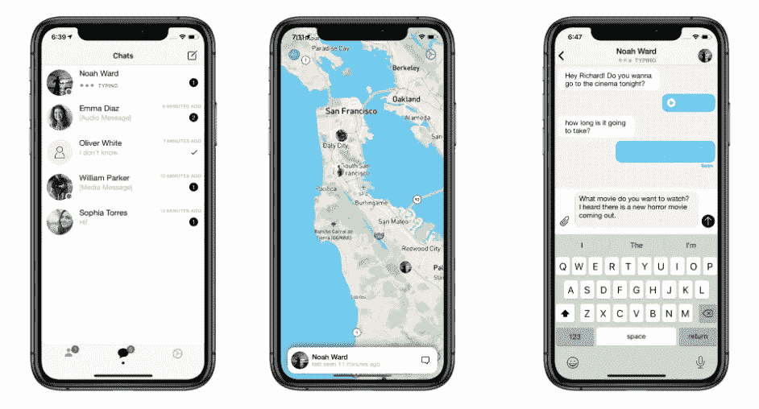

# 2020 年初十大热门 iOS 项目

> 原文：<https://betterprogramming.pub/top-10-trending-ios-projects-at-the-start-of-2020-62dfff1707e0>

## 2020 年第一季度最酷的开源产品


阿恩尔·哈萨诺维奇在 [Unsplash](https://unsplash.com?utm_source=medium&utm_medium=referral) 上拍摄的照片。

2020 年第一季度即将结束，由于冠状病毒的持续爆发，你现在很有可能在家工作。

WWDC 2020 并不遥远，这一次的直播会议有很多值得期待的地方。在我们耐心等待 iOS 14 新功能推出的同时，让我们来看看一些已经发布的很酷的 iOS 项目。

从 ARKit 到 SwiftUI，我们已经有了一系列很棒的产品，我希望这些产品也能启发你去构建一些自己的很棒的项目。

# 1.巴拉巴

首先，我们有一个[有趣的 iOS 库](https://github.com/nsoojin/baraba)，它利用 ARKit 和 AVFoundation 让用户用眼睛滚动内容。无触摸手势有着光明的未来，这个库应该可以帮助你启动这些程序。

ARKit 的真深度相机确实可以快速跟踪人脸，但它只能在 iPhone X 和更高版本上使用。对于较旧的规范，我们可以回退到 AVFoundation 进行跟踪。除了当用户看向别处时暂停滚动，这个库还允许你调整自动滚动的速度。


你知道巴拉巴是一个韩语单词，意思是“看着我”吗？

# 2.ALBusSeatView

这里有一个[很酷的 iOS 库](https://github.com/applogistdev/ALBusSeatView)，可以让你为公交车座位选择配置自定义视图。这个基于 Swift 的库通常是旅行预订应用程序所需要的，它可以轻松定制座位选择、巴士布局，还提供了基于性别的座位选择/限制工具提示。


# 3.帧抓取器

接下来，我们有一个[开源 iOS 应用](https://github.com/arthurhammer/FrameGrabber)，它可以让你提取全分辨率视频和实时照片帧作为图像。与截图不同，这些全分辨率图像也包含视频元数据。该应用程序还允许您选择压缩质量和控制导出的文件格式。


# 4.日历热图

受 GitHub Contributions UI 设计的启发，[这个库](https://github.com/Zacharysp/CalendarHeatmap)为您提供了一个基于日历的热图，有助于通过颜色显示数据点的时间序列。

您可以提供一个开始日期、一个日期范围，或者通过按日、月和年分组来修改设计。下面是一些最小使用量的示例代码:

```
let startDate = Date()
let calendarHeatmap = CalendarHeatmap(startDate: startDate)
calendarHeatmap.delegate = self
view.addSubview(calendarHeatmap)
```



# 5.电晕跟踪器

这里有一个支持 macOS 和 iPadOS 的开源 iOS 应用程序。此应用程序在地图或图表上显示最新的新冠肺炎数据，有两个分布级别:国家和城市。此外，该应用程序还提供以下功能:

*   搜索国家和城市。
*   以图像形式分享统计数据和图表。
*   今日全球统计窗口小部件。
*   一个红色标尺，反映按影响划分的确诊病例数。



# 6.图像过滤器 SwiftUI

接下来，我们有一个基于 [SwiftUI 的开源 iOS 应用](https://github.com/alfianlosari/ImageFilterSwiftUICompleted)。通过利用 GPUImage 框架，该应用程序提供了广泛的图像过滤器，以及直接在 macOS 版本的应用程序上拖放图像的能力。



# 7.动画渐变

这里有一个 [SwiftUI 库](https://github.com/CypherPoet/AnimatableGradients)，它保存了一组用于制作颜色渐变动画的视图修改器。它允许您在标准和自定义形状上设置动画渐变，在开始和结束颜色之间有许多插值。



# 8.SwiftUI 可折叠形状

SwiftUI 是 2019 年 WWDC 期间的热门话题，因为它可以轻松地让我们构建用户界面。这个[开源项目](https://github.com/kieranb662/SwiftUI_Foldable_Shapes)使用 SwiftUI 路径构建了一个类似贴纸的剥离动画。基于滑块/手势，它创建一个路径的反射(镜像)版本，从而给出一个折叠形状的效果。



# 9.多 peerKit

[MultipeerConnectivity](https://developer.apple.com/documentation/multipeerconnectivity) 是一个鲜为人知的苹果框架，用于通过 WiFi 或蓝牙在设备间共享数据。它也经常用于构建共享的增强现实体验。

[这个库](https://github.com/insidegui/MultipeerKit)是对 MultipeerConnectivity 的高级抽象，符合简化传输消息类型的可编码协议。



# 10.麦克哈特

最后但同样重要的是，我们有一个开源的[实时消息 iOS 应用程序](https://github.com/realpaliy/mChat)，它使用 Firebase 数据库实现可靠性，并使用 Mapbox API 实现不同的地图样式。

在众多功能中，它可以让你在地图上定位朋友(除非他们处于匿名模式)，并发送文本和媒体信息。



# 结论

这总结了最近在 iOS 社区引起轰动的几个有趣的库和开源项目。

感谢阅读。希望对你有启发。

[](https://medium.com/better-programming/top-10-trending-ios-libraries-in-december-e100c9064a54) [## 12 月十大热门 iOS 库

### 探索 iOS 社区在这十年的最后一个月提供的服务

medium.com](https://medium.com/better-programming/top-10-trending-ios-libraries-in-december-e100c9064a54)