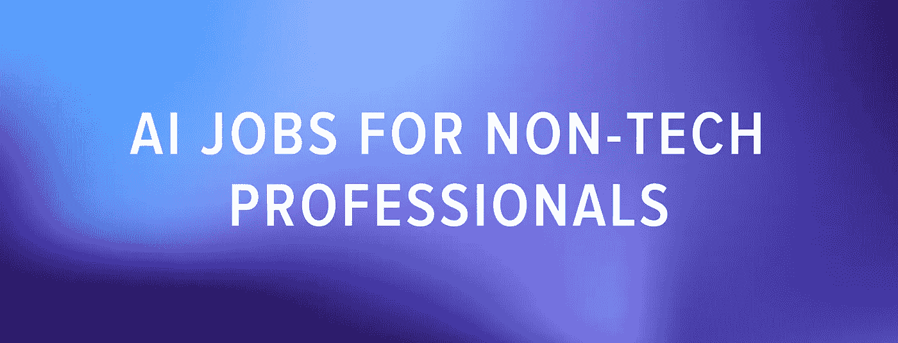

# 2021 年要选择的 11 条机器学习职业道路

> 原文：<https://betterprogramming.pub/top-11-machine-learning-career-paths-to-choose-in-2021-6a8ef060815e>

## 想转行做机器学习吗？不要再看了

迈克尔·泽兹奇在 [Unsplash](https://unsplash.com/s/photos/abstract-art-squares?utm_source=unsplash&utm_medium=referral&utm_content=creditCopyText) 上的照片

2021 年，对数字化的关注一如既往地强烈。机器学习和人工智能已经帮助 IT 领导者和全球企业以最小的损失走出了全球疫情。对知道如何应用数据科学和 ML 技术的专业人员的需求持续增长。

在这篇文章中，你会发现一些在未来几十年里绝对需要的职业选择。还有一个转折——人工智能不再是一个专有的技术领域。它与法律、哲学和社会科学交织在一起，所以我们也包括了一些人文领域的专业。

# 2021 年要选择的热门 ML 工作

程序员和软件工程师是过去十年中最受欢迎的职业。AI 和机器学习也不例外。我们进行了调查，以找出哪些职业最受欢迎，以及每个职业需要哪些技能(基于来自 Indeed.com 和 Glassdoor.com[的数据)。](https://www.glassdoor.com/Job/)

# 1.机器学习软件工程师

机器学习软件工程师是从事人工智能领域工作的程序员。他们的任务是创建算法，使机器能够分析输入信息，并理解事件之间的因果关系。ML 工程师也致力于这种算法的改进。要成为一名 ML 软件工程师，你需要具备以下技能:优秀的逻辑、分析思维和编程能力。

雇主通常希望 ML 软件工程师拥有计算机科学、工程、数学或相关领域的学士学位，以及至少两年的 ML 算法实施实践经验，这些经验可以在学习时获得。您需要能够用一种或多种编程语言编写代码，并且您应该熟悉相关工具，如 Flink、Spark、Sqoop、Flume、Kafka 或其他工具。

# 2.数据科学家

数据科学家应用机器学习算法和数据分析来处理大数据。他们经常处理需要清理和预处理的非结构化数据阵列。数据科学家的主要任务之一是发现数据集中可用于预测性商业智能的模式。为了成功地成为一名数据科学家，你需要强大的数学背景和专注于发现每个小细节的能力。

作为一名数据科学家，通常需要数学、物理、统计学或运筹学的学士学位。你需要有很强的 Python 和 SQL 技能以及出色的分析能力。数据科学家经常要展示他们的发现，所以如果你有数据可视化工具(Google Charts，Tableau，Grafana，Chartist)的经验，这是一个加分项。js，FusionCharts)以及优秀的沟通和 PowerPoint 技巧。

# 3.AIOps 工程师

ai ops(IT 运营人工智能)工程师帮助开发和部署机器学习算法，这些算法可以分析 IT 数据并提高 IT 运营的效率。大中型企业投入大量人力资源进行实时性能监控和异常检测。人工智能软件工程可以让你自动化这个过程，优化劳动力成本。

AIOps 工程师基本上是一个操作角色。因此，要想被聘为 AIOps 工程师，你需要具备网络、云技术和安全等领域的知识(证书很有用)。使用自动化脚本(Python、Go、shell 脚本等)的经验也是非常必要的。

# 4.网络安全分析师

网络安全分析师识别信息安全威胁和数据泄露风险。他们还实施措施来保护公司免受信息损失，并确保大数据的安全性和机密性。保护这些数据免受恶意使用非常重要，因为人工智能系统现在无处不在。

网络安全专家通常需要拥有技术领域的学士学位，并被期望拥有安全框架和网络、操作系统和软件应用程序等领域的一般知识。CEH、CASP+、GCED 等认证。，在 CTFs 等安全类竞赛中的经验也是有利的。

# 5.面向 ML 的云架构师

今天，大多数 ML 公司更喜欢在云中保存和处理他们的数据，因为云更加可靠和可扩展，这在机器学习中尤其重要，因为机器必须处理难以置信的大量数据。云架构师负责管理组织中的云架构。随着云技术变得越来越复杂，这个职业尤其重要。云计算架构包含了与 it 相关的一切，包括 ML 软件平台、服务器、存储和网络。

对于云架构师来说，其他有用的技能是在 AWS 和 Azure 中设计解决方案的经验，以及使用 Chef/Puppet/Ansible 等配置管理工具的专业知识。你需要能够用像 Go 和 Python 这样的语言编码。猎头也在寻找像 AppDynamics、Solarwinds、NewRelic 等监控工具方面的专业知识。

# 6.计算语言学家

计算语言学家参与创建用于开发在线词典、翻译系统、虚拟助手和机器人的 ML 算法和程序。计算语言学家与机器学习工程师有很多共同点，但他们将语言学的深厚知识与对计算机系统如何处理自然语言的理解相结合。

计算语言学家经常需要能够用 Python 或其他语言编写代码。他们还经常被要求展示以前在 NLP 领域的经验，雇主希望他们提供关于 NLP 和产品开发的新的创新方法的宝贵建议。

# 7.以人为中心的人工智能系统设计师/研究员

以人为中心的人工智能系统设计者确保智能软件是在考虑最终用户的情况下创建的。以人为中心的 AI 必须学会与人类合作，并不断改进——这要归功于深度学习算法。这种交流对人类来说必须是无缝的和方便的。一个以人为中心的人工智能设计师不仅要拥有技术知识，还要了解认知科学、计算机科学、通信心理学和 UX/UI 设计。

以人为中心的人工智能系统设计师通常是一个研究型职位，因此候选人需要拥有或正在获得人机交互、人机交互或相关领域的博士学位。他们必须提供一个投资组合，以该领域的研究为特色。他们通常被期望在人工智能或相关领域有 1 年以上的经验。

# 8.机器人工程师

机器人工程师是设计和制造机器人和复杂机器人系统的人。机器人工程师必须思考未来人类助手的机制，设想如何组装其电子部件，并编写软件。因此，要成为这一领域的专家，你需要精通机械和电子。由于机器人经常使用人工智能进行动态交互和避障，你将有很多机会与 ML 系统合作。

雇主通常要求你拥有计算机科学、工程、机器人等领域的学士学位或更高学位，并拥有 C++或 Python 等编程语言的软件开发经验。你还需要熟悉硬件接口，包括摄像头、激光雷达、嵌入式控制器等等。

# 非技术人员的人工智能工作

如果你没有技术背景，或者想过渡到一个全新的领域，可以去看看这些新兴职业。

# 1.数据律师

数据律师是保证安全性和遵守 GDPR 要求以避免数百万美元罚款的专家。他们知道如何正确保护数据，也知道如何以避免任何法律纠纷的方式买卖这些数据。他们还知道如何管理数据处理和存储过程中产生的风险。数据律师是未来的职业；他们站在技术、伦理和法律的交叉点上。

# 2.艾伦理学家

人工智能伦理学家是对公司的人工智能系统进行伦理审计，并提出改善人工智能非技术方面的综合战略的人。他们的目标是消除采用人工智能可能给组织带来的声誉、财务和法律风险。他们还确保公司对他们的智能软件负责。

# 3.对话设计器

对话设计者是设计虚拟助手的用户体验的人。这个人是一个高效的 UX/UI 文案和沟通专家，因为由他们来将品牌的业务需求转化为对话。

# 一个 ML 专家赚多少钱？

根据[Indeed.com](https://www.indeed.com/career/machine-learning-engineer/salaries)的说法，ML 专家的薪水根据他们的地理位置、角色和经验年限而有所不同。然而，平均而言，美国的 ML 专家每年挣 15 万美元左右。像易贝、Wish、Twitter 和 Airbnb 这样的顶级公司准备向他们的开发者支付每年 20 万美元到 33.5 万美元的费用。

在撰写本文时，美国薪酬最高的城市是旧金山，平均年薪为 199465 美元，库比蒂诺为 190731 美元，奥斯汀为 171757 美元，纽约为 167449 美元。

# 需要 ML/AI 专家的行业

今天，机器学习几乎应用于每个行业。然而，有些行业会比其他行业发布更多的 ML 职位:

*   **交通工具。**从无人机开始，到完全自动驾驶汽车结束的自动驾驶汽车，都非常依赖 ML。Gartner 预计，到 2025 年，自动驾驶汽车将围绕在我们的周围，并以比人类更高的精度和效率执行运输操作。
*   **医疗保健。**在诊断和药物发现中，机器学习系统处理大量数据，并检测否则会被遗漏的模式。
*   **金融。**洗钱使银行能够加强其业务的安全性。当出现问题时，人工智能系统能够实时识别异常，并提醒员工注意潜在的欺诈交易。
*   **制造业。在工厂中，基于人工智能的机器有助于自动化质量控制、包装和其他流程，同时允许人类员工从事更有意义的工作。**
*   **市场营销。**据报道，根据特定客户的需求进行大量定制的针对性营销活动在不同领域都更加有效。

# 结论

你发现什么让你感兴趣的了吗？如果是这样，祝你好运！无论你选择哪条职业道路，学习和使用机器学习都是一次非常有益的经历。

如果你觉得我们错过了什么重要的 ML 职业，请在评论中告诉我们！

*最初发布于*[*https://sero Kell . io*](https://serokell.io/blog/top-ml-jobs)*。*