# 提升团队生产力的 12 大松弛应用

> 原文：<https://betterprogramming.pub/top-12-slack-apps-to-boost-your-teams-productivity-183816afb4e9>

## 使用这些 Slack 应用程序提升您团队的生产力

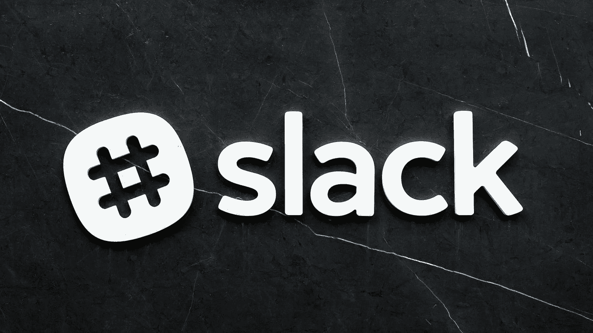

斯科特·韦伯在 [Unsplash](https://unsplash.com?utm_source=medium&utm_medium=referral) 上拍摄的照片

Slack 诞生于 2013 年。尽管开始很艰难，在 2015 年被黑客攻击，但他们成功地成为了世界上团队沟通的首选解决方案。

他们为什么会有如此的成功？在 Slack 之前，Google talk 和 Skype 等工具用于团队沟通。它们为什么不好？因为它们不是为了这个目的而建造的。另一方面，Slack 是专门为团队协作和交流而构建的。

那么平台为什么这么好呢？它提供了什么？

*   **工作流**:使用预定义的触发器和步骤，提供自动化日常任务的无代码解决方案。
*   Slack apps :使用一系列 API 来访问更深层次的定制。它们将提供平台中没有的功能和集成。

Slack 提供了自己的可信市场，你可以在那里安装和删除应用程序。将应用添加到您的工作区变得简单而直观。

那么，你是否充分利用了 Slack？它能做什么来提高你的生产力？它能自动化您的手动工作流程吗？在这里，我们将看看前 12 个应用程序，以帮助您的团队变得更加高效和可靠。

# 1.简单投票

*价格:免费* [*访问开发者网站*](https://simplepoll.rocks/)

在一个地方收集每个人的反馈是乏味的。这使得决策过程更加困难。你所需要的只是一个简单的投票，以一种做作的方式收集每个人的想法。

使用简单投票，您可以在 slack 中创建投票。你需要做的就是安装应用程序并使用以下命令:

```
/poll "How likely do you think it is that we accomplish our quarterly  goals?" "Very unlikely" "Somewhat unlikely" "Neutral" "Somewhat likely"  "Very likely" anonymous
```

然后，无论 commands 运行哪个频道/组消息，都会向您的受众显示此投票布局:

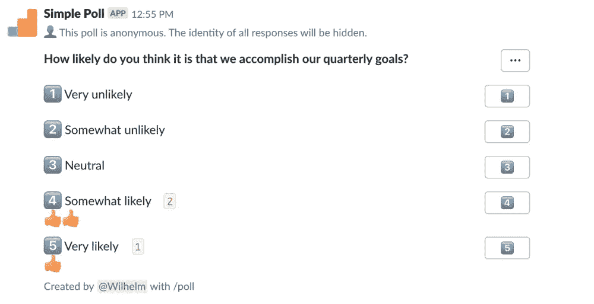

从 https://simplepoll.rocks/俘获

它支持许多方便的功能:

*   重复民意调查
*   限制投票数量
*   匿名回答
*   多问题调查

如您所见，民意测验可以根据您的需求进行定制。

# 2.谷歌日历

*价格:免费* [*访问开发者网站*](https://slack.com/app-pages/google-calendar)

这个应用程序是一个非常整洁的集成。它在你的谷歌日历和你的懈怠之间架起了一座桥梁。这将使您能够:

*   回复邀请
*   在会议开始前得到提醒
*   自动设置您的状态，以反映您正忙于开会
*   查看您的时间表

您将能够在不离开 Slack 应用程序的情况下正确管理您的日历。

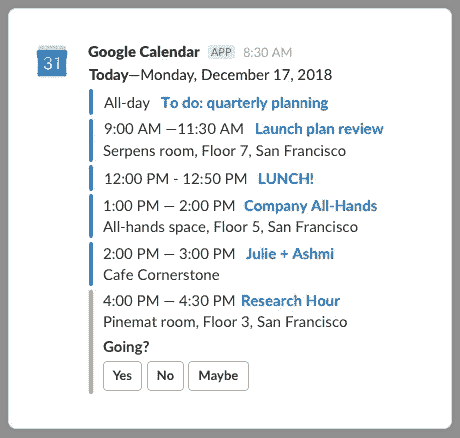

https://slack.com/app-pages/google-calendar 每日文摘示例

一旦习惯了，就没有回头路了！

# 3.烤

*价格:开源项目免费/每个用户每月 4 美元* [*访问开发者网站*](https://toast.ninja/)

GitHub 已经成为我们日常工作生活中必不可少的工具。开发人员负责创建和审查彼此的工作。有时这可能是一个痛点。pr 都坐在那里等着审核很久了。烤面包就是为了解决这个问题。怎么会？通过增加你的 GitHub 的 PRs 在 Slack 中的可见性。

它会通知您:

*   待审查的任务
*   待定意见
*   GitHub 中的提及

这个机器人通过友好的提醒确保每个人都在完成他们的任务。你必须主动宣传你的公关的日子已经一去不复返了。

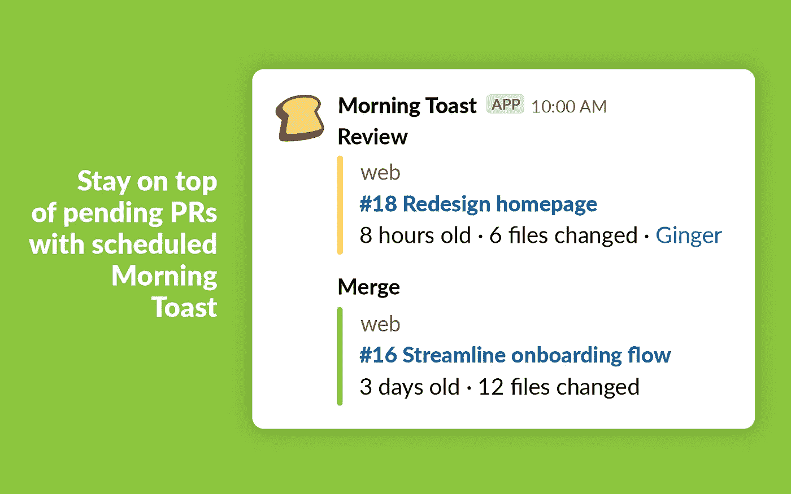

从 https://toast.ninja/捕获未决的 PR 特征

它提供的每日文摘帮助你以一个好的概览开始你的一天。

# 4.吉拉云

*价格:免费附带 Atlassian 捆绑包* [*访问开发者网站*](https://www.atlassian.com/partnerships/slack)

谈到项目管理，吉拉已经成为最受欢迎的选择。最近，一些竞争对手正在接近，但它仍然是主导服务。

吉拉云应用将把吉拉融入你的闲暇时光:

*   获得实时时差通知。忘记电子邮件通知，你不会再错过任何重要的电子邮件。
*   获取聊天中提到的问题的上下文。你不再需要离开懈怠去了解一个问题是关于什么的。
*   直接从懈怠中采取行动。创建门票，分配门票，回复评论…你可以在 Slack 内做很多事情。

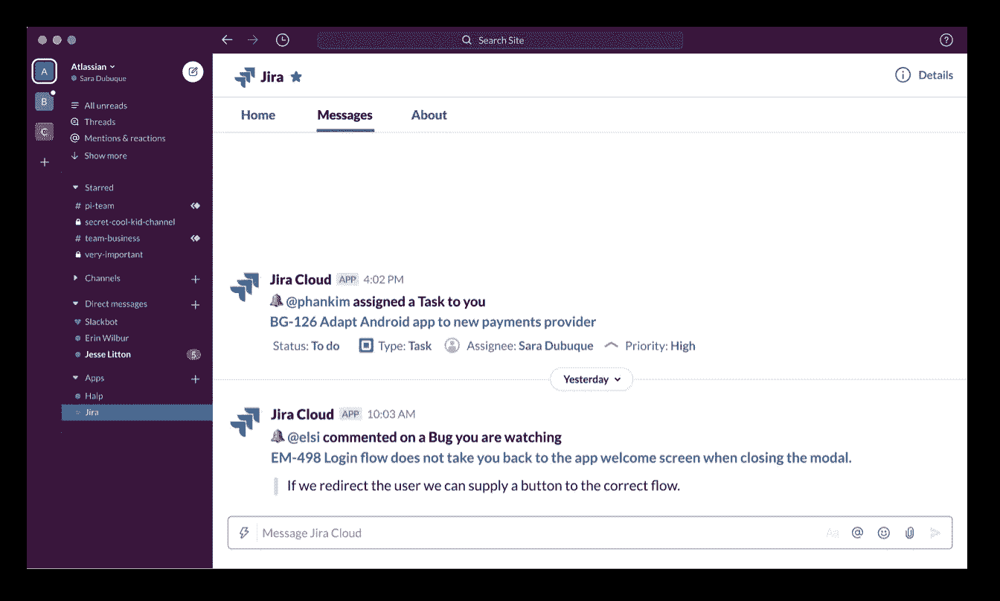

从 https://www.atlassian.com/partnerships/slack 捕获吉拉云通知

通过这种 Slack 应用程序集成，您将减少在 Slack 和吉拉之间切换所花费的时间。你会变得更加高效和专注。宽限通知意味着您的团队可以实时响应与吉拉相关的事件。

# 5.团队时区

*价格:10 名会员免费/9 美元-29 美元-99 美元随后计划* [*访问开发者网站*](https://www.teamtimezone.com/)

远程开发在持续增长。随着团队的壮大，团队的分布也是如此。团队成员跨时区分布越来越普遍。如果没有合适的工具，会影响生产力。

幸运的是，有一个工具可以帮助你监控所有团队的时区位置:团队时区。当不得不预定会议时，它特别有用——当使用这个应用程序时，这个令人生畏的任务将变得容易得多。


只需一瞥，你就能想象出你的团队的所有时间。您可以使用一些过滤器来微调您的搜索。

这个应用程序包括一些命令，将渲染时差内的时区可视化。

# 6.Biascorrect

*价格:免费* [*访问开发商网站*](https://www.catalyst.org/biascorrect-install/)

这些天来，我们越来越意识到性别偏见。这并不能阻止我们犯下无意识的错误。改掉坏习惯很难。在那件事上，BiasCorrect 会帮助我们。

它会通过实时标记无意识的性别偏见来警告他们。它将提供一些无偏见的单词或短语供您考虑。这一切都将私下进行。和事件，让您有机会重写文本或选择接受建议。

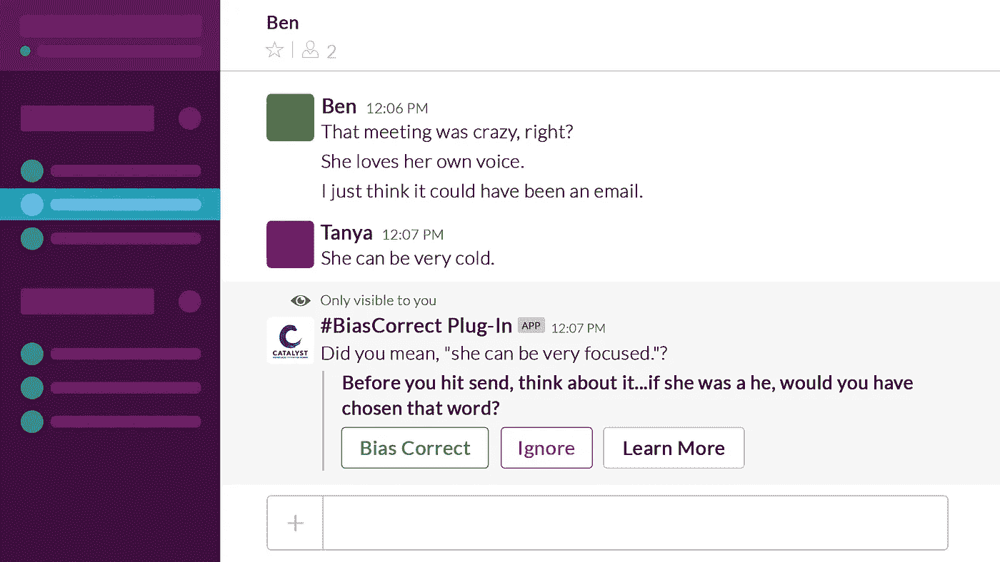

https://www.catalyst.org/biascorrect-install/插件使用示例

这个 Slack 应用程序将帮助您的团队在一个更有意识和更健康的氛围中工作。

# 7.OneBar

*价格:最多 3 个用户免费/之后 200 美元* [*访问开发者网站*](https://onebar.io/)

拥有方便的文档是提高工作效率的全部手段。有许多工具可以解决这个问题。由于工具的丰富，信息可能会变得支离破碎。有些员工甚至不知道在哪里可以找到文档。

OneBar 将有助于解决这个问题。它是一个带有 Slack 机器人的知识管理平台，使人们可以很容易地获取相关信息。它与 GitHub、Goole Suite、HubSpot、Bitbucket、吉拉和 Confluence 等工具相集成，还会有更多的工具。

您将能够创建自己的常见问题，这将有助于减少重复回答的需要。它不仅仅是为信息技术而建，它还可以帮助任何公司的部门:销售、营销。通过使用`@onebar`引导，您将能够执行查询。

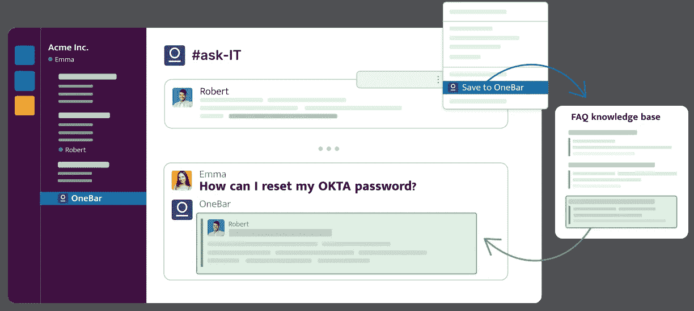

https://onebar.io/常见问题特征模式

您所要做的就是将信息记录在您的首选位置，并将其与 OneBar 集成。把它当作唯一的真理来源。

# 8.语音报文

*价格:有限制功能免费/每个用户每月 2-8 美元* [*访问开发商网站*](https://talk-talk.me/)

仅仅通过写作可能很难快速准确地表达自己。很难在文本中表达你的感受或担忧。另一端的人甚至可能误解你想说的话。通常情况下，人们会匆忙打电话要求两分钟的澄清。

那个澄清会最终被过度扼杀了。一条简短的语音信息可能会完成这项工作。通过语音，您能够在更短的时间内更清晰地表达自己。

为此，语音消息应用程序诞生了。这款应用为 Slack 带来了语音消息。这将提高你的工作效率，帮助你更好地了解你的同事。这会增加交流，减少误解。


https://talk-talk.me/语音应用使用示例

# **9。甘露**

*价格:免费，功能有限/之后每个活跃用户每月 2.5-3.75 美元。* [*访问开发者网站*](https://nectarhr.com/)

事实证明，祝贺人们的工作对每个人的生产力都有积极的影响。让优秀的工作不被注意是很危险的——人们可能会觉得不受重视。

在偏远的环境中，恰当地庆祝某人的成就可能会变得很有挑战性。这就是甘露要解决的问题。

Nectar 为你提供了展示每个人的工作有多重要的工具。每个人都有被欣赏的权利。

甘露能为你做什么:

*   社会认可
*   奖励
*   集中奖励
*   挑战
*   员工福利

Nectar 的 360°识别平台支持上下同行识别。它有一个网络平台和一个松散的集成。

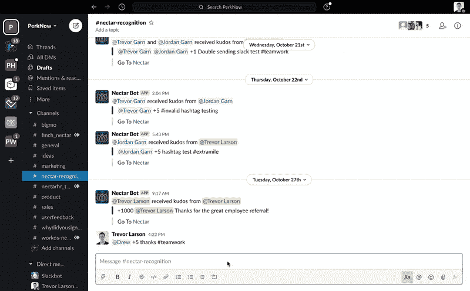

https://nectarhr.com/花蜜用法举例

# 10.吉菲

*价格:免费* [*访问开发者网站*](https://giphy.com/)

正如弗雷德·r·巴纳德曾经说过的那样:“一幅画胜过千言万语。”这个应用程序将这一点付诸实践。您将能够向您的同事发送 gif。

它帮助你以不同的方式与你的队友交流。学会如何在正确的时间使用正确的 GIF 是一个值得学习的技能。

这个插件可以让你访问世界上最大的动画 gif 库。你甚至可以创建自己的并分享它们。

使用它很简单。你所需要做的就是使用他们的命令执行关键字搜索。然后浏览建议的结果。当你看到一个你喜欢的，你只需要按`send`。

```
/giphy cats/giphy dogs
```

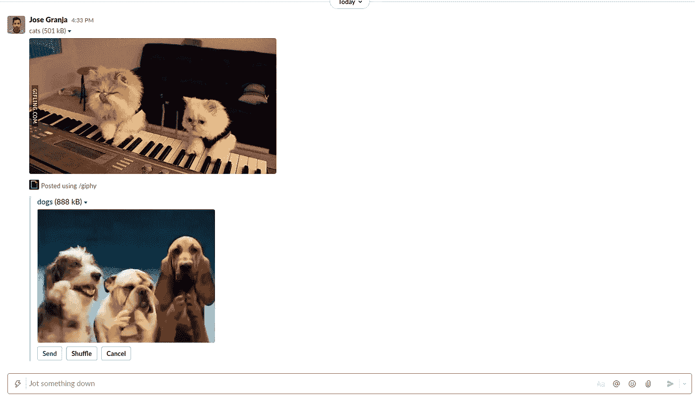

作者使用 Giphy 的示例

*注:脸书最近收购了 GIPHY。产品将基本保持不变。如果你担心数据隐私，这是值得了解的。*

# 11.扎皮尔

如今，我们在工作流程中使用许多不同的应用程序。让他们交流是必须的。不用学习编程，你怎么能做到呢？通过使用扎皮尔。Zapier 允许您定义触发器和动作来自动化您的工作流程。

假设您有一个类型表单，希望在提交时得到通知。您可以通过 Zappier 的 slack 集成轻松做到这一点:

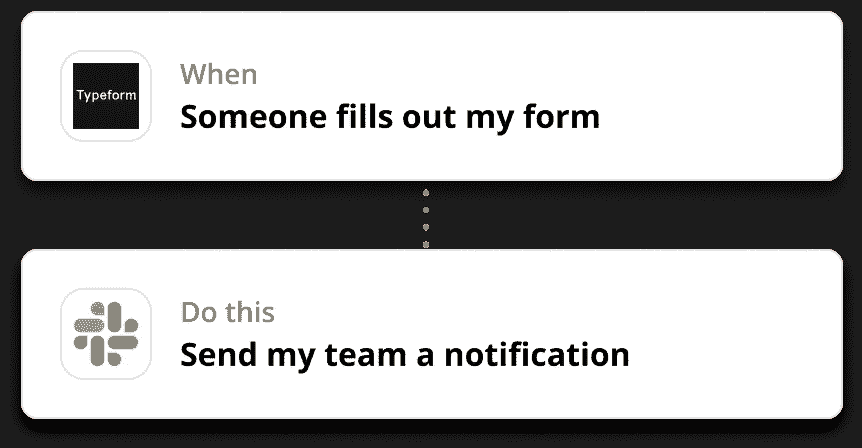

这个工具将自动为你处理手工工作。你只需要定义工作流程，或者他们所说的“Zaps”。

你会看到生产力的提高，因为你将能够专注于重要的事情。

# 12.油炸圈饼

*价格:每轮最多 24 个用户免费/每月 49-99 美元，具体取决于功能* [*访问开发者网站*](https://www.donut.com/)

如前所述，远程工作日益增多。它不会在短时间内放缓——它会一直存在。一个重要的警告是，了解你的同事可能很难。

甜甜圈就是为了解决这个问题。它将使你能够启动远程友好的程序来创建更好的人际关系。这个机器人会负责为你组织所有的活动。你可以从一长串提议的活动中选择一项。

一旦活动开始，你将在更轻松的环境中更好地了解你的同事。

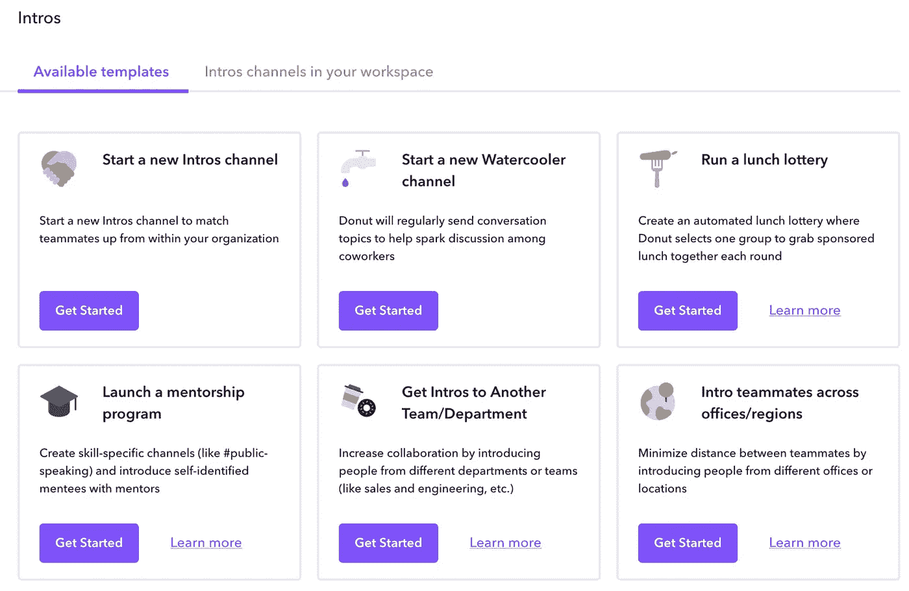

https://www.donut.com/甜甜圈活动模板

# 最后的想法

我们已经研究了一些 Slack 应用程序来帮助你显著提高你的工作效率。

它们中的大多数都为您实现了工作自动化。这意味着您在重复的手动任务上花费的时间更少。人类不擅长做重复和无聊的任务——我们冒着失去注意力和犯错的风险。这些应用程序将更好、更高效地完成工作。你只需要投入时间来配置它们以满足你的需求。

# 有关系的

[](/8-vs-code-plugins-to-improve-your-productivity-ee4497cebefa) [## 8 VS 代码插件，提高您的工作效率

### 帮助你日常工作的必备插件

better 编程. pub](/8-vs-code-plugins-to-improve-your-productivity-ee4497cebefa) [](https://medium.com/macoclock/top-10-productivity-apps-for-web-developers-bbc2f921216f) [## Web 开发人员的 10 大生产力应用

### 使用这些 Mac 应用程序提高您的 web 开发效率

medium.com](https://medium.com/macoclock/top-10-productivity-apps-for-web-developers-bbc2f921216f)